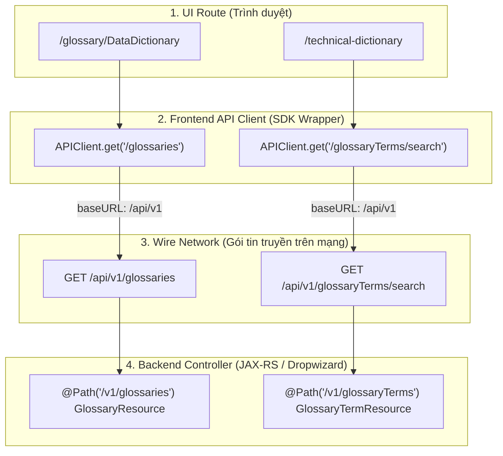
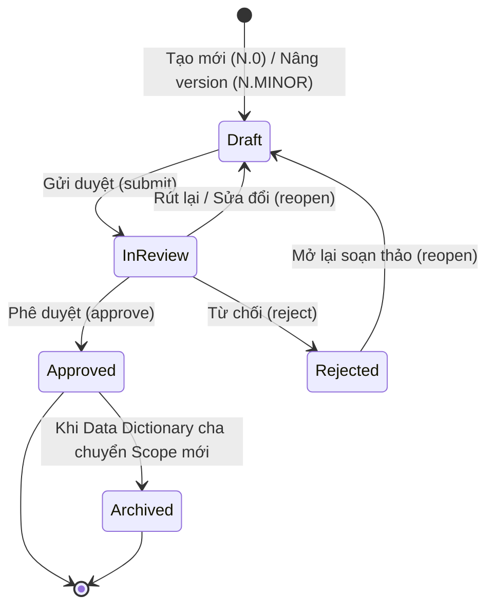

# TÀI LIỆU ĐẶC TẢ KỸ THUẬT API (API SPECIFICATION DOCUMENT)
## HỆ THỐNG QUẢN TRỊ METADATA NGÂN HÀNG (AGRIBANK METADATA PLATFORM)
### PHÂN HỆ: TỪ ĐIỂN DỮ LIỆU DÙNG CHUNG (CDE), CHẤT LƯỢNG DỮ LIỆU (DQ) VÀ TỪ ĐIỂN KỸ THUẬT (TECHNICAL DICTIONARY)

---

## 1. TỔNG QUAN TÀI LIỆU & QUY CHUẨN CHUNG

### 1.1. Mục đích tài liệu
Tài liệu này đặc tả chi tiết toàn bộ giao diện lập trình ứng dụng (RESTful APIs) phục vụ 3 phân hệ quản trị metadata trọng yếu của Agribank:
1. **Từ điển dữ liệu dùng chung (Data Dictionary) & Thành tố dữ liệu dùng chung (CDE - Critical Data Elements)**.
2. **Danh mục Quy tắc Chất lượng dữ liệu (Data Quality - DQ Rules Glossary)**.
3. **Từ điển Kỹ thuật (Technical Dictionary)**, không phiên bản, gắn với Từ điển dữ liệu đang hiệu lực.

Tài liệu được biên soạn theo tiêu chuẩn kỹ thuật ngân hàng, đóng vai trò là hợp đồng giao tiếp (API Contract) chính thức giữa Backend (OpenMetadata Core Server - JAX-RS / Dropwizard), Frontend (React Single Page Application), và các hệ sinh thái tích hợp bên ngoài (Data Pipeline, Ingestion Bots, DWH/Data Lakehouse).

**Trạng thái tài liệu:** As-built, đối chiếu mã nguồn ngày `2026-09-30`.

**Nguồn sự thật theo thứ tự ưu tiên:**

1. JAX-RS resource trong `openmetadata-service` (method, path, query parameter, authorization).
2. JSON Schema trong `openmetadata-spec` (request body và validation).
3. Frontend REST wrapper trong `openmetadata-ui` (cách UI gọi API).
4. Tài liệu thiết kế trong `docs/design` (ý định kiến trúc; không thay thế contract đã triển khai).

Tài liệu này đặc tả **danh mục quy tắc Chất lượng dữ liệu** dưới dạng Governed Glossary. Các API vận hành kiểm thử dữ liệu gốc của OpenMetadata như `/dataQuality/testCases`, `/testSuites` và `/testCaseResults` nằm ngoài phạm vi tài liệu này.

### 1.2. Đối tượng sử dụng
- **Kỹ sư phát triển Backend & Frontend:** Căn cứ lập trình đúng endpoint, tham số, kiểu dữ liệu, ràng buộc khóa lạc quan và mã phản hồi.
- **Kỹ sư Đảm bảo chất lượng (QA/QC/Testers):** Thiết kế kịch bản kiểm thử tự động (API Automation Testing), kiểm thử bảo mật và tải.
- **Kiến trúc sư giải pháp & Quản trị hệ thống (Architects & DevOps/SecOps):** Rà soát tuân thủ kiến trúc, phân quyền RBAC và an toàn thông tin ngân hàng.

### 1.3. Bảng thuật ngữ và chữ viết tắt
| Viết tắt / Khái niệm | Tên đầy đủ / Định nghĩa | Ý nghĩa nghiệp vụ |
| :--- | :--- | :--- |
| **CDE** | Critical Data Element | Thành tố dữ liệu dùng chung có giá trị nghiệp vụ trọng yếu trong ngân hàng. |
| **DQ** | Data Quality | Chất lượng dữ liệu (tính chính xác, đầy đủ, kịp thời, nhất quán, hợp lệ, duy nhất). |
| **TD** | Technical Dictionary | Từ điển kỹ thuật quản lý metadata vật lý của các cột dữ liệu từ hệ thống nguồn. |
| **Scope / Parent Version** | Governance Scope ($N$) | Kỳ/Phạm vi quản trị dữ liệu dạng số nguyên ($1, 2, 3...$), đóng vai trò là không gian cô lập phiên bản. |
| **Business Version** | Business Version ($N.MINOR$) | Phiên bản nghiệp vụ của bản ghi (CDE, DQ Rule, Technical Record) thuộc Scope $N$. |
| **Working Version** | Working / Draft State | Bản ghi đang trong chu trình soạn thảo, phê duyệt (`Draft`, `In Review`, `Rejected`). |
| **Published Version** | Published Snapshot | Bản ghi đã phê duyệt (`Approved`), đóng băng bất biến (Immutable), phục vụ khai thác chính thức. |
| **FQN** | Fully Qualified Name | Tên định danh toàn cầu duy nhất của một thực thể trong OpenMetadata. |
| **RBAC** | Role-Based Access Control | Cơ chế kiểm soát truy cập dựa trên vai trò người dùng (Consumer, Proposer, Steward, Admin). |
| **Optimistic Locking** | Khóa lạc quan | Kiểm soát xung đột cập nhật đồng thời dựa trên số hiệu hiệu chỉnh `workingRevision`. |

Các trường audit của Governed Workflow như `createdAt`, `updatedAt`, `submittedAt`, `rejectedAt`, `publishedAt`, `archivedAt` dùng Unix epoch milliseconds (`int64`). Riêng `expiresAt` của import session là chuỗi ISO-8601 UTC.

---

### 1.4. Quy chuẩn Phân tầng Kiến trúc URL (Architecture & URL Layering)
Hệ thống tuân thủ nghiêm ngặt mô hình 4 tầng định tuyến để đảm bảo tính nhất quán giữa UI, API Client và Wire Network:



* **Quy tắc vàng:**
  - Base URL của API server: `http(s)://<domain_or_ip>:<port>/api/v1`.
  - Frontend `APIClient` đã cấu hình ngầm `baseURL = '/api/v1'`. Khi gọi trong wrapper, không thêm tiền tố `/api/v1` để tránh sinh lỗi `404 Not Found` (do trùng lặp thành `/api/v1/api/v1/...`).
  - Mọi thao tác Mutation trên phiên bản nghiệp vụ phải được xác thực authoritative tại Database, không tin cậy trạng thái suy diễn từ Search Index (OpenSearch/Elasticsearch).

---

## 2. TIÊU CHUẨN KỸ THUẬT, BẢO MẬT & MÃ LỖI

### 2.1. Xác thực & Phân quyền RBAC (Authentication & RBAC)
- **Cơ chế xác thực:** Mọi API (ngoại trừ health-check công khai) bắt buộc phải truyền Header xác thực chuẩn OAuth2 / JWT:
  ```http
  Authorization: Bearer <JWT_ACCESS_TOKEN>
  ```
- **Vai trò người dùng (5 Roles chuẩn của hệ thống Agribank Metadata):**
  1. `BasicConsumer` (Người dùng cơ bản): Quyền tối thiểu, chỉ được phép tra cứu và đọc (`GET`) các bản ghi đã được phê duyệt (`Approved` - Published snapshot) và các bản ghi lưu trữ lịch sử (`Archived`). Không xem được bản nháp (`Draft`), đang xem xét (`In Review`), từ chối (`Rejected`) và không có quyền export nâng cao.
  2. `DataConsumer` (Người tiêu thụ / khai thác dữ liệu): Khai thác nội dung đã được phê duyệt (`Approved`) và lịch sử (`Archived`), có toàn quyền tra cứu, tìm kiếm, lọc dữ liệu và xuất dữ liệu (`Export`) ra Excel. Không xem được bản ghi đang trong chu trình soạn thảo (`Draft/In Review/Rejected`).
  3. `DataProposer` (Người đề xuất - Maker): Soạn thảo dữ liệu, có quyền tạo mới bản ghi (`Draft` $N.0$), nâng phiên bản ($N.MINOR$), chỉnh sửa lưu nháp tại chỗ (`Save Draft`), gửi thẩm định (`Submit`), mở lại bản nháp sau từ chối (`Reopen`) và Import dữ liệu hàng loạt vào Draft theo policy.
  4. `DataSteward` (Quản trị viên nghiệp vụ dữ liệu - Checker/Approver): Thẩm định và kiểm soát chất lượng dữ liệu, có quyền phê duyệt ban hành (`Approve`), từ chối thẩm định (`Reject`) các bản ghi đang xem xét (`In Review`), hoặc thu hồi phê duyệt theo thẩm quyền. Mặc định không trực tiếp tạo mới hoặc chỉnh sửa nội dung bản nháp của Maker.
  5. `Admin` (Quản trị viên hệ thống - Administrator): Toàn quyền quản trị trên toàn bộ hệ thống, khởi tạo Scope mới, liên kết binding scope, kích hoạt Cutover toàn hệ thống, quản lý phân quyền và xử lý ngoại lệ.

#### Bảng Ma trận Quyền hạn và Phạm vi Dữ liệu theo 5 Role:
| Nội dung / Thao tác | BasicConsumer | DataConsumer | DataProposer (Maker) | DataSteward (Checker) | Admin |
| :--- | :---: | :---: | :---: | :---: | :---: |
| **Xem bản Approved mới nhất** | ✅ Có | ✅ Có | ✅ Có | ✅ Có | ✅ Có |
| **Xem bản Archived (Lịch sử)** | ✅ Có (Chỉ đọc) | ✅ Có (Chỉ đọc) | ✅ Có | ✅ Có | ✅ Có |
| **Xem bản Draft / Rejected** | ❌ Không | ❌ Không | ✅ Có (Bản mình tạo/sửa) | ✅ Có (Phạm vi quản lý) | ✅ Có |
| **Xem bản In Review (Đang xem xét)** | ❌ Không | ❌ Không | ✅ Có (Chỉ đọc) | ✅ Có (Để thẩm định) | ✅ Có |
| **Tạo mới bản ghi ($N.0$)** | ❌ Không | ❌ Không | ✅ Có | ❌ Không mặc định | ✅ Có |
| **Nâng phiên bản ($N.MINOR$)** | ❌ Không | ❌ Không | ✅ Có | ❌ Không mặc định | ✅ Có |
| **Chỉnh sửa nháp (`Save Draft`)** | ❌ Không | ❌ Không | ✅ Có | ❌ Không mặc định | ✅ Có |
| **Gửi duyệt (`Submit`)** | ❌ Không | ❌ Không | ✅ Có | ❌ Không mặc định | ✅ Có |
| **Phê duyệt (`Approve`)** | ❌ Không | ❌ Không | ❌ Không | ✅ Có | ✅ Có |
| **Từ chối (`Reject`)** | ❌ Không | ❌ Không | ❌ Không | ✅ Có | ✅ Có |
| **Mở lại soạn thảo (`Reopen`)** | ❌ Không | ❌ Không | ✅ Có | ❌ Không | ✅ Có |
| **Xuất dữ liệu (`Export Excel`)** | ❌ Hạn chế | ✅ Có | ✅ Có | ✅ Có | ✅ Có |
| **Nhập dữ liệu (`Import Excel`)** | ❌ Không | ❌ Không | ✅ Có (Theo policy) | ❌ Không | ✅ Có |
| **Tạo Scope & Phê duyệt Cutover** | ❌ Không | ❌ Không | ❌ Không | ❌ Không | ✅ Có |

> [!NOTE]
> **Quy tắc phân loại Consumer-only:** Người dùng chỉ bị áp dụng cơ chế giới hạn "chỉ thấy Approved" (`Consumer-only`) khi quyền hiệu lực thỏa mãn: `canViewPublished = true` VÀ `canViewWorking = false`. Nếu một người dùng mang role `BasicConsumer` hoặc `DataConsumer` nhưng đồng thời là Chủ sở hữu (Owner) của bản ghi hoặc được phân công thẩm định thì hệ thống vẫn cấp quyền truy cập bản nháp theo chính sách hiệu lực.


### 2.2. Kiểm soát đồng thời bằng Khóa lạc quan (Optimistic Locking)
Để ngăn chặn tình trạng ghi đè mất dữ liệu (Lost Updates) khi nhiều người dùng cùng thao tác:
- Mọi API cập nhật nháp (`PATCH /working`) hoặc chuyển trạng thái workflow (`POST /working/{action}`) bắt buộc phải truyền thuộc tính `expectedRevision` trong payload.
- Backend đối chiếu `expectedRevision` với `workingRevision` hiện tại trong Database:
  - Nếu khớp: Cập nhật thành công và tăng `workingRevision` lên 1 đơn vị.
  - Nếu không khớp: Từ chối giao dịch, trả về HTTP status `409 Conflict`.

### 2.3. Cấu trúc phản hồi lỗi

HTTP status là tín hiệu bắt buộc để client xử lý lỗi. Các lỗi miền nghiệp vụ của Từ điển kỹ thuật có contract ổn định dạng:

```json
{
  "code": "TD_COLUMN_ALREADY_DECLARED",
  "message": "Column 'ipcas.core.public.customer.customer_id' is already declared in the Technical Dictionary"
}
```

Các lỗi nền tảng/validation kế thừa OpenMetadata có thể dùng envelope chung của server và chứa `message` hoặc `responseMessage`. Client không được giả định mọi lỗi đều có `timestamp`, `path` hoặc `errorCode`; phải ưu tiên HTTP status, sau đó đọc `code` (nếu có) và thông điệp lỗi.

### 2.4. Bảng mã phản hồi HTTP (HTTP Status Codes)
| HTTP Code | Mã lỗi chuẩn | Ý nghĩa & Ngữ cảnh áp dụng |
| :--- | :--- | :--- |
| **200 OK** | `SUCCESS` | Yêu cầu đọc/xử lý thành công. |
| **201 Created** | `CREATED` | Khởi tạo thành công bản ghi mới (Identity, Version). |
| **400 Bad Request** | `INVALID_PAYLOAD` / `MISSING_PARAM` | Thiếu tham số bắt buộc, sai kiểu dữ liệu, vi phạm ràng buộc miền giá trị. |
| **401 Unauthorized** | `AUTH_TOKEN_EXPIRED` / `UNAUTHORIZED` | Thiếu hoặc token JWT không hợp lệ/hết hạn. |
| **403 Forbidden** | `PERMISSION_DENIED` | Người dùng không đủ quyền thực hiện thao tác (Maker duyệt bài, Consumer xem Draft). |
| **404 Not Found** | `ENTITY_NOT_FOUND` | Không tìm thấy entity, hoặc bản ghi ở trạng thái người dùng không có quyền nhìn thấy. |
| **409 Conflict** | `OPTIMISTIC_LOCK_CONFLICT` / `DUPLICATE_KEY` | Xung đột phiên bản khóa lạc quan hoặc trùng lặp mã duy nhất trong cùng Scope. |
| **413 Payload Too Large** | `FILE_SIZE_EXCEEDED` | File tải lên vượt giới hạn: CDE import tối đa 5 MiB/5.000 dòng; Technical Dictionary import tối đa 20 MiB/70.000 dòng. |
| **503 Service Unavailable** | `TD_INDEX_UNAVAILABLE` | Search index riêng của Từ điển kỹ thuật không sẵn sàng; không tự động fallback sang truy vấn toàn bộ PostgreSQL. |
| **500 Internal Error** | `INTERNAL_SERVER_ERROR` | Lỗi máy chủ nội bộ không mong muốn. Không để lộ stack trace ra client. |

### 2.5. Phạm vi danh mục API as-built

Danh mục tại các mục 3-5 đã được đối chiếu với JAX-RS resource hiện tại (`GlossaryResource`, `GlossaryTermResource`, `TechnicalDictionaryResource`, `TechnicalDictionaryImportResource`) và Swagger được build từ source. Đây là contract tích hợp cho ba phân hệ governed, không phải bản sao toàn bộ API glossary upstream của OpenMetadata.

Một số route upstream vẫn xuất hiện trong Swagger nhưng không thuộc contract này. Đặc biệt, direct `PATCH /glossaries/{id}`, direct `PATCH /glossaryTerms/{id}`, `PUT` upsert và native bulk create bị backend từ chối đối với luồng governed; client phải dùng `/working`, workflow hoặc import nguyên tử được mô tả trong tài liệu. Các API native history, vote, relation, move, delete/restore và CSV upstream chỉ được dùng khi có đặc tả nghiệp vụ riêng, không được suy ra là API của ba phân hệ này chỉ vì route xuất hiện trong Swagger.

---

## 3. PHÂN HỆ 1: TỪ ĐIỂN DỮ LIỆU DÙNG CHUNG (CDE / DATA DICTIONARY)

Phân hệ quản lý duy nhất một thực thể Từ điển dữ liệu nghiệp vụ (`Data Dictionary`) đóng vai trò là Scope cha, và các Thành tố dữ liệu dùng chung (`CDE`) là các nút con trực tiếp.



`InReview` trong sơ đồ chỉ là identifier Mermaid. Contract JSON chính thức sử dụng
`"In Review"`, tương ứng với `EntityStatus.IN_REVIEW` ở Java và
`EntityStatus.InReview` ở TypeScript. `Pending` không phải trạng thái workflow hợp lệ;
giá trị lưu trữ nội bộ không phải contract công khai.

### 3.1. Nhóm API Quản lý Scope Từ điển Dữ liệu (Glossary Level)

#### API 3.1.1: Lấy danh sách Từ điển dữ liệu (Sidebar/List)
- **Method & Endpoint:** `GET /api/v1/glossaries`
- **Mô tả:** Backend hiện chỉ trả hai governed glossary `Data Dictionary` và `Data Quality`; glossary `Technical Dictionary` không nằm trong danh sách này.
- **Query Parameters:**
  - `fields` (string, tùy chọn): Danh sách trường quan hệ cần nạp (ví dụ: `owners,tags,reviewers`).
  - `limit` (integer, mặc định `10`, miền kiểm tra hiện tại `0..1.000.000`): Số lượng bản ghi mỗi trang.
  - `before`, `after` (string, tùy chọn): Cursor phân trang; không dùng `offset` tại endpoint này.
  - `include` (string, mặc định `non-deleted`): `all`, `deleted` hoặc `non-deleted`.
- **Quy tắc phân quyền:**
  - `Consumer-only`: Chỉ trả về thực thể nếu có bản ghi `Approved`. Nếu chỉ có bản `Draft`, trả về danh sách rỗng.
  - User có `canViewWorking=true`: Trả về thực thể kèm bản ghi nháp hiện hành trong phạm vi được cấp.
- **Mẫu Request:**
  ```http
  GET /api/v1/glossaries?fields=owners,tags HTTP/1.1
  Host: localhost:8585
  Authorization: Bearer <TOKEN>
  ```
- **Mẫu Phản hồi (200 OK):**
  ```json
  {
    "data": [
      {
        "id": "e305e5d3-883a-44ba-8ca4-f655848bb21f",
        "name": "Data Dictionary",
        "displayName": "Từ điển dữ liệu dùng chung",
        "fullyQualifiedName": "Data Dictionary",
        "versioningMode": "BusinessWorkflow",
        "businessVersion": "1",
        "entityStatus": "Approved",
        "owners": [
          {
            "id": "2d242416-65bb-4aa7-9252-87da77ec23f8",
            "type": "team",
            "name": "TrungTamQuanLyDuLieu",
            "displayName": "Trung tâm Quản lý Dữ liệu"
          }
        ]
      }
    ],
    "paging": {
      "total": 1
    }
  }
  ```

---

#### API 3.1.2: Lấy chi tiết Từ điển theo FQN
- **Method & Endpoint theo FQN:** `GET /api/v1/glossaries/name/{glossaryFqn}`
- **Endpoint tương đương theo ID:** `GET /api/v1/glossaries/{id}`
- **Path Parameters:**
  - `glossaryFqn` (string): FQN của Từ điển dữ liệu (ví dụ: `Data Dictionary`).
  - `id` (UUID): ID identity của governed glossary khi dùng endpoint theo ID.
- **Mẫu Phản hồi (200 OK):**
  ```json
  {
    "id": "e305e5d3-883a-44ba-8ca4-f655848bb21f",
    "name": "Data Dictionary",
    "displayName": "Từ điển dữ liệu dùng chung",
    "fullyQualifiedName": "Data Dictionary",
    "businessVersion": "1",
    "entityStatus": "Approved",
    "description": "Từ điển dữ liệu nghiệp vụ dùng chung toàn hệ thống Agribank.",
    "owners": [
      {
        "id": "2d242416-65bb-4aa7-9252-87da77ec23f8",
        "type": "team",
        "name": "TrungTamQuanLyDuLieu",
        "displayName": "Trung tâm Quản lý Dữ liệu"
      }
    ]
  }
  ```

Quyền hiệu lực không nằm trong response này. Client lấy riêng qua `GET /api/v1/glossaries/{id}/permissions`; response là object boolean phẳng gồm `canViewWorking`, `canViewPublished`, `canEditWorking`, `canSubmit`, `canCreateVersion`, `canApprove`, `canReject`, `canArchive`, `canImportCdeDrafts`, `isConsumer`.

---

#### API 3.1.3: Lấy bản Approved mới nhất của Từ điển
- **Method & Endpoint:** `GET /api/v1/glossaries/{id}/published/latest`
- **Path Parameters:**
  - `id` (UUID): ID định danh của Từ điển dữ liệu.
- **Mẫu Phản hồi (200 OK):**
  ```json
  {
    "id": "e305e5d3-883a-44ba-8ca4-f655848bb21f",
    "name": "Data Dictionary",
    "displayName": "Từ điển dữ liệu dùng chung",
    "businessVersion": "1",
    "entityStatus": "Approved",
    "publishedAt": 1767254400000,
    "publishedBy": "admin"
  }
  ```

---

#### API 3.1.4: Lấy danh sách các phiên bản Approved đã phát hành
- **Method & Endpoint:** `GET /api/v1/glossaries/{id}/published`
- **Mẫu Phản hồi (200 OK):** Backend trả trực tiếp JSON array.
  ```json
  [
      {
        "businessVersion": "1",
        "entityStatus": "Approved",
        "publishedAt": 1767254400000
      }
  ]
  ```

---

#### API 3.1.5: Lấy chi tiết phiên bản Approved cụ thể
- **Method & Endpoint:** `GET /api/v1/glossaries/{id}/published/{businessVersion}`
- **Path Parameters:**
  - `id` (UUID): ID Từ điển.
  - `businessVersion` (string): Số hiệu phiên bản (ví dụ: `1`).
- **Mẫu Phản hồi (200 OK):** Tương tự API 3.1.3.

---

#### API 3.1.6: Lấy bản ghi nháp hiện hành (Draft/Working) của Từ điển
- **Method & Endpoint:** `GET /api/v1/glossaries/{id}/working`
- **Mẫu Phản hồi (200 OK):**
  ```json
  {
    "id": "e305e5d3-883a-44ba-8ca4-f655848bb21f",
    "name": "Data Dictionary",
    "displayName": "Từ điển dữ liệu dùng chung",
    "businessVersion": "2",
    "entityStatus": "Draft",
    "workingRevision": 3,
    "description": "Từ điển dữ liệu dùng chung áp dụng cho kỳ kế hoạch 2026-2027."
  }
  ```

---

#### API 3.1.7: Xem trước CDE sẽ tự động phát hành khi Cutover (Publish Preview)

> [!NOTE]
> Response bổ sung `technicalDictionary: { declaredColumns, mappedColumns }` để cảnh báo số cột Từ điển kỹ thuật sẽ bị làm mới khi phê duyệt (mục 5.6).
- **Method & Endpoint:** `GET /api/v1/glossaries/{id}/working/publish-preview?limit={n}&after={cursor}`
- **Mô tả:** Trả về danh sách revision CDE `Approved` trong scope mới sẽ được công bố. `limit` từ 1 đến 100; `after` là cursor do server trả.
- **Mẫu Phản hồi (200 OK):**
  ```json
  {
    "data": [
      {
        "termId": "c1f7a4e2-623b-4830-a15d-5ff36f2f3981",
        "termSnapshotId": "b95bfc06-02a1-4f46-bbe7-a82b91f0252d",
        "termBusinessVersion": "2.0",
        "displayOrder": 0
      }
    ],
    "paging": {"after": "25"},
    "termCount": 1420,
    "evaluatedAt": 1790640000000
  }
  ```

---

#### API 3.1.8: Lưu nháp Từ điển dữ liệu tại chỗ (In-place Save Draft)
- **Method & Endpoint:** `PATCH /api/v1/glossaries/{id}/working`
- **Mẫu Request Body:**
  ```json
  {
    "expectedRevision": 3,
    "payload": {
      "description": "Cập nhật định hướng quản trị từ điển dữ liệu kỳ 2.",
      "owners": [],
      "reviewers": [],
      "domains": [],
      "tags": []
    }
  }
  ```
- **Mẫu Phản hồi (200 OK):**
  ```json
  {
    "id": "e305e5d3-883a-44ba-8ca4-f655848bb21f",
    "workingRevision": 4,
    "updatedAt": 1790661300000
  }
  ```

---

#### API 3.1.9: Thao tác Vòng đời Từ điển dữ liệu (Workflow Actions)
- **Method & Endpoint chuyển trạng thái:** `POST /api/v1/glossaries/{id}/working/{action}`
- **Endpoint tạo version kế tiếp:** `POST /api/v1/glossaries/{id}/working` với body `{"businessVersion":"N+1"}`.
- **Path Actions:**
  - `submit`: Gửi thẩm định toàn bộ Scope từ điển (`Draft` $\rightarrow$ `In Review`).
  - `approve`: Glossary working bắt buộc đang `In Review`. Trong một transaction, backend phát hành
    toàn bộ working term thuộc đúng glossary/scope (không kiểm tra trạng thái riêng của từng term),
    tạo manifest và phát hành glossary. Khi glossary là `Data Dictionary`, transaction đồng thời
    chụp/reset Từ điển kỹ thuật theo mục 5.6; thao tác này không phải phê duyệt từng record kỹ thuật.
  - `reject`: Từ chối thẩm định (`In Review` $\rightarrow$ `Rejected`).
  - `reopen`: Mở lại bản nháp để chỉnh sửa (`Rejected` $\rightarrow$ `Draft`).
- **Mẫu Request (Approve Cutover):**
  ```http
  POST /api/v1/glossaries/e305e5d3-883a-44ba-8ca4-f655848bb21f/working/approve HTTP/1.1
  Host: localhost:8585
  Authorization: Bearer <TOKEN>
  Content-Type: application/json

  {"expectedRevision": 4}
  ```
- **Mẫu Phản hồi (200 OK):**
  ```json
  {
    "id": "e305e5d3-883a-44ba-8ca4-f655848bb21f",
    "businessVersion": "2",
    "entityStatus": "Approved",
    "snapshotId": "3b581a70-c52d-4c35-9df9-e038d4971515",
    "publicationSequence": 2,
    "publishedAt": 1790661300000,
    "publishedBy": "checker@example.com"
  }
  ```

---

#### API 3.1.10: Danh sách term trong snapshot và thu hồi bản phát hành

```http
GET  /api/v1/glossaries/{id}/published/{businessVersion}/terms
POST /api/v1/glossaries/{id}/published/latest/archive
```

- `GET .../terms` trả trực tiếp JSON array các revision term thuộc manifest của snapshot glossary. Với snapshot mới nhất chưa archive và actor không phải consumer-only, backend còn ghép các working term cùng scope vào kết quả.
- `POST .../archive` không có request body. Endpoint yêu cầu `canArchive=true`, archive bản published mới nhất và tạo lại một working record trạng thái `Rejected` để sửa đổi. Ma trận nghiệp vụ nguồn không mặc nhiên cấp thao tác này; chỉ sử dụng khi quyền thu hồi được phê duyệt riêng.

---

### 3.2. Nhóm API Quản lý CDE (Critical Data Elements)

#### Schema 16 Thuộc tính chuẩn của CDE:
| STT | Tên trường API | Tên hiển thị tiếng Việt | Kiểu dữ liệu | Bắt buộc | Mô tả & Ràng buộc giá trị |
| :---: | :--- | :--- | :--- | :---: | :--- |
| 1 | `name` | Mã CDE | `string` | **Có** | Mã định danh duy nhất (ví dụ: `CDE_CUST_ID`). Không dấu, không khoảng trắng. |
| 2 | `domains` | Khối / Miền nghiệp vụ | `Array<string>` khi create; `Array<EntityReference>` khi đọc/cập nhật | Không | Danh sách Domain phân cấp trong hệ thống. |
| 3 | `displayName` | Tên thuật ngữ nghiệp vụ | `string` | Không theo JSON Schema hiện tại | Tên chuẩn hóa tiếng Việt (ví dụ: `Mã khách hàng`). |
| 4 | `tags` (Data Source) | Hệ thống nguồn | `Array<Tag>` | Không | Tag thuộc Classification `DataSource` (ví dụ: `CoreBanking`). |
| 5 | `description` | Ý nghĩa nghiệp vụ | `markdown` | **Có** | Định nghĩa chi tiết ý nghĩa và mục đích sử dụng. |
| 6 | `extension.entityRelationship` | Mối quan hệ với thực thể | `markdown` | Không | Quan hệ liên kết logic giữa thực thể CDE với các đối tượng dữ liệu khác. |
| 7 | `owners` | Chủ sở hữu dữ liệu | `Array<EntityReference>` | Không | Nhóm (Team) hoặc cá nhân (User) phụ trách sở hữu dữ liệu. |
| 8 | `tags` (Classification) | Phân loại dữ liệu | `Array<Tag>` | Không | Nhãn bảo mật (Công khai, Nội bộ, Bảo mật, Tối mật). |
| 9 | `tags` (Personal Data) | Dữ liệu cá nhân | `Array<Tag>` | Không | Phân loại dữ liệu định danh khách hàng (PII). |
| 10 | `extension.relatedRegulatoryDocuments` | Văn bản quy định liên quan | `markdown` | Không | Căn cứ văn bản, luật định, thông tư của NHNN hoặc nội bộ ban hành. |
| 11 | `extension.dataQualityRules` | Quy định chất lượng dữ liệu | `Array<string>` | Không theo JSON Schema hiện tại | Danh sách 1 giá trị: `["Y"]` (Có) hoặc `["N"]` (Không). |
| 12 | `businessVersion` | Phiên bản | `string` | **Auto** khi tạo CDE đầu tiên; bắt buộc ở API tạo minor | Số hiệu phiên bản nghiệp vụ dạng `$N.MINOR$` (ví dụ: `1.0`, `1.1`). |
| 13 | `extension.releaseVersionType` | Loại phiên bản phát hành | `Array<string>` | **Auto** | Hệ thống tự tính: `Bản chính` nếu là `$N.0$`, `Bản phụ` nếu `$N.MINOR$` ($MINOR \ge 1$). |
| 14 | `extension.releaseLevel` | Cấp phát hành | `Array<string>` | Không theo JSON Schema hiện tại | Danh sách một giá trị: `CEO` (Tổng Giám đốc) hoặc `TTQLDL` (Trung tâm QLDL). |
| 15 | `extension.effectiveDate` | Ngày hiệu lực | `string (date)` | Không | Định dạng chuẩn `yyyy-MM-dd`. |
| 16 | `extension.expirationDate` | Ngày hết hiệu lực | `string (date)` | Không | Định dạng `yyyy-MM-dd`. Ràng buộc: $\ge$ `effectiveDate`. |

Ngoài 16 thuộc tính nghiệp vụ trên, `POST /glossaryTerms` bắt buộc có `glossary`, `name`, `description`, `parentBusinessVersion`. Client không gửi `businessVersion` khi tạo CDE đầu tiên; backend sinh phiên bản `$N.0$`. Các trường được nghiệp vụ yêu cầu nhưng JSON Schema chưa đánh dấu bắt buộc phải được coi là khoảng trống validation cần xử lý, không được mô tả là backend đã cưỡng chế.

---

#### API 3.2.1: Truy vấn danh sách CDE dạng phẳng (Flat List Table)
- **Method & Endpoint:** `GET /api/v1/glossaryTerms`
- **Query Parameters:**
  - `glossary` (UUID, bắt buộc): ID Từ điển.
  - `parentBusinessVersion` (string, bắt buộc): Scope kỳ quản trị (ví dụ: `1`, `2`).
  - `limit` (integer, mặc định `10`, chỉ nhận `10`, `15`, `25`, `50`), `offset` (integer, mặc định `0`, phải `>= 0`).
- **Mẫu Phản hồi (200 OK):**
  ```json
  {
    "data": [
      {
        "id": "c1f7a4e2-623b-4830-a15d-5ff36f2f3981",
        "name": "CDE_CUST_ID",
        "displayName": "Mã khách hàng",
        "fullyQualifiedName": "Data Dictionary.CDE_CUST_ID@v1",
        "parentBusinessVersion": "1",
        "businessVersion": "1.0",
        "entityStatus": "Approved",
        "recordType": "published",
        "description": "Mã định danh duy nhất của khách hàng trên toàn hệ thống Agribank.",
        "extension": {
          "releaseVersionType": ["Bản chính"],
          "releaseLevel": ["CEO"],
          "dataQualityRules": ["Y"],
          "effectiveDate": "2026-01-01",
          "expirationDate": "2030-12-31"
        },
        "owners": [
          {
            "id": "2d242416-65bb-4aa7-9252-87da77ec23f8",
            "type": "team",
            "name": "KhoiQLRR",
            "displayName": "Khối Quản lý Rủi ro"
          }
        ]
      }
    ],
    "paging": {
      "total": 1250,
      "limit": 25,
      "offset": 0
    }
  }
  ```

---

#### API 3.2.2: Tìm kiếm và Lọc CDE theo đa tiêu chí (Authoritative Search & Filter)
- **Method & Endpoint:** `GET /api/v1/glossaryTerms/search`
- **Query Parameters:** `glossary`, `parentBusinessVersion`, `q`, `statuses`, `domainIds`, `ownerIds`, `dataSourceTags`, `classificationTags`, `sortField`, `sortOrder`, `limit`, `offset`. `limit` mặc định `50` và chỉ nhận `10`, `15`, `25`, `50`; `offset` mặc định `0`.
- **Mẫu Phản hồi (200 OK):** Cùng định dạng với API 3.2.1.

---

#### API 3.2.3: Lấy representation hiện hành theo Identity FQN
- **Method & Endpoint:** `GET /api/v1/glossaryTerms/name/{identityFqn}`
- **Path Parameters:**
  - `identityFqn`: FQN identity lưu trong `glossary_term_entity`, ví dụ `Data Dictionary.CDE_CUST_ID`.
- **Mẫu Phản hồi (200 OK):** Trả working representation cho actor có quyền nếu working tồn tại; nếu không trả latest published. Response có thể project `fullyQualifiedName` dạng scoped `Data Dictionary.CDE_CUST_ID@v1`.

Không dùng scoped FQN trong response để lookup identity. Deep link cần version chính xác phải mang `termId`, `businessVersion`, `parentBusinessVersion` và gọi API `/published/{businessVersion}` hoặc `/working` tương ứng.

---

#### API 3.2.4: Lấy danh sách các phiên bản Approved của CDE trong Scope
- **Method & Endpoint:** `GET /api/v1/glossaryTerms/{id}/published?parentBusinessVersion={N}`
- **Mẫu Phản hồi (200 OK):** Backend trả trực tiếp một JSON array, không bọc trong `{ "data": ... }`.
  ```json
  [
      {
        "businessVersion": "1.1",
        "entityStatus": "Approved",
        "extension": {"releaseVersionType": ["Bản phụ"]},
        "publishedAt": 1773565200000
      },
      {
        "businessVersion": "1.0",
        "entityStatus": "Approved",
        "extension": {"releaseVersionType": ["Bản chính"]},
        "publishedAt": 1767254400000
      }
  ]
  ```

---

#### API 3.2.5: Lấy chi tiết phiên bản Approved cụ thể của CDE
- **Method & Endpoint:** `GET /api/v1/glossaryTerms/{id}/published/{businessVersion}?parentBusinessVersion={N}`
- **Mẫu Phản hồi (200 OK):** Trả về snapshot bất biến của CDE tại phiên bản tương ứng.

---

#### API 3.2.6: Lấy bản nháp hiện hành (Draft/Working) của CDE
- **Method & Endpoint:** `GET /api/v1/glossaryTerms/{id}/working?parentBusinessVersion={N}`
- **Mẫu Phản hồi (200 OK):**
  ```json
  {
    "id": "c1f7a4e2-623b-4830-a15d-5ff36f2f3981",
    "name": "CDE_CUST_ID",
    "displayName": "Mã khách hàng",
    "parentBusinessVersion": "1",
    "businessVersion": "1.2",
    "entityStatus": "Draft",
    "workingRevision": 2,
    "description": "Bản nháp cập nhật mô tả quy định liên quan."
  }
  ```

---

#### API 3.2.7: Tạo mới CDE (Bản khởi tạo $N.0$)
- **Method & Endpoint:** `POST /api/v1/glossaryTerms`
- **Mẫu Request Body:**
  ```json
  {
    "glossary": "Data Dictionary",
    "parentBusinessVersion": "1",
    "name": "CDE_ACC_NO",
    "displayName": "Số tài khoản thanh toán",
    "description": "Số tài khoản thanh toán nội bảng của khách hàng mở tại Agribank.",
    "extension": {
      "releaseLevel": ["TTQLDL"],
      "dataQualityRules": ["Y"],
      "effectiveDate": "2026-03-01",
      "entityRelationship": "Liên kết 1-N với bảng Thông tin khách hàng",
      "relatedRegulatoryDocuments": "Thông tư 23/2014/TT-NHNN"
    },
    "tags": [
      {
        "tagFQN": "DataSource.CoreBanking",
        "source": "Classification"
      },
      {
        "tagFQN": "SecurityClassification.Confidential",
        "source": "Classification"
      }
    ]
  }
  ```
- **Mẫu Phản hồi (201 Created):**
  ```json
  {
    "id": "a9812e11-1244-4902-8812-78129aa123bb",
    "name": "CDE_ACC_NO",
    "displayName": "Số tài khoản thanh toán",
    "parentBusinessVersion": "1",
    "businessVersion": "1.0",
    "entityStatus": "Draft",
    "workingRevision": 1
  }
  ```

---

#### API 3.2.8: Nâng phiên bản CDE mới ($N.MINOR$)
- **Method & Endpoint:** `POST /api/v1/glossaryTerms/{id}/working`
- **Mẫu Request Body:**
  ```json
  {
    "parentBusinessVersion": "1",
    "businessVersion": "1.1"
  }
  ```
- **Mẫu Phản hồi (200 OK):**
  ```json
  {
    "id": "c1f7a4e2-623b-4830-a15d-5ff36f2f3981",
    "parentBusinessVersion": "1",
    "businessVersion": "1.1",
    "entityStatus": "Draft",
    "workingRevision": 1
  }
  ```

---

#### API 3.2.9: Lưu nháp CDE tại chỗ (In-place Save Draft)
- **Method & Endpoint:** `PATCH /api/v1/glossaryTerms/{id}/working?parentBusinessVersion={N}`
- **Mẫu Request Body:**
  ```json
  {
    "expectedRevision": 1,
    "displayName": "Mã khách hàng chuẩn hóa",
    "description": "Ý nghĩa nghiệp vụ được cập nhật lại chuẩn mực hơn.",
    "owners": [],
    "domains": [],
    "tags": [],
    "relatedTerms": [],
    "extension": {
      "releaseLevel": ["CEO"],
      "dataQualityRules": ["Y"],
      "effectiveDate": "2026-01-01",
      "expirationDate": "2032-12-31"
    }
  }
  ```
- **Mẫu Phản hồi (200 OK):**
  ```json
  {
    "id": "c1f7a4e2-623b-4830-a15d-5ff36f2f3981",
    "workingRevision": 2,
    "updatedAt": 1790661600000
  }
  ```

---

#### API 3.2.10: Chuyển trạng thái Workflow CDE (Maker - Checker)
- **Method & Endpoint:** `POST /api/v1/glossaryTerms/{id}/working/{action}?parentBusinessVersion={N}`
- **Path Actions:** `submit`, `approve`, `reject`, `reopen`.
- **Lưu ý phân quyền:** `reject` và `reopen` tồn tại trong runtime nhưng không được ma trận nghiệp vụ nguồn mặc nhiên cấp; chỉ bật khi có phê duyệt nghiệp vụ/policy riêng.
- **Mẫu Request Body:**
  ```json
  {"expectedRevision": 2}
  ```
- **Mẫu Phản hồi (200 OK):**
  ```json
  {
    "id": "c1f7a4e2-623b-4830-a15d-5ff36f2f3981",
    "entityStatus": "In Review",
    "workingRevision": 3,
    "submittedAt": 1790640000000,
    "submittedBy": "maker@example.com"
  }
  ```

---

#### API 3.2.10a: Sửa phiên bản Approved (tạo bản nháp sửa)
- **Method & Endpoint:** `POST /api/v1/glossaryTerms/{id}/published/{businessVersion}/correction?parentBusinessVersion={N}`
- **Request Body:** không có.
- **Hành vi:** Tạo working `Draft` cùng `businessVersion`, payload sao chép từ snapshot Approved đó. Bản nháp đi qua `submit`/`approve`/`reject`/`reopen` như API 3.2.10. Khi `approve`, backend chép nội dung cũ sang bảng lịch sử rồi ghi đè snapshot, giữ nguyên `snapshotId` và published head (thiết kế CDE §5.6). Áp dụng cho CDE và DQ Rule.
- **Mã lỗi:** `403` thiếu `CreateVersion`; `404` version không thuộc scope; `409` version đã Archived, CDE đã có working version, hoặc tạo đồng thời.
- **Mẫu Phản hồi (200 OK):**
  ```json
  {
    "id": "c1f7a4e2-623b-4830-a15d-5ff36f2f3981",
    "businessVersion": "1.1",
    "parentBusinessVersion": "1",
    "entityStatus": "Draft",
    "workingRevision": 1,
    "capabilities": { "canEditWorking": true, "canSubmit": true }
  }
  ```

#### API 3.2.10b: Lịch sử nội dung đã bị ghi đè của một version
- **Method & Endpoint:** `GET /api/v1/glossaryTerms/{id}/published/{businessVersion}/history?parentBusinessVersion={N}`
- **Hành vi:** Danh sách nội dung Approved trước các lần sửa, mới nhất trước. Quyền xem như API chi tiết bản phát hành.
- **Mẫu Phản hồi (200 OK):**
  ```json
  [
    {
      "historyId": "5b0c...",
      "snapshotId": "9e1d...",
      "businessVersion": "1.1",
      "contentHash": "ab12...",
      "publishedAt": 1790640000000,
      "publishedBy": "checker@example.com",
      "supersededAt": 1790726400000,
      "supersededBy": "checker2@example.com",
      "displayName": "Mã chi nhánh"
    }
  ]
  ```

> Không còn endpoint hủy duyệt: `POST /api/v1/glossaries/{id}/published/latest/archive` và `POST /api/v1/glossaryTerms/{id}/published/latest/archive` đã bị gỡ.

---

#### API 3.2.11: Lấy ma trận quyền thao tác trên CDE (Version Permissions)
- **Method & Endpoint:** `GET /api/v1/glossaryTerms/{id}/permissions`
- **Mẫu Phản hồi (200 OK):**
  ```json
  {
    "canViewPublished": true,
    "canViewWorking": true,
    "canEditWorking": true,
    "canSubmit": true,
    "canCreateVersion": true,
    "canApprove": false,
    "canReject": false,
    "canArchive": false,
    "canImportCdeDrafts": true,
    "isConsumer": false
  }
  ```

---

#### API 3.2.12: Lấy danh sách Tài sản metadata liên kết (Tab Assets)

> [!NOTE]
> Tab Assets của CDE dùng `GET /api/v1/glossaryTerms/{id}/technicalAssets` (mục 5.5): danh sách cột hiện hành khi phiên bản DD của CDE đang hiệu lực, bản chụp tại thời điểm cutover khi đã bị thay thế. Endpoint dưới đây (tìm theo tag) không còn được UI dùng cho CDE.
- **Method & Endpoint:** `GET /api/v1/glossaryTerms/{id}/assets?limit=15&offset=0`
- **Mẫu Phản hồi (200 OK):**
  ```json
  {
    "data": [
      {
        "id": "89ab12cd-ef34-5678-9012-123456789abc",
        "entityType": "table",
        "name": "CUSTOMER",
        "fullyQualifiedName": "CoreBanking.COREDB.dbo.CUSTOMER",
        "description": "Bảng thông tin khách hàng gốc",
        "columnName": "CUST_ID"
      }
    ],
    "paging": {
      "total": 12
    }
  }
  ```

---

#### API 3.2.13: Latest published, thu hồi và workflow hàng loạt

```http
GET  /api/v1/glossaryTerms/{id}/published/latest
POST /api/v1/glossaryTerms/{id}/published/latest/archive
POST /api/v1/glossaryTerms/bulk/{submit|approve|reject}
```

- `GET .../published/latest` chỉ áp dụng cho CDE thuộc `Data Dictionary` và trả representation Approved mới nhất.
- `POST .../archive` không có body, yêu cầu `canArchive=true`; endpoint dùng chung cho governed CDE/DQ Rule và trả working representation trạng thái `Rejected`. Quyền này không được suy ra từ `A` nếu chưa được nghiệp vụ phê duyệt riêng.
- Bulk workflow dùng cho cả CDE và DQ Rule. Body chọn record bằng `termIds`, `criteria` hoặc kết hợp cả hai:

  ```json
  {
    "glossaryId": "e305e5d3-883a-44ba-8ca4-f655848bb21f",
    "parentBusinessVersion": "2",
    "termIds": ["c1f7a4e2-623b-4830-a15d-5ff36f2f3981"],
    "criteria": {"statuses": "Draft", "q": "customer"},
    "dryRun": false,
    "offset": 0,
    "limit": 500
  }
  ```

`limit` bulk mặc định `500`, tối đa `1.000`. Mỗi record chạy trong transaction riêng; response báo `matched`, `eligible`, `attempted`, `succeeded`, `failedCount`, `failures`, `remaining`. Đây không phải thao tác nguyên tử toàn lô.

---

### 3.3. Nhóm API Xuất & Nhập Excel CDE (Export & Import)

#### API 3.3.1: Xuất dữ liệu CDE ra Excel (.xlsx)
- **Method & Endpoint:** `GET /api/v1/glossaryTerms/export?glossary={glossaryId}&parentBusinessVersion={N}`
- **Headers:** `Accept: application/vnd.openxmlformats-officedocument.spreadsheetml.sheet`
- **Tên file tải về:** `Agribank_CDE_Danh_Tu_Dien_Du_Lieu_v{N}_YYYYMMDD_HHmm.xlsx`

---

#### API 3.3.2: Tải file mẫu Nhập CDE (Import Template)
- **Method & Endpoint:** `GET /api/v1/glossaryTerms/import/template`
- **Headers:** `Accept: application/vnd.openxmlformats-officedocument.spreadsheetml.sheet`
- **Mô tả:** Tải file Excel gồm đúng 14 cột nghiệp vụ chuẩn phục vụ soạn thảo nhập liệu hàng loạt.

---

#### API 3.3.3: Thẩm định và xem trước file Nhập (Import Preview)
- **Method & Endpoint:** `POST /api/v1/glossaryTerms/import/preview?glossary={id}&parentBusinessVersion={N}&existingCodePolicy={policy}`
- **Content-Type:** `multipart/form-data`
- **Parameters:** `existingCodePolicy` nhận `SKIP_EXISTING` hoặc `OVERWRITE_EXISTING`.
- **Mẫu Phản hồi (200 OK):**
  ```json
  {
    "importSessionId": "89a3f2b4-7123-4567-8901-abcdef123456",
    "expiresAt": "2026-09-29T09:15:00.000Z",
    "fileHash": "e3b0c44298fc1c149afbf4c8996fb92427ae41e4649b934ca495991b7852b855",
    "scope": {
      "glossaryId": "e305e5d3-883a-44ba-8ca4-f655848bb21f",
      "parentBusinessVersion": "2"
    },
    "existingCodePolicy": "OVERWRITE_EXISTING",
    "summary": {
      "total": 150,
      "CREATE": 120,
      "UPDATE_DRAFT": 30,
      "error": 0,
      "warning": 2
    },
    "rows": [
      {
        "rowNumber": 2,
        "cdeCode": "CDE_CUST_ID",
        "action": "UPDATE_DRAFT",
        "warnings": [],
        "errors": []
      }
    ],
    "canCommit": true
  }
  ```

---

#### API 3.3.4: Xác nhận Nhập dữ liệu nguyên tử (Atomic Commit)
- **Method & Endpoint:** `POST /api/v1/glossaryTerms/import/{importSessionId}/commit`
- **Mẫu Phản hồi (200 OK):**
  ```json
  {
    "importSessionId": "89a3f2b4-7123-4567-8901-abcdef123456",
    "committed": 150,
    "skipped": 0,
    "parentBusinessVersion": "2"
  }
  ```
- **Kênh tiến độ:** kết nối Socket.IO qua path `/api/v1/push/feed` với query `userId={currentUserId}`, sau đó lắng nghe event `cdeImportChannel`. Payload dùng `jobId={importSessionId}` để client lọc đúng phiên import; `cdeImportChannel` là tên event, không phải một WebSocket URL riêng.

---

## 4. PHÂN HỆ 2: DANH MỤC QUY TẮC CHẤT LƯỢNG DỮ LIỆU (DATA QUALITY - DQ GLOSSARY)

Phân hệ quản lý quy tắc CLDL nghiệp vụ bằng profile Governed Glossary `DATA_QUALITY`. Profile được backend xác định từ Glossary có tên hệ thống `Data Quality`; client **không gửi** query parameter `profile`.

### 4.1. Mô hình dữ liệu và ràng buộc

| Trường | Kiểu | Quy tắc |
| :--- | :--- | :--- |
| `name` | `string` | Mã quy tắc, duy nhất trong Data Quality Glossary. |
| `displayName` | `string/null` | Tên hiển thị của quy tắc. |
| `description` | `markdown` | Nội dung quy tắc nghiệp vụ. |
| `owners`, `domains` | `EntityReference[]` | Đơn vị sở hữu và miền dữ liệu. |
| `relatedTerms` / `versionedRelatedTerms` | `TermRelation[]` | Đúng một CDE chuẩn thuộc Data Dictionary cùng `parentBusinessVersion`. Chỉ gửi `term.id`; không gửi `versionContext`. Liên kết bao trùm mọi version `N.x` của CDE, nội dung CDE trong response được resolve theo bản `Approved` mới nhất của scope. |
| `tags` | `TagLabel[]` | Các nhóm `DataQualityDimension`, `DataQualityTargetPopulation`, `DataQualityMethod`, `DataQualityFrequency`. |
| `extension.ruleExplanation` | `string` | Diễn giải công thức/logic. |
| `extension.otherConstraints` | `string` | Ràng buộc hoặc ngoại lệ. |
| `extension.relatedRegulatoryDocuments` | `string` | Văn bản quy định liên quan. |
| `extension.qualityThreshold` | `string` | Ngưỡng đạt, ví dụ `>= 99.5%`. |
| `extension.releaseLevel` | `string[]` | Một cấp phát hành theo cấu hình nghiệp vụ. |
| `extension.effectiveDate`, `extension.expirationDate` | `yyyy-MM-dd` | Khoảng hiệu lực; ngày hết hiệu lực không trước ngày hiệu lực. |
| `extension.releaseVersionType` | `string[]` | Server-owned, suy từ `businessVersion`; client không gửi giá trị này. |

Một DQ Rule phải là con trực tiếp của Data Quality Glossary, phải có `name`, và phải tham chiếu đúng một CDE chuẩn. Backend kiểm tra lại CDE và scope; không tin `cdeCode`/`cdeName` lưu trong extension cũ.

### 4.2. API đọc danh sách, tìm kiếm và chi tiết

| Chức năng | Method và endpoint | Tham số chính |
| :--- | :--- | :--- |
| Flat list trong một scope | `GET /api/v1/glossaryTerms` | `glossary={dqGlossaryId}`, `parentBusinessVersion=N`, `limit=10|15|25|50` (mặc định `10`), `offset>=0` |
| Tìm kiếm/lọc | `GET /api/v1/glossaryTerms/search` | Các tham số trên cộng `q`, `statuses`, `domainIds`, `ownerIds`, `dataSourceTags`, `classificationTags`, `sortField`, `sortOrder`; `limit` mặc định `50` |
| Chi tiết hiện hành | `GET /api/v1/glossaryTerms/{id}` | `fields` tùy chọn; trả working nếu có quyền và tồn tại, nếu không trả latest published |
| Working version | `GET /api/v1/glossaryTerms/{id}/working` | `parentBusinessVersion=N` bắt buộc |
| Lịch sử published | `GET /api/v1/glossaryTerms/{id}/published` | `parentBusinessVersion=N` để giới hạn scope |
| Published cụ thể | `GET /api/v1/glossaryTerms/{id}/published/{businessVersion}` | `parentBusinessVersion=N` |
| Lịch sử sửa của một version | `GET /api/v1/glossaryTerms/{id}/published/{businessVersion}/history` | `parentBusinessVersion=N` |
| Tạo bản nháp sửa | `POST /api/v1/glossaryTerms/{id}/published/{businessVersion}/correction` | `parentBusinessVersion=N` bắt buộc |
| Quyền hiệu lực | `GET /api/v1/glossaryTerms/{id}/permissions` | Không có query `profile` |

Ví dụ:

```http
GET /api/v1/glossaryTerms/search?glossary=7bd5c86d-87ad-4d9c-b1b8-0e57b10be637&parentBusinessVersion=2&q=customer&statuses=Draft,In%20Review&classificationTags=DataQualityDimension.Accuracy&limit=25&offset=0
Authorization: Bearer <TOKEN>
```

Response flat-list/search có dạng `{ "data": [...], "paging": { "total", "limit", "offset" } }`. Consumer-only chỉ nhận representation published; người có `canViewWorking` có thể nhận working representation theo quyền từng record.

### 4.3. Tạo và cập nhật DQ Rule

#### 4.3.1. Tạo Draft đầu tiên

```http
POST /api/v1/glossaryTerms
Content-Type: application/json
```

```json
{
  "glossary": "Data Quality",
  "parentBusinessVersion": "2",
  "name": "DQ_ACC_STATUS_01",
  "displayName": "Kiểm tra trạng thái tài khoản",
  "description": "Trạng thái tài khoản phải thuộc tập giá trị hợp lệ.",
  "versionedRelatedTerms": [
    {
      "relationType": "relatedTo",
      "term": {
        "id": "a9812e11-1244-4902-8812-78129aa123bb",
        "type": "glossaryTerm"
      }
    }
  ],
  "tags": [
    {
      "tagFQN": "DataQualityDimension.Accuracy",
      "source": "Classification",
      "labelType": "Manual",
      "state": "Confirmed"
    }
  ],
  "owners": [],
  "domains": [],
  "extension": {
    "qualityThreshold": ">= 99.9%",
    "ruleExplanation": "ACCOUNT.STATUS IN ('ACTIVE','CLOSED')",
    "releaseLevel": ["TTQLDL"],
    "effectiveDate": "2026-10-01"
  }
}
```

Thành công trả `201 Created` với working representation, gồm `businessVersion`, `parentBusinessVersion`, `entityStatus="Draft"` và `workingRevision`.

#### 4.3.2. Tạo minor working version

```http
POST /api/v1/glossaryTerms/{id}/working
```

```json
{
  "businessVersion": "2.1",
  "parentBusinessVersion": "2"
}
```

Request chỉ nhận đúng hai trường trên; `comment`, `payload`, `expectedRevision` và trường identity bị từ chối.

#### 4.3.3. Lưu Draft tại chỗ

```http
PATCH /api/v1/glossaryTerms/{id}/working?parentBusinessVersion=2
```

```json
{
  "expectedRevision": 3,
  "displayName": "Kiểm tra trạng thái tài khoản",
  "description": "Nội dung đầy đủ sau chỉnh sửa.",
  "owners": [],
  "domains": [],
  "tags": [],
  "relatedTerms": [
    {
      "term": {
        "id": "a9812e11-1244-4902-8812-78129aa123bb",
        "type": "glossaryTerm"
      }
    }
  ],
  "extension": {
    "qualityThreshold": "100%",
    "otherConstraints": "Áp dụng từ quý IV/2026"
  }
}
```

Đây là **full mutable payload**, không có wrapper `payload`. `description`, `owners`, `domains`, `tags` và `expectedRevision` là bắt buộc theo JSON Schema. Backend tăng `workingRevision`; revision cũ trả `409 Conflict`.

### 4.4. Workflow

```http
POST /api/v1/glossaryTerms/{id}/working/{submit|approve|reject|reopen}?parentBusinessVersion=N
Content-Type: application/json

{"expectedRevision": 4}
```

Body chỉ cho phép `expectedRevision >= 1`; `comment` và mọi field khác bị từ chối. State machine hợp lệ: `Draft -> In Review`, `In Review -> Approved|Rejected`, `Rejected -> Draft`.

Workflow hàng loạt dùng endpoint `POST /api/v1/glossaryTerms/bulk/{submit|approve|reject}` và request/response tại API 3.2.13. Runtime hiện có cả `reject` và `reopen`; ma trận nghiệp vụ nguồn chỉ mặc nhiên quy định `W` và `A`, vì vậy quyền từ chối/thu hồi phải được nghiệp vụ phê duyệt riêng trước khi cấp policy.

### 4.5. Trạng thái import/export DQ hiện tại

As-built chưa có server API chuyên biệt cho DQ import/export. Cụ thể:

- `GET /glossaryTerms/export` trả `400` khi Glossary profile là `DATA_QUALITY`.
- `/glossaryTerms/import/template`, `/import/preview` và `/import/{sessionId}/commit` là contract dành cho CDE, không nhận `profile=DATA_QUALITY`.
- UI hiện tạo template/xuất Excel, đọc và kiểm tra file tại trình duyệt, sau đó gọi API create/update từng DQ Rule. Luồng này không phải atomic server transaction.

Hệ thống tích hợp không được gọi các endpoint DQ import/export giả định. Nếu cần import nguyên tử, phải bổ sung contract backend riêng trước khi công bố cho bên ngoài.

## 5. PHÂN HỆ 3: TỪ ĐIỂN KỸ THUẬT (TECHNICAL DICTIONARY)

Từ điển kỹ thuật **không có phiên bản và không có workflow**. Mỗi record đại diện cho một physical Column đã được **khai báo**; lưu là có hiệu lực ngay. Từ điển luôn gắn với **Từ điển dữ liệu dùng chung (DD) đang hiệu lực** (phiên bản Approved mới nhất, gọi là `vN`) và chỉ gán được CDE `Approved` của `vN`. Khi DD `vN+1` được phê duyệt, trong cùng transaction phê duyệt: các record đã gán CDE được chụp lại thành bản chụp của `vN` (giữ vĩnh viễn), toàn bộ record bị xóa và tag trên Column được gỡ. Thiết kế: [Thiết kế Từ điển kỹ thuật](../design/technical-dictionary-design.md).

PostgreSQL (`technical_record`) là nguồn sự thật cho ghi; `technical_dictionary_search_index` là read model cho danh sách, lọc, thống kê và export. Mọi endpoint bên dưới **không có** tham số `glossary`, `parentBusinessVersion`, `versionView` hay `statuses`. Các endpoint `/glossaries/{id}/working*`, `/published*`, `/glossaryTerms/{id}/working*`, `/published*`, `/permissions`, `/glossaryTerms/bulk/*` không còn áp dụng cho Từ điển kỹ thuật; `POST`/`DELETE /glossaryTerms` trên glossary này không tạo/xóa record.

### 5.1. Phân quyền

#### 5.1.1. Yêu cầu nghiệp vụ theo ma trận nguồn

Phân hệ này áp dụng nguyên [ma trận phân quyền nghiệp vụ](#211-ma-trận-phân-quyền-nghiệp-vụ): Admin System, Người phê duyệt, Người đề xuất và Người dùng TT QLDL có `R`; Người dùng các ban TSC/Chi nhánh không có quyền truy cập. Chỉ Người đề xuất có `W` và chỉ Người phê duyệt có `A`; Admin System không có `W` hoặc `A`. Dữ liệu do Người đề xuất tạo mới hoặc sửa đổi phải chờ Người phê duyệt phê duyệt trước khi có hiệu lực.

#### 5.1.2. Sai khác của API hiện tại cần xử lý

API Từ điển kỹ thuật hiện là mô hình **không phiên bản, không workflow**: mọi lần `POST`/`PATCH` có hiệu lực ngay và chỉ trả bốn capability `canView`, `canEdit`, `canImport`, `canExport`. Vì vậy API hiện tại **chưa thể đáp ứng** ma trận phân quyền nguồn cho phân hệ này.

| Sai khác | Hành vi hiện tại | Yêu cầu cần đạt trước nghiệm thu |
| :--- | :--- | :--- |
| Tách người đề xuất/người phê duyệt | Role `DataSteward` được cấp trực tiếp `canEdit`; không có capability phê duyệt | Bổ sung working state và các capability submit/approve; người phê duyệt không có quyền edit. Reject/archive chỉ bổ sung nếu được nghiệp vụ phê duyệt riêng |
| Phạm vi Admin System | OpenMetadata Admin có toàn quyền `canEdit` và `canImport` | Role quản trị nghiệp vụ chỉ có `C` đối với tài khoản/phân quyền và `R` đối với Từ điển kỹ thuật; không có `W` hoặc `A` |
| Phạm vi xem của Các Ban liên quan | `canView` được suy ra từ policy `ViewBasic` trên glossary `Technical Dictionary`; policy consumer dùng chung có thể làm lộ phân hệ | Policy theo phân hệ/tổ chức phải từ chối toàn bộ endpoint Từ điển kỹ thuật đối với user Các Ban liên quan |
| API `/{cdeId}/technicalAssets` | Endpoint hiện chỉ kiểm tra quyền nhìn thấy CDE qua `versionEntity`, chưa kiểm tra `TechnicalDictionaryAccess.canView` | Bắt buộc kiểm tra thêm quyền xem Từ điển kỹ thuật trước khi trả dữ liệu cột/mapping kỹ thuật |
| Hiệu lực thay đổi | Lưu là có hiệu lực ngay | Chỉ bản được phê duyệt mới có hiệu lực; bản chờ duyệt không xuất hiện với người chỉ có quyền Vấn tin |

> [!WARNING]
> Bảng capability hiện tại bên dưới chỉ mô tả runtime để tích hợp và kiểm thử sai khác; không phải ma trận nghiệp vụ được chấp thuận.

| Capability runtime hiện tại | Điều kiện hiện tại |
| :--- | :--- |
| `canEdit` | Admin, role `DataSteward`, hoặc policy `EditWorking` trên glossary `Technical Dictionary` (role `DataProposer` có policy này) |
| `canView` | `canEdit` hoặc policy `ViewBasic` trên glossary `Technical Dictionary` |
| `canImport` | Bằng `canEdit` |
| `canExport` | Bằng `canView` |

Mọi user có `canView` hiện thấy cùng một dữ liệu. Mọi thao tác ghi vẫn phải được kiểm tra quyền lại ở server.

### 5.2. Ngữ cảnh và phiên bản DD đang gắn

```http
GET /api/v1/glossaryTerms/technical/context
```

```json
{
  "glossaryId": "72b9cc8a-b13b-43f2-9d7b-574f84993f94",
  "dataDictionaryVersion": "2",
  "previousDataDictionaryVersion": "1",
  "resetAt": 1790640000000,
  "resetBy": "admin",
  "capabilities": { "canView": true, "canEdit": true, "canImport": true, "canExport": true }
}
```

`dataDictionaryVersion` là `null` khi chưa có DD nào được phê duyệt; khi đó khai báo, sửa và import trả `409 TD_DATA_DICTIONARY_NOT_ACTIVE`.

### 5.3. Danh sách và thống kê

```http
GET /api/v1/glossaryTerms/technical/search
  ?q=customer
  &sourceServices=ipcas
  &cdeMapping=MAPPED
  &cdeTermIds={uuid},{uuid}
  &systemOwnerIds={uuid}
  &sourceStatuses=Available,Unavailable
  &elementTypes=DataElementType.AtomicDataElement
  &generationTypes=FieldGenerationType.SystemGenerated
  &creationMethods=DataCreationMethod.Parameterised
  &timeliness=DataTimeliness.T1
  &limit=25&offset=0
```

`limit` chỉ nhận `10`, `15`, `25`, `50`. Filter nhiều giá trị dùng CSV: OR trong một nhóm, AND giữa các nhóm. `cdeMapping` nhận `MAPPED`, `UNMAPPED`. Phân trang tối đa 10.000 kết quả đầu. Khi index không sẵn sàng: `503 TD_INDEX_UNAVAILABLE`, không fallback quét PostgreSQL.

Mỗi phần tử `data` là một dòng phẳng, cũng là hình dạng của `GET /records/{id}`, bản chụp và export:

```json
{
  "termId": "e3910764-2ddf-422c-9b51-b30b00b6873f",
  "columnKey": "3f1c…",
  "columnFqn": "ipcas.core.public.customer.customer_id",
  "service": "ipcas", "database": "core", "schema": "public", "table": "customer", "column": "customer_id",
  "dataType": "VARCHAR", "description": "Mã khách hàng",
  "sourceStatus": "Available",
  "dataDictionaryVersion": "2",
  "revision": 3,
  "cde": { "id": "a9812e11-…", "code": "CDE_CUSTOMER_ID", "name": "Mã khách hàng", "businessVersion": "2.1",
           "assignedAt": 1790640000000, "assignedBy": "steward" },
  "dataOwners": [{ "id": "…", "name": "Ban KHCL" }],
  "rank": 1,
  "elementType": { "fqn": "DataElementType.AtomicDataElement", "label": "Dữ liệu nguyên tố" },
  "generationType": { "fqn": "…", "label": "…" },
  "creationMethod": { "fqn": "…", "label": "…" },
  "timeliness": { "fqn": "DataTimeliness.T1", "label": "T+1" },
  "systemOwner": { "id": "…", "name": "Ban CNTT" },
  "createdAt": 1790640000000, "createdBy": "steward", "updatedAt": 1790640000000, "updatedBy": "steward"
}
```

`sourceStatus` là `Available` hoặc `Unavailable` (Column nguồn bị xóa hoặc đổi tên). Khối `cde` và `dataOwners` chỉ có khi đã gán CDE.

```http
GET /api/v1/glossaryTerms/technical/stats
```

```json
{ "totalColumns": 1250, "totalTables": 83, "totalSources": 6, "mapped": 940 }
```

### 5.4. Khai báo, sửa, xóa

```http
GET /api/v1/glossaryTerms/technical/columns?q=customer&limit=20     # canEdit; limit 1..50, mặc định 20
POST /api/v1/glossaryTerms/technical/records                        # canEdit
GET /api/v1/glossaryTerms/technical/records/{id}                    # canView
PATCH /api/v1/glossaryTerms/technical/records/{id}                  # canEdit
DELETE /api/v1/glossaryTerms/technical/records/{id}?expectedRevision=3   # canEdit
GET /api/v1/glossaryTerms/technical/records/{id}/history?limit=20&offset=0   # canView
```

`POST` chỉ bắt buộc `columnFqn`; backend đọc Column từ `table_entity`:

```json
{
  "columnFqn": "ipcas.core.public.customer.customer_id",
  "cde": "a9812e11-1244-4902-8812-78129aa123bb",
  "rank": 1,
  "elementType": "DataElementType.AtomicDataElement",
  "generationType": "FieldGenerationType.SystemGenerated",
  "creationMethod": "DataCreationMethod.Parameterised",
  "timeliness": "DataTimeliness.T1",
  "systemOwnerId": "2d242416-65bb-4aa7-9252-87da77ec23f8"
}
```

`PATCH` gửi **toàn bộ** giá trị sửa được kèm `expectedRevision`; giá trị vắng mặt bị xóa. Trả về dòng phẳng mới, `revision` tăng 1. Nếu không có giá trị nào đổi thì không tăng `revision` và không ghi audit.

Quy tắc kiểm tra: `rank` từ `1` đến `999`; có `cde` thì bắt buộc có `rank`, không có `cde` thì `rank` phải trống; `cde` phải là CDE `Approved` của DD đang gắn; `rank` duy nhất trong cùng CDE trên các record `Available`; tag phải thuộc đúng classification (`DataElementType`, `FieldGenerationType`, `DataCreationMethod`, `DataTimeliness`); `systemOwnerId` là một Team tồn tại.

`history` trả `{data:[{id, action, actor, at, dataDictionaryVersion, changes:[{field, oldValue, newValue}]}], paging}` mới nhất trước; `action` là `CREATE`, `UPDATE`, `DELETE`, `IMPORT` hoặc `RESET`; `oldValue`/`newValue` đã được đổi sang nhãn đọc được (mã CDE, tên Team, nhãn tag).

### 5.5. Export, import, bản chụp

```http
GET  /api/v1/glossaryTerms/technical/export
GET  /api/v1/glossaryTerms/import/technical/template
POST /api/v1/glossaryTerms/import/technical/preview          # multipart/form-data, part "file"
POST /api/v1/glossaryTerms/import/technical/{importSessionId}/commit
GET  /api/v1/glossaryTerms/technical/snapshots
GET  /api/v1/glossaryTerms/technical/snapshots/{dataDictionaryVersion}/export
GET  /api/v1/glossaryTerms/{cdeId}/technicalAssets?limit=15&offset=0
POST /api/v1/glossaryTerms/technical/index/rebuild           # Admin
```

- **Export**: file `TuDienKyThuat_Agribank_TDDLv{N}_YYYYMMDD_HHmm.xlsx`, sheet `Technical Dictionary`, 16 cột. Bản chụp: `TuDienKyThuat_Agribank_TDDLv{K}_banchup_YYYYMMDD_HHmm.xlsx`, cùng 16 cột, chỉ có cột đã gán CDE; Mã/Tên CDE lấy từ lúc chụp.
- **Import**: không có `updatePolicy`. Mỗi dòng match theo `Tên cơ sở dữ liệu + Tên Schema + Tên Bảng + Tên cột` (và `Nguồn` nếu có). Action preview: `CREATE_RECORD` (Column chưa khai báo), `UPDATE`, `NO_CHANGE`, `ERROR`. Chỉ cập nhật cột có trong file; ô trống xóa giá trị. Mã CDE resolve trong DD đang gắn. Thứ hạng kiểm tra trên trạng thái cuối của file; trùng là lỗi dòng. Session gắn actor và `dataDictionaryVersion`, dùng một lần, hết hạn sau 30 phút; commit nguyên tử, kiểm tra lại quyền và `revision` từng dòng. File tối đa 20 MiB, 70.000 dòng, 32.000 ký tự/ô. Commit khi DD đã đổi phiên bản: `409 TD_IMPORT_SESSION_INVALID`. Mỗi dòng thay đổi ghi audit `IMPORT`.
- **`snapshots`**: `{data:[{dataDictionaryVersion, bindings, frozenAt}]}`, mới nhất trước. Bản chụp giữ vĩnh viễn, không có API xóa.
- **`technicalAssets`** (tab Tài sản liên kết của CDE): `{source, dataDictionaryVersion, frozenAt, data, paging}`. `source = CURRENT` khi phiên bản DD của CDE đang hiệu lực (đọc index theo `cde.id`), `SNAPSHOT` khi đã bị thay thế (đọc bản chụp, chỉ đọc, kèm `frozenAt`), `NONE` khi phiên bản đang soạn (`data` rỗng). Không phụ thuộc phiên bản `N.x` của CDE.
- **`index/rebuild`**: dựng physical index mới từ PostgreSQL rồi chuyển alias; reader dùng index cũ trong lúc dựng. Sai quyền `403`; index lỗi `503 TD_INDEX_UNAVAILABLE`.

### 5.6. Tác động lên phê duyệt Từ điển dữ liệu

`GET /api/v1/glossaries/{ddId}/working/publish-preview` trả thêm `technicalDictionary: {declaredColumns, mappedColumns}` (null với glossary khác DD) để UI cảnh báo số cột sẽ bị xóa và số cột được lưu vào bản chụp.

### 5.7. Mã lỗi miền Từ điển kỹ thuật

| Mã lỗi | HTTP thường dùng | Ý nghĩa |
| :--- | :---: | :--- |
| `TD_DATA_DICTIONARY_NOT_ACTIVE` | 409 | Chưa có DD Approved đang hiệu lực. |
| `TD_RECORD_NOT_FOUND` | 404 | Record không tồn tại hoặc đã bị xóa khi làm mới. |
| `TD_RECORD_REVISION_CONFLICT` | 409 | `expectedRevision` lệch với `revision` hiện tại. |
| `TD_CDE_SCOPE_NOT_ACTIVE` | 409 | CDE không thuộc DD đang gắn hoặc không còn phiên bản Approved. |
| `TD_RANK_REQUIRED`, `TD_RANK_DUPLICATE` | 400 / 409 | Thiếu Thứ hạng khi có CDE, hoặc trùng Thứ hạng trong cùng CDE. |
| `TD_INVALID_FIELD`, `TD_SERVER_OWNED_FIELD` | 400 | Giá trị field/tag/Team không hợp lệ. |
| `TD_COLUMN_NOT_FOUND` | 404 | Không tìm thấy physical Column. |
| `TD_COLUMN_ALREADY_DECLARED` | 409 | Column đã được khai báo. |
| `TD_IMPORT_ROW_NOT_MATCHED`, `TD_IMPORT_CONFLICT`, `TD_IMPORT_SESSION_INVALID` | 400 / 409 | Lỗi đối sánh, stale preview hoặc session import. |
| `TD_NOT_INITIALIZED` | 404 / 503 | Glossary `Technical Dictionary` chưa được khởi tạo. |
| `TD_INDEX_UNAVAILABLE` | 503 | Index riêng không sẵn sàng. |

## 6. PHỤ LỤC: VÍ DỤ TÍCH HỢP HỆ THỐNG (INTEGRATION EXAMPLES)

### 6.1. Kịch bản cURL: Quy trình Maker gửi duyệt CDE
```bash
# Bước 1: Tạo mới CDE
curl -X POST "http://localhost:8585/api/v1/glossaryTerms" \
  -H "Authorization: Bearer $ACCESS_TOKEN" \
  -H "Content-Type: application/json" \
  -d '{
    "glossary": "Data Dictionary",
    "parentBusinessVersion": "1",
    "name": "CDE_BRANCH_CODE",
    "displayName": "Mã chi nhánh mở tài khoản",
    "description": "Mã định danh duy nhất của chi nhánh Agribank nơi mở tài khoản thanh toán.",
    "extension": {
      "releaseLevel": ["TTQLDL"],
      "dataQualityRules": ["Y"],
      "effectiveDate": "2026-04-01"
    }
  }'

# Bước 2: Gửi thẩm định (Submit) với expectedRevision = 1
curl -X POST "http://localhost:8585/api/v1/glossaryTerms/{CDE_UUID}/working/submit?parentBusinessVersion=1" \
  -H "Authorization: Bearer $ACCESS_TOKEN" \
  -H "Content-Type: application/json" \
  -d '{"expectedRevision": 1}'
```

### 6.2. Kịch bản Python SDK: Kiểm tra xung đột khóa lạc quan (Optimistic Locking Handling)
```python
import requests

BASE_URL = "http://localhost:8585/api/v1"
HEADERS = {
    "Authorization": "Bearer YOUR_JWT_TOKEN",
    "Content-Type": "application/json"
}

def update_cde_safely(cde_id: str, parent_version: str, new_description: str):
    # 1. Lấy thông tin bản nháp hiện tại để nhận workingRevision
    get_res = requests.get(
        f"{BASE_URL}/glossaryTerms/{cde_id}/working?parentBusinessVersion={parent_version}",
        headers=HEADERS
    )
    get_res.raise_for_status()
    current_data = get_res.json()
    current_rev = current_data["workingRevision"]

    # 2. Cập nhật kèm expectedRevision
    # PATCH là full mutable payload, vì vậy phải carry-forward các trường
    # không đổi thay vì chỉ gửi riêng description.
    extension = dict(current_data.get("extension") or {})
    extension.pop("releaseVersionType", None)  # server-owned
    patch_payload = {
        "expectedRevision": current_rev,
        "displayName": current_data.get("displayName"),
        "description": new_description,
        "owners": current_data.get("owners") or [],
        "domains": current_data.get("domains") or [],
        "tags": current_data.get("tags") or [],
        "relatedTerms": current_data.get("relatedTerms") or [],
        "extension": extension,
    }
    patch_res = requests.patch(
        f"{BASE_URL}/glossaryTerms/{cde_id}/working?parentBusinessVersion={parent_version}",
        json=patch_payload,
        headers=HEADERS
    )

    if patch_res.status_code == 200:
        print("Cập nhật thành công! Revision mới:", patch_res.json().get("workingRevision"))
    elif patch_res.status_code == 409:
        print("CẢNH BÁO: Dữ liệu bị xung đột do người khác đã sửa đổi (409 Conflict).")
    else:
        print(f"Lỗi: {patch_res.status_code} - {patch_res.text}")

if __name__ == "__main__":
    update_cde_safely("c1f7a4e2-623b-4830-a15d-5ff36f2f3981", "1", "Mô tả mới đã chuẩn hóa.")
```

---
*Tài liệu phản ánh contract đã triển khai trên nhánh OpenMetadata Core 1.13.3 của dự án tại ngày đối chiếu nêu ở mục 1.1.*
