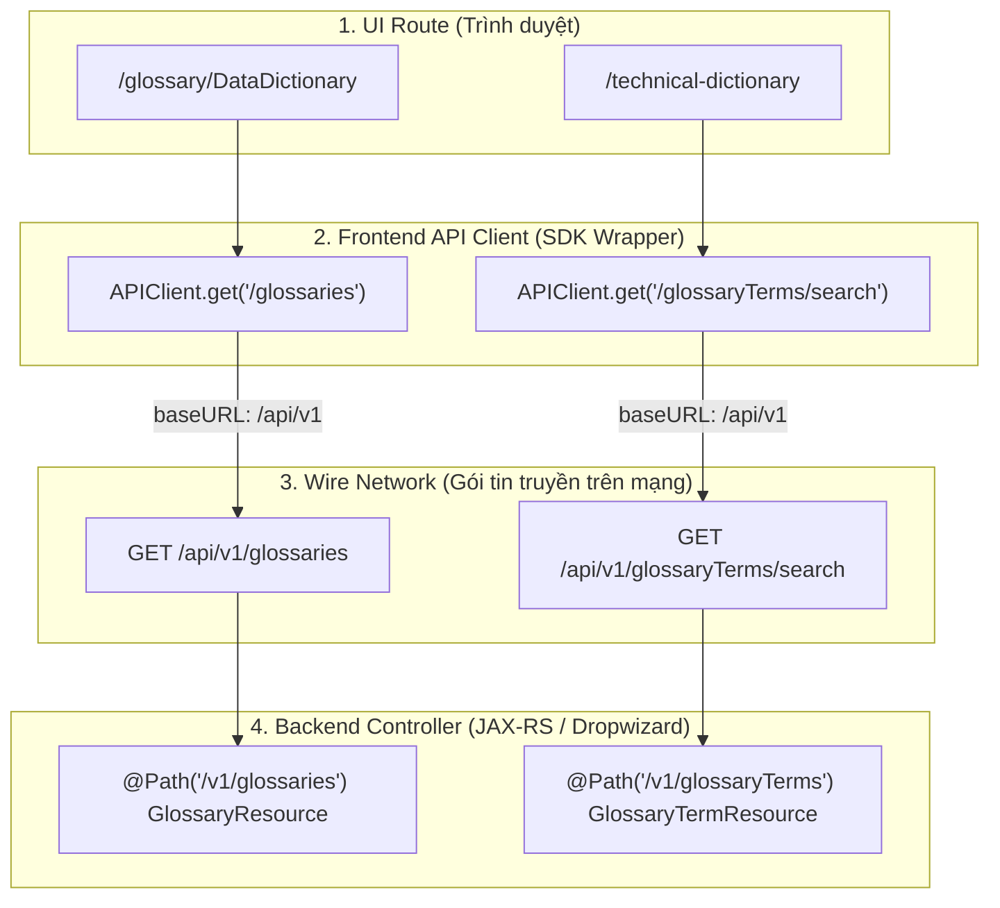
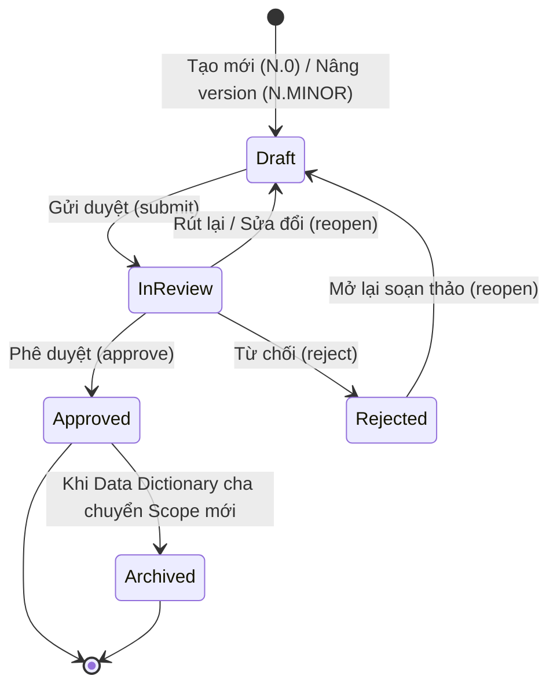

# TÀI LIỆU ĐẶC TẢ KỸ THUẬT API (API SPECIFICATION DOCUMENT)
## HỆ THỐNG QUẢN TRỊ METADATA NGÂN HÀNG (AGRIBANK METADATA PLATFORM)
### PHÂN HỆ: TỪ ĐIỂN DỮ LIỆU DÙNG CHUNG (CDE), CHẤT LƯỢNG DỮ LIỆU (DQ) VÀ TỪ ĐIỂN KỸ THUẬT (TECHNICAL DICTIONARY)

---

## 1. TỔNG QUAN TÀI LIỆU & QUY CHUẨN CHUNG

### 1.1. Mục đích tài liệu
Tài liệu này đặc tả chi tiết toàn bộ giao diện lập trình ứng dụng (RESTful APIs) phục vụ 3 phân hệ quản trị metadata trọng yếu của Agribank:
1. **Từ điển dữ liệu dùng chung (Data Dictionary) & Thành tố dữ liệu dùng chung (CDE - Critical Data Elements)**.
2. **Danh mục Quy tắc Chất lượng dữ liệu (Data Quality - DQ Rules Glossary)**.
3. **Từ điển Kỹ thuật theo Phiên bản nghiệp vụ (Technical Dictionary)**.

Tài liệu được biên soạn theo tiêu chuẩn kỹ thuật ngân hàng, đóng vai trò là hợp đồng giao tiếp (API Contract) chính thức giữa Backend (OpenMetadata Core Server - JAX-RS / Dropwizard), Frontend (React Single Page Application), và các hệ sinh thái tích hợp bên ngoài (Data Pipeline, Ingestion Bots, DWH/Data Lakehouse).

### 1.2. Đối tượng sử dụng
- **Kỹ sư phát triển Backend & Frontend:** Căn cứ lập trình đúng endpoint, tham số, kiểu dữ liệu, ràng buộc khóa lạc quan và mã phản hồi.
- **Kỹ sư Đảm bảo chất lượng (QA/QC/Testers):** Thiết kế kịch bản kiểm thử tự động (API Automation Testing), kiểm thử bảo mật và tải.
- **Kiến trúc sư giải pháp & Quản trị hệ thống (Architects & DevOps/SecOps):** Rà soát tuân thủ kiến trúc, phân quyền RBAC và an toàn thông tin ngân hàng.

### 1.3. Bảng thuật ngữ và chữ viết tắt
| Viết tắt / Khái niệm | Tên đầy đủ / Định nghĩa | Ý nghĩa nghiệp vụ |
| :--- | :--- | :--- |
| **CDE** | Critical Data Element | Thành tố dữ liệu dùng chung có giá trị nghiệp vụ trọng yếu trong ngân hàng. |
| **DQ** | Data Quality | Chất lượng dữ liệu (tính chính xác, đầy đủ, kịp thời, nhất quán, hợp lệ, duy nhất). |
| **TD** | Technical Dictionary | Từ điển kỹ thuật quản lý metadata vật lý của các cột dữ liệu từ hệ thống nguồn. |
| **Scope / Parent Version** | Governance Scope ($N$) | Kỳ/Phạm vi quản trị dữ liệu dạng số nguyên ($1, 2, 3...$), đóng vai trò là không gian cô lập phiên bản. |
| **Business Version** | Business Version ($N.MINOR$) | Phiên bản nghiệp vụ của bản ghi (CDE, DQ Rule, Technical Record) thuộc Scope $N$. |
| **Working Version** | Working / Draft State | Bản ghi đang trong chu trình soạn thảo, phê duyệt (`Draft`, `In Review`, `Rejected`). |
| **Published Version** | Published Snapshot | Bản ghi đã phê duyệt (`Approved`), đóng băng bất biến (Immutable), phục vụ khai thác chính thức. |
| **FQN** | Fully Qualified Name | Tên định danh toàn cầu duy nhất của một thực thể trong OpenMetadata. |
| **RBAC** | Role-Based Access Control | Cơ chế kiểm soát truy cập dựa trên vai trò người dùng (Consumer, Proposer, Steward, Admin). |
| **Optimistic Locking** | Khóa lạc quan | Kiểm soát xung đột cập nhật đồng thời dựa trên số hiệu hiệu chỉnh `workingRevision`. |

---

### 1.4. Quy chuẩn Phân tầng Kiến trúc URL (Architecture & URL Layering)
Hệ thống tuân thủ nghiêm ngặt mô hình 4 tầng định tuyến để đảm bảo tính nhất quán giữa UI, API Client và Wire Network:



* **Quy tắc vàng:**
  - Base URL của API server: `http(s)://<domain_or_ip>:<port>/api/v1`.
  - Frontend `APIClient` đã cấu hình ngầm `baseURL = '/api/v1'`. Khi gọi trong wrapper, không thêm tiền tố `/api/v1` để tránh sinh lỗi `404 Not Found` (do trùng lặp thành `/api/v1/api/v1/...`).
  - Mọi thao tác Mutation trên phiên bản nghiệp vụ phải được xác thực authoritative tại Database, không tin cậy trạng thái suy diễn từ Search Index (OpenSearch/Elasticsearch).

---

## 2. TIÊU CHUẨN KỸ THUẬT, BẢO MẬT & MÃ LỖI

### 2.1. Xác thực & Phân quyền RBAC (Authentication & RBAC)
- **Cơ chế xác thực:** Mọi API (ngoại trừ health-check công khai) bắt buộc phải truyền Header xác thực chuẩn OAuth2 / JWT:
  ```http
  Authorization: Bearer <JWT_ACCESS_TOKEN>
  ```
- **Vai trò người dùng (5 Roles chuẩn của hệ thống Agribank Metadata):**
  1. `BasicConsumer` (Người dùng cơ bản): Quyền tối thiểu, chỉ được phép tra cứu và đọc (`GET`) các bản ghi đã được phê duyệt (`Approved` - Published snapshot) và các bản ghi lưu trữ lịch sử (`Archived`). Không xem được bản nháp (`Draft`), đang xem xét (`In Review`), từ chối (`Rejected`) và không có quyền export nâng cao.
  2. `DataConsumer` (Người tiêu thụ / khai thác dữ liệu): Khai thác nội dung đã được phê duyệt (`Approved`) và lịch sử (`Archived`), có toàn quyền tra cứu, tìm kiếm, lọc dữ liệu và xuất dữ liệu (`Export`) ra Excel. Không xem được bản ghi đang trong chu trình soạn thảo (`Draft/In Review/Rejected`).
  3. `DataProposer` (Người đề xuất - Maker): Soạn thảo dữ liệu, có quyền tạo mới bản ghi (`Draft` $N.0$), nâng phiên bản ($N.MINOR$), chỉnh sửa lưu nháp tại chỗ (`Save Draft`), gửi thẩm định (`Submit`), mở lại bản nháp sau từ chối (`Reopen`) và Import dữ liệu hàng loạt vào Draft theo policy.
  4. `DataSteward` (Quản trị viên nghiệp vụ dữ liệu - Checker/Approver): Thẩm định và kiểm soát chất lượng dữ liệu, có quyền phê duyệt ban hành (`Approve`), từ chối thẩm định (`Reject`) các bản ghi đang xem xét (`In Review`), hoặc thu hồi phê duyệt theo thẩm quyền. Mặc định không trực tiếp tạo mới hoặc chỉnh sửa nội dung bản nháp của Maker.
  5. `Admin` (Quản trị viên hệ thống - Administrator): Toàn quyền quản trị trên toàn bộ hệ thống, khởi tạo Scope mới, liên kết binding scope, kích hoạt Cutover toàn hệ thống, quản lý phân quyền và xử lý ngoại lệ.

#### Bảng Ma trận Quyền hạn và Phạm vi Dữ liệu theo 5 Role:
| Nội dung / Thao tác | BasicConsumer | DataConsumer | DataProposer (Maker) | DataSteward (Checker) | Admin |
| :--- | :---: | :---: | :---: | :---: | :---: |
| **Xem bản Approved mới nhất** | ✅ Có | ✅ Có | ✅ Có | ✅ Có | ✅ Có |
| **Xem bản Archived (Lịch sử)** | ✅ Có (Chỉ đọc) | ✅ Có (Chỉ đọc) | ✅ Có | ✅ Có | ✅ Có |
| **Xem bản Draft / Rejected** | ❌ Không | ❌ Không | ✅ Có (Bản mình tạo/sửa) | ✅ Có (Phạm vi quản lý) | ✅ Có |
| **Xem bản In Review (Đang xem xét)** | ❌ Không | ❌ Không | ✅ Có (Chỉ đọc) | ✅ Có (Để thẩm định) | ✅ Có |
| **Tạo mới bản ghi ($N.0$)** | ❌ Không | ❌ Không | ✅ Có | ❌ Không mặc định | ✅ Có |
| **Nâng phiên bản ($N.MINOR$)** | ❌ Không | ❌ Không | ✅ Có | ❌ Không mặc định | ✅ Có |
| **Chỉnh sửa nháp (`Save Draft`)** | ❌ Không | ❌ Không | ✅ Có | ❌ Không mặc định | ✅ Có |
| **Gửi duyệt (`Submit`)** | ❌ Không | ❌ Không | ✅ Có | ❌ Không mặc định | ✅ Có |
| **Phê duyệt (`Approve`)** | ❌ Không | ❌ Không | ❌ Không | ✅ Có | ✅ Có |
| **Từ chối (`Reject`)** | ❌ Không | ❌ Không | ❌ Không | ✅ Có | ✅ Có |
| **Mở lại soạn thảo (`Reopen`)** | ❌ Không | ❌ Không | ✅ Có | ❌ Không | ✅ Có |
| **Xuất dữ liệu (`Export Excel`)** | ❌ Hạn chế | ✅ Có | ✅ Có | ✅ Có | ✅ Có |
| **Nhập dữ liệu (`Import Excel`)** | ❌ Không | ❌ Không | ✅ Có (Theo policy) | ❌ Không | ✅ Có |
| **Tạo Scope & Phê duyệt Cutover** | ❌ Không | ❌ Không | ❌ Không | ❌ Không | ✅ Có |

> [!NOTE]
> **Quy tắc phân loại Consumer-only:** Người dùng chỉ bị áp dụng cơ chế giới hạn "chỉ thấy Approved" (`Consumer-only`) khi quyền hiệu lực thỏa mãn: `canViewPublished = true` VÀ `canViewWorking = false`. Nếu một người dùng mang role `BasicConsumer` hoặc `DataConsumer` nhưng đồng thời là Chủ sở hữu (Owner) của bản ghi hoặc được phân công thẩm định thì hệ thống vẫn cấp quyền truy cập bản nháp theo chính sách hiệu lực.


### 2.2. Kiểm soát đồng thời bằng Khóa lạc quan (Optimistic Locking)
Để ngăn chặn tình trạng ghi đè mất dữ liệu (Lost Updates) khi nhiều người dùng cùng thao tác:
- Mọi API cập nhật nháp (`PATCH /working`) hoặc chuyển trạng thái workflow (`POST /working/{action}`) bắt buộc phải truyền thuộc tính `expectedRevision` trong payload.
- Backend đối chiếu `expectedRevision` với `workingRevision` hiện tại trong Database:
  - Nếu khớp: Cập nhật thành công và tăng `workingRevision` lên 1 đơn vị.
  - Nếu không khớp: Từ chối giao dịch, trả về HTTP status `409 Conflict`.

### 2.3. Cấu trúc phản hồi lỗi chuẩn (Standard Error Envelope)
Mọi phản hồi lỗi từ hệ thống tuân theo định dạng JSON chuẩn:
```json
{
  "code": 409,
  "errorCode": "OPTIMISTIC_LOCK_CONFLICT",
  "message": "Bản ghi đã được cập nhật bởi một người dùng khác. Vui lòng tải lại trang để lấy dữ liệu mới nhất.",
  "timestamp": "2026-09-29T08:30:00.000Z",
  "path": "/api/v1/glossaryTerms/d3b07384-d113-4a6f-9988-251f92e42426/working"
}
```

### 2.4. Bảng mã phản hồi HTTP (HTTP Status Codes)
| HTTP Code | Mã lỗi chuẩn | Ý nghĩa & Ngữ cảnh áp dụng |
| :--- | :--- | :--- |
| **200 OK** | `SUCCESS` | Yêu cầu đọc/xử lý thành công. |
| **201 Created** | `CREATED` | Khởi tạo thành công bản ghi mới (Identity, Version). |
| **400 Bad Request** | `INVALID_PAYLOAD` / `MISSING_PARAM` | Thiếu tham số bắt buộc, sai kiểu dữ liệu, vi phạm ràng buộc miền giá trị. |
| **401 Unauthorized** | `AUTH_TOKEN_EXPIRED` / `UNAUTHORIZED` | Thiếu hoặc token JWT không hợp lệ/hết hạn. |
| **403 Forbidden** | `PERMISSION_DENIED` | Người dùng không đủ quyền thực hiện thao tác (Maker duyệt bài, Consumer xem Draft). |
| **404 Not Found** | `ENTITY_NOT_FOUND` | Không tìm thấy entity, hoặc bản ghi ở trạng thái người dùng không có quyền nhìn thấy. |
| **409 Conflict** | `OPTIMISTIC_LOCK_CONFLICT` / `DUPLICATE_KEY` | Xung đột phiên bản khóa lạc quan hoặc trùng lặp mã duy nhất trong cùng Scope. |
| **413 Payload Too Large** | `FILE_SIZE_EXCEEDED` | File tải lên vượt quá giới hạn tối đa cho phép (ví dụ file Import > 5MB). |
| **500 Internal Error** | `INTERNAL_SERVER_ERROR` | Lỗi máy chủ nội bộ không mong muốn. Không để lộ stack trace ra client. |

---

## 3. PHÂN HỆ 1: TỪ ĐIỂN DỮ LIỆU DÙNG CHUNG (CDE / DATA DICTIONARY)

Phân hệ quản lý duy nhất một thực thể Từ điển dữ liệu nghiệp vụ (`Data Dictionary`) đóng vai trò là Scope cha, và các Thành tố dữ liệu dùng chung (`CDE`) là các nút con trực tiếp.



`InReview` trong sơ đồ chỉ là identifier Mermaid. Contract JSON chính thức sử dụng
`"In Review"`, tương ứng với `EntityStatus.IN_REVIEW` ở Java và
`EntityStatus.InReview` ở TypeScript. `Pending` không phải trạng thái workflow hợp lệ;
giá trị lưu trữ nội bộ không phải contract công khai.

### 3.1. Nhóm API Quản lý Scope Từ điển Dữ liệu (Glossary Level)

#### API 3.1.1: Lấy danh sách Từ điển dữ liệu (Sidebar/List)
- **Method & Endpoint:** `GET /api/v1/glossaries`
- **Mô tả:** Lấy danh sách Từ điển dữ liệu cho cây thư mục/panel trái.
- **Query Parameters:**
  - `fields` (string, tùy chọn): Danh sách trường quan hệ cần nạp (ví dụ: `owners,tags,reviewers`).
  - `limit` (integer, mặc định `25`): Số lượng bản ghi mỗi trang.
- **Quy tắc phân quyền:**
  - `Consumer-only`: Chỉ trả về thực thể nếu có bản ghi `Approved`. Nếu chỉ có bản `Draft`, trả về danh sách rỗng.
  - Các role khác: Trả về thực thể kèm bản ghi nháp hiện hành.
- **Mẫu Request:**
  ```http
  GET /api/v1/glossaries?fields=owners,tags HTTP/1.1
  Host: localhost:8585
  Authorization: Bearer <TOKEN>
  ```
- **Mẫu Phản hồi (200 OK):**
  ```json
  {
    "data": [
      {
        "id": "e305e5d3-883a-44ba-8ca4-f655848bb21f",
        "name": "Data Dictionary",
        "displayName": "Từ điển dữ liệu dùng chung",
        "fullyQualifiedName": "Data Dictionary",
        "versioningMode": "BusinessWorkflow",
        "businessVersion": "1",
        "entityStatus": "Approved",
        "owners": [
          {
            "id": "2d242416-65bb-4aa7-9252-87da77ec23f8",
            "type": "team",
            "name": "TrungTamQuanLyDuLieu",
            "displayName": "Trung tâm Quản lý Dữ liệu"
          }
        ]
      }
    ],
    "paging": {
      "total": 1
    }
  }
  ```

---

#### API 3.1.2: Lấy chi tiết Từ điển theo FQN
- **Method & Endpoint:** `GET /api/v1/glossaries/name/{glossaryFqn}`
- **Path Parameters:**
  - `glossaryFqn` (string): FQN của Từ điển dữ liệu (ví dụ: `Data Dictionary`).
- **Mẫu Phản hồi (200 OK):**
  ```json
  {
    "id": "e305e5d3-883a-44ba-8ca4-f655848bb21f",
    "name": "Data Dictionary",
    "displayName": "Từ điển dữ liệu dùng chung",
    "fullyQualifiedName": "Data Dictionary",
    "businessVersion": "1",
    "entityStatus": "Approved",
    "description": "Từ điển dữ liệu nghiệp vụ dùng chung toàn hệ thống Agribank.",
    "owners": [
      {
        "id": "2d242416-65bb-4aa7-9252-87da77ec23f8",
        "type": "team",
        "name": "TrungTamQuanLyDuLieu",
        "displayName": "Trung tâm Quản lý Dữ liệu"
      }
    ],
    "capabilities": {
      "canViewPublished": true,
      "canViewWorking": false,
      "canEdit": false,
      "canSubmit": false,
      "canApprove": false,
      "canReject": false,
      "canImport": false,
      "canExport": true
    }
  }
  ```

---

#### API 3.1.3: Lấy bản Approved mới nhất của Từ điển
- **Method & Endpoint:** `GET /api/v1/glossaries/{id}/published/latest`
- **Path Parameters:**
  - `id` (UUID): ID định danh của Từ điển dữ liệu.
- **Mẫu Phản hồi (200 OK):**
  ```json
  {
    "id": "e305e5d3-883a-44ba-8ca4-f655848bb21f",
    "name": "Data Dictionary",
    "displayName": "Từ điển dữ liệu dùng chung",
    "businessVersion": "1",
    "entityStatus": "Approved",
    "publishedAt": "2026-01-01T08:00:00.000Z",
    "publishedBy": "admin"
  }
  ```

---

#### API 3.1.4: Lấy danh sách các phiên bản Approved đã phát hành
- **Method & Endpoint:** `GET /api/v1/glossaries/{id}/published`
- **Mẫu Phản hồi (200 OK):**
  ```json
  {
    "data": [
      {
        "businessVersion": "1",
        "entityStatus": "Approved",
        "publishedAt": "2026-01-01T08:00:00.000Z",
        "isCurrent": true
      }
    ]
  }
  ```

---

#### API 3.1.5: Lấy chi tiết phiên bản Approved cụ thể
- **Method & Endpoint:** `GET /api/v1/glossaries/{id}/published/{businessVersion}`
- **Path Parameters:**
  - `id` (UUID): ID Từ điển.
  - `businessVersion` (string): Số hiệu phiên bản (ví dụ: `1`).
- **Mẫu Phản hồi (200 OK):** Tương tự API 3.1.3.

---

#### API 3.1.6: Lấy bản ghi nháp hiện hành (Draft/Working) của Từ điển
- **Method & Endpoint:** `GET /api/v1/glossaries/{id}/working`
- **Mẫu Phản hồi (200 OK):**
  ```json
  {
    "id": "e305e5d3-883a-44ba-8ca4-f655848bb21f",
    "name": "Data Dictionary",
    "displayName": "Từ điển dữ liệu dùng chung",
    "businessVersion": "2",
    "entityStatus": "Draft",
    "workingRevision": 3,
    "description": "Từ điển dữ liệu dùng chung áp dụng cho kỳ kế hoạch 2026-2027.",
    "capabilities": {
      "canViewPublished": true,
      "canViewWorking": true,
      "canEdit": true,
      "canSubmit": true,
      "canApprove": false,
      "canReject": false
    }
  }
  ```

---

#### API 3.1.7: Xem trước CDE sẽ tự động phát hành khi Cutover (Publish Preview)
- **Method & Endpoint:** `GET /api/v1/glossaries/{id}/working/publish-preview?limit={n}&after={cursor}`
- **Mô tả:** Trả về danh sách CDE `Approved` trong scope mới sẽ được công bố, kèm số lượng CDE cũ sẽ bị Archive hoặc xóa dọn.
- **Mẫu Phản hồi (200 OK):**
  ```json
  {
    "targetBusinessVersion": "2",
    "cdeToPublishCount": 1420,
    "predecessorStats": {
      "predecessorVersion": "1",
      "cdeToArchiveCount": 1250,
      "cdeDraftToDeleteCount": 15
    },
    "previewTerms": [
      {
        "id": "c1f7a4e2-623b-4830-a15d-5ff36f2f3981",
        "name": "CDE_CUST_ID",
        "displayName": "Mã khách hàng",
        "businessVersion": "2.0",
        "entityStatus": "Approved"
      }
    ]
  }
  ```

---

#### API 3.1.8: Lưu nháp Từ điển dữ liệu tại chỗ (In-place Save Draft)
- **Method & Endpoint:** `PATCH /api/v1/glossaries/{id}/working`
- **Mẫu Request Body:**
  ```json
  {
    "expectedRevision": 3,
    "payload": {
      "description": "Cập nhật định hướng quản trị từ điển dữ liệu kỳ 2.",
      "displayName": "Từ điển dữ liệu dùng chung (Kỳ 2026-2027)"
    }
  }
  ```
- **Mẫu Phản hồi (200 OK):**
  ```json
  {
    "id": "e305e5d3-883a-44ba-8ca4-f655848bb21f",
    "workingRevision": 4,
    "displayName": "Từ điển dữ liệu dùng chung (Kỳ 2026-2027)",
    "updatedAt": "2026-09-29T08:35:00.000Z"
  }
  ```

---

#### API 3.1.9: Thao tác Vòng đời Từ điển dữ liệu (Workflow Actions)
- **Method & Endpoint:** `POST /api/v1/glossaries/{id}/working/{action}`
- **Path Actions:**
  - `createDraft`: Khởi tạo bản nháp kỳ tiếp theo ($N+1$).
  - `submit`: Gửi thẩm định toàn bộ Scope từ điển (`Draft` $\rightarrow$ `In Review`).
  - `approve`: Phê duyệt và kích hoạt Cutover (`In Review` $\rightarrow$ `Approved`).
  - `reject`: Từ chối thẩm định (`In Review` $\rightarrow$ `Rejected`).
  - `reopen`: Mở lại bản nháp để chỉnh sửa (`Rejected` $\rightarrow$ `Draft`).
- **Mẫu Request (Approve Cutover):**
  ```http
  POST /api/v1/glossaries/e305e5d3-883a-44ba-8ca4-f655848bb21f/working/approve HTTP/1.1
  Host: localhost:8585
  Authorization: Bearer <TOKEN>
  Content-Type: application/json

  {
    "expectedRevision": 4,
    "comment": "Đồng ý phê duyệt ban hành phiên bản Từ điển dữ liệu kỳ 2."
  }
  ```
- **Mẫu Phản hồi (200 OK):**
  ```json
  {
    "id": "e305e5d3-883a-44ba-8ca4-f655848bb21f",
    "businessVersion": "2",
    "entityStatus": "Approved",
    "message": "Cutover thành công. Phiên bản 2 đã trở thành phiên bản hoạt động chính thức."
  }
  ```

---

### 3.2. Nhóm API Quản lý CDE (Critical Data Elements)

#### Schema 16 Thuộc tính chuẩn của CDE:
| STT | Tên trường API | Tên hiển thị tiếng Việt | Kiểu dữ liệu | Bắt buộc | Mô tả & Ràng buộc giá trị |
| :---: | :--- | :--- | :--- | :---: | :--- |
| 1 | `name` | Mã CDE | `string` | **Có** | Mã định danh duy nhất (ví dụ: `CDE_CUST_ID`). Không dấu, không khoảng trắng. |
| 2 | `domain` | Khối / Miền nghiệp vụ | `EntityReference` | Không | Liên kết tới Domain phân cấp trong hệ thống. |
| 3 | `displayName` | Tên thuật ngữ nghiệp vụ | `string` | **Có** | Tên chuẩn hóa tiếng Việt (ví dụ: `Mã khách hàng`). |
| 4 | `tags` (Data Source) | Hệ thống nguồn | `Array<Tag>` | Không | Tag thuộc Classification `DataSource` (ví dụ: `CoreBanking`). |
| 5 | `description` | Ý nghĩa nghiệp vụ | `markdown` | **Có** | Định nghĩa chi tiết ý nghĩa và mục đích sử dụng. |
| 6 | `extension.entityRelationship` | Mối quan hệ với thực thể | `markdown` | Không | Quan hệ liên kết logic giữa thực thể CDE với các đối tượng dữ liệu khác. |
| 7 | `owners` | Chủ sở hữu dữ liệu | `Array<EntityReference>` | Không | Nhóm (Team) hoặc cá nhân (User) phụ trách sở hữu dữ liệu. |
| 8 | `tags` (Classification) | Phân loại dữ liệu | `Array<Tag>` | Không | Nhãn bảo mật (Công khai, Nội bộ, Bảo mật, Tối mật). |
| 9 | `tags` (Personal Data) | Dữ liệu cá nhân | `Array<Tag>` | Không | Phân loại dữ liệu định danh khách hàng (PII). |
| 10 | `extension.relatedRegulatoryDocuments` | Văn bản quy định liên quan | `markdown` | Không | Căn cứ văn bản, luật định, thông tư của NHNN hoặc nội bộ ban hành. |
| 11 | `extension.dataQualityRules` | Quy định chất lượng dữ liệu | `Array<string>` | **Có** | Danh sách 1 giá trị: `["Y"]` (Có) hoặc `["N"]` (Không). |
| 12 | `businessVersion` | Phiên bản | `string` | **Có** | Số hiệu phiên bản nghiệp vụ dạng `$N.MINOR$` (ví dụ: `1.0`, `1.1`). |
| 13 | `extension.releaseVersionType` | Loại phiên bản phát hành | `string` | **Auto** | Hệ thống tự tính: `Bản chính` nếu là `$N.0$`, `Bản phụ` nếu `$N.MINOR$` ($MINOR \ge 1$). |
| 14 | `extension.releaseLevel` | Cấp phát hành | `string` | **Có** | Thẩm quyền phê duyệt: Chỉ nhận `CEO` (Tổng Giám đốc) hoặc `TTQLDL` (Trung tâm QLDL). |
| 15 | `extension.effectiveDate` | Ngày hiệu lực | `string (date)` | Không | Định dạng chuẩn `yyyy-MM-dd`. |
| 16 | `extension.expirationDate` | Ngày hết hiệu lực | `string (date)` | Không | Định dạng `yyyy-MM-dd`. Ràng buộc: $\ge$ `effectiveDate`. |

---

#### API 3.2.1: Truy vấn danh sách CDE dạng phẳng (Flat List Table)
- **Method & Endpoint:** `GET /api/v1/glossaryTerms`
- **Query Parameters:**
  - `glossary` (UUID, bắt buộc): ID Từ điển.
  - `parentBusinessVersion` (string, bắt buộc): Scope kỳ quản trị (ví dụ: `1`, `2`).
  - `limit` (integer, mặc định `25`), `offset` (integer, mặc định `0`).
- **Mẫu Phản hồi (200 OK):**
  ```json
  {
    "data": [
      {
        "id": "c1f7a4e2-623b-4830-a15d-5ff36f2f3981",
        "name": "CDE_CUST_ID",
        "displayName": "Mã khách hàng",
        "fullyQualifiedName": "Data Dictionary.CDE_CUST_ID@v1",
        "parentBusinessVersion": "1",
        "businessVersion": "1.0",
        "entityStatus": "Approved",
        "recordType": "published",
        "description": "Mã định danh duy nhất của khách hàng trên toàn hệ thống Agribank.",
        "extension": {
          "releaseVersionType": "Bản chính",
          "releaseLevel": "CEO",
          "dataQualityRules": ["Y"],
          "effectiveDate": "2026-01-01",
          "expirationDate": "2030-12-31"
        },
        "owners": [
          {
            "id": "2d242416-65bb-4aa7-9252-87da77ec23f8",
            "type": "team",
            "name": "KhoiQLRR",
            "displayName": "Khối Quản lý Rủi ro"
          }
        ]
      }
    ],
    "paging": {
      "total": 1250,
      "limit": 25,
      "offset": 0
    }
  }
  ```

---

#### API 3.2.2: Tìm kiếm và Lọc CDE theo đa tiêu chí (Authoritative Search & Filter)
- **Method & Endpoint:** `GET /api/v1/glossaryTerms/search`
- **Query Parameters:** `glossary`, `parentBusinessVersion`, `q`, `statuses`, `domainIds`, `ownerIds`, `limit`, `offset`.
- **Mẫu Phản hồi (200 OK):** Cùng định dạng với API 3.2.1.

---

#### API 3.2.3: Lấy chi tiết CDE theo Scoped FQN
- **Method & Endpoint:** `GET /api/v1/glossaryTerms/name/{scopedFqn}`
- **Path Parameters:**
  - `scopedFqn`: FQN có chứa version scope (ví dụ: `Data Dictionary.CDE_CUST_ID@v1`).
- **Mẫu Phản hồi (200 OK):** Trả về đầy đủ thông tin CDE, `extension`, `domain`, `tags`, `owners`.

---

#### API 3.2.4: Lấy danh sách các phiên bản Approved của CDE trong Scope
- **Method & Endpoint:** `GET /api/v1/glossaryTerms/{id}/published?parentBusinessVersion={N}`
- **Mẫu Phản hồi (200 OK):**
  ```json
  {
    "data": [
      {
        "businessVersion": "1.1",
        "entityStatus": "Approved",
        "releaseVersionType": "Bản phụ",
        "publishedAt": "2026-03-15T09:00:00.000Z"
      },
      {
        "businessVersion": "1.0",
        "entityStatus": "Approved",
        "releaseVersionType": "Bản chính",
        "publishedAt": "2026-01-01T08:00:00.000Z"
      }
    ]
  }
  ```

---

#### API 3.2.5: Lấy chi tiết phiên bản Approved cụ thể của CDE
- **Method & Endpoint:** `GET /api/v1/glossaryTerms/{id}/published/{businessVersion}?parentBusinessVersion={N}`
- **Mẫu Phản hồi (200 OK):** Trả về snapshot bất biến của CDE tại phiên bản tương ứng.

---

#### API 3.2.6: Lấy bản nháp hiện hành (Draft/Working) của CDE
- **Method & Endpoint:** `GET /api/v1/glossaryTerms/{id}/working?parentBusinessVersion={N}`
- **Mẫu Phản hồi (200 OK):**
  ```json
  {
    "id": "c1f7a4e2-623b-4830-a15d-5ff36f2f3981",
    "name": "CDE_CUST_ID",
    "displayName": "Mã khách hàng",
    "parentBusinessVersion": "1",
    "businessVersion": "1.2",
    "entityStatus": "Draft",
    "workingRevision": 2,
    "description": "Bản nháp cập nhật mô tả quy định liên quan."
  }
  ```

---

#### API 3.2.7: Tạo mới CDE (Bản khởi tạo $N.0$)
- **Method & Endpoint:** `POST /api/v1/glossaryTerms`
- **Mẫu Request Body:**
  ```json
  {
    "glossary": "e305e5d3-883a-44ba-8ca4-f655848bb21f",
    "name": "CDE_ACC_NO",
    "displayName": "Số tài khoản thanh toán",
    "description": "Số tài khoản thanh toán nội bảng của khách hàng mở tại Agribank.",
    "extension": {
      "releaseLevel": "TTQLDL",
      "dataQualityRules": ["Y"],
      "effectiveDate": "2026-03-01",
      "entityRelationship": "Liên kết 1-N với bảng Thông tin khách hàng",
      "relatedRegulatoryDocuments": "Thông tư 23/2014/TT-NHNN"
    },
    "tags": [
      {
        "tagFQN": "DataSource.CoreBanking",
        "source": "Classification"
      },
      {
        "tagFQN": "SecurityClassification.Confidential",
        "source": "Classification"
      }
    ]
  }
  ```
- **Mẫu Phản hồi (201 Created):**
  ```json
  {
    "id": "a9812e11-1244-4902-8812-78129aa123bb",
    "name": "CDE_ACC_NO",
    "displayName": "Số tài khoản thanh toán",
    "parentBusinessVersion": "1",
    "businessVersion": "1.0",
    "entityStatus": "Draft",
    "workingRevision": 1
  }
  ```

---

#### API 3.2.8: Nâng phiên bản CDE mới ($N.MINOR$)
- **Method & Endpoint:** `POST /api/v1/glossaryTerms/{id}/working`
- **Mẫu Request Body:**
  ```json
  {
    "parentBusinessVersion": "1",
    "businessVersion": "1.1",
    "comment": "Nâng cấp phiên bản để cập nhật văn bản quy định liên quan mới."
  }
  ```
- **Mẫu Phản hồi (201 Created):**
  ```json
  {
    "id": "c1f7a4e2-623b-4830-a15d-5ff36f2f3981",
    "parentBusinessVersion": "1",
    "businessVersion": "1.1",
    "entityStatus": "Draft",
    "workingRevision": 1
  }
  ```

---

#### API 3.2.9: Lưu nháp CDE tại chỗ (In-place Save Draft)
- **Method & Endpoint:** `PATCH /api/v1/glossaryTerms/{id}/working?parentBusinessVersion={N}`
- **Mẫu Request Body:**
  ```json
  {
    "expectedRevision": 1,
    "payload": {
      "displayName": "Mã khách hàng chuẩn hóa",
      "description": "Ý nghĩa nghiệp vụ được cập nhật lại chuẩn mực hơn.",
      "extension": {
        "releaseLevel": "CEO",
        "dataQualityRules": ["Y"],
        "effectiveDate": "2026-01-01",
        "expirationDate": "2032-12-31"
      }
    }
  }
  ```
- **Mẫu Phản hồi (200 OK):**
  ```json
  {
    "id": "c1f7a4e2-623b-4830-a15d-5ff36f2f3981",
    "workingRevision": 2,
    "updatedAt": "2026-09-29T08:40:00.000Z"
  }
  ```

---

#### API 3.2.10: Chuyển trạng thái Workflow CDE (Maker - Checker)
- **Method & Endpoint:** `POST /api/v1/glossaryTerms/{id}/working/{action}?parentBusinessVersion={N}`
- **Path Actions:** `submit`, `approve`, `reject`, `reopen`.
- **Mẫu Request Body:**
  ```json
  {
    "expectedRevision": 2,
    "comment": "Kính gửi Trung tâm Quản lý dữ liệu thẩm định và phê duyệt."
  }
  ```
- **Mẫu Phản hồi (200 OK):**
  ```json
  {
    "id": "c1f7a4e2-623b-4830-a15d-5ff36f2f3981",
    "entityStatus": "In Review",
    "workingRevision": 3,
    "message": "CDE đã được chuyển sang trạng thái đang xem xét."
  }
  ```

---

#### API 3.2.11: Lấy ma trận quyền thao tác trên CDE (Version Permissions)
- **Method & Endpoint:** `GET /api/v1/glossaryTerms/{id}/permissions?parentBusinessVersion={N}`
- **Mẫu Phản hồi (200 OK):**
  ```json
  {
    "cdeId": "c1f7a4e2-623b-4830-a15d-5ff36f2f3981",
    "parentBusinessVersion": "1",
    "capabilities": {
      "canViewPublished": true,
      "canViewWorking": true,
      "canEdit": true,
      "canSubmit": true,
      "canApprove": false,
      "canReject": false,
      "canReopen": false,
      "canDelete": false
    }
  }
  ```

---

#### API 3.2.12: Lấy danh sách Tài sản metadata liên kết (Tab Assets)
- **Method & Endpoint:** `GET /api/v1/glossaryTerms/{id}/assets?limit=15&offset=0`
- **Mẫu Phản hồi (200 OK):**
  ```json
  {
    "data": [
      {
        "id": "89ab12cd-ef34-5678-9012-123456789abc",
        "entityType": "table",
        "name": "CUSTOMER",
        "fullyQualifiedName": "CoreBanking.COREDB.dbo.CUSTOMER",
        "description": "Bảng thông tin khách hàng gốc",
        "columnName": "CUST_ID"
      }
    ],
    "paging": {
      "total": 12
    }
  }
  ```

---

### 3.3. Nhóm API Xuất & Nhập Excel CDE (Export & Import)

#### API 3.3.1: Xuất dữ liệu CDE ra Excel (.xlsx)
- **Method & Endpoint:** `GET /api/v1/glossaryTerms/export?glossary={glossaryId}&parentBusinessVersion={N}`
- **Headers:** `Accept: application/vnd.openxmlformats-officedocument.spreadsheetml.sheet`
- **Tên file tải về:** `Agribank_CDE_Danh_Tu_Dien_Du_Lieu_v{N}_YYYYMMDD_HHmm.xlsx`

---

#### API 3.3.2: Tải file mẫu Nhập CDE (Import Template)
- **Method & Endpoint:** `GET /api/v1/glossaryTerms/import/template`
- **Headers:** `Accept: application/vnd.openxmlformats-officedocument.spreadsheetml.sheet`
- **Mô tả:** Tải file Excel gồm đúng 14 cột nghiệp vụ chuẩn phục vụ soạn thảo nhập liệu hàng loạt.

---

#### API 3.3.3: Thẩm định và xem trước file Nhập (Import Preview)
- **Method & Endpoint:** `POST /api/v1/glossaryTerms/import/preview?glossary={id}&parentBusinessVersion={N}&existingCodePolicy={policy}`
- **Content-Type:** `multipart/form-data`
- **Parameters:** `existingCodePolicy` nhận `SKIP_EXISTING` hoặc `OVERWRITE_EXISTING`.
- **Mẫu Phản hồi (200 OK):**
  ```json
  {
    "importSessionId": "sess_89a3f2b4-7123-4567-8901-abcdef123456",
    "expiresAt": "2026-09-29T09:15:00.000Z",
    "fileHash": "e3b0c44298fc1c149afbf4c8996fb92427ae41e4649b934ca495991b7852b855",
    "canCommit": true,
    "summary": {
      "totalRows": 150,
      "createCount": 120,
      "updateCount": 30,
      "errorCount": 0,
      "warningCount": 2
    },
    "rows": [
      {
        "rowNumber": 2,
        "cdeCode": "CDE_CUST_ID",
        "action": "UPDATE_DRAFT",
        "status": "VALID",
        "errors": []
      }
    ]
  }
  ```

---

#### API 3.3.4: Xác nhận Nhập dữ liệu nguyên tử (Atomic Commit)
- **Method & Endpoint:** `POST /api/v1/glossaryTerms/import/{importSessionId}/commit`
- **Mẫu Phản hồi (200 OK):**
  ```json
  {
    "importSessionId": "sess_89a3f2b4-7123-4567-8901-abcdef123456",
    "status": "COMPLETED",
    "committedRows": 150,
    "message": "Nhập dữ liệu CDE thành công."
  }
  ```
- **Kênh WebSocket tiến độ:** `wss://<host>/api/v1/ws/cdeImportChannel?sessionId={importSessionId}`.

---

## 4. PHÂN HỆ 2: DANH MỤC QUY TẮC CHẤT LƯỢNG DỮ LIỆU (DATA QUALITY - DQ GLOSSARY)

Phân hệ quản lý các quy tắc chất lượng dữ liệu nghiệp vụ, kế thừa kiến trúc **Governed Glossary Profile** (`profileKey = DATA_QUALITY`).

### 4.1. Schema 19 Thuộc tính Quy tắc Chất lượng Dữ liệu
| Tên trường API | Tên hiển thị tiếng Việt | Kiểu dữ liệu | Mô tả & Ràng buộc |
| :--- | :--- | :--- | :--- |
| `name` | Mã quy tắc CLDL | `string` | Mã duy nhất (ví dụ: `DQ_CUST_001`). Canonical identifier. |
| `displayName` | Tên quy tắc | `string` | Tên hiển thị (ví dụ: `Kiểm tra định dạng Mã số thuế`). |
| `description` | Mô tả quy tắc | `markdown` | Diễn giải mục đích và yêu cầu đo lường. |
| `owners` | Đơn vị chủ trì | `EntityReference` | Team nghiệp vụ chịu trách nhiệm quy tắc. |
| `relatedTerms` | CDE liên kết | `Array<EntityReference>` | Bắt buộc liên kết tới đúng CDE trong cùng Governance Scope. |
| `extension.dimension` | Chiều chất lượng | `string (enum)` | `Accuracy` (Chính xác), `Completeness` (Đầy đủ), `Consistency` (Nhất quán), `Timeliness` (Kịp thời), `Uniqueness` (Duy nhất), `Validity` (Hợp lệ). |
| `extension.ruleExplanation` | Diễn giải quy tắc nghiệp vụ | `markdown` | Diễn giải chi tiết công thức hoặc thuật toán tính toán. |
| `extension.otherConstraints` | Ràng buộc / Yêu cầu khác | `markdown` | Điều kiện lọc phụ, ngoại lệ áp dụng. |
| `extension.qualityThreshold` | Ngưỡng chất lượng dữ liệu | `string` | Biểu thức hoặc tỷ lệ cần đạt (ví dụ: `>= 99.5%`). |
| `extension.releaseLevel` | Cấp phát hành | `string (enum)` | `CEO` (Tổng Giám đốc) hoặc `TTQLDL` (Trung tâm Quản lý dữ liệu). |
| `extension.releaseVersionType` | Loại phiên bản phát hành | `string (enum)` | Server-owned: `Bản chính` ($N.0$) hoặc `Bản phụ` ($N.MINOR$). |
| `extension.effectiveDate` | Ngày hiệu lực | `string (date)` | `yyyy-MM-dd`. |
| `extension.expirationDate` | Ngày hết hiệu lực | `string (date)` | `yyyy-MM-dd`. |

---

### 4.2. Đặc tả chi tiết từng API Chất lượng Dữ liệu

#### API 4.2.1: Truy vấn danh sách Flat list Quy tắc CLDL
- **Method & Endpoint:** `GET /api/v1/glossaryTerms?profile=DATA_QUALITY&parentBusinessVersion={N}`
- **Query Parameters:** `profile=DATA_QUALITY`, `parentBusinessVersion={N}`, `limit`, `offset`.
- **Mẫu Phản hồi (200 OK):**
  ```json
  {
    "data": [
      {
        "id": "b1234567-89ab-cdef-0123-456789abcdef",
        "name": "DQ_CUST_TAX_01",
        "displayName": "Kiểm tra định dạng Mã số thuế khách hàng",
        "parentBusinessVersion": "1",
        "businessVersion": "1.0",
        "entityStatus": "Approved",
        "relatedTerms": [
          {
            "id": "c1f7a4e2-623b-4830-a15d-5ff36f2f3981",
            "name": "CDE_CUST_ID",
            "displayName": "Mã khách hàng"
          }
        ],
        "extension": {
          "dimension": "Validity",
          "qualityThreshold": "100%",
          "releaseLevel": "TTQLDL",
          "releaseVersionType": "Bản chính",
          "effectiveDate": "2026-01-01"
        }
      }
    ],
    "paging": {
      "total": 350,
      "limit": 25,
      "offset": 0
    }
  }
  ```

---

#### API 4.2.2: Tìm kiếm & Lọc Quy tắc CLDL
- **Method & Endpoint:** `GET /api/v1/glossaryTerms/search?profile=DATA_QUALITY`
- **Query Parameters:** `q`, `dimension`, `statuses`, `cdeId`, `parentBusinessVersion={N}`, `limit`, `offset`.
- **Mẫu Phản hồi (200 OK):** Cùng định dạng với API 4.2.1.

---

#### API 4.2.3: Xem chi tiết Quy tắc CLDL
- **Method & Endpoint:** `GET /api/v1/glossaryTerms/{id}?profile=DATA_QUALITY&parentBusinessVersion={N}`
- **Mẫu Phản hồi (200 OK):** Trả về đầy đủ 19 thuộc tính, logic kiểm tra và CDE liên kết.

---

#### API 4.2.4: Lấy danh sách các phiên bản Approved của Quy tắc CLDL
- **Method & Endpoint:** `GET /api/v1/glossaryTerms/{id}/published?profile=DATA_QUALITY&parentBusinessVersion={N}`
- **Mẫu Phản hồi (200 OK):** Danh sách các version nghiệp vụ đã phê duyệt của quy tắc.

---

#### API 4.2.5: Tạo mới Quy tắc CLDL (Bản $N.0$)
- **Method & Endpoint:** `POST /api/v1/glossaryTerms?profile=DATA_QUALITY`
- **Mẫu Request Body:**
  ```json
  {
    "name": "DQ_ACC_STATUS_01",
    "displayName": "Kiểm tra tính hợp lệ trạng thái tài khoản",
    "description": "Trạng thái tài khoản phải thuộc danh mục hợp lệ quy định tại CoreBanking.",
    "relatedTerms": [
      {
        "id": "a9812e11-1244-4902-8812-78129aa123bb"
      }
    ],
    "extension": {
      "dimension": "Consistency",
      "qualityThreshold": ">= 99.9%",
      "ruleExplanation": "ACCOUNT.STATUS IN ('ACTIVE', 'DORMANT', 'CLOSED')",
      "releaseLevel": "TTQLDL",
      "effectiveDate": "2026-04-01"
    }
  }
  ```
- **Mẫu Phản hồi (201 Created):**
  ```json
  {
    "id": "d9812345-bcde-4567-8901-234567890abc",
    "name": "DQ_ACC_STATUS_01",
    "parentBusinessVersion": "1",
    "businessVersion": "1.0",
    "entityStatus": "Draft",
    "workingRevision": 1
  }
  ```

---

#### API 4.2.6: Nâng phiên bản Quy tắc CLDL ($N.MINOR$)
- **Method & Endpoint:** `POST /api/v1/glossaryTerms/{id}/working?profile=DATA_QUALITY`
- **Mẫu Request Body:**
  ```json
  {
    "parentBusinessVersion": "1",
    "businessVersion": "1.1",
    "comment": "Bổ sung thêm mã trạng thái mới vào tập hợp kiểm tra."
  }
  ```

---

#### API 4.2.7: Lưu nháp Quy tắc CLDL tại chỗ (In-place Save Draft)
- **Method & Endpoint:** `PATCH /api/v1/glossaryTerms/{id}/working?profile=DATA_QUALITY&parentBusinessVersion={N}`
- **Mẫu Request Body:**
  ```json
  {
    "expectedRevision": 1,
    "payload": {
      "description": "Cập nhật ngưỡng chất lượng từ 99.9% lên 100%.",
      "extension": {
        "qualityThreshold": "100%",
        "otherConstraints": "Áp dụng bắt buộc từ quý 2/2026"
      }
    }
  }
  ```
- **Mẫu Phản hồi (200 OK):**
  ```json
  {
    "id": "d9812345-bcde-4567-8901-234567890abc",
    "workingRevision": 2,
    "updatedAt": "2026-09-29T08:45:00.000Z"
  }
  ```

---

#### API 4.2.8: Vòng đời Phê duyệt Quy tắc CLDL (Maker - Checker)
- **Method & Endpoint:** `POST /api/v1/glossaryTerms/{id}/working/{action}?profile=DATA_QUALITY&parentBusinessVersion={N}`
- **Path Actions:** `submit`, `approve`, `reject`, `reopen`.
- **Mẫu Request Body:**
  ```json
  {
    "expectedRevision": 2,
    "comment": "Đã hoàn tất kiểm tra công thức, kính gửi phê duyệt ban hành."
  }
  ```

---

#### API 4.2.9: Xuất danh mục Quy tắc CLDL ra Excel (.xlsx)
- **Method & Endpoint:** `GET /api/v1/glossaryTerms/export?profile=DATA_QUALITY&parentBusinessVersion={N}`
- **Headers:** `Accept: application/vnd.openxmlformats-officedocument.spreadsheetml.sheet`

---

#### API 4.2.10: Tải file mẫu Nhập Quy tắc CLDL (DQ Import Template)
- **Method & Endpoint:** `GET /api/v1/glossaryTerms/import/template?profile=DATA_QUALITY`

---

#### API 4.2.11: Preview file Nhập Quy tắc CLDL
- **Method & Endpoint:** `POST /api/v1/glossaryTerms/import/preview?profile=DATA_QUALITY&parentBusinessVersion={N}`
- **Content-Type:** `multipart/form-data`

---

#### API 4.2.12: Commit Nhập Quy tắc CLDL vào Database
- **Method & Endpoint:** `POST /api/v1/glossaryTerms/import/{importSessionId}/commit?profile=DATA_QUALITY`

---

## 5. PHÂN HỆ 3: TỪ ĐIỂN KỸ THUẬT (TECHNICAL DICTIONARY)

> **Contract:** Từ điển kỹ thuật là profile `TECHNICAL_DICTIONARY` của Governed
> Glossary, kế thừa Data Quality (và qua đó Data Dictionary). Không có
> `/technical-dictionary/*`, `scopeId`, `scopeVersion` hay scope lifecycle. Mỗi
> catalog version `N` có identity record riêng; record chỉ được gán CDE của Data
> Dictionary cùng số `N`.
>
> Nguồn thiết kế:
> [technical-dictionary-ui-design.md](../design/technical-dictionary-ui-design.md)
> và
> [technical-dictionary-feature-implementation-plan.md](../design/technical-dictionary-feature-implementation-plan.md).

Record chỉ do hệ thống sinh từ physical Column (bootstrap job và sự kiện Table),
người dùng không tạo hoặc xóa: `POST`/`DELETE /glossaryTerms` trên glossary này
trả `403` với mã `TD_MANUAL_CREATE_NOT_ALLOWED` / `TD_MANUAL_DELETE_NOT_ALLOWED`.

### 5.1. Catalog version (dùng chung)

```http
GET   /api/v1/glossaries/{id}/working
POST  /api/v1/glossaries/{id}/working                 # tạo catalog N+1, tự chạy bootstrap job
PATCH /api/v1/glossaries/{id}/working
POST  /api/v1/glossaries/{id}/working/{submit|approve|reject|reopen}
GET   /api/v1/glossaries/{id}/working/publish-preview
GET   /api/v1/glossaries/{id}/published
GET   /api/v1/glossaries/{id}/published/{businessVersion}
GET   /api/v1/glossaries/{id}/permissions
```

Route UI mặc định `/technical-dictionary`; lịch sử dùng `?businessVersion=N`.
Version không tồn tại là Not Found, không fallback sang version khác.

### 5.2. Danh sách, tìm kiếm, thống kê, export

```http
GET /api/v1/glossaryTerms/search
  ?glossary={id}&parentBusinessVersion=N&limit=25&offset=0
  &q=customer                          # database/schema/table/column/mã-tên CDE
  &statuses=Draft,In Review
  &sourceServices=ipcas                # OR trong nhóm, AND giữa các nhóm
  &cdeMapping=MAPPED|UNMAPPED
  &cdeTermIds=uuid,uuid
  &systemOwnerIds=uuid
  &sourceStatuses=Available,Unavailable,Changed
  &elementTypes=DataElementType.AtomicDataElement
  &generationTypes=FieldGenerationType.SystemGenerated
  &creationMethods=DataCreationMethod.Parameterised
  &timeliness=DataTimeliness.T1
  &versionView=LATEST|ALL              # mặc định LATEST

GET /api/v1/glossaryTerms/stats?glossary={id}&parentBusinessVersion=N
GET /api/v1/glossaryTerms/export?glossary={id}&parentBusinessVersion=N
```

- `limit` chỉ nhận `10`, `15`, `25`, `50`.
- Mỗi row là read-model phẳng gồm payload record và các trường suy ra:
  `sourceStatus`, `cdeCode`, `cdeName`, `dataOwners` (chủ sở hữu của CDE được
  quy chiếu), `searchText`, `sortKey`.
- `stats` trả `totalColumns`, `totalTables`, `mappedCde`, `totalSources`.
- `export` trả `.xlsx` 19 cột, tên `TuDienKyThuat_Agribank_v{N}_YYYYMMDD_HHmm.xlsx`,
  mỗi record một dòng (representation mới nhất); file này import lại được.

### 5.3. Record workflow (dùng chung)

```http
GET|PATCH /api/v1/glossaryTerms/{id}/working?parentBusinessVersion=N
POST      /api/v1/glossaryTerms/{id}/working                       # minor kế tiếp
POST      /api/v1/glossaryTerms/{id}/working/{submit|approve|reject|reopen}?parentBusinessVersion=N
GET       /api/v1/glossaryTerms/{id}/published?parentBusinessVersion=N
```

`PATCH` chỉ nhận `survivorshipRank`, `systemOwner` (Team) trong `extension`, tag
của 4 classification (`DataElementType`, `FieldGenerationType`,
`DataCreationMethod`, `DataTimeliness`) và một `relatedTerms` trỏ tới CDE. Mọi
trường nguồn (database, schema, table, column, kiểu dữ liệu, mô tả) do server
sở hữu; gửi lên sẽ bị từ chối `400 TD_SERVER_OWNED_FIELD`. Gửi `relatedTerms`
rỗng sẽ gỡ CDE.

### 5.4. Bulk workflow

```http
POST /api/v1/glossaryTerms/bulk/{submit|approve|reject}
{
  "glossaryId": "uuid", "parentBusinessVersion": "2",
  "termIds": ["uuid"],                 // hoặc
  "criteria": { "q": "...", "sourceServices": "ipcas", ... },   // tham số như /search
  "dryRun": false, "offset": 0, "limit": 500
}
```

Mỗi lần gọi xử lý một chunk (`limit` tối đa 1000), mỗi record một transaction.
Response: `matched`, `eligible`, `ineligible`, `attempted`, `succeeded`,
`failedCount`, `failures[{termId, code, message}]`, `remaining`. Client lặp lại với
`offset = tổng số thất bại` cho tới khi `remaining = 0`. Bulk approve kiểm tra
Thứ hạng trên trạng thái cuối của chunk nên đổi chỗ thứ hạng trong một lần duyệt
là hợp lệ.

### 5.5. Import gán CDE

```http
GET  /api/v1/glossaryTerms/import/technical/template
POST /api/v1/glossaryTerms/import/technical/preview
       ?glossary={id}&parentBusinessVersion=N&updatePolicy=DRAFT_ONLY|ALL_EDITABLE   (multipart `file`)
POST /api/v1/glossaryTerms/import/technical/{importSessionId}/commit
```

Khớp dòng với record theo Database/Schema/Bảng/Cột (thêm `Nguồn` để phân biệt),
không bao giờ tạo record. Chỉ cột có trong file được áp dụng; ô trống xóa giá trị.
Giới hạn 20 MB, 70.000 dòng. Session dùng một lần, gắn actor, hết hạn sau 30 phút;
commit là một transaction và kiểm tra lại revision từng dòng (`409
TD_IMPORT_CONFLICT` nếu preview đã cũ).

### 5.6. Bootstrap job

```http
GET  /api/v1/glossaries/{id}/bootstrap-jobs?businessVersion=N
POST /api/v1/glossaries/{id}/bootstrap-jobs?businessVersion=N          # Admin, tạo job còn thiếu
POST /api/v1/glossaries/{id}/bootstrap-jobs/{jobId}/retry              # Admin, chỉ job Failed
```

Trạng thái job (`Pending|Running|Succeeded|Failed`) độc lập với trạng thái
workflow của catalog. Phạm vi Column cấu hình ở `technicalDictionary.*` trong
`openmetadata.yaml` và được chụp lại vào job khi tạo.

### 5.7. Mã lỗi

`TD_MANUAL_CREATE_NOT_ALLOWED`, `TD_MANUAL_DELETE_NOT_ALLOWED`,
`TD_SERVER_OWNED_FIELD`, `TD_INVALID_FIELD`, `TD_SOURCE_UNAVAILABLE`,
`TD_RANK_REQUIRED`, `TD_RANK_DUPLICATE`, `TD_CDE_SCOPE_MISMATCH`,
`TD_CDE_SCOPE_NOT_ACTIVE`, `TD_COLUMN_SCOPE_EMPTY`, `TD_BOOTSTRAP_NOT_READY`,
`TD_IMPORT_ROW_NOT_MATCHED`, `TD_IMPORT_CONFLICT`, `TD_IMPORT_SESSION_INVALID`.
Mã chung (`WORKING_REVISION_CONFLICT`, ...) theo các phân hệ trước.

## 6. PHỤ LỤC: VÍ DỤ TÍCH HỢP HỆ THỐNG (INTEGRATION EXAMPLES)

### 6.1. Kịch bản cURL: Quy trình Maker gửi duyệt CDE
```bash
# Bước 1: Tạo mới CDE
curl -X POST "http://localhost:8585/api/v1/glossaryTerms" \
  -H "Authorization: Bearer $ACCESS_TOKEN" \
  -H "Content-Type: application/json" \
  -d '{
    "glossary": "e305e5d3-883a-44ba-8ca4-f655848bb21f",
    "name": "CDE_BRANCH_CODE",
    "displayName": "Mã chi nhánh mở tài khoản",
    "description": "Mã định danh duy nhất của chi nhánh Agribank nơi mở tài khoản thanh toán.",
    "extension": {
      "releaseLevel": "TTQLDL",
      "dataQualityRules": ["Y"],
      "effectiveDate": "2026-04-01"
    }
  }'

# Bước 2: Gửi thẩm định (Submit) với expectedRevision = 1
curl -X POST "http://localhost:8585/api/v1/glossaryTerms/{CDE_UUID}/working/submit?parentBusinessVersion=1" \
  -H "Authorization: Bearer $ACCESS_TOKEN" \
  -H "Content-Type: application/json" \
  -d '{
    "expectedRevision": 1,
    "comment": "Kính gửi Trung tâm QLDL phê duyệt mã CDE_BRANCH_CODE."
  }'
```

### 6.2. Kịch bản Python SDK: Kiểm tra xung đột khóa lạc quan (Optimistic Locking Handling)
```python
import requests

BASE_URL = "http://localhost:8585/api/v1"
HEADERS = {
    "Authorization": "Bearer YOUR_JWT_TOKEN",
    "Content-Type": "application/json"
}

def update_cde_safely(cde_id: str, parent_version: str, new_description: str):
    # 1. Lấy thông tin bản nháp hiện tại để nhận workingRevision
    get_res = requests.get(
        f"{BASE_URL}/glossaryTerms/{cde_id}/working?parentBusinessVersion={parent_version}",
        headers=HEADERS
    )
    get_res.raise_for_status()
    current_data = get_res.json()
    current_rev = current_data["workingRevision"]

    # 2. Cập nhật kèm expectedRevision
    patch_payload = {
        "expectedRevision": current_rev,
        "payload": {
            "description": new_description
        }
    }
    patch_res = requests.patch(
        f"{BASE_URL}/glossaryTerms/{cde_id}/working?parentBusinessVersion={parent_version}",
        json=patch_payload,
        headers=HEADERS
    )

    if patch_res.status_code == 200:
        print("Cập nhật thành công! Revision mới:", patch_res.json().get("workingRevision"))
    elif patch_res.status_code == 409:
        print("CẢNH BÁO: Dữ liệu bị xung đột do người khác đã sửa đổi (409 Conflict).")
    else:
        print(f"Lỗi: {patch_res.status_code} - {patch_res.text}")

if __name__ == "__main__":
    update_cde_safely("c1f7a4e2-623b-4830-a15d-5ff36f2f3981", "1", "Mô tả mới đã chuẩn hóa.")
```

---
*Tài liệu này được biên soạn và chuẩn hóa 100% theo kiến trúc OpenMetadata Core 1.13.3 và các tiêu chuẩn quản trị dữ liệu Agribank.*
