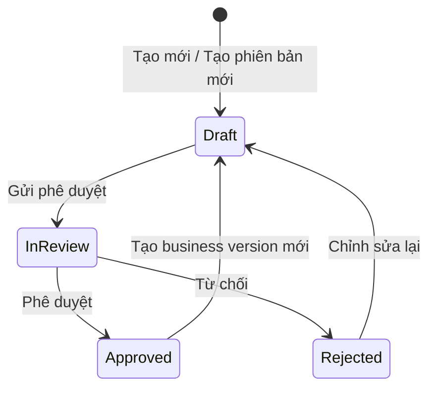

# Thiết kế luồng Từ điển dữ liệu dùng chung (CDE Glossary) và Thành tố dữ liệu dùng chung (CDE) theo Version, Workflow và Role

## 1. Mục tiêu

Tài liệu này mô tả thiết kế chuyên biệt cho **Từ điển dữ liệu dùng chung** (`Data Dictionary`) và các **Thành tố dữ liệu dùng chung (CDE)**, bao gồm:

- Phân biệt working version và published version.
- Nội dung từng Role được phép nhìn thấy.
- Hành vi màn hình khi người dùng tạo, chỉnh sửa, gửi duyệt, phê duyệt, từ chối và xem lịch sử.
- Quan hệ giữa version của Từ điển dữ liệu dùng chung và version của CDE.
- Các nhược điểm của implementation hiện tại và hướng xử lý.

Thiết kế ưu tiên nguyên tắc: Consumer luôn nhìn thấy bản Approved ổn định gần nhất và không bị ảnh hưởng bởi Draft/In Review đang được chỉnh sửa.

## 2. Khái niệm

### 2.1. Từ điển dữ liệu dùng chung (Data Dictionary Glossary)

`Data Dictionary` chính là **Từ điển dữ liệu dùng chung** của Agribank, quản lý tập trung toàn bộ các Thành tố dữ liệu dùng chung (CDE). Mỗi bản phát hành (release/published version) của Từ điển dữ liệu dùng chung xác định chính xác danh sách các CDE và phiên bản nghiệp vụ (`businessVersion`) tương ứng thuộc bản phát hành đó.

### 2.2. Thành tố dữ liệu dùng chung (CDE)

- **Bản chất kỹ thuật:** CDE chính là entity `GlossaryTerm` trong OpenMetadata. Toàn bộ kiến trúc bên dưới (model, schema, phân quyền, quan hệ hierarchy và REST API) tuân thủ 100% chuẩn chung `Glossary` và `GlossaryTerm`, tránh phát sinh các entity hoặc khái niệm kỹ thuật dư thừa.
- **Tầng nghiệp vụ (UI):** CDE (Common Data Element) là thuật ngữ hiển thị cho người dùng đối với các mục từ (`GlossaryTerm`) thuộc Từ điển dữ liệu dùng chung (`Data Dictionary`).
- Mỗi CDE có workflow và business version riêng, độc lập với native metadata version của OpenMetadata.

### 2.3. Hai loại version

| Loại version | Ví dụ | Mục đích | Vai trò hiển thị UI |
| --- | --- | --- | --- |
| Business version | `1.0`, `1.1`, `2.0` | Định danh phiên bản nghiệp vụ chính thức khi phát hành Từ điển hoặc CDE. | **Phiên bản hiển thị chính (Primary UI Version)** trên toàn bộ giao diện: Header, danh sách, bảng dữ liệu, dropdown chọn version, badge và xuất dữ liệu. Người dùng chỉ làm việc và nhận biết phiên bản này. |
| Native metadata version | `0.1`, `0.2`, `1.0` | OpenMetadata sử dụng để lưu lịch sử thay đổi kỹ thuật của entity dưới backend. | **Kỹ thuật / Nội bộ**: Ẩn khỏi màn hình nghiệp vụ chính; không hiển thị thay thế cho business version. |

Quy tắc:
- Trong Từ điển dữ liệu dùng chung, **business version là nội dung được hiển thị chính cho người dùng**. Mọi thao tác tìm kiếm, lọc, chọn phiên bản lịch sử, đối soát hay xem chi tiết đều quy chiếu theo business version.
- Quá trình lưu nháp (Save Draft) chỉ cập nhật đè tại chỗ (in-place), không tăng ngầm `nativeVersion` để tránh phình to dung lượng lưu trữ (storage bloating).
- Hai loại version phải được đặt tên và xử lý tách biệt trong model/code. Không dùng `version` mà không xác định đó là `nativeVersion` hay `businessVersion`.

### 2.4. Working version và published version

- **Working version**: bản đang soạn thảo hoặc đang chờ duyệt. Chỉ người có quyền quản trị nội dung được nhìn thấy.
- **Published version**: snapshot bất biến đã Approved. Consumer sử dụng bản này.
- Mỗi Từ điển hoặc CDE chỉ có tối đa một working version tại một thời điểm, nhưng có thể có nhiều published version trong lịch sử.

## 3. Mô hình trạng thái



Quy tắc:

- `Draft`: được chỉnh sửa bởi Proposer và các Role có quyền quản trị.
- `InReview`: khóa các trường nghiệp vụ; chỉ cho phép Reviewer/Steward phê duyệt hoặc từ chối.
- `Rejected`: không hiển thị cho Consumer; người soạn thảo có thể đưa về Draft để sửa.
- `Approved`: snapshot bất biến và được hiển thị cho Consumer.
- Không coi thiếu `entityStatus` là Approved. Phương án triển khai mới không hỗ trợ dữ liệu thiếu trạng thái; môi trường phải được khởi tạo lại với dữ liệu tuân thủ schema mới.

## 4. Role và phạm vi trách nhiệm

### 4.1. Các Role nghiệp vụ

| Role | Trách nhiệm chính |
| --- | --- |
| Admin | Quản trị toàn bộ, xử lý ngoại lệ và cấu hình hệ thống. |
| Organization | Role hệ thống có quyền theo policy; không mặc định là Consumer. |
| Data Steward | Kiểm soát chất lượng, duyệt/từ chối và quản trị nội dung được giao. |
| Reviewer | Người được gán trực tiếp vào Glossary/CDE để duyệt. Đây có thể là assignment, không nhất thiết là một Role hệ thống riêng. |
| Data Proposer | Tạo Draft, chỉnh sửa và gửi duyệt. |
| Data Consumer | Khai thác nội dung đã được phê duyệt. |
| Basic Consumer | Chỉ đọc nội dung đã được phê duyệt với tập chức năng tối thiểu. |

Quyền thực tế phải được backend xác định từ Role, policy, quyền trên entity và reviewer assignment. Frontend chỉ dùng kết quả quyền từ backend để điều khiển giao diện.

### 4.2. Ma trận nội dung được nhìn thấy

| Nội dung | Admin | Data Steward | Reviewer được gán | Data Proposer | Data Consumer | Basic Consumer |
| --- | --- | --- | --- | --- | --- | --- |
| Glossary Draft | Có | Có trong phạm vi quản lý | Có khi được gán duyệt | Có khi là owner/người tạo hoặc có quyền edit | Không | Không |
| Glossary In Review | Có | Có | Có khi được gán duyệt | Có, chỉ đọc | Không | Không |
| Glossary Approved mới nhất | Có | Có | Có | Có | Có | Có |
| Glossary Approved cũ | Có | Có | Có | Có | Có | Có |
| CDE Draft/Rejected | Có | Có trong phạm vi quản lý | Có khi liên quan phiên duyệt | Có khi được phép chỉnh sửa | Không | Không |
| CDE In Review | Có | Có | Có khi được gán duyệt | Có, chỉ đọc | Không | Không |
| CDE Approved | Có | Có | Có | Có | Có | Có |
| Import | Có | Theo policy | Không mặc định | Theo policy | Không | Không |
| Export | Có | Có | Có | Có | Có | Có |

### 4.3. Ma trận thao tác

| Thao tác | Admin | Data Steward | Reviewer | Data Proposer | Data Consumer | Basic Consumer |
| --- | --- | --- | --- | --- | --- | --- |
| Tạo Glossary/CDE | Có | Theo policy | Không | Có | Không | Không |
| Tạo business version mới | Có | Theo policy | Không | Có | Không | Không |
| Chỉnh sửa Draft | Có | Theo policy | Không mặc định | Có | Không | Không |
| Gửi duyệt | Có | Theo policy | Không | Có | Không | Không |
| Approve/Reject | Có | Có | Có khi được gán | Không | Không | Không |
| Thu hồi Approved | Có | Có theo policy | Không mặc định | Không | Không | Không |
| Xóa | Có | Theo policy | Không | Theo policy với Draft | Không | Không |
| Xem/chọn version | Có | Có | Có | Có | Chỉ Approved | Chỉ Approved |

## 5. Thiết kế version của Từ điển dữ liệu dùng chung và CDE

### 5.1. Snapshot của Từ điển dữ liệu dùng chung (Glossary)

Published Glossary không được chỉ lưu danh sách `termIds`. Snapshot phải tham chiếu chính xác phiên bản của từng Term (CDE):

```json
{
  "glossaryId": "...",
  "businessVersion": "1.0",
  "status": "Approved",
  "publishedAt": 0,
  "publishedBy": "...",
  "terms": [
    {
      "termId": "...",
      "termBusinessVersion": "1.0"
    }
  ]
}
```

Quy tắc:

- Snapshot Approved là bất biến.
- Glossary luôn hiển thị đúng phiên bản Term (CDE) đã được đóng gói lúc phát hành.
- Glossary version mới được tạo sau đó không làm thay đổi nội dung của Glossary version cũ.
- Xóa hoặc đổi tên Glossary hiện hành không được phá vỡ snapshot đã phát hành.

### 5.2. Tạo business version mới của Glossary

Khi tạo Glossary version mới từ Glossary version cũ:

1. Tạo working snapshot ở trạng thái Draft với `termRevisions` rỗng.
2. Không sao chép bất kỳ term revision nào từ published snapshot.
3. Chỉ giữ các trường định danh ổn định cần thiết để tham chiếu đúng Glossary.
4. Người dùng chủ động thêm term revision vào working snapshot mới.
5. Published snapshot không thay đổi và vẫn phục vụ Consumer.

Mọi business version kế tiếp của Glossary được tạo sau khi đã có published snapshot mặc định là một bản trắng. Business version đầu tiên vẫn nhận dữ liệu người dùng vừa nhập khi tạo entity. Hệ thống không cung cấp hành vi ngầm kế thừa danh sách Term từ phiên bản đã phát hành trước đó.

### 5.4. Snapshot và Version của CDE

Mỗi CDE khi được phê duyệt sẽ tạo ra một snapshot bất biến chứa toàn bộ thuộc tính nghiệp vụ tại thời điểm ban hành:

```json
{
  "termId": "...",
  "glossaryId": "...",
  "businessVersion": "1.0",
  "status": "Approved",
  "publishedAt": 0,
  "publishedBy": "...",
  "attributes": {
    "name": "...",
    "displayName": "...",
    "description": "...",
    "customProperties": { ... }
  }
}
```

Quy tắc:

- Mỗi CDE chỉ có tối đa một working version (`Draft` hoặc `InReview`) tại một thời điểm, nhưng lưu giữ toàn bộ lịch sử các published version đã `Approved`.
- Chỉnh sửa và lưu nháp nhiều lần (Save Draft) chỉ cập nhật đè trực tiếp (in-place update) lên bản Draft hiện hành, **không tăng ngầm `nativeVersion`** và không tạo thêm bản ghi snapshot kỹ thuật ngầm nhằm tối ưu dung lượng lưu trữ (tránh storage bloating).
- Snapshot Approved của CDE là bất biến; việc sửa đổi hoặc tạo version mới của CDE không làm thay đổi nội dung các published snapshot đã có.

### 5.5. Tạo business version mới của CDE

Khi tạo CDE version mới (ví dụ `1.1` từ bản `1.0` đã Approved):

1. Hệ thống khởi tạo working version mới ở trạng thái `Draft`.
2. Form tạo phiên bản mới bắt đầu rỗng: chỉ giữ lại các trường định danh bất biến (`id`, `name`, `fullyQualifiedName`, liên kết `glossary`) và để trống toàn bộ thông tin nghiệp vụ để người dùng nhập mới.
3. Bản `1.0` đã Approved vẫn giữ nguyên trạng thái bất biến và tiếp tục phục vụ Consumer tra cứu cho tới khi bản `1.1` được Approved.

## 6. Luồng màn hình Glossary

### 6.1. Danh sách Glossary (Panel menu bên trái)

Panel bên trái (`GlossaryLeftPanel`) đóng vai trò là danh mục điều hướng để người dùng chuyển đổi giữa các Glossary:

- **Hiển thị:** Danh sách các Glossary (Icon + Tên hiển thị (DisplayName)) và nút `+ Thêm Glossary` (đối với Role có quyền tạo).
- **Phân quyền hiển thị:**
  - *Nhóm quản trị / soạn thảo (Admin, Steward, Proposer, Reviewer):* Hiển thị các Glossary trong phạm vi quản lý.
  - *Nhóm tra cứu (Data Consumer, Basic Consumer):* Chỉ hiển thị các Glossary đã có ít nhất một phiên bản được `Approved`.

Toàn bộ thông tin chi tiết về phiên bản, trạng thái, mô tả và thao tác phê duyệt được quản lý tại **Trang chi tiết Glossary bên phải (Mục 6.2)**.

### 6.2. Trang chi tiết Glossary (Header và Khu vực điều khiển)

#### Chi tiết các thành phần trên Header:
1. **Tên Glossary:** Sử dụng cơ chế mặc định của OpenMetadata (hiển thị ưu tiên `displayName` trên giao diện, fallback về `name` nếu trống; `name` cố định dùng cho FQN và URL).
2. **Bộ chọn Business Version (Dropdown Selector) & Đồng bộ URL qua Query Param:**
   - **Cơ chế đồng bộ Query Param (`?version={businessVersion}`):**
     - Khi người dùng chọn một phiên bản trong Dropdown, URL lập tức cập nhật: `.../glossary/{glossaryFqn}?version={businessVersion}` (ví dụ: `?version=1.0`).
     - **Tải lại trang (F5) / Bookmark:** Giao diện đọc trực tiếp query param `version` trên URL để tải chính xác phiên bản đang xem, không bị nhảy về phiên bản khác.
     - **Chia sẻ liên kết (Deep linking):** Cho phép copy URL gửi cho người dùng khác truy cập trực tiếp đúng bản phát hành cần tra cứu hoặc kiểm duyệt.
     - **URL mặc định (không truyền param `version`):**
       - *Consumer:* Tự động mở bản phát hành `Approved` mới nhất.
       - *Nhóm Quản trị/Soạn thảo:* Mặc định mở bản làm việc `Draft`/`In Review` đang soạn (nếu có), hoặc bản `Approved` mới nhất.
   - **Phân quyền trong danh sách Dropdown:**
      - *Consumer:* Trong dropdown chỉ hiển thị các phiên bản đã `Approved`. Nếu tự ý gõ param `?version=...` trỏ tới một bản `Draft`/`In Review`/`Rejected` chưa duyệt, hệ thống từ chối truy cập (trả lỗi 403 hoặc 404), giao diện hiển thị màn hình báo lỗi và tuyệt đối không hiển thị bất kỳ nút action nào.
     - *Admin / Steward / Proposer:* Liệt kê đầy đủ bản đang làm việc (`Draft` / `In Review`) và toàn bộ lịch sử các bản `Approved`.
3. **Badge trạng thái (Status Badge):**
   - `[ Draft ]`: Màu xám/vàng - Bản đang soạn thảo, cho phép thêm/bớt/sửa CDE.
   - `[ In Review ]`: Màu xanh dương - Đang chờ duyệt, khóa toàn bộ form.
   - `[ Rejected ]`: Màu đỏ - Bị từ chối phê duyệt.
   - `[ Approved ]`: Màu xanh lá - Bản phát hành chính thức, bất biến.
4. **Cụm nút thao tác (Action Buttons phân cấp theo Action Hierarchy):**

Bố cục góc phải Header: `[ Bộ chọn Version ]  [ Nút trực diện ]  [ Menu ba chấm (...) ]`

| Trạng thái Glossary đang xem | Nút hiển thị trực diện trên Header (Role Quản trị) | Tùy chọn trong Menu ba chấm `...` | Role Khai thác (Consumer) |
| :--- | :--- | :--- | :--- |
| **Draft** | • `Lưu nháp` <br>• `Gửi duyệt` <br>• `+ Thêm CDE` | • `Xóa bản nháp` (Chữ đỏ, có modal xác nhận)<br>• `Xuất dữ liệu (Export)` | Không truy cập được (403/404); Ẩn hoàn toàn trên UI và không hiển thị bất kỳ nút thao tác nào. |
| **In Review** | • `Phê duyệt` (Steward/Reviewer - Xanh lá)<br>• `Từ chối` (Steward/Reviewer - Đỏ)<br>• `Chờ duyệt` (Proposer - Read-only) | • `Xuất dữ liệu (Export)` | Không truy cập được (403/404); Ẩn hoàn toàn trên UI và không hiển thị bất kỳ nút thao tác nào. |
| **Rejected** | • `Chỉnh sửa lại` (Proposer - đưa về Draft) | • `Xóa bản nháp` | Không truy cập được (403/404); Ẩn hoàn toàn trên UI và không hiển thị bất kỳ nút thao tác nào. |
| **Approved (Mới nhất)** | • `+ Thêm CDE`<br>• `Tạo phiên bản mới` | • `Xuất dữ liệu (Export)`<br>• `Nhập dữ liệu (Import)` | Toàn bộ chỉ đọc; `Export` (trong menu `...`). |
| **Approved (Lịch sử cũ)** | Không hiển thị nút thao tác (ẩn toàn bộ nút Thêm/Sửa; màn hình chuyển sang chế độ chỉ đọc). | • `Xuất dữ liệu (Export)` | Chỉ đọc; `Export` (trong menu `...`). |

---

### 6.3. Bảng danh sách CDE trong Từ điển dữ liệu dùng chung

Bảng danh sách thể hiện tập hợp các Thành tố dữ liệu dùng chung (CDE) thuộc Từ điển dữ liệu dùng chung.

#### Quy tắc hiển thị danh sách CDE:
1. **Các dòng hiển thị ngang hàng (Flat List - Không phân biệt dòng chính/dòng con):**
   - Tất cả các phiên bản của CDE được hiển thị bình đẳng thành các dòng độc lập, ngang hàng nhau trên bảng dữ liệu.
   - Không áp dụng cơ chế phân cấp chính/con hay thụt lề `↳`.
   - Các dòng có cùng mã CDE được xếp cạnh nhau, sắp xếp theo thứ tự phiên bản mới nhất ở trên để người dùng dễ theo dõi.
2. **Quyền xem theo Role (Người dùng tự do tra cứu theo quyền):**
   - **Data Consumer:** Nhìn thấy tất cả các dòng phiên bản có trạng thái `Approved`. Người dùng tùy ý lựa chọn, tìm kiếm và xem chi tiết bất kỳ phiên bản CDE đã duyệt nào mà mình cần. Tuyệt đối không hiển thị các bản đang là `Draft`, `In Review` hoặc `Rejected`.
   - **Nhóm Quản trị (Admin, Steward, Proposer):** Nhìn thấy đầy đủ tất cả các dòng phiên bản (bao gồm cả `Draft`, `In Review`, `Rejected`, `Approved`) để phục vụ quản lý và chỉnh sửa.
3. **Công cụ Tìm kiếm, Lọc và Phân trang (Search, Filters & Pagination):**
   - **Thanh tìm kiếm văn bản (Text Search Bar):**
     - *Vị trí:* Nằm ở góc trái thanh công cụ phía trên bảng (chiều rộng 280px, có nút xóa nhanh `x`).
     - *Phạm vi tìm kiếm:* Tìm kiếm gần đúng (wildcard query `*<keyword>*`) đồng thời trên **Mã CDE (`name`)** và **Tên hiển thị CDE (`displayName`)**.
     - *Cơ chế:* Tích hợp cơ chế Debounce 500ms để tối ưu tải truy vấn server khi người dùng nhập liệu.
   - **Bộ lọc Trạng thái (Status Filter Dropdown):**
     - *Hình thức:* Dropdown đa chọn (Multi-select checkbox).
     - *Các tiêu chí trạng thái:* `Tất cả` (`all`), `Bản nháp` (`Draft`), `Chờ duyệt` (`In Review`), `Đã phê duyệt` (`Approved`).
     - *Quy tắc phân quyền:* 
       - Với **Role Khai thác (Consumer):** Hệ thống tự động khóa cứng (hard-lock) duy nhất trạng thái `Đã phê duyệt (Approved)`.
       - Với **Nhóm Quản trị (Admin / Steward / Proposer):** Mặc định chọn tất cả, người dùng có thể tick/bỏ tick để lọc riêng bản nháp, bản chờ duyệt hoặc bản đã phê duyệt.
   - **4 Bộ lọc Chuyên biệt cho CDE (CDE Specific Filter Dropdowns):**
     - **(1) Khối / Miền nghiệp vụ (Business Group / Domain):** Dropdown đa chọn nạp động danh sách Miền từ hệ thống (ví dụ: *Khối Bán lẻ, Khối Khách hàng doanh nghiệp, Khối Quản trị rủi ro, Khối Tài chính kế toán,...*). Lọc theo trường `domains.displayName`.
     - **(2) Hệ thống nguồn (Data Source):** Dropdown đa chọn nạp danh sách các tag thuộc phân loại `DataSource` (ví dụ: *Core Banking, LOS, CRM, DWH, ERP, ECM,...*). Lọc theo mã tag trong `classificationTags`.
     - **(3) Chủ sở hữu / Đầu mối phụ trách (Data Owner):** Dropdown đa chọn nạp danh sách user và team phụ trách CDE trong hệ thống. Lọc theo định danh `owners.name`.
     - **(4) Phân loại dữ liệu (Data Classification):** Dropdown đa chọn nạp danh sách tag bảo mật thuộc nhóm `DataClassification` (ví dụ: *Công khai, Nội bộ, Bí mật, Tuyệt mật*). Lọc theo mã tag trong `classificationTags`.
   - **Cơ chế phối hợp truy vấn & Phân trang:**
     - Mọi tiêu chí tìm kiếm và lọc được kết hợp đồng thời theo điều kiện **`AND`** (mệnh đề `must` trong truy vấn Elasticsearch).
     - Mỗi khi người dùng thay đổi từ khóa hoặc điều kiện lọc, hệ thống tự động reset về trang 1 và tính toán lại tổng số dòng.
     - Phân trang tính trên toàn bộ các dòng kết quả tìm kiếm/lọc được (hỗ trợ các mức kích thước trang: 10, 15, 25, 50 dòng/trang).
   - **Tính năng Xuất dữ liệu (Export):** Khi người dùng bấm Export trong menu ba chấm `...`, file xuất ra sẽ phản ánh đúng các điều kiện lọc và tìm kiếm đang kích hoạt trên màn hình, đồng thời tuân thủ 100% phân quyền của người thực hiện xuất.

#### Ví dụ minh họa cụ thể:
Giả sử mục từ `CDE1` (Mã khách hàng) có lịch sử 4 phiên bản với các trạng thái khác nhau trong hệ thống:
- `v1.0`: `Approved`
- `v1.1`: `Approved`
- `v1.2`: `Rejected`
- `v2.0`: `Draft`

*So sánh nội dung hiển thị trên bảng giữa các nhóm người dùng:*

| Nhóm người dùng | Các dòng hiển thị trên bảng (Ngang hàng) | Quy tắc |
| :--- | :--- | :--- |
| **Data Consumer** | • **`CDE1`** - Version `1.1` `[Approved]`<br>• **`CDE1`** - Version `1.0` `[Approved]` | • Các bản đã `Approved` hiển thị ngang hàng nhau.<br>• Người xem muốn tra cứu bản nào thì tùy chọn.<br>• Ẩn các bản `Draft` và `Rejected`. |
| **Data Steward / Admin / Proposer** | • **`CDE1`** - Version `2.0` `[Draft]`<br>• **`CDE1`** - Version `1.2` `[Rejected]`<br>• **`CDE1`** - Version `1.1` `[Approved]`<br>• **`CDE1`** - Version `1.0` `[Approved]` | • Hiển thị đầy đủ mọi phiên bản ngang hàng nhau.<br>• Cho phép thao tác chỉnh sửa hoặc kiểm duyệt theo từng dòng. |

## 7. Luồng màn hình Thành tố dữ liệu dùng chung (CDE)

### 7.1. Bố cục và thành phần Trang chi tiết CDE

Màn hình chi tiết CDE trong phân hệ Từ điển dữ liệu dùng chung bao gồm các khu vực thành phần sau:

#### 1. Header và Khu vực điều khiển:
- **Breadcrumbs điều hướng phân cấp rõ 2 tầng phiên bản:**  
  `Glossaries > [DisplayName của Glossary] (v{glossaryVersion}) > [DisplayName của CDE] (v{cdeVersion})`  
  *(Ví dụ: `Glossaries > Từ điển dữ liệu dùng chung (v2.0) > Mã khách hàng (v1.1)`)*.
- **Tên CDE:** Kế thừa cơ chế mặc định của OpenMetadata (hiển thị ưu tiên `displayName` tiếng Việt có dấu; fallback về `name` kỹ thuật nếu trống; `name` dùng cho FQN và URL).
- **Bộ chọn Business Version (Dropdown Selector) & Đồng bộ URL chuẩn REST:**
  - **Định dạng URL chuẩn:**  
    `/glossary/{cdeFqn}?glossaryVersion={glossaryVersion}&version={cdeVersion}`  
    *(Ví dụ: `/glossary/DataDictionary.CDE1?glossaryVersion=2.0&version=1.1`)*.
    - `glossaryVersion`: Xác định rõ CDE này đang được xem trong ngữ cảnh bản phát hành nào của Từ điển dùng chung (`Data Dictionary v2.0`).
    - `version`: Xác định chính xác phiên bản nghiệp vụ của CDE đang xem (`CDE1 v1.1`).
  - **Cơ chế tự động suy diễn (Smart Fallback):**
    - *Khi click từ bảng CDE trong Từ điển v2.0:* Link tự động đính kèm `?glossaryVersion=2.0&version=1.1`.
    - *Nếu URL chỉ truyền `?glossaryVersion=2.0` (không truyền `version`):* Backend tự động tra cứu trong Snapshot của `Data Dictionary v2.0` để resolve ra đúng phiên bản CDE thuộc gói phát hành đó.
    - *Nếu URL chỉ truyền `?version=1.1` (truy cập CDE độc lập qua tìm kiếm/bookmark):* Giao diện hiển thị CDE v1.1 kèm nhãn ngữ cảnh: *“Thuộc bản phát hành Từ điển: Data Dictionary v2.0”*.
    - *Nếu không truyền tham số nào:* Consumer tự động mở bản `Approved` mới nhất; nhóm Quản trị mở bản `Draft`/`In Review` đang soạn (nếu có).
  - **Phân quyền trong danh sách Dropdown:**
    - *Consumer:* Trong dropdown chỉ hiển thị các bản `Approved`. Nếu tự ý gõ param URL trỏ tới bản `Draft`/`In Review`/`Rejected`, hệ thống chặn truy cập (trả lỗi 403 hoặc 404), hiển thị màn hình báo lỗi và tuyệt đối không hiển thị bất kỳ nút action nào.
    - *Nhóm Quản trị (Admin, Steward, Proposer):* Chọn được tất cả các phiên bản đang có (`Draft`, `In Review`, `Rejected`, `Approved`).
- **Badge trạng thái (Status Badge):**
  - `[ Draft ]`: Bản nháp đang soạn thảo.
  - `[ In Review ]`: Đang chờ duyệt (khóa không cho chỉnh sửa).
  - `[ Rejected ]`: Bị từ chối duyệt (kèm thông tin người từ chối).
  - `[ Approved ]`: Bản đã ban hành chính thức, bất biến.
- **Cụm nút thao tác (Action Buttons phân cấp theo Action Hierarchy):**

Bố cục góc phải Header CDE: `[ Bộ chọn Version CDE ]  [ Nút trực diện ]  [ Menu ba chấm (...) ]`

| Trạng thái CDE đang xem | Nút hiển thị trực diện trên Header (Role Quản trị) | Tùy chọn trong Menu ba chấm `...` | Role Khai thác (Consumer) |
| :--- | :--- | :--- | :--- |
| **Draft** | • `Lưu nháp` (Secondary)<br>• `Gửi duyệt` (Primary) | • `Xóa bản nháp` (Chữ đỏ, có modal xác nhận) | Không truy cập được (403/404); Ẩn hoàn toàn trên UI và không hiển thị bất kỳ nút thao tác nào. |
| **In Review** | • `Phê duyệt` (Steward/Reviewer - Xanh lá)<br>• `Từ chối` (Steward/Reviewer - Đỏ)<br>• `Chờ duyệt` (Proposer - Read-only) | *(Không có)* | Không truy cập được (403/404); Ẩn hoàn toàn trên UI và không hiển thị bất kỳ nút thao tác nào. |
| **Rejected** | • `Chỉnh sửa lại` (Proposer - đưa về Draft) | • `Xóa CDE` | Không truy cập được (403/404); Ẩn hoàn toàn trên UI và không hiển thị bất kỳ nút thao tác nào. |
| **Approved** | • `Tạo phiên bản mới` (Primary) | • `Xem lịch sử thay đổi` | Toàn bộ chỉ đọc (Read-only); không hiển thị nút chỉnh sửa. |

#### 2. Khu vực thông tin nghiệp vụ và Custom Properties của CDE (Overview Panel):
- **Thông tin cơ bản chuẩn OpenMetadata:**
  - **Mã CDE (`name`):** Mã định danh kỹ thuật duy nhất của CDE trong Từ điển.
  - **Tên CDE (`displayName`):** Tên nghiệp vụ tiếng Việt có dấu.
  - **Ý nghĩa nghiệp vụ (`description`):** Mô tả chi tiết nội dung nghiệp vụ của CDE (hỗ trợ RichText/Markdown).
  - **Người kiểm duyệt (`reviewers`):** Danh sách cá nhân/nhóm được chỉ định phê duyệt CDE (hiển thị tại Panel bên phải).
  - **Chủ sở hữu dữ liệu (`owners`):** Phòng ban/Team chịu trách nhiệm quản lý CDE (`CDEOwnersField`).
  - **Miền nghiệp vụ (`domains`):** Nhóm nghiệp vụ trực thuộc (`CDEDomainsField`).
- **Nhãn phân loại dữ liệu (Classification Tags):**
  - **Nguồn dữ liệu (`DataSource` tags):** Hệ thống/CSDL nguồn phát sinh dữ liệu của CDE.
  - **Phân loại dữ liệu (`DataClassification` tags):** Cấp độ bảo mật dữ liệu (Công khai, Nội bộ, Bảo mật, Tối mật...).
  - **Dữ liệu cá nhân (`PersonalData` tags):** Xác định dữ liệu có chứa thông tin cá nhân hay không.
- **Thuộc tính mở rộng chuyên biệt của CDE (Custom Properties trong `extension`):**
  - **Quy định về chất lượng dữ liệu (`dataQualityRules`):** Kiểu Enum (`Y` / `N`), xác định CDE đã có quy định chất lượng hay chưa.
  - **Ngày hiệu lực (`effectiveDate`):** Ngày bắt đầu có hiệu lực áp dụng của CDE (định dạng `yyyy-MM-dd`).
  - **Ngày hết hiệu lực (`expirationDate`):** Ngày hết hiệu lực của CDE (định dạng `yyyy-MM-dd`).
  - **Mối quan hệ với thực thể (`entityRelationship`):** Mô tả mối quan hệ, liên kết giữa CDE với các thực thể trong hệ thống (Markdown đa dòng).
  - **Văn bản quy định liên quan (`relatedRegulatoryDocuments`):** Danh mục các văn bản, quyết định hoặc quy chế nội bộ liên quan (Markdown đa dòng).

#### 3. Các Tab chức năng:
- **Tab Tổng quan (`Overview`):** Hiển thị toàn bộ thông tin cơ bản, mô tả, phân loại tags và các thuộc tính mở rộng Custom Properties của CDE.
- **Tab Tài sản liên kết (`Assets`):** Danh sách các bảng dữ liệu, cột kỹ thuật được gắn ánh xạ (mapping) với CDE này.
*(Hệ thống chủ động ẩn các tab kỹ thuật dư thừa như Sub-terms, Activity Feed, Data Observability và Custom Properties raw theo cơ chế `CDE_RESTRICTED_TABS` để giao diện gọn gàng và tối ưu trải nghiệm).*


## 8. Hành vi khi người dùng thao tác

| Thao tác | Phản hồi tức thời trên UI | Sau khi thành công |
| --- | --- | --- |
| Tạo Draft mới | Disable nút xác nhận, hiển thị loading | Chuyển sang working version mới, badge Draft. |
| Lưu Draft | Hiển thị trạng thái đang lưu | Cập nhật dữ liệu nhưng không tạo business version mới. |
| Gửi duyệt | Hiển thị validation và modal xác nhận | Khóa form, badge In Review, hiện reviewer/assignee. |
| Approve | Modal xác nhận và danh sách validation | Chuyển sang published snapshot, badge Approved, cập nhật version selector. |
| Reject | Xác nhận thao tác, không nhập lý do | Badge Rejected và hiển thị người từ chối. |
| Tạo version kế tiếp | Yêu cầu business version mới | Tạo Draft rỗng; bản Approved cũ vẫn phục vụ Consumer. |
| Chọn version lịch sử | Cập nhật Query Param `?version=...`, loading riêng cho nội dung | Nạp dữ liệu snapshot của version đã chọn, toàn bộ trường chỉ đọc (Read-only), ẩn các nút Thêm/Sửa. |
| Import | Hiển thị bước validation trước khi ghi | Chỉ tạo/cập nhật Draft; không tự động Approved. |
| Export | Bấm chọn Export trong menu dấu ba chấm (...) | Xuất toàn bộ dữ liệu CDE mà người dùng được phép xem theo quyền ra file. |

Các request mutation cần có optimistic locking. Nếu entity đã thay đổi từ lúc người dùng mở màn hình, UI hiển thị thông báo conflict và yêu cầu tải lại, không âm thầm ghi đè.

## 9. Đặc tả API phục vụ giao diện (UI API Contracts)

Tài liệu này chuẩn hóa toàn bộ các giao thức API kết nối giữa Frontend và Backend OpenMetadata, loại bỏ hoàn toàn các điểm nhập nhằng để đảm bảo mọi nhà phát triển hoặc AI khi sinh mã đều code chính xác 100%, không bị lỗi đường dẫn hay sai lệch cấu trúc file.

---

### 9.1. Quy chuẩn Kiến trúc & Phân tầng URL (Architecture & URL Layering)

Hệ thống OpenMetadata áp dụng cơ chế định tuyến phân cấp nghiêm ngặt giữa 4 tầng. Lập trình viên và AI bắt buộc phải tuân thủ nguyên tắc sau:

| Tầng (Layer) | Quy ước đường dẫn | Ví dụ cụ thể | Lưu ý sống còn cho Lập trình viên & AI |
| :--- | :--- | :--- | :--- |
| **1. UI Route (Trình duyệt)** | Dùng **số ít** (`/glossary`) | `http://localhost:8585/glossary/DataDictionary` | Chỉ dùng trong React Router / `history.push`. **Tuyệt đối không dùng số nhiều** (`/glossaries`). |
| **2. Frontend API Client** | Bắt đầu từ `/glossaries` hoặc `/glossaryTerms` | `APIClient.get('/glossaries')` | `APIClient` đã cấu hình ngầm `baseURL = '/api/v1'`. **Tuyệt đối không ghi thêm `/api/v1` hay `/v1`** vào chuỗi URL trong `glossaryAPI.ts` (tránh lỗi 404 do thành `/api/v1/v1/...`). |
| **3. Backend Controller (JAX-RS)** | `@Path("/v1/glossaries")`<br>`@Path("/v1/glossaryTerms")` | `@Path("/v1/glossaries")`<br>`public class GlossaryResource` | Khai báo endpoint số nhiều trong Java Dropwizard. Root path của server là `/api`. |
| **4. Network Traffic (Gói tin Wire)** | `/api/v1/...` | `GET /api/v1/glossaries` | Là URL thực tế được truyền trên mạng giữa Trình duyệt và Máy chủ. |

> [!CAUTION]
> **CẢNH BÁO CHO AI KHI SINH MÃ (AI CODE GENERATION RULES):**
> 1. **KHÔNG tạo file API mới** (như `cdeAPI.ts`). Mọi API liên quan đến Từ điển và CDE bắt buộc phải nằm trong [glossaryAPI.ts](file:///home/dinhphu/Documents/Agribank-Metadata/OpenMetadata/openmetadata-ui/src/main/resources/ui/src/rest/glossaryAPI.ts).
> 2. **KHÔNG gọi trực tiếp `axios.get('/api/v1/...')`**. Luôn import và sử dụng các hàm wrapper đã định nghĩa sẵn trong [glossaryAPI.ts](file:///home/dinhphu/Documents/Agribank-Metadata/OpenMetadata/openmetadata-ui/src/main/resources/ui/src/rest/glossaryAPI.ts).
> 3. **Tên action workflow phải khớp 100% với enum**: Sử dụng `'reopen'` khi mở lại bản nháp sau từ chối (không tự chế ra `re-draft`).

---

### 9.2. Bảng Ánh xạ Mã nguồn & Hàm thực thi (Codebase File & Function Mapping)

| Nghiệp vụ UI | Backend JAX-RS Endpoint | Backend File | Frontend Wrapper Function | Frontend File |
| :--- | :--- | :--- | :--- | :--- |
| **Lấy danh sách Glossary** | `GET /v1/glossaries` | `GlossaryResource.java` | `getGlossariesList(params)` | [glossaryAPI.ts](file:///home/dinhphu/Documents/Agribank-Metadata/OpenMetadata/openmetadata-ui/src/main/resources/ui/src/rest/glossaryAPI.ts) |
| **Lấy chi tiết Glossary theo FQN** | `GET /v1/glossaries/name/{fqn}` | `GlossaryResource.java` | `getGlossariesByName(fqn, params)` | [glossaryAPI.ts](file:///home/dinhphu/Documents/Agribank-Metadata/OpenMetadata/openmetadata-ui/src/main/resources/ui/src/rest/glossaryAPI.ts) |
| **Lấy bản Approved mới nhất (Glossary)** | `GET /v1/glossaries/{id}/published/latest` | `GlossaryResource.java` | `getLatestPublishedGlossary(id)` | [glossaryAPI.ts](file:///home/dinhphu/Documents/Agribank-Metadata/OpenMetadata/openmetadata-ui/src/main/resources/ui/src/rest/glossaryAPI.ts) |
| **Lấy bản Draft hiện hành (Glossary)** | `GET /v1/glossaries/{id}/working` | `GlossaryResource.java` | `getGlossaryWorkingVersion(id)` | [glossaryAPI.ts](file:///home/dinhphu/Documents/Agribank-Metadata/OpenMetadata/openmetadata-ui/src/main/resources/ui/src/rest/glossaryAPI.ts) |
| **Lưu nháp in-place (Glossary)** | `PATCH /v1/glossaries/{id}/working` | `GlossaryResource.java` | `updateGlossaryWorkingVersion(id, rev, data)` | [glossaryAPI.ts](file:///home/dinhphu/Documents/Agribank-Metadata/OpenMetadata/openmetadata-ui/src/main/resources/ui/src/rest/glossaryAPI.ts) |
| **Chuyển trạng thái Workflow (Glossary)** | `POST /v1/glossaries/{id}/working/{action}` | `GlossaryResource.java` | `transitionGlossaryWorkflow(id, action, req)` | [glossaryAPI.ts](file:///home/dinhphu/Documents/Agribank-Metadata/OpenMetadata/openmetadata-ui/src/main/resources/ui/src/rest/glossaryAPI.ts) |
| **Lấy danh sách CDE dạng phẳng (Flat list)** | `GET /v1/glossaryTerms` | `GlossaryTermResource.java` | `getGlossaryTerms(params)` | [glossaryAPI.ts](file:///home/dinhphu/Documents/Agribank-Metadata/OpenMetadata/openmetadata-ui/src/main/resources/ui/src/rest/glossaryAPI.ts) |
| **Lấy chi tiết CDE theo FQN** | `GET /v1/glossaryTerms/name/{fqn}` | `GlossaryTermResource.java` | `getGlossaryTermByFQN(fqn, params)` | [glossaryAPI.ts](file:///home/dinhphu/Documents/Agribank-Metadata/OpenMetadata/openmetadata-ui/src/main/resources/ui/src/rest/glossaryAPI.ts) |
| **Lấy bản Approved mới nhất (CDE)** | `GET /v1/glossaryTerms/{id}/published/latest` | `GlossaryTermResource.java` | `getLatestPublishedGlossaryTerm(id)` | [glossaryAPI.ts](file:///home/dinhphu/Documents/Agribank-Metadata/OpenMetadata/openmetadata-ui/src/main/resources/ui/src/rest/glossaryAPI.ts) |
| **Lấy bản Draft hiện hành (CDE)** | `GET /v1/glossaryTerms/{id}/working` | `GlossaryTermResource.java` | `getGlossaryTermWorkingVersion(id)` | [glossaryAPI.ts](file:///home/dinhphu/Documents/Agribank-Metadata/OpenMetadata/openmetadata-ui/src/main/resources/ui/src/rest/glossaryAPI.ts) |
| **Lưu nháp in-place (CDE)** | `PATCH /v1/glossaryTerms/{id}/working` | `GlossaryTermResource.java` | `updateGlossaryTermWorkingVersion(id, rev, data)` | [glossaryAPI.ts](file:///home/dinhphu/Documents/Agribank-Metadata/OpenMetadata/openmetadata-ui/src/main/resources/ui/src/rest/glossaryAPI.ts) |
| **Chuyển trạng thái Workflow (CDE)** | `POST /v1/glossaryTerms/{id}/working/{action}` | `GlossaryTermResource.java` | `transitionGlossaryTermWorkflow(id, action, req)` | [glossaryAPI.ts](file:///home/dinhphu/Documents/Agribank-Metadata/OpenMetadata/openmetadata-ui/src/main/resources/ui/src/rest/glossaryAPI.ts) |
| **Kiểm tra quyền phiên bản** | `GET /v1/glossaryTerms/{id}/permissions` | `GlossaryTermResource.java` | `getGlossaryTermVersionPermissions(id)` | [glossaryAPI.ts](file:///home/dinhphu/Documents/Agribank-Metadata/OpenMetadata/openmetadata-ui/src/main/resources/ui/src/rest/glossaryAPI.ts) |
| **Xuất dữ liệu CSV (Export)** | `GET /v1/glossaries/name/{fqn}/exportAsync` | `GlossaryResource.java` | `exportGlossaryInCSVFormat(glossaryName)` | [glossaryAPI.ts](file:///home/dinhphu/Documents/Agribank-Metadata/OpenMetadata/openmetadata-ui/src/main/resources/ui/src/rest/glossaryAPI.ts) |

---

### 9.3. Nhóm API Từ điển dữ liệu dùng chung (Glossary Level)

#### 1. Lấy danh sách Glossary cho Panel bên trái (Sidebar):
* **Backend Endpoint:** `GET /v1/glossaries`
* **Frontend Function:** `getGlossariesList({ fields: 'owners,reviewers,tags' })`
* **Màn hình sử dụng:** `GlossaryLeftPanel.component.tsx` (Mục 6.1).
* **Quy tắc phân quyền Backend:**
  * *Data Consumer / Basic Consumer:* Backend tự động lọc, chỉ trả về các Glossary đã có ít nhất một phiên bản được `Approved`.
  * *Admin / Steward / Proposer:* Trả về toàn bộ Glossary trong hệ thống/miền quản lý.

#### 2. Lấy thông tin chi tiết Glossary theo Version & Đồng bộ URL:
* **Backend Endpoint:** `GET /v1/glossaries/name/{glossaryFqn}`
* **Frontend Function:** `getGlossariesByName(glossaryFqn, { version: businessVersion })`
* **Màn hình sử dụng:** `GlossaryHeader.component.tsx` (Mục 6.2).
* **Tham số Query Params:**
  * `version={businessVersion}`: (Tùy chọn, ví dụ `?version=1.0`). Đọc từ URL query param của trình duyệt.
* **Hành vi xử lý:**
  * **Có truyền `version`:** Backend nạp đúng snapshot của phiên bản đó. Nếu Consumer cố tình truyền version của bản `Draft`/`InReview`/`Rejected`, Backend trả về lỗi `403 Forbidden` hoặc `404 Not Found`. Khi nhận lỗi này, Frontend chuyển sang view thông báo lỗi, tuyệt đối không render form hay bất kỳ nút thao tác nào.
  * **Không truyền `version` (URL mặc định):**
    * *Consumer:* Tự động trả về bản snapshot `Approved` mới nhất.
    * *Steward / Proposer:* Tự động trả về bản đang làm việc `Draft`/`InReview` (nếu có), hoặc bản `Approved` mới nhất nếu không có bản nháp.

#### 3. Lấy danh sách Version của Glossary cho Dropdown Selector:
* **Backend Endpoint:** `GET /v1/glossaries/{id}/versions`
* **Frontend Function:** `getGlossaryVersionsList(id)`
* **Màn hình sử dụng:** Dropdown chọn phiên bản trên Header Từ điển.
* **Quy tắc Backend:** Consumer chỉ nhận danh sách các bản có `status = Approved`.

#### 4. Thao tác vòng đời trên Glossary (Maker - Checker):
* **Tạo phiên bản mới (Upgrade Version):**
  * Gọi: `transitionGlossaryWorkflow(id, 'createDraft', { businessVersion: '1.1' })`
  * *Hành vi:* Khởi tạo snapshot Draft mới với `terms` rỗng (bản trắng), giữ định danh Glossary.
* **Lưu nháp in-place (Save Draft):**
  * Gọi: `updateGlossaryWorkingVersion(id, expectedRevision, payload)`
  * Endpoint backend: `PATCH /v1/glossaries/{id}/working`
  * *Hành vi:* Ghi đè trực tiếp tại chỗ, **không tăng `nativeVersion` ngầm**.
* **Gửi duyệt Glossary:**
  * Gọi: `transitionGlossaryWorkflow(id, 'submit', {})`
  * Endpoint backend: `POST /v1/glossaries/{id}/working/submit`
  * *Hành vi:* Chuyển trạng thái từ `Draft` $\rightarrow$ `InReview`, khóa form.
* **Phê duyệt Glossary:**
  * Gọi: `transitionGlossaryWorkflow(id, 'approve', {})`
  * Endpoint backend: `POST /v1/glossaries/{id}/working/approve`
  * *Hành vi:* Đóng gói snapshot bất biến, chuyển trạng thái $\rightarrow$ `Approved`.
* **Từ chối Glossary:**
  * Gọi: `transitionGlossaryWorkflow(id, 'reject', {})`
  * Endpoint backend: `POST /v1/glossaries/{id}/working/reject`
* **Mở lại sau khi bị từ chối:**
  * Gọi: `transitionGlossaryWorkflow(id, 'reopen', {})`
  * Endpoint backend: `POST /v1/glossaries/{id}/working/reopen`

#### 5. Xuất dữ liệu Từ điển (Export):
* **Backend Endpoint:** `GET /v1/glossaries/name/{glossaryFqn}/exportAsync`
* **Frontend Function:** `exportGlossaryInCSVFormat(glossaryFqn)`
* **Màn hình sử dụng:** Nút Export duy nhất trong menu ba chấm (`...`) trên Header Glossary.

---

### 9.4. Nhóm API Bảng danh sách CDE (Flat List Table)

#### Truy vấn danh sách CDE hiển thị ngang hàng (Mục 6.3):
* **Backend Endpoint:** `GET /v1/glossaryTerms`
* **Frontend Function:** `getGlossaryTerms(params)`
* **Màn hình sử dụng:** Bảng danh sách CDE trong Từ điển (`GlossaryTermsV1.component.tsx`).
* **Tham số Query Params:**
  * `glossary={glossaryId}`: ID của Glossary cha.
  * `version={glossaryBusinessVersion}`: Phiên bản Glossary đang xem.
  * `q={keyword}`: Từ khóa tìm kiếm theo Mã hoặc Tên CDE.
  * `domain={domain}`: Lọc theo Miền nghiệp vụ.
  * `status={status}`: Lọc theo trạng thái (`Approved`, `Draft`, `InReview`, `Rejected`).
  * `limit={limit}&offset={offset}`: Phân trang.
* **Quy tắc phân quyền trả về từ Backend:**
  * *Consumer:* Backend tự động lọc cứng chỉ trả về các dòng có `entityStatus = Approved`.
  * *Admin / Steward / Proposer:* Trả về đầy đủ tất cả các dòng phiên bản (`Draft`, `InReview`, `Rejected`, `Approved`) ngang hàng nhau để quản trị và kiểm duyệt.

---

### 9.5. Nhóm API Chi tiết CDE (CDE / GlossaryTerm Level)

#### 1. Lấy chi tiết CDE theo Version & Đồng bộ URL:
* **Backend Endpoint:** `GET /v1/glossaryTerms/name/{cdeFqn}`
* **Frontend Function:** `getGlossaryTermByFQN(cdeFqn, { glossaryVersion, version })`
* **Màn hình sử dụng:** Trang chi tiết CDE (`GlossaryTermTab.component.tsx`, Mục 7.1).
* **Tham số Query Params:**
  * `glossaryVersion={glossaryVersion}`: (Tùy chọn, ví dụ `?glossaryVersion=2.0`). Xác định bản phát hành Từ điển cha đang duyệt.
  * `version={cdeVersion}`: (Tùy chọn, ví dụ `?version=1.1`). Xác định phiên bản nghiệp vụ CDE cần xem.
* **Hành vi xử lý:**
  * Trả về toàn bộ thông tin CDE: Mã, Tên, Mô tả, Tags (DataSource, DataClassification, PersonalData), Reviewers, Owners, Domains và 5 Custom Properties trong `extension`.
  * Nếu Consumer cố tình truy cập URL trỏ vào bản chưa duyệt (`Draft`/`InReview`/`Rejected`), Backend trả lỗi `403 Forbidden` hoặc `404 Not Found`. Khi nhận lỗi này, Frontend chuyển sang view thông báo lỗi, tuyệt đối không render form hay bất kỳ nút thao tác nào.

#### 2. Lấy danh sách Version của CDE cho Dropdown Selector:
* **Backend Endpoint:** `GET /v1/glossaryTerms/{id}/versions`
* **Frontend Function:** `getGlossaryTermsVersionsList(id)`
* **Màn hình sử dụng:** Dropdown chọn phiên bản CDE trên Header.
* **Quy tắc Backend:** Consumer chỉ nhận danh sách các bản đã `Approved`.

#### 3. Thao tác vòng đời CDE (Maker - Checker):
* **Tạo mới CDE (Bản v1.0):**
  * Gọi: `addGlossaryTerm(data)`
  * Endpoint backend: `POST /v1/glossaryTerms`
  * *Payload:* Khởi tạo CDE ở trạng thái `Draft` với `businessVersion: "1.0"`.
* **Tạo business version mới (Upgrade Version):**
  * Gọi: `transitionGlossaryTermWorkflow(id, 'createDraft', { businessVersion: '1.1' })`
  * Endpoint backend: `POST /v1/glossaryTerms/{id}/working`
  * *Hành vi:* Khởi tạo form Draft mới bắt đầu rỗng, chỉ giữ các trường định danh bất biến (`id`, `name`, `fullyQualifiedName`). Bản `1.0 Approved` cũ vẫn giữ nguyên để phục vụ Consumer.
* **Lưu nháp CDE in-place (Save Draft):**
  * Gọi: `updateGlossaryTermWorkingVersion(id, expectedRevision, payload)`
  * Endpoint backend: `PATCH /v1/glossaryTerms/{id}/working`
  * *Request Body:* `{ "expectedRevision": 1, "payload": { ... } }`
  * *Hành vi:* Ghi đè trực tiếp tại chỗ vào bản Draft hiện hành, **không tăng `nativeVersion` ngầm**.
* **Gửi duyệt CDE:**
  * Gọi: `transitionGlossaryTermWorkflow(id, 'submit', {})`
  * Endpoint backend: `POST /v1/glossaryTerms/{id}/working/submit`
  * *Hành vi:* Chuyển trạng thái sang `InReview`, khóa toàn bộ form sửa.
* **Phê duyệt CDE:**
  * Gọi: `transitionGlossaryTermWorkflow(id, 'approve', {})`
  * Endpoint backend: `POST /v1/glossaryTerms/{id}/working/approve`
  * *Hành vi:* Chuyển trạng thái sang `Approved`, đóng gói snapshot bất biến phát hành cho Consumer.
* **Từ chối CDE:**
  * Gọi: `transitionGlossaryTermWorkflow(id, 'reject', {})`
  * Endpoint backend: `POST /v1/glossaryTerms/{id}/working/reject`
  * *Hành vi:* Chuyển trạng thái sang `Rejected`.
* **Chỉnh sửa lại CDE bị từ chối:**
  * Gọi: `transitionGlossaryTermWorkflow(id, 'reopen', {})`
  * Endpoint backend: `POST /v1/glossaryTerms/{id}/working/reopen`
  * *Hành vi:* Chuyển từ `Rejected` về lại `Draft` để Proposer tiếp tục hoàn thiện.

---

### 9.6. Nhóm API Tài sản liên kết (Tab Assets)

* **Backend Endpoint:** `GET /v1/search/query` hoặc `GET /v1/glossaryTerms/{termId}/assets`
* **Frontend Function:** `getGlossaryTermAssets(termId, params)`
* **Màn hình sử dụng:** Tab Tài sản liên kết (`AssetsTabs`) trên trang chi tiết CDE.
* **Tham số:**
  * `index=table_search_index`
  * `query_filter={"query":{"bool":{"must":[{"term":{"tags.tagFQN.keyword":"{cdeFqn}"}}]}}}`
  * `size=15&from=0`
* **Response:** Danh sách các bảng dữ liệu, cột kỹ thuật được gắn ánh xạ (tagging) với CDE này.

---

### 9.7. Nguyên tắc Kiểm soát & Phân quyền Backend (Security & Performance)

1. **Phân quyền và biểu diễn dữ liệu ở tầng Backend (Server-side Enforcement):**
   * Backend xác định Role từ JWT Token và Policy để trả về đúng dữ liệu đại diện (`representation`).
   * Tuyệt đối không trả toàn bộ danh sách/lịch sử về Frontend để Frontend tự ẩn/hiện bằng JavaScript.
2. **Khóa lạc quan (Optimistic Locking):**
   * Mọi request chỉnh sửa (`PATCH /working`) phải gửi kèm `expectedRevision`. Nếu bản ghi đã bị thay đổi bởi người khác, Backend trả lỗi `409 Conflict` để UI thông báo người dùng tải lại trang.
3. **Bảo toàn chuẩn OpenMetadata:**
   * Không tự ý tạo thêm endpoint riêng ngoài chuẩn `/glossaries` và `/glossaryTerms`. Mọi thông tin mở rộng của CDE được lưu trữ và truy xuất chuẩn hóa qua trường `extension` (Custom Properties).

