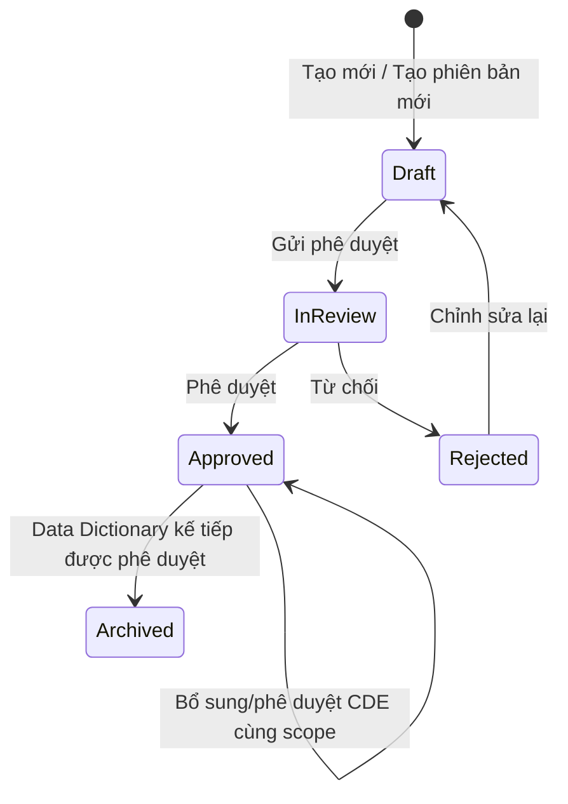

# Thiết kế luồng Từ điển dữ liệu dùng chung (CDE Glossary) và Thành tố dữ liệu dùng chung (CDE) theo Version, Workflow và Role

> Baseline kiến trúc: [Kiến trúc tham chiếu OpenMetadata 1.13.3](./openmetadata-1.13.3-upstream-architecture-reference.md). Mọi list/detail/workflow của Glossary và GlossaryTerm coi database là nguồn sự thật; search engine chỉ phục vụ global discovery và truy vấn tài sản liên quan, không làm nguồn trạng thái cho bảng CDE.

## 1. Mục tiêu

Tài liệu này mô tả thiết kế chuyên biệt cho **Từ điển dữ liệu dùng chung** (`Data Dictionary`) và các **Thành tố dữ liệu dùng chung (CDE)**, bao gồm:

- Phân biệt working version và published version.
- Nội dung từng Role được phép nhìn thấy.
- Hành vi màn hình khi người dùng tạo, chỉnh sửa, gửi duyệt, phê duyệt, từ chối và xem lịch sử.
- Quan hệ giữa version của Từ điển dữ liệu dùng chung và version của CDE.
- Các nhược điểm của implementation hiện tại và hướng xử lý.

Thiết kế ưu tiên nguyên tắc: Consumer luôn nhìn thấy bản Approved ổn định gần nhất và không bị ảnh hưởng bởi Draft/In Review đang được chỉnh sửa.

## 2. Khái niệm

### 2.1. Từ điển dữ liệu dùng chung (Data Dictionary Glossary)

`Data Dictionary` chính là **Từ điển dữ liệu dùng chung** của Agribank. Bản `Approved` mới nhất là scope đang hoạt động và có thể nhận thêm CDE cùng tiền tố; khi version kế tiếp được Approved, scope cũ mới đóng băng danh sách cuối cùng và chuyển `Archived`.

### 2.2. Thành tố dữ liệu dùng chung (CDE)

- **Bản chất kỹ thuật:** CDE chính là entity `GlossaryTerm` trong OpenMetadata và sử dụng model, schema, phân quyền, quan hệ với `Glossary` cùng REST API chuẩn. Trong phạm vi nghiệp vụ này, chỉ hỗ trợ một cấp quan hệ: Data Dictionary (`Glossary`) là cha và CDE (`GlossaryTerm`) là con trực tiếp.
- **Tầng nghiệp vụ (UI):** CDE (Common Data Element) là thuật ngữ hiển thị cho người dùng đối với các mục từ (`GlossaryTerm`) thuộc Từ điển dữ liệu dùng chung (`Data Dictionary`).
- Mỗi CDE có workflow và business version riêng, độc lập với native metadata version của OpenMetadata.
- Không tồn tại quan hệ CDE cha — CDE con: không gán `parent` là một `GlossaryTerm`, không tạo hoặc hiển thị sub-term, và backend phải từ chối payload tạo CDE lồng nhau.

### 2.3. Hai loại version

| Loại version | Ví dụ | Mục đích | Vai trò hiển thị UI |
| --- | --- | --- | --- |
| Business version (`businessVersion`) | Data Dictionary: `1`, `2`, `3`; CDE: `1.0`, `1.1`, `2.0` | Định danh phiên bản nghiệp vụ chính thức của Data Dictionary hoặc CDE. | **Định danh version duy nhất ở tầng sản phẩm** trên UI, URL, business API/response, selector, badge, breadcrumb và xuất dữ liệu. |
| Native metadata version | `0.1`, `0.2`, `1.0` | OpenMetadata sử dụng để lưu lịch sử thay đổi kỹ thuật của entity dưới backend. | **Kỹ thuật / Nội bộ**: Ẩn khỏi màn hình nghiệp vụ chính; không hiển thị thay thế cho business version. |

Quy tắc:
- Trong Từ điển dữ liệu dùng chung, `businessVersion` là định danh version duy nhất ở tầng sản phẩm. Mọi thao tác tìm kiếm, lọc, chọn lịch sử, deep link, đối soát và xem chi tiết đều quy chiếu theo `businessVersion`.
- Data Dictionary chỉ dùng số nguyên dương canonical `N`. CDE chỉ dùng `N.MINOR`, trong đó `N` bắt buộc bằng `parentBusinessVersion`; Data Dictionary `N` không hiển thị, kế thừa hoặc fallback sang CDE có tiền tố khác `N`.
- Quy ước URL của quan hệ một cấp Data Dictionary — CDE: `businessVersion` luôn chỉ phiên bản của entity đang xem; khi entity là CDE, `parentBusinessVersion` chỉ phiên bản Data Dictionary cha. Mọi URL mở CDE bắt buộc có đồng thời `businessVersion` và `parentBusinessVersion`; thiếu một trong hai param là URL không hợp lệ và trả `404 Not Found`. Tên param không gắn với loại nghiệp vụ cụ thể để có thể tái sử dụng cho mô hình cha — con tương tự; thiết kế này không hàm ý hỗ trợ CDE lồng nhau.
- UI, frontend business model và business API/response dùng `businessVersion` cho entity hiện tại; browser URL của CDE bắt buộc dùng thêm `parentBusinessVersion` để giữ ngữ cảnh cha; không tạo alias `version`/`nativeVersion` và không ánh xạ `publicationSequence` thành version nghiệp vụ.
- Cơ chế native metadata version của OpenMetadata vẫn tồn tại hoàn toàn ở tầng kỹ thuật nội bộ để bảo toàn framework; tính năng này không xóa hoặc thay đổi cơ chế đó.
- Quá trình lưu nháp (Save Draft) chỉ cập nhật working record tại chỗ và không dùng native metadata version làm business version.

### 2.4. Working version và published version

- **Working version**: bản đang soạn thảo hoặc đang chờ duyệt. Chỉ người có quyền quản trị nội dung được nhìn thấy.
- **Published version**: version đã Approved. Data Dictionary Approved mới nhất là bản đang hoạt động: business payload giữ nguyên nhưng danh sách CDE hiển thị thay đổi khi CDE cùng scope được tạo/duyệt. Khi successor được Approved, bản cũ mới đóng băng archive manifest và trở thành `Archived` bất biến.
- Nội dung snapshot Approved của từng CDE là bất biến. Mỗi Data Dictionary business version sở hữu tập CDE identity độc lập: hai CDE cùng mã ở scope `1` và `2` có `termId` khác nhau, nội dung và vòng đời không liên quan nhau. Working/head vẫn lưu `parentBusinessVersion` để cách ly tuyệt đối theo scope.

## 3. Mô hình trạng thái



Quy tắc:

- `Draft`: được chỉnh sửa bởi Proposer và các Role có quyền quản trị.
- `InReview`: khóa các trường nghiệp vụ; chỉ cho phép Reviewer/Steward phê duyệt hoặc từ chối.
- `Rejected`: không hiển thị cho Consumer; người soạn thảo có thể đưa về Draft để sửa.
- `Approved`: Data Dictionary mới nhất đang hoạt động; Consumer thấy các CDE cùng tiền tố đã Approved. Việc tạo/duyệt CDE không đổi trạng thái Data Dictionary.
- `Archived`: Data Dictionary cũ và các CDE Approved của nó sau khi successor được Approved; chỉ đọc, không nhận thêm mutation. CDE non-Approved của predecessor bị xóa tại cutover.
- Không coi thiếu `entityStatus` là Approved. Phương án triển khai mới không hỗ trợ dữ liệu thiếu trạng thái; môi trường phải được khởi tạo lại với dữ liệu tuân thủ schema mới.

## 4. Role và phạm vi trách nhiệm

### 4.1. Các Role nghiệp vụ

| Role | Trách nhiệm chính |
| --- | --- |
| Admin | Quản trị toàn bộ, xử lý ngoại lệ và cấu hình hệ thống. |
| Organization | Role hệ thống có quyền theo policy; không mặc định là Consumer. |
| Data Steward | Theo policy mặc định: kiểm soát chất lượng; phê duyệt, từ chối và hủy phê duyệt, không tạo hoặc chỉnh sửa nội dung. Capability thực tế luôn lấy từ policy hiệu lực. |
| Reviewer | Người được gán trực tiếp vào Glossary/CDE để duyệt. Đây có thể là assignment, không nhất thiết là một Role hệ thống riêng. |
| Data Proposer | Tạo Draft, chỉnh sửa và gửi duyệt. |
| Data Consumer | Khai thác nội dung đã được phê duyệt. |
| Basic Consumer | Chỉ đọc nội dung đã được phê duyệt với tập chức năng tối thiểu. |

Quyền thực tế phải được backend xác định từ Role, policy, quyền trên entity và reviewer assignment. Frontend chỉ dùng kết quả quyền từ backend để điều khiển giao diện.

Trong tài liệu này, **Consumer-only** không được suy ra chỉ từ việc người dùng có role `BasicConsumer` hoặc `DataConsumer`. Một người dùng chỉ được xem là Consumer-only đối với Data Dictionary/CDE khi quyền hiệu lực của họ có `canViewPublished = true` và `canViewWorking = false`. Admin, Data Steward, Data Proposer, owner hoặc Reviewer được gán có quyền xem working không bị áp dụng quy tắc chỉ-hiển-thị-Approved, kể cả khi họ đồng thời mang role Consumer.

### 4.2. Ma trận nội dung được nhìn thấy

| Nội dung | Admin | Data Steward | Reviewer được gán | Data Proposer | Data Consumer | Basic Consumer |
| --- | --- | --- | --- | --- | --- | --- |
| Glossary Draft | Có | Có trong phạm vi quản lý | Có khi được gán duyệt | Có khi là owner/người tạo hoặc có quyền edit | Không | Không |
| Glossary In Review | Có | Có | Có khi được gán duyệt | Có, chỉ đọc | Không | Không |
| Glossary Approved mới nhất | Có | Có | Có | Có | Có | Có |
| Data Dictionary Archived | Có | Có | Có khi có quyền audit | Có khi có quyền lịch sử | Có, chỉ đọc | Có, chỉ đọc |
| CDE Draft/Rejected | Có | Có trong phạm vi quản lý | Có khi liên quan phiên duyệt | Có khi được phép chỉnh sửa | Không | Không |
| CDE In Review | Có | Có | Có khi được gán duyệt | Có, chỉ đọc | Không | Không |
| CDE Approved | Có | Có | Có | Có | Có | Có |
| Import | Có | Không | Không | Theo policy | Không | Không |
| Export | Có | Có | Có | Có | Có | Có |

### 4.3. Ma trận thao tác

| Thao tác | Admin | Data Steward | Reviewer | Data Proposer | Data Consumer | Basic Consumer |
| --- | --- | --- | --- | --- | --- | --- |
| Tạo Glossary/CDE | Có | Không mặc định | Không | Có | Không | Không |
| Tạo business version mới | Có | Không mặc định | Không | Có | Không | Không |
| Chỉnh sửa Draft | Có | Không mặc định | Không | Có | Không | Không |
| Gửi duyệt | Có | Không mặc định | Không | Có | Không | Không |
| Approve/Reject | Có | Có | Có khi được gán | Không | Không | Không |
| Thu hồi Approved | Có | Có theo policy | Không mặc định | Không | Không | Không |
| Xóa | Có | Không | Không | Theo policy với Draft | Không | Không |
| Xem/chọn version | Có | Có | Có | Có | Active Approved và Archived | Active Approved và Archived |

## 5. Thiết kế version của Từ điển dữ liệu dùng chung và CDE

### 5.1. Data Dictionary đang hoạt động và archive manifest

Data Dictionary Approved mới nhất là bản đang hoạt động. Danh sách CDE trên bản này là read model động theo đúng scope version; archive manifest chỉ được đóng băng khi Data Dictionary kế tiếp được Approved. Ví dụ archive manifest của Dictionary `1`:

```json
{
  "glossaryId": "...",
  "businessVersion": "1",
  "entityStatus": "Approved",
  "publishedAt": 0,
  "publishedBy": "...",
  "termCount": 1,
  "termRevisions": [
    {
      "termId": "...",
      "termSnapshotId": "...",
      "termBusinessVersion": "1.0",
      "displayOrder": 0
    }
  ]
}
```

Quy tắc:

- Data Dictionary `N` chỉ query CDE có `parentBusinessVersion = N` và `businessVersion = N.MINOR`. Consumer chỉ thấy Approved; Manager thấy đủ trạng thái theo quyền. Không fallback sang `N-1.x` khi scope `N` chưa có CDE Approved.
- Sau khi Dictionary `N` Approved, người dùng vẫn có thể bổ sung và xử lý CDE `N.x`. CDE `N.x` vừa Approved xuất hiện ngay cho Consumer; Data Dictionary vẫn giữ status Approved và không cần publish lại.
- Tạo Dictionary `N+1` hoặc CDE `N+1.x` không thay đổi Dictionary `N` và CDE `N.x`. Dictionary `N+1` tuyệt đối không kế thừa content/membership từ `N`.
- Khi Dictionary `N+1` Approved, hệ thống đóng băng final Approved `N.x` vào archive manifest, archive Dictionary `N` cùng các snapshot đó và xóa CDE `N.x` Draft/InReview/Rejected. Dictionary `N` từ đó chỉ đọc và không nhận CDE mới.
- Public contract không expose native version. Archive manifest dùng `(termId, termSnapshotId, termBusinessVersion, displayOrder)` và chỉ chứa CDE Approved đúng scope; active read không coi manifest này là membership bất biến.

### 5.2. Tạo business version mới của Glossary

Khi tạo Data Dictionary version mới từ bản active `N`:

1. Version mới bắt buộc là số nguyên kế tiếp `N+1`.
2. Tạo working Draft trắng; không sao chép business content, CDE membership hoặc archive manifest từ `N`.
3. Việc Create không đổi status của `N` hoặc bất kỳ CDE `N.x` nào; `N` tiếp tục hoạt động và có thể nhận thêm CDE cho tới cutover.
4. Người dùng tạo riêng CDE `N+1.x` từ form trắng. Không tự clone, renumber hoặc fallback từ CDE `N.x`.
5. Khi Approve `N+1`, backend atomically archive `N` và Approved `N.x`, xóa non-Approved `N.x`, rồi activate `N+1`. Các CDE `N+1.x` giữ nguyên status; Consumer chỉ thấy những bản Approved.

### 5.4. Snapshot và Version của CDE

Mỗi CDE khi được phê duyệt sẽ tạo ra một snapshot bất biến chứa toàn bộ thuộc tính nghiệp vụ tại thời điểm ban hành:

```json
{
  "termId": "...",
  "glossaryId": "...",
  "businessVersion": "1.0",
  "status": "Approved",
  "publishedAt": 0,
  "publishedBy": "...",
  "attributes": {
    "name": "...",
    "displayName": "...",
    "description": "...",
    "customProperties": { ... }
  }
}
```

Quy tắc:

- Mỗi CDE identity chỉ thuộc đúng một `parentBusinessVersion` và có tối đa một working version. Hai bản ghi cùng mã ở scope `N` và `N+1` là hai identity khác nhau, vì vậy có thể có working độc lập; mọi lookup/mutation phải mang scope Data Dictionary cha.
- Chỉnh sửa và lưu nháp nhiều lần (Save Draft) chỉ cập nhật đè trực tiếp (in-place update) lên bản Draft hiện hành, **không tạo `businessVersion` mới** và không tạo thêm published snapshot ngầm nhằm tối ưu dung lượng lưu trữ (tránh storage bloating).
- Snapshot Approved của CDE là bất biến; việc sửa đổi hoặc tạo version mới của CDE không làm thay đổi nội dung các published snapshot đã có.

### 5.5. Tạo business version mới của CDE

Khi tạo CDE version mới trong Data Dictionary `N`:

1. Hệ thống khởi tạo working version mới ở trạng thái `Draft`.
2. Version bắt buộc có dạng `N.MINOR`; lần đầu của scope là `N.0`, các version sau tăng minor trong đúng scope.
3. Tạo CDE trong scope mới luôn tạo identity mới và form bắt đầu rỗng; không dùng lại `id`, `fullyQualifiedName` hay business content của CDE cùng mã ở scope trước. Tạo minor version trong cùng scope mới giữ identity kỹ thuật và vẫn bắt đầu với business content rỗng.
4. Việc Create không đổi status CDE hiện hành hoặc Data Dictionary. Trong scope active, Consumer tiếp tục thấy Approved head cũ cùng scope cho tới khi version mới Approved; không bao giờ fallback chéo scope.

## 6. Luồng màn hình Glossary

### 6.1. Danh sách Glossary (Panel menu bên trái)

Panel bên trái (`GlossaryLeftPanel`) giữ hành vi mặc định của OpenMetadata đối với người dùng không phải Consumer-only:

- **Người dùng không phải Consumer-only:** Giữ nguyên luồng danh sách, tạo mới, empty state, điều hướng, identity và working data theo quyền OpenMetadata hiện có. Không thay đổi route hoặc thay thế representation của nhóm này. Trong phạm vi sản phẩm, backend vẫn kiểm tra Data Dictionary theo quy tắc nghiệp vụ tương ứng.
- **Consumer-only:** Chỉ hiển thị nội dung đã có published snapshot `Approved`; không fallback sang identity, `Draft`, `InReview` hoặc `Rejected`.
- **Không có dữ liệu:** Consumer-only nhận danh sách rỗng hoặc `403`/`404` khi truy cập trực tiếp entity chưa publish. Người dùng có quyền quản trị/soạn thảo nhận empty state và action mặc định theo quyền; UI không chuyển họ sang 404 chỉ vì chưa có published snapshot.

Toàn bộ thông tin chi tiết về phiên bản, trạng thái, mô tả và thao tác phê duyệt được quản lý tại **Trang chi tiết Glossary bên phải (Mục 6.2)**.

### 6.2. Trang chi tiết Glossary (Header và Khu vực điều khiển)

#### Chi tiết các thành phần trên Header:
1. **Tên Glossary:** Sử dụng cơ chế mặc định của OpenMetadata (hiển thị ưu tiên `displayName` trên giao diện, fallback về `name` nếu trống; `name` cố định dùng cho FQN và URL).
2. **Bộ chọn Business Version (Dropdown Selector) & Đồng bộ URL qua Query Param:**
   - **Cơ chế đồng bộ Query Param (`?businessVersion={businessVersion}`):**
     - Khi người dùng chọn một phiên bản trong Dropdown, URL cập nhật: `.../glossary/{glossaryFqn}?businessVersion={businessVersion}` (ví dụ: `?businessVersion=2`).
     - **Tải lại trang (F5) / Bookmark:** Giao diện đọc trực tiếp query param `businessVersion` trên URL để tải chính xác phiên bản đang xem, không bị nhảy về phiên bản khác.
     - **Chia sẻ liên kết (Deep linking):** Cho phép copy URL gửi cho người dùng khác truy cập trực tiếp đúng bản phát hành cần tra cứu hoặc kiểm duyệt.
     - **URL mặc định (không truyền param `businessVersion`):**
       - *Consumer-only:* Tự động mở bản phát hành `Approved` mới nhất.
       - *Người dùng không phải Consumer-only:* Giữ nguyên cách OpenMetadata chọn identity/working/published representation theo quyền hiện có.
   - **Phân quyền trong danh sách Dropdown:**
      - *Consumer:* Thấy Data Dictionary `Approved` active và các version `Archived`; không thấy Draft/InReview/Rejected. Archived luôn chỉ đọc.
     - *Consumer-only:* Thấy bản active Approved và toàn bộ Data Dictionary `Archived`; không thấy working.
     - *Người có `canViewWorking` hoặc quyền audit:* Thấy bản active, working `N+1` theo quyền và lịch sử `Archived`.
3. **Badge trạng thái (Status Badge):**
   - `[ Draft ]`: Màu xám/vàng - Bản đang soạn thảo; cho phép sửa metadata Data Dictionary và quản lý nội dung CDE qua workflow riêng, không chọn CDE thủ công.
   - `[ In Review ]`: Màu xanh dương - Đang chờ duyệt, khóa toàn bộ form.
   - `[ Rejected ]`: Màu đỏ - Bị từ chối phê duyệt.
   - `[ Approved ]`: Màu xanh lá - Data Dictionary đang hoạt động; business metadata đã duyệt nhưng danh sách CDE cùng scope thay đổi theo workflow CDE.
   - `[ Archived ]`: Màu xám - Bản cũ đã đóng băng, chỉ đọc.
4. **Cụm nút thao tác (Action Buttons phân cấp theo Action Hierarchy):**

Bố cục góc phải Header: `[ Bộ chọn Version ]  [ Nút trực diện ]  [ Menu ba chấm (...) ]`

| Trạng thái Glossary đang xem | Nút hiển thị trực diện trên Header (Role Quản trị) | Tùy chọn trong Menu ba chấm `...` | Role Khai thác (Consumer) |
| :--- | :--- | :--- | :--- |
| **Draft** | • `Lưu nháp` <br>• `Gửi duyệt` | • `Xóa bản nháp` (Chữ đỏ, có modal xác nhận)<br>• `Xuất dữ liệu (Export)`<br>• `Nhập dữ liệu (Import)` theo capability | Không truy cập được (403/404); Ẩn hoàn toàn trên UI và không hiển thị bất kỳ nút thao tác nào. |
| **In Review** | • `Phê duyệt` (Steward/Reviewer - Xanh lá)<br>• `Từ chối` (Steward/Reviewer - Đỏ)<br>• `Chờ duyệt` (Proposer - Read-only) | • `Xuất dữ liệu (Export)` | Không truy cập được (403/404); Ẩn hoàn toàn trên UI và không hiển thị bất kỳ nút thao tác nào. |
| **Rejected** | • `Chỉnh sửa lại` (Proposer - đưa về Draft) | • `Xóa bản nháp` | Không truy cập được (403/404); Ẩn hoàn toàn trên UI và không hiển thị bất kỳ nút thao tác nào. |
| **Approved (Đang hoạt động)** | • `Tạo phiên bản mới`<br>• thao tác CDE theo capability | • `Xuất dữ liệu (Export)`<br>• `Nhập dữ liệu (Import)` | Chỉ đọc; thấy live Approved CDE cùng scope. |
| **Archived** | Không có nút mutation. | • `Xuất dữ liệu (Export)` | Được chọn/xem lại, chỉ đọc và được Export; không có mutation hoặc Import. |

---

### 6.3. Bảng danh sách CDE trong Từ điển dữ liệu dùng chung

Bảng danh sách thể hiện tập hợp các Thành tố dữ liệu dùng chung (CDE) thuộc Từ điển dữ liệu dùng chung.

#### Quy tắc hiển thị danh sách CDE:
1. **Các dòng hiển thị ngang hàng (Flat List - Không phân biệt dòng chính/dòng con):**
   - Tất cả các phiên bản của CDE được hiển thị bình đẳng thành các dòng độc lập, ngang hàng nhau trên bảng dữ liệu.
   - Không áp dụng cơ chế phân cấp chính/con hay thụt lề `↳`.
   - Mọi CDE là con trực tiếp của Data Dictionary; backend từ chối `parent` trỏ tới một CDE khác.
   - Các dòng có cùng mã CDE được xếp cạnh nhau, sắp xếp theo thứ tự phiên bản mới nhất ở trên để người dùng dễ theo dõi.
   - Mỗi lần mở bảng chỉ hiển thị một `parentBusinessVersion` đang được chọn. Một response không ghép CDE của Dictionary active, working hoặc historical khác scope; Manager chuyển scope bằng Data Dictionary version selector.
2. **Quyền xem theo capability hiệu lực (Người dùng tự do tra cứu theo quyền):**
   - **Data Consumer:** Trong Data Dictionary active `N`, chỉ thấy CDE `N.x` Approved. Khi chủ động chọn Data Dictionary Archived, chỉ thấy các published CDE snapshots thuộc frozen manifest của đúng scope đó. Không thấy Draft/InReview/Rejected/working hoặc CDE thuộc scope khác.
   - **Người có quyền working:** Trong scope đang chọn, nhìn thấy published và working rows theo capability hiệu lực. Không suy quyền từ tên role; ownership, reviewer assignment và policy có thể thay đổi quyền trên từng CDE.
   - Khi xem Data Dictionary Approved active, bảng là live scoped read model: CDE cùng scope xuất hiện cho Consumer ngay khi Approved. Khi xem Data Dictionary working, Consumer nhận `404`. Khi xem Data Dictionary Archived, bảng dùng frozen archive manifest để xác định identity, chỉ trả published history đúng scope và không nhận mutation.
3. **Công cụ Tìm kiếm, Lọc và Phân trang (Search, Filters & Pagination):**
   - **Thanh tìm kiếm văn bản (Text Search Bar):**
     - *Vị trí:* Nằm ở góc trái thanh công cụ phía trên bảng (chiều rộng 280px, có nút xóa nhanh `x`).
     - *Phạm vi tìm kiếm:* Tìm kiếm gần đúng đồng thời trên **Mã CDE (`name`)** và **Tên hiển thị CDE (`displayName`)**. Input là text literal; UI không gửi SQL fragment, search-engine DSL hoặc wildcard expression. Backend chuẩn hóa Unicode và thực hiện contains search bằng database query có bind parameter.
     - *Cơ chế:* Tích hợp cơ chế Debounce 500ms để tối ưu tải truy vấn server khi người dùng nhập liệu.
   - **Bộ lọc Trạng thái (Status Filter Dropdown):**
     - *Hình thức:* Dropdown đa chọn (Multi-select checkbox).
     - *Các tiêu chí trạng thái:* `Tất cả`, `Draft`, `In Review`, `Rejected`, `Approved`; `Archived` chỉ có trong chế độ lịch sử/audit.
     - *Quy tắc phân quyền:* 
       - Với **Role Khai thác (Consumer):** Hệ thống tự động khóa cứng (hard-lock) duy nhất trạng thái `Đã phê duyệt (Approved)`.
       - Với **Nhóm Quản trị (Admin / Steward / Proposer):** Mặc định chọn tất cả, người dùng có thể tick/bỏ tick để lọc riêng bản nháp, bản chờ duyệt hoặc bản đã phê duyệt.
   - **4 Bộ lọc Chuyên biệt cho CDE (CDE Specific Filter Dropdowns):**
     - **(1) Khối / Miền nghiệp vụ (Business Group / Domain):** Dropdown đa chọn nạp động danh sách Miền từ hệ thống (ví dụ: *Khối Bán lẻ, Khối Khách hàng doanh nghiệp, Khối Quản trị rủi ro, Khối Tài chính kế toán,...*). UI hiển thị display name nhưng gửi `domainIds`; backend lọc theo UUID ổn định.
     - **(2) Hệ thống nguồn (Data Source):** Dropdown đa chọn nạp danh sách các tag thuộc phân loại `DataSource` (ví dụ: *Core Banking, LOS, CRM, DWH, ERP, ECM,...*). UI gửi tag FQN và backend lọc theo `dataSourceTagFqns`.
     - **(3) Chủ sở hữu / Đầu mối phụ trách (Data Owner):** Dropdown đa chọn nạp danh sách user và team phụ trách CDE trong hệ thống. UI hiển thị tên nhưng gửi `ownerIds`; backend lọc theo UUID ổn định.
     - **(4) Phân loại dữ liệu (Data Classification):** Dropdown đa chọn nạp danh sách tag bảo mật thuộc nhóm `DataClassification` (ví dụ: *Công khai, Nội bộ, Bí mật, Tuyệt mật*). UI gửi tag FQN và backend lọc theo `classificationTagFqns`.
   - **Cơ chế phối hợp truy vấn & Phân trang:**
     - Nhiều giá trị trong cùng một bộ lọc được kết hợp bằng **`OR`**; các nhóm search/status/domain/owner/tag được kết hợp bằng **`AND`** trong database query.
     - Mỗi khi người dùng thay đổi từ khóa hoặc điều kiện lọc, hệ thống tự động reset về trang 1 và tính toán lại tổng số dòng.
     - Phân trang tính trên toàn bộ các dòng kết quả tìm kiếm/lọc được (hỗ trợ các mức kích thước trang: 10, 15, 25, 50 dòng/trang).
     - F11 và F12 là hai contract trên **cùng một database-backed flat read model**. Không có criteria thì UI gọi F11; có search/filter thì UI gọi F12. Việc bật một filter không được đổi nguồn dữ liệu, consistency model hoặc authorization model của bảng.
     - Database áp dụng scope, authorization, search và filter trước `total`, sort và pagination. Không page identity trước rồi hydrate/filter trong application; không dùng native index `glossaryTerm` hoặc custom OpenSearch index cho bảng CDE.
     - Kết quả list/search/filter có hiệu lực ngay sau workflow commit. OpenSearch vẫn được OpenMetadata duy trì cho global discovery và tab Assets nhưng không quyết định row, status, total hoặc empty state của bảng CDE.
   - **Tính năng Xuất dữ liệu (Export):** Khi người dùng bấm Export trong menu ba chấm `...`, hệ thống xuất toàn bộ CDE business-version rows mà người đó được phép xem trong đúng Data Dictionary version đang mở. Export không áp dụng từ khóa, bộ lọc hoặc trang hiện tại trên màn hình. File `.xlsx` dùng đúng các cột presentation của bảng CDE, không chứa field lưu trữ/kỹ thuật của OpenMetadata.

#### Ví dụ minh họa cụ thể:
Giả sử hai identity độc lập cùng có mã nghiệp vụ `CDE1`:
- Identity A thuộc Dictionary `1`: `v1.0` Approved, `v1.1` Approved và `v1.2` Rejected.
- Identity B thuộc Dictionary `2`: `v2.0` Approved và `v2.1` Draft, có `termId`, scoped FQN và business content riêng.

*So sánh nội dung hiển thị theo từng Dictionary scope:*

| Ngữ cảnh xem | Các dòng hiển thị trên bảng (Ngang hàng) | Quy tắc |
| :--- | :--- | :--- |
| **Data Consumer trong Dictionary 1** | • **`CDE1`** - Version `1.1` `[Approved]`<br>• **`CDE1`** - Version `1.0` `[Approved]` | Chỉ Approved `1.x`; không thấy `2.x` hoặc non-Approved. |
| **Manager trong Dictionary 1** | • **`CDE1` (identity A)** - Version `1.2` `[Rejected]`<br>• **`CDE1` (identity A)** - Version `1.1` `[Approved]`<br>• **`CDE1` (identity A)** - Version `1.0` `[Approved]` | Chỉ identity và version thuộc scope `1`. |
| **Manager chuyển sang Dictionary 2** | • **`CDE1` (identity B)** - Version `2.1` `[Draft]`<br>• **`CDE1` (identity B)** - Version `2.0` `[Approved]` | Request riêng cho scope `2`; không chứa row `1.x`. |

## 7. Luồng màn hình Thành tố dữ liệu dùng chung (CDE)

### 7.1. Bố cục và thành phần Trang chi tiết CDE

Màn hình chi tiết CDE trong phân hệ Từ điển dữ liệu dùng chung bao gồm các khu vực thành phần sau:

#### 1. Header và Khu vực điều khiển:
- **Breadcrumbs điều hướng phân cấp rõ 2 tầng phiên bản:**  
  `Glossaries > [DisplayName của Glossary] (v{parentBusinessVersion}) > [DisplayName của CDE] (v{businessVersion})`
  *(Ví dụ: `Glossaries > Từ điển dữ liệu dùng chung (v2) > Mã khách hàng (v2.1)`)*.
- **Mã CDE:** `name` là mã nghiệp vụ người dùng nhập, ví dụ `alo1`, và chỉ cần duy nhất trong một `parentBusinessVersion`. Hai scope khác nhau được phép có cùng `name` nhưng phải có `termId` khác nhau.
- **FQN kỹ thuật:** để không xung đột native uniqueness, backend sinh FQN có scope theo dạng `{glossaryFqn}.{escapedName}@v{parentBusinessVersion}`, ví dụ `Data Dictionary.alo1@v2`. UI vẫn hiển thị `name = alo1`; không hiển thị hậu tố scope như một phần mã nghiệp vụ.
- **Bộ chọn Business Version (Dropdown Selector) & Đồng bộ URL chuẩn REST:**
  - **Định dạng URL chuẩn:**  
    `/glossary/{scopedCdeFqn}?businessVersion={businessVersion}&parentBusinessVersion={parentBusinessVersion}`
    *(Ví dụ: `/glossary/DataDictionary.CDE1@v2?businessVersion=2.1&parentBusinessVersion=2`)*.
    - `parentBusinessVersion`: Version số nguyên của Data Dictionary cha (`2`).
    - `businessVersion`: Version CDE đúng scope (`2.1`).
  - **Quy tắc ngữ cảnh bắt buộc:**
    - *Khi click từ bảng CDE trong Từ điển `2`:* Link bắt buộc có `?businessVersion=2.1&parentBusinessVersion=2`.
    - *Nếu URL thiếu `businessVersion`, thiếu `parentBusinessVersion` hoặc thiếu cả hai:* Trả `404 Not Found`; không fallback sang working/latest và không lộ payload.
    - Không hỗ trợ chế độ xem CDE độc lập và không tự suy diễn Data Dictionary version từ CDE version hoặc CDE version từ Data Dictionary version.
    - Phần nguyên của CDE `businessVersion` phải bằng `parentBusinessVersion`. Với parent active, backend kiểm tra scoped read model; với parent Archived, kiểm tra archive manifest. Không khớp trả `404`.
  - **Phân quyền trong danh sách Dropdown:**
    - *Consumer:* Trong dropdown chỉ hiển thị các bản `Approved`. Nếu tự ý gõ param URL trỏ tới bản `Draft`/`In Review`/`Rejected`, hệ thống chặn truy cập (trả `404 Not Found`), hiển thị màn hình báo lỗi và tuyệt đối không hiển thị bất kỳ nút action nào.
    - *Nhóm Quản trị (Admin, Steward, Proposer):* Chọn được tất cả các phiên bản đang có (`Draft`, `In Review`, `Rejected`, `Approved`).
- **Badge trạng thái (Status Badge):**
  - `[ Draft ]`: Bản nháp đang soạn thảo.
  - `[ In Review ]`: Đang chờ duyệt (khóa không cho chỉnh sửa).
  - `[ Rejected ]`: Bị từ chối duyệt (kèm thông tin người từ chối).
  - `[ Approved ]`: Bản đã ban hành chính thức, bất biến.
  - `[ Archived ]`: Version thuộc Data Dictionary predecessor đã đóng; chỉ đọc và chỉ xuất hiện trong lịch sử/audit theo quyền.
- **Cụm nút thao tác (Action Buttons phân cấp theo Action Hierarchy):**

Bố cục góc phải Header CDE: `[ Bộ chọn Version CDE ]  [ Nút trực diện ]  [ Menu ba chấm (...) ]`

| Trạng thái CDE đang xem | Nút hiển thị trực diện trên Header (Role Quản trị) | Tùy chọn trong Menu ba chấm `...` | Role Khai thác (Consumer) |
| :--- | :--- | :--- | :--- |
| **Draft** | • `Lưu nháp` (Secondary)<br>• `Gửi duyệt` (Primary) | • `Xóa bản nháp` (Chữ đỏ, có modal xác nhận) | Không truy cập được (403/404); Ẩn hoàn toàn trên UI và không hiển thị bất kỳ nút thao tác nào. |
| **In Review** | • `Phê duyệt` (Steward/Reviewer - Xanh lá)<br>• `Từ chối` (Steward/Reviewer - Đỏ)<br>• `Chờ duyệt` (Proposer - Read-only) | *(Không có)* | Không truy cập được (403/404); Ẩn hoàn toàn trên UI và không hiển thị bất kỳ nút thao tác nào. |
| **Rejected** | • `Chỉnh sửa lại` (Proposer - đưa về Draft) | • `Xóa CDE` | Không truy cập được (403/404); Ẩn hoàn toàn trên UI và không hiển thị bất kỳ nút thao tác nào. |
| **Approved** | • `Tạo phiên bản mới` (Primary) | • `Xem lịch sử thay đổi` | Toàn bộ chỉ đọc (Read-only); không hiển thị nút chỉnh sửa. |

#### 2. Khu vực thông tin nghiệp vụ và Custom Properties của CDE (Overview Panel):
- **Thông tin cơ bản chuẩn OpenMetadata:**
  - **Mã CDE (`name`):** Mã nghiệp vụ chỉ duy nhất trong Data Dictionary version đang xem; cùng mã ở version khác là identity độc lập.
  - **Tên CDE (`displayName`):** Tên nghiệp vụ tiếng Việt có dấu và là business content độc lập theo identity/scope; `alo1` ở v1 và v2 có thể có `displayName` khác nhau.
  - **Ý nghĩa nghiệp vụ (`description`):** Mô tả chi tiết nội dung nghiệp vụ của CDE (hỗ trợ RichText/Markdown).
  - **Người kiểm duyệt (`reviewers`):** Danh sách cá nhân/nhóm được chỉ định phê duyệt CDE (hiển thị tại Panel bên phải).
  - **Chủ sở hữu dữ liệu (`owners`):** Phòng ban/Team chịu trách nhiệm quản lý CDE (`CDEOwnersField`).
  - **Miền nghiệp vụ (`domains`):** Nhóm nghiệp vụ trực thuộc (`CDEDomainsField`).
- **Nhãn phân loại dữ liệu (Classification Tags):**
  - **Nguồn dữ liệu (`DataSource` tags):** Hệ thống/CSDL nguồn phát sinh dữ liệu của CDE.
  - **Phân loại dữ liệu (`DataClassification` tags):** Cấp độ bảo mật dữ liệu (Công khai, Nội bộ, Bảo mật, Tối mật...).
  - **Dữ liệu cá nhân (`PersonalData` tags):** Xác định dữ liệu có chứa thông tin cá nhân hay không.
- **Thuộc tính mở rộng chuyên biệt của CDE (Custom Properties trong `extension`):**
  - **Quy định về chất lượng dữ liệu (`dataQualityRules`):** Kiểu Enum (`Y` / `N`), xác định CDE đã có quy định chất lượng hay chưa.
  - **Ngày hiệu lực (`effectiveDate`):** Ngày bắt đầu có hiệu lực áp dụng của CDE (định dạng `yyyy-MM-dd`).
  - **Ngày hết hiệu lực (`expirationDate`):** Ngày hết hiệu lực của CDE (định dạng `yyyy-MM-dd`).
  - **Mối quan hệ với thực thể (`entityRelationship`):** Mô tả mối quan hệ, liên kết giữa CDE với các thực thể trong hệ thống (Markdown đa dòng).
  - **Văn bản quy định liên quan (`relatedRegulatoryDocuments`):** Danh mục các văn bản, quyết định hoặc quy chế nội bộ liên quan (Markdown đa dòng).

#### 3. Các Tab chức năng:
- **Tab Tổng quan (`Overview`):** Hiển thị toàn bộ thông tin cơ bản, mô tả, phân loại tags và các thuộc tính mở rộng Custom Properties của CDE.
- **Tab Tài sản liên kết (`Assets`):** Danh sách các bảng dữ liệu, cột kỹ thuật được gắn ánh xạ (mapping) với CDE này.
*(Sub-terms không thuộc mô hình nghiệp vụ và không được tạo. UI ẩn Sub-terms cùng các tab kỹ thuật dư thừa như Activity Feed, Data Observability và Custom Properties raw theo cơ chế `CDE_RESTRICTED_TABS`.)*


## 8. Hành vi khi người dùng thao tác

| Thao tác | Phản hồi tức thời trên UI | Sau khi thành công |
| --- | --- | --- |
| Tạo Draft mới | Disable nút xác nhận, hiển thị loading | Chuyển sang working version mới, badge Draft. |
| Lưu Draft | Hiển thị trạng thái đang lưu | Cập nhật dữ liệu nhưng không tạo business version mới. |
| Gửi duyệt | Hiển thị validation và modal xác nhận | Khóa form, badge In Review, hiện reviewer/assignee. |
| Approve Data Dictionary mới | Modal hiển thị CDE scope mới và cảnh báo archive/xóa predecessor | Bản mới Approved active; bản cũ + CDE Approved cũ Archived; CDE cũ non-Approved bị xóa. |
| Reject | Xác nhận thao tác, không nhập lý do | Badge Rejected và hiển thị người từ chối. |
| Tạo version kế tiếp | Hiển thị số nguyên `N+1` bắt buộc | Tạo Draft trắng; không đổi trạng thái bản active/CDE hiện tại và không kế thừa dữ liệu. |
| Chọn version lịch sử | Với Data Dictionary, cập nhật `?businessVersion=...`; với CDE, bắt buộc cập nhật đầy đủ `?businessVersion=...&parentBusinessVersion=...`, loading riêng cho nội dung | Nạp dữ liệu snapshot theo đúng cặp version đã chọn, toàn bộ trường chỉ đọc (Read-only), ẩn các nút Thêm/Sửa. |
| Import | Tải template/chọn XLSX, preview summary và lỗi từng dòng trước khi ghi; cảnh báo nếu có CDE In Review sẽ bị hủy duyệt | Commit nguyên tử: tạo/cập nhật working Draft; CDE In Review/Rejected bị ghi đè sẽ về Draft; không tự động submit/Approved. |
| Export | Bấm chọn Export trong menu dấu ba chấm (...) | Gọi API cho đúng Data Dictionary version đang mở và tự tải file Excel `.xlsx` khi hoàn tất; không mở modal/job/progress, không yêu cầu bấm tải lần hai và không áp dụng search/filter/page hiện tại. |

Các request mutation cần có optimistic locking. Nếu entity đã thay đổi từ lúc người dùng mở màn hình, UI hiển thị thông báo conflict và yêu cầu tải lại, không âm thầm ghi đè.

## 9. Đặc tả API phục vụ giao diện (UI API Contracts)

Tài liệu này chuẩn hóa toàn bộ các giao thức API kết nối giữa Frontend và Backend OpenMetadata, loại bỏ hoàn toàn các điểm nhập nhằng để đảm bảo mọi nhà phát triển hoặc AI khi sinh mã đều code chính xác 100%, không bị lỗi đường dẫn hay sai lệch cấu trúc file.

---

### 9.1. Quy chuẩn Kiến trúc & Phân tầng URL (Architecture & URL Layering)

Hệ thống OpenMetadata áp dụng cơ chế định tuyến phân cấp nghiêm ngặt giữa 4 tầng. Lập trình viên và AI bắt buộc phải tuân thủ nguyên tắc sau:

| Tầng (Layer) | Quy ước đường dẫn | Ví dụ cụ thể | Lưu ý sống còn cho Lập trình viên & AI |
| :--- | :--- | :--- | :--- |
| **1. UI Route (Trình duyệt)** | Dùng **số ít** (`/glossary`) | `http://localhost:8585/glossary/DataDictionary` | Chỉ dùng trong React Router / `history.push`. **Tuyệt đối không dùng số nhiều** (`/glossaries`). |
| **2. Frontend API Client** | Bắt đầu từ `/glossaries` hoặc `/glossaryTerms` | `APIClient.get('/glossaries')` | `APIClient` đã cấu hình ngầm `baseURL = '/api/v1'`. **Tuyệt đối không ghi thêm `/api/v1` hay `/v1`** vào chuỗi URL trong `glossaryAPI.ts` (tránh lỗi 404 do thành `/api/v1/v1/...`). |
| **3. Backend Controller (JAX-RS)** | `@Path("/v1/glossaries")`<br>`@Path("/v1/glossaryTerms")` | `@Path("/v1/glossaries")`<br>`public class GlossaryResource` | Khai báo endpoint số nhiều trong Java Dropwizard. Root path của server là `/api`. |
| **4. Network Traffic (Gói tin Wire)** | `/api/v1/...` | `GET /api/v1/glossaries` | Là URL thực tế được truyền trên mạng giữa Trình duyệt và Máy chủ. |

> [!CAUTION]
> **CẢNH BÁO CHO AI KHI SINH MÃ (AI CODE GENERATION RULES):**
> 1. **KHÔNG tạo file API mới** (như `cdeAPI.ts`). Mọi API liên quan đến Từ điển và CDE bắt buộc phải nằm trong [glossaryAPI.ts](file:///home/dinhphu/Documents/Agribank-Metadata/OpenMetadata/openmetadata-ui/src/main/resources/ui/src/rest/glossaryAPI.ts).
> 2. **KHÔNG gọi trực tiếp `axios.get('/api/v1/...')`**. Luôn import và sử dụng các hàm wrapper đã định nghĩa sẵn trong [glossaryAPI.ts](file:///home/dinhphu/Documents/Agribank-Metadata/OpenMetadata/openmetadata-ui/src/main/resources/ui/src/rest/glossaryAPI.ts).
> 3. **Tên action workflow phải khớp 100% với enum**: Sử dụng `'reopen'` khi mở lại bản nháp sau từ chối (không tự chế ra `re-draft`).

---

### 9.2. Bảng Ánh xạ Mã nguồn & Hàm thực thi (Codebase File & Function Mapping)

| Nghiệp vụ UI | Backend JAX-RS Endpoint | Backend File | Frontend Wrapper Function | Frontend File |
| :--- | :--- | :--- | :--- | :--- |
| **Lấy danh sách Glossary** | `GET /v1/glossaries` | `GlossaryResource.java` | `getGlossariesList(params)` | [glossaryAPI.ts](file:///home/dinhphu/Documents/Agribank-Metadata/OpenMetadata/openmetadata-ui/src/main/resources/ui/src/rest/glossaryAPI.ts) |
| **Lấy chi tiết Glossary theo FQN** | `GET /v1/glossaries/name/{fqn}` | `GlossaryResource.java` | `getGlossariesByName(fqn, params)` | [glossaryAPI.ts](file:///home/dinhphu/Documents/Agribank-Metadata/OpenMetadata/openmetadata-ui/src/main/resources/ui/src/rest/glossaryAPI.ts) |
| **Lấy bản Approved mới nhất (Glossary)** | `GET /v1/glossaries/{id}/published/latest` | `GlossaryResource.java` | `getLatestPublishedGlossary(id)` | [glossaryAPI.ts](file:///home/dinhphu/Documents/Agribank-Metadata/OpenMetadata/openmetadata-ui/src/main/resources/ui/src/rest/glossaryAPI.ts) |
| **Lấy danh sách bản Approved (Glossary)** | `GET /v1/glossaries/{id}/published` | `GlossaryResource.java` | `getGlossaryVersionsList(id)` | [glossaryAPI.ts](file:///home/dinhphu/Documents/Agribank-Metadata/OpenMetadata/openmetadata-ui/src/main/resources/ui/src/rest/glossaryAPI.ts) |
| **Lấy Glossary theo businessVersion** | `GET /v1/glossaries/{id}/published/{businessVersion}` | `GlossaryResource.java` | `getGlossaryVersion(id, businessVersion)` | [glossaryAPI.ts](file:///home/dinhphu/Documents/Agribank-Metadata/OpenMetadata/openmetadata-ui/src/main/resources/ui/src/rest/glossaryAPI.ts) |
| **Lấy bản Draft hiện hành (Glossary)** | `GET /v1/glossaries/{id}/working` | `GlossaryResource.java` | `getGlossaryWorkingVersion(id)` | [glossaryAPI.ts](file:///home/dinhphu/Documents/Agribank-Metadata/OpenMetadata/openmetadata-ui/src/main/resources/ui/src/rest/glossaryAPI.ts) |
| **Xem trước CDE sẽ tự động phát hành** | `GET /v1/glossaries/{id}/working/publish-preview` | `GlossaryResource.java` | `getGlossaryPublishPreview(id, params)` | [glossaryAPI.ts](file:///home/dinhphu/Documents/Agribank-Metadata/OpenMetadata/openmetadata-ui/src/main/resources/ui/src/rest/glossaryAPI.ts) |
| **Lưu nháp in-place (Glossary)** | `PATCH /v1/glossaries/{id}/working` | `GlossaryResource.java` | `updateGlossaryWorkingVersion(id, rev, data)` | [glossaryAPI.ts](file:///home/dinhphu/Documents/Agribank-Metadata/OpenMetadata/openmetadata-ui/src/main/resources/ui/src/rest/glossaryAPI.ts) |
| **Chuyển trạng thái Workflow (Glossary)** | `POST /v1/glossaries/{id}/working/{action}` | `GlossaryResource.java` | `transitionGlossaryWorkflow(id, action, req)` | [glossaryAPI.ts](file:///home/dinhphu/Documents/Agribank-Metadata/OpenMetadata/openmetadata-ui/src/main/resources/ui/src/rest/glossaryAPI.ts) |
| **Lấy danh sách CDE dạng phẳng (Flat list)** | `GET /v1/glossaryTerms` | `GlossaryTermResource.java` | `getGlossaryTerms(params)` | [glossaryAPI.ts](file:///home/dinhphu/Documents/Agribank-Metadata/OpenMetadata/openmetadata-ui/src/main/resources/ui/src/rest/glossaryAPI.ts) |
| **Lấy chi tiết CDE theo FQN** | `GET /v1/glossaryTerms/name/{fqn}` | `GlossaryTermResource.java` | `getGlossaryTermByFQN(fqn, params)` | [glossaryAPI.ts](file:///home/dinhphu/Documents/Agribank-Metadata/OpenMetadata/openmetadata-ui/src/main/resources/ui/src/rest/glossaryAPI.ts) |
| **Lấy bản Approved mới nhất (CDE scope)** | `GET /v1/glossaryTerms/{id}/published/latest?parentBusinessVersion={N}` | `GlossaryTermResource.java` | `getLatestPublishedGlossaryTerm(id, parentVersion)` | [glossaryAPI.ts](file:///home/dinhphu/Documents/Agribank-Metadata/OpenMetadata/openmetadata-ui/src/main/resources/ui/src/rest/glossaryAPI.ts) |
| **Lấy danh sách version CDE theo scope** | `GET /v1/glossaryTerms/{id}/published?parentBusinessVersion={N}` | `GlossaryTermResource.java` | `getGlossaryTermsVersionsList(id, parentVersion)` | [glossaryAPI.ts](file:///home/dinhphu/Documents/Agribank-Metadata/OpenMetadata/openmetadata-ui/src/main/resources/ui/src/rest/glossaryAPI.ts) |
| **Lấy CDE theo businessVersion** | `GET /v1/glossaryTerms/{id}/published/{businessVersion}?parentBusinessVersion={N}` | `GlossaryTermResource.java` | `getGlossaryTermsVersion(id, parentVersion, businessVersion)` | [glossaryAPI.ts](file:///home/dinhphu/Documents/Agribank-Metadata/OpenMetadata/openmetadata-ui/src/main/resources/ui/src/rest/glossaryAPI.ts) |
| **Lấy bản Draft hiện hành (CDE)** | `GET /v1/glossaryTerms/{id}/working?parentBusinessVersion={N}` | `GlossaryTermResource.java` | `getGlossaryTermWorkingVersion(id, parentVersion)` | [glossaryAPI.ts](file:///home/dinhphu/Documents/Agribank-Metadata/OpenMetadata/openmetadata-ui/src/main/resources/ui/src/rest/glossaryAPI.ts) |
| **Lưu nháp in-place (CDE)** | `PATCH /v1/glossaryTerms/{id}/working?parentBusinessVersion={N}` | `GlossaryTermResource.java` | `updateGlossaryTermWorkingVersion(id, parentVersion, rev, data)` | [glossaryAPI.ts](file:///home/dinhphu/Documents/Agribank-Metadata/OpenMetadata/openmetadata-ui/src/main/resources/ui/src/rest/glossaryAPI.ts) |
| **Chuyển trạng thái Workflow (CDE)** | `POST /v1/glossaryTerms/{id}/working/{action}?parentBusinessVersion={N}` | `GlossaryTermResource.java` | `transitionGlossaryTermWorkflow(id, parentVersion, action, req)` | [glossaryAPI.ts](file:///home/dinhphu/Documents/Agribank-Metadata/OpenMetadata/openmetadata-ui/src/main/resources/ui/src/rest/glossaryAPI.ts) |
| **Kiểm tra quyền phiên bản** | `GET /v1/glossaryTerms/{id}/permissions?parentBusinessVersion={N}` | `GlossaryTermResource.java` | `getGlossaryTermVersionPermissions(id, parentVersion)` | [glossaryAPI.ts](file:///home/dinhphu/Documents/Agribank-Metadata/OpenMetadata/openmetadata-ui/src/main/resources/ui/src/rest/glossaryAPI.ts) |
| **Xuất Data Dictionary version ra Excel** | `GET /v1/glossaryTerms/export?glossary={id}&parentBusinessVersion={N}` | `GlossaryTermResource.java` | `exportDataDictionaryVersion(glossaryId, parentVersion)` | [glossaryAPI.ts](file:///home/dinhphu/Documents/Agribank-Metadata/OpenMetadata/openmetadata-ui/src/main/resources/ui/src/rest/glossaryAPI.ts) |

---

### 9.3. Nhóm API Từ điển dữ liệu dùng chung (Glossary Level)

#### 1. Lấy danh sách Glossary cho Panel bên trái (Sidebar):
* **Backend Endpoint:** `GET /v1/glossaries`
* **Frontend Function:** `getGlossariesList({ fields: 'owners,reviewers,tags' })`
* **Màn hình sử dụng:** `GlossaryLeftPanel.component.tsx` (Mục 6.1).
* **Quy tắc phân quyền Backend:**
  * *Consumer-only (`canViewWorking = false`):* Backend chỉ trả nội dung có published snapshot `Approved`; nếu chưa publish thì không trả identity hoặc working payload.
  * *Người dùng không phải Consumer-only:* Giữ nguyên kết quả và thứ tự representation mặc định của OpenMetadata theo role, policy, ownership và reviewer assignment. Không áp dụng bộ lọc published-only cho nhóm này.
  * Không dùng điều kiện “có role Consumer” làm điều kiện đủ để lọc published-only, vì một người dùng có thể đồng thời là owner, Reviewer hoặc có quyền quản trị/soạn thảo.

#### 2. Lấy chi tiết mặc định và lịch sử Approved của Glossary:
* **Chi tiết mặc định:** `GET /v1/glossaries/name/{glossaryFqn}` qua `getGlossariesByName(glossaryFqn, params)`; không truyền query version nghiệp vụ. Consumer-only nhận bản `Approved` mới nhất, còn người dùng khác giữ nguyên cách OpenMetadata phân giải representation theo quyền.
* **Danh sách lịch sử Approved:** `GET /v1/glossaries/{id}/published` qua `getGlossaryVersionsList(id)`.
* **Chi tiết một bản phát hành:** `GET /v1/glossaries/{id}/published/{businessVersion}` qua `getGlossaryVersion(id, businessVersion)`.
* **Đồng bộ URL:** Query `?businessVersion={businessVersion}` chỉ là trạng thái định tuyến của trình duyệt. Frontend đọc giá trị này và gọi endpoint `/published/{businessVersion}`; không chuyển nó thành query `version` của endpoint theo FQN.
* **Quy tắc:** Endpoint active trả Data Dictionary `Approved` hiện hành; history endpoint theo quyền có thể trả `Archived`. Draft/InReview/Rejected không lộ qua published/history API. Archived luôn chỉ đọc.

#### 3. Bộ chọn Business Version của Glossary:
* Selector lấy bản `Approved` active và các bản `Archived` mà actor có quyền xem; nếu có `canViewWorking`, UI ghép thêm Dictionary `N+1` từ `/working`.
* Badge, breadcrumb, selector và URL đều dùng đúng trường `businessVersion` trong response.
* Data Dictionary version là số nguyên và sắp xếp giảm dần theo giá trị số: `10` đứng trước `2`.
* Không dùng `version`, `nativeVersion` hoặc `publicationSequence` làm alias cho `businessVersion`.

#### 4. Thao tác vòng đời trên Glossary (Maker - Checker):
* **Tạo phiên bản mới (Upgrade Version):**
  * Gọi: `transitionGlossaryWorkflow(id, 'createDraft', { businessVersion: '2' })`
  * *Hành vi:* Từ bản active `1`, chỉ cho tạo Draft trắng `2`; không đổi status `1`/CDE `1.x` và không kế thừa content/membership.
* **Lưu nháp in-place (Save Draft):**
  * Gọi: `updateGlossaryWorkingVersion(id, expectedRevision, payload)`
  * Endpoint backend: `PATCH /v1/glossaries/{id}/working`
  * *Hành vi:* Ghi đè trực tiếp tại chỗ, **không tạo `businessVersion` mới**.
* **Gửi duyệt Glossary:**
  * Gọi: `transitionGlossaryWorkflow(id, 'submit', { expectedRevision })`
  * Endpoint backend: `POST /v1/glossaries/{id}/working/submit`
  * *Hành vi:* Chuyển trạng thái từ `Draft` $\rightarrow$ `InReview`, khóa form; không ghi hoặc đóng băng `termRevisions`.
* **Phê duyệt Glossary:**
  * Gọi: `transitionGlossaryWorkflow(id, 'approve', { expectedRevision })`
  * Endpoint backend: `POST /v1/glossaries/{id}/working/approve`
  * *Hành vi:* Cutover nguyên tử: archive predecessor và Approved CDE cùng tiền tố, xóa predecessor CDE Draft/InReview/Rejected, rồi activate Data Dictionary mới. Không copy/fallback CDE predecessor.
  * Data Dictionary mới chỉ hiển thị CDE cùng tiền tố; Approved hiện cho Consumer, các status khác chỉ hiện cho Manager và tiếp tục được xử lý sau cutover.
* **Xem trước nội dung sẽ phát hành:**
  * Gọi: `getGlossaryPublishPreview(id, { limit, after })`.
  * Endpoint backend: `GET /v1/glossaries/{id}/working/publish-preview?limit={n}&after={cursor}`.
  * *Hành vi:* Trả CDE Approved đúng scope mới và thống kê predecessor sẽ Archive/xóa. Modal cảnh báo cleanup có tính phá hủy và yêu cầu xác nhận; dữ liệu được tính lại trong transaction Approve.
* **Từ chối Glossary:**
  * Gọi: `transitionGlossaryWorkflow(id, 'reject', { expectedRevision })`
  * Endpoint backend: `POST /v1/glossaries/{id}/working/reject`
* **Mở lại sau khi bị từ chối:**
  * Gọi: `transitionGlossaryWorkflow(id, 'reopen', { expectedRevision })`
  * Endpoint backend: `POST /v1/glossaries/{id}/working/reopen`

#### 5. Xuất dữ liệu Từ điển (Export):
* **Backend Endpoint:** `GET /v1/glossaryTerms/export?glossary={glossaryId}&parentBusinessVersion={N}`. Không nhận search, filter, pagination hoặc danh sách cột từ client.
* **Response:** Trả trực tiếp attachment `.xlsx` với content type và `Content-Disposition` đúng; không tạo export job, status/download API hoặc WebSocket flow.
* **Frontend Function:** `exportDataDictionaryVersion(glossaryId, parentBusinessVersion)`
* **Màn hình sử dụng:** Nút Export duy nhất trong menu ba chấm (`...`) trên Header Glossary.
* **Scope và nguồn dữ liệu:** Export toàn bộ authorized rows của đúng `glossaryId + parentBusinessVersion` đang xem, không áp dụng search/filter/page hiện tại. Backend dùng F11 authoritative database read path và stable order; không dùng OpenSearch, native `GlossaryTerm` projection hoặc `GlossaryCsv`. Sau khi authorize, backend dùng một read-only consistent database snapshot cho mọi batch; mutation/cutover đồng thời không được làm file trộn dữ liệu từ hai thời điểm.
* **Quyền:** Consumer-only được export published `Approved` rows của active scope và các published archived rows thuộc frozen manifest khi đang xem Data Dictionary Archived; không bao giờ export working/non-Approved. Người có quyền working export published/working rows theo effective capability. Scope không tồn tại hoặc không được phép xem trả `404`.
* **Định dạng:** Backend đọc batch/keyset và ghi workbook bằng streaming API vào file tạm giới hạn trong thư mục temp chuyên biệt để không giữ toàn bộ dataset/workbook trong heap. Chỉ sau khi workbook đóng/validate thành công mới trả attachment; file tạm luôn cleanup khi thành công, client disconnect hoặc lỗi. Tên file `Agribank_CDE_Danh_Tu_Dien_Du_Lieu_v{N}_YYYYMMDD_HHmm.xlsx`; một sheet tên `Data Dictionary v{N}`, freeze header, autofilter, wrap text và tự chia sheet khi vượt giới hạn dòng của Excel.
* **Cột presentation theo đúng thứ tự bảng:** `Mã CDE`, `Khối/Miền nghiệp vụ`, `Tên thuật ngữ nghiệp vụ`, `Hệ thống nguồn`, `Ý nghĩa nghiệp vụ`, `Mối quan hệ với thực thể`, `Chủ sở hữu dữ liệu`, `Phân loại dữ liệu`, `Dữ liệu cá nhân`, `Văn bản quy định liên quan`, `Quy định chất lượng dữ liệu`, `Phiên bản`, `Ngày hiệu lực`, `Ngày hết hiệu lực`. File Export không có cột `Trạng thái`.
* **Không xuất field kỹ thuật:** Không có `termId`, FQN, `parentBusinessVersion`, `recordType`, `rowKey`, UUID, tag FQN hoặc JSON `extension`. Reference/tag dùng display label; nhiều giá trị xuống dòng trong ô; Markdown chuyển thành text giữ line break; chất lượng dữ liệu hiển thị `Có/Không`; ngày và trạng thái theo presentation của UI; thiếu dữ liệu để ô trống.
* **An toàn và vận hành:** Neutralize text có prefix công thức Excel (`=`, `+`, `-`, `@`, tab, CR/LF). Audit lưu actor, scope, thời điểm, kết quả và row count nhưng không lưu nội dung file.
* **UX:** Giữ thao tác một lần bấm như hiện tại: chọn `Xuất Excel`, action loading/disabled trong lúc chờ và trình duyệt tự tải file khi response hoàn tất. Không mở modal, không hiển thị job/progress, không yêu cầu bấm tải lần hai; lỗi hiển thị toast và cho thử lại.

#### 6. Nhập CDE vào Draft (Import):
* **Scope hỗ trợ:** Import vào đúng Data Dictionary `Approved` active `N` hoặc Data Dictionary working `Draft` `N+1` đang mở, định danh bằng `glossaryId + parentBusinessVersion`. Không import vào Data Dictionary `InReview`, `Rejected` hoặc `Archived`; không sửa business payload/revision của Data Dictionary hay CDE snapshot `Approved`/`Archived`.
* **Capability:** Backend trả `canImportCdeDrafts` từ policy hiệu lực, ownership và scope; không hard-code tên role. Mặc định Admin có quyền, Data Proposer theo policy, Data Steward/Reviewer/Consumer-only không có. Action Import chỉ xuất hiện ở Header của Dictionary `Approved` active hoặc `Draft` khi capability này bằng true.
* **Template:** `GET /v1/glossaryTerms/import/template` tải workbook `.xlsx` riêng cho import. Template có một sheet dữ liệu với 13 cột editable: `Mã CDE`, `Khối/Miền nghiệp vụ`, `Tên thuật ngữ nghiệp vụ`, `Hệ thống nguồn`, `Ý nghĩa nghiệp vụ`, `Mối quan hệ với thực thể`, `Chủ sở hữu dữ liệu`, `Phân loại dữ liệu`, `Dữ liệu cá nhân`, `Văn bản quy định liên quan`, `Quy định chất lượng dữ liệu`, `Ngày hiệu lực`, `Ngày hết hiệu lực`. Import không hiển thị hoặc nhận cột `Người xem xét`/reviewer. File Export F13 không phải import template vì có thể chứa nhiều version của cùng mã; client không gửi version, status, UUID, FQN kỹ thuật, revision hoặc raw `extension`.
* **Header mapping:** Trang Import đọc dữ liệu theo tên header thay vì vị trí. DataGrid Import không hiển thị hoặc duy trì field `Phiên bản`. Nếu chọn file Export F13, UI bỏ qua cột `Phiên bản`, giữ đúng mapping hai cột ngày và dựng lại workbook 13 cột trước khi preview. Thiếu bất kỳ header import bắt buộc nào thì từ chối file; nhiều version cùng mã trong file Export vẫn bị xem là duplicate.
* **Chính sách mã đã tồn tại:** Trước preview, người dùng chọn một trong hai radio: `SKIP_EXISTING` — **Bỏ qua bản ghi trùng** (mặc định), hoặc `OVERWRITE_EXISTING` — **Cập nhật ghi đè bản ghi**. Chính sách chỉ áp dụng cho mã đã tồn tại trong đúng Dictionary scope; duplicate giữa các dòng trong workbook vẫn là lỗi chặn. Đổi lựa chọn sau preview bắt buộc hủy kết quả/session hiện tại và preview lại.
* **Preview endpoint:** `POST /v1/glossaryTerms/import/preview?glossary={glossaryId}&parentBusinessVersion={N}&existingCodePolicy={SKIP_EXISTING|OVERWRITE_EXISTING}`, `multipart/form-data`. UI luôn gửi policy tường minh; thiếu/sai policy trả `400`. Backend authorize scope, parse/validate file, resolve reference và dựng normalized import plan nhưng không mutation/outbox. Import session server-side bind với actor, scope, policy, SHA-256 file, parent state và expected revision của từng row sẽ mutation; TTL 30 phút, single-use. Response gồm `importSessionId`, `expiresAt`, `fileHash`, scope, policy, summary `create/createVersion/update/skip/warning/error`, kết quả từng dòng và `canCommit`.
* **Commit endpoint:** `POST /v1/glossaryTerms/import/{importSessionId}/commit`; không nhận lại workbook hoặc normalized payload. Backend re-authorize và xác nhận session còn hạn/chưa dùng, parent chưa cutover/archive, expected revision/state/unique key/reference chưa đổi. Stale preview, concurrent mutation, permission/reference/scope change trả `409`, không tự merge/retry và không ghi một phần.
* **Frontend Functions:** `downloadCdeImportTemplate()`, `previewCdeImport(glossaryId, parentBusinessVersion, existingCodePolicy, file)` và `commitCdeImport(importSessionId)` phải được khai báo trong `glossaryAPI.ts`; component không gọi Axios trực tiếp. Commit không nhận lại policy vì policy đã khóa trong session.
* **Status và lỗi:** File/request/schema sai trả `400`; scope không tồn tại hoặc actor không được xem trả `404`; preview hợp lệ về cú pháp nhưng có lỗi dữ liệu từng dòng trả `200` với `canCommit=false`; session/revision/state/quyền/reference thay đổi sau preview trả `409`; giới hạn upload trả `413`. Lỗi từng dòng có tối thiểu `rowNumber`, `column`, mã lỗi ổn định và message an toàn.
* **Match và action:** Match duy nhất bằng `(glossaryId, parentBusinessVersion, normalizedName)` với `Mã CDE = name` bất biến. Mã chưa tồn tại luôn tạo identity + Draft `N.0`. Với `SKIP_EXISTING`, mã đã tồn tại nhận action `SKIP` và không mutation/revision/transition/outbox. Với `OVERWRITE_EXISTING`, working `Draft` được thay toàn bộ payload; working `InReview`/`Rejected` được thay toàn bộ payload và chuyển về `Draft`, vô hiệu hóa phiên duyệt cũ nhưng giữ audit; CDE chỉ có `Approved` thì tạo version Draft kế tiếp rồi ghi payload. Không reuse identity cùng mã ở scope khác. Preview hiển thị action `CREATE`, `SKIP`, `UPDATE_DRAFT`, `REPLACE_IN_REVIEW_AND_REOPEN`, `REPLACE_REJECTED_AND_REOPEN` hoặc `CREATE_VERSION`.
* **Semantics dữ liệu:** Import là full-state replacement; với update, ô trống xóa custom property bằng cách bỏ key khỏi `extension` mới, không gửi JSON `null` cho trường typed. Duplicate mã sau normalization là error. Export và Import thống nhất hai cột ngày theo `dd/MM/yyyy`; Import chỉ nhận chính xác định dạng này, backend parse nghiêm ngặt rồi chuẩn hóa về ISO string khi lưu. Ngày hết hiệu lực không trước ngày hiệu lực. Chất lượng dữ liệu chỉ nhận `Có/Không` và được lưu theo schema enum array dưới dạng `["Y"]`/`["N"]`, không phải scalar string. Preview chạy schema validator giống commit để lỗi kiểu custom property được hiển thị trước khi cho phép Cập nhật. Reference trong file dùng `displayName` giống Export và nhiều giá trị phân cách bằng line break. Backend resolve duy nhất theo `displayName` trong đúng loại entity; không fallback sang FQN/name nhập từ file và không tự tạo reference. Reference thiếu, trùng display name, sai classification hoặc trái quyền là error; owner được resolve trên User + Team, tag bị giới hạn trong classification tương ứng.
* **An toàn lookup:** Resolver tôn trọng capability soft-delete của từng repository (`NON_DELETED` khi được hỗ trợ, nếu không dùng `ALL`). Lỗi SQL/JDBI nội bộ được log phía server và trả row error `REFERENCE_LOOKUP_FAILED`; UI không hiển thị raw SQL, statement, tên class exception hoặc stack trace.
* **Atomicity và locking:** Commit atomic cho toàn bộ row có action mutation; row `SKIP` là kết quả có chủ đích, không phải partial success. Không được bỏ qua row lỗi. Backend lock parent/working rows theo thứ tự ổn định và dùng service F03/F04/F06, không dùng native CSV/direct GlossaryTerm PATCH. Mỗi working row thay đổi tăng `workingRevision` đúng một lần; Dictionary revision không đổi. Lỗi bất kỳ row mutation nào rollback toàn bộ identity, working, transition, audit-success và outbox. Commit thành công phát transactional outbox idempotent theo `importSessionId + rowNumber` cho integration/event nếu cần; UI reload database-backed F11/F12 và không chờ search index.
* **File safety:** Tối đa 5 MB, 5.000 data rows và 32.000 ký tự mỗi ô. Từ chối macro, formula, external link, embedded object, sheet/header ngoài schema, workbook malformed/zip bomb. File tạm/session có quota, TTL, cleanup và không ghi workbook/cell content vào application log.
* **Frontend route/flow:** Action Import điều hướng tới trang import riêng theo route chuẩn `getEntityImportPath(EntityType.GLOSSARY, glossaryFqn)` và mang `parentBusinessVersion` của Dictionary đang mở trên query string; không hiển thị modal import. Trang này giữ hai radio policy và luồng `Tải template → Chọn file/chọn policy → Preview → Xem summary/action/lỗi theo dòng-cột → Xác nhận nhập`. `SKIP_EXISTING` là mặc định. Chỉ enable commit khi không có error; với `OVERWRITE_EXISTING`, nếu có `InReview` phải hiển thị rõ số phiên duyệt sẽ bị hủy và chuyển về Draft, còn `SKIP_EXISTING` chỉ hiển thị action `SKIP`. Disable/deduplicate request khi loading. Commit thành công điều hướng/reload F11; `409` hoặc session hết hạn giữ báo cáo để tham chiếu nhưng khóa commit và yêu cầu preview lại.
* **Realtime progress:** Commit giữ transaction atomic nhưng phát tiến độ xử lý theo batch qua WebSocket channel riêng `cdeImportChannel`, dùng `importSessionId` làm job key. UI hiển thị `round(rowsProcessed/totalRows*100)` và thông điệp “Đã xử lý X/Y”; trước khi database commit chỉ hiển thị tối đa 99%. Chỉ `COMPLETED`/HTTP success mới hiển thị 100% và diễn đạt là đã cập nhật. `FAILED` nghĩa là toàn bộ transaction rollback. Mất WebSocket không làm commit thất bại; UI vẫn hoàn tất từ HTTP response.

---

### 9.4. Nhóm API Bảng danh sách CDE (Flat List Table)

#### Truy vấn danh sách CDE hiển thị ngang hàng (Mục 6.3):
* **Backend Endpoint:** `GET /v1/glossaryTerms`
* **Frontend Function:** `getGlossaryTerms(params)`
* **Màn hình sử dụng:** Bảng danh sách CDE trong Từ điển (`GlossaryTermsV1.component.tsx`).
* **Tham số Query Params:**
  * `glossary={glossaryId}`: ID của Glossary cha.
  * `parentBusinessVersion={parentBusinessVersion}`: Bắt buộc với Data Dictionary flat list; là canonical version của đúng một Dictionary scope.
  * `limit={limit}&offset={offset}`: Phân trang.
* **Response:** `{ data, paging: { total, limit, offset } }`. Mỗi row gồm tối thiểu `termId`, `name`, scoped `fullyQualifiedName`, `parentBusinessVersion`, `businessVersion`, `entityStatus`, `recordType = working|published|archived` và các field cần render. Row key là `(termId, parentBusinessVersion, businessVersion)`.
* **Nguồn dữ liệu:** Database authoritative. Backend dựng flat read model từ business snapshot/working stores; archived scope dùng frozen manifest. Không page native identity rồi hydrate history, không gọi history riêng cho từng term và không fallback giữa scope.
* **Thứ tự mặc định:** normalized `name ASC` → business version numeric `DESC` → `termId ASC` → `recordType ASC`. Authorization thực hiện trước `total`, sort và pagination.
* **Quy tắc phân quyền trả về từ Backend:**
  * *Consumer-only:* Được request Dictionary active hoặc Archived. Active chỉ trả published `Approved`; Archived chỉ trả published snapshots thuộc frozen manifest và luôn read-only. Working/unauthorized scope trả `404`.
  * *Người có quyền working:* Nhận published và working rows đúng scope theo capability hiệu lực.
  * *Người có quyền history/audit:* Nhận archived rows read-only đúng frozen scope.
  * Thiếu/sai canonical `parentBusinessVersion` trả `400`; scope không tồn tại hoặc không được xem trả `404` để không lộ dữ liệu.

#### Tìm kiếm và lọc CDE business-version (Mục 6.3):
* **Backend Endpoint:** `GET /v1/glossaryTerms/search`
* **Nguồn dữ liệu:** Database authoritative, dùng cùng business snapshot/working stores và archive manifest với default flat list. Endpoint không query `glossaryTerm`, `cdeBusinessVersion` hoặc bất kỳ search-engine alias nào.
* **Tham số bắt buộc:** `glossary`, canonical `parentBusinessVersion`, `limit`, `offset`.
* **Criteria optional:** `q`, `statuses`, `domainIds`, `ownerIds`, `dataSourceTags`, `classificationTags`. Filter đa chọn truyền UUID/FQN; không truyền display name. Nhiều giá trị trong cùng nhóm là OR, giữa các nhóm là AND.
* **Database query model:** Query bắt đầu từ row business-version theo đúng `glossaryId + parentBusinessVersion`, union published/working hoặc frozen archived manifest theo scope. Search/filter và allowed-row restriction được thực hiện trong database trước `COUNT`, stable sort và `LIMIT/OFFSET`. Index database tối thiểu bao phủ scope/status/version; bảng quan hệ/filter cần composite hoặc join index phù hợp, được xác nhận bằng execution plan trên PostgreSQL và MySQL.
* **Authorization:** Backend authorize parent scope trước, sau đó đưa effective capability/allowed row keys vào chính database query trước `total` và pagination. Không page trước rồi post-filter quyền; không thể biểu diễn đầy đủ thì fail closed.
* **Consistency:** F12 có cùng strong read-after-commit semantics với F11. Workflow/import commit thành công phải quan sát được ngay qua list, search và filter; không có outbox, retry, reconciliation hoặc reindex nào nằm trên critical path của bảng.
* **Response:** Cùng row DTO và `{ data, paging: { total, limit, offset } }` của default list để UI chuyển giữa F11/F12 mà không hydrate từng row.

---

### 9.5. Nhóm API Chi tiết CDE (CDE / GlossaryTerm Level)

#### 1. Lấy chi tiết mặc định và lịch sử Approved của CDE:
* **Phân giải identity:** CDE detail ưu tiên `termId` cùng `parentBusinessVersion`. Nếu dùng `GET /v1/glossaryTerms/name/{cdeFqn}`, `cdeFqn` bắt buộc là FQN đã scope hóa (`...{name}@v{N}`); FQN không có scope không được tự chọn một identity khi nhiều Data Dictionary version cùng có mã đó. Frontend không hiển thị payload khi URL thiếu cặp version bắt buộc.
* **Danh sách version theo scope:** `GET /v1/glossaryTerms/{id}/published?parentBusinessVersion={N}`; active scope trả Approved, audit scope trả Archived theo quyền.
* **Chi tiết một bản phát hành:** `GET /v1/glossaryTerms/{id}/published/{businessVersion}?parentBusinessVersion={N}` qua `getGlossaryTermsVersion(id, parentVersion, businessVersion)`; backend xác nhận identity/version thuộc đúng parent scope.
* **Đồng bộ URL:** `businessVersion` và `parentBusinessVersion` là trạng thái định tuyến bắt buộc. Route phải giữ `termId` hoặc scoped FQN để hai identity cùng mã ở các scope khác nhau không bị nhập nhằng; không truyền business version thành native query `version` của endpoint theo FQN.
* **Ngữ cảnh Data Dictionary:** Với parent Approved active, frontend/backend dùng scoped read model `parentBusinessVersion`; với parent Archived dùng archive manifest. Phần nguyên CDE version phải bằng parent integer; không khớp trả `404` và không fallback.
* URL CDE bắt buộc có đồng thời `businessVersion` và `parentBusinessVersion`. Thiếu một trong hai param hoặc thiếu cả hai đều trả `404 Not Found`; không tự resolve param còn thiếu và không hỗ trợ CDE độc lập.
* Version không tồn tại, prefix không khớp parent, hoặc actor không có quyền xem active/archive scope trả `404` và không lộ payload. Archived luôn chỉ đọc.

#### 2. Bộ chọn Business Version của CDE:
* Selector được scope bởi `parentBusinessVersion`: Consumer thấy published rows của active scope và archived published rows khi xem Data Dictionary Archived; Manager thấy working/published đúng scope. Không trộn `1.x` vào selector của Dictionary `2`.
* Badge và selector dùng `businessVersion` của CDE; breadcrumb và URL dùng đồng thời `businessVersion` của CDE và `parentBusinessVersion` của Data Dictionary cha. Không dùng `version`, `nativeVersion` hoặc `publicationSequence` làm alias.
* Danh sách sắp xếp giảm dần theo từng đoạn số, vì vậy `1.10` đứng trước `1.2`.

#### 3. Thao tác vòng đời CDE (Maker - Checker):
* **Tạo mới CDE trong Data Dictionary `N` (Bản `N.0`):**
  * Gọi: `addGlossaryTerm(data)`
  * Endpoint backend: `POST /v1/glossaryTerms`
  * *Payload:* Backend suy `parentBusinessVersion: "N"` và khởi tạo Draft `businessVersion: "N.0"`; client không chọn prefix khác.
* **Tạo business version mới (Upgrade Version):**
  * Gọi: `transitionGlossaryTermWorkflow(id, 'createDraft', { businessVersion: '2.1', parentBusinessVersion: '2' })`
  * Endpoint backend: `POST /v1/glossaryTerms/{id}/working` với `parentBusinessVersion` trong typed request.
  * *Hành vi:* Khởi tạo Draft trắng đúng scope, chỉ giữ định danh kỹ thuật. Không kế thừa content từ version trước; thao tác Create không đổi status version hiện hành hoặc Data Dictionary.
* **Lưu nháp CDE in-place (Save Draft):**
  * Gọi: `updateGlossaryTermWorkingVersion(id, expectedRevision, payload)`
  * Endpoint backend: `PATCH /v1/glossaryTerms/{id}/working?parentBusinessVersion={N}`
  * *Request Body:* `{ "expectedRevision": 1, "payload": { ... } }`
  * *Hành vi:* Ghi đè trực tiếp tại chỗ vào bản Draft hiện hành, **không tạo `businessVersion` mới**.
* **Gửi duyệt CDE:**
  * Gọi: `transitionGlossaryTermWorkflow(id, 'submit', { expectedRevision: workingRevision })`
  * Endpoint backend: `POST /v1/glossaryTerms/{id}/working/submit?parentBusinessVersion={N}`
  * *Request Body:* `{ "expectedRevision": 1 }`, lấy từ `workingRevision` của working representation gần nhất.
  * *Hành vi:* Chuyển trạng thái sang `InReview`, khóa toàn bộ form sửa.
* **Phê duyệt CDE:**
  * Gọi: `transitionGlossaryTermWorkflow(id, 'approve', { expectedRevision: workingRevision, parentBusinessVersion: N })`
  * Endpoint backend: `POST /v1/glossaryTerms/{id}/working/approve?parentBusinessVersion={N}`
  * *Hành vi:* Chuyển CDE sang Approved trong đúng scope; hiện ngay cho Consumer nếu Dictionary `N` active, hoặc chờ Dictionary `N` cutover nếu parent còn working.
* **Từ chối CDE:**
  * Gọi: `transitionGlossaryTermWorkflow(id, 'reject', { expectedRevision: workingRevision })`
  * Endpoint backend: `POST /v1/glossaryTerms/{id}/working/reject?parentBusinessVersion={N}`
  * *Request Body:* `{ "expectedRevision": 1 }`, lấy từ `workingRevision` của working representation gần nhất.
  * *Hành vi:* Chuyển trạng thái sang `Rejected`.
* **Chỉnh sửa lại CDE bị từ chối:**
  * Gọi: `transitionGlossaryTermWorkflow(id, 'reopen', { expectedRevision: workingRevision })`
  * Endpoint backend: `POST /v1/glossaryTerms/{id}/working/reopen?parentBusinessVersion={N}`
  * *Request Body:* `{ "expectedRevision": 1 }`, lấy từ `workingRevision` của working representation gần nhất.
  * *Hành vi:* Chuyển từ `Rejected` về lại `Draft` để Proposer tiếp tục hoàn thiện.

---

### 9.6. Nhóm API Tài sản liên kết (Tab Assets)

* **Backend Endpoint:** `GET /v1/search/query` hoặc `GET /v1/glossaryTerms/{termId}/assets`
* **Frontend Function:** `getGlossaryTermAssets(termId, params)`
* **Màn hình sử dụng:** Tab Tài sản liên kết (`AssetsTabs`) trên trang chi tiết CDE.
* **Tham số:**
  * `index=table_search_index`
  * `query_filter={"query":{"bool":{"must":[{"term":{"tags.tagFQN.keyword":"{scopedCdeFqn}"}}]}}}`; asset/tag relationship của CDE scope `1` không tự chuyển sang identity cùng mã ở scope `2`.
  * `size=15&from=0`
* **Response:** Danh sách các bảng dữ liệu, cột kỹ thuật được gắn ánh xạ (tagging) với CDE này.

---

### 9.7. Nguyên tắc Kiểm soát & Phân quyền Backend (Security & Performance)

1. **Phân quyền và biểu diễn dữ liệu ở tầng Backend (Server-side Enforcement):**
   * Backend xác định Role từ JWT Token và Policy để trả về đúng dữ liệu đại diện (`representation`).
   * Phân loại Consumer-only theo quyền hiệu lực trên entity: `canViewPublished = true` và `canViewWorking = false`. Owner/Reviewer assignment và policy có thể nâng quyền xem working; không được lọc published-only chỉ vì người dùng đồng thời mang role Consumer.
   * Tuyệt đối không trả toàn bộ danh sách/lịch sử về Frontend để Frontend tự ẩn/hiện bằng JavaScript.
2. **Khóa lạc quan (Optimistic Locking):**
   * Mọi request chỉnh sửa (`PATCH /working`) phải gửi kèm `expectedRevision`. Nếu bản ghi đã bị thay đổi bởi người khác, Backend trả lỗi `409 Conflict` để UI thông báo người dùng tải lại trang.
3. **Bảo toàn chuẩn OpenMetadata:**
   * Không tự ý tạo thêm endpoint riêng ngoài chuẩn `/glossaries` và `/glossaryTerms`. Mọi thông tin mở rộng của CDE được lưu trữ và truy xuất chuẩn hóa qua trường `extension` (Custom Properties).
