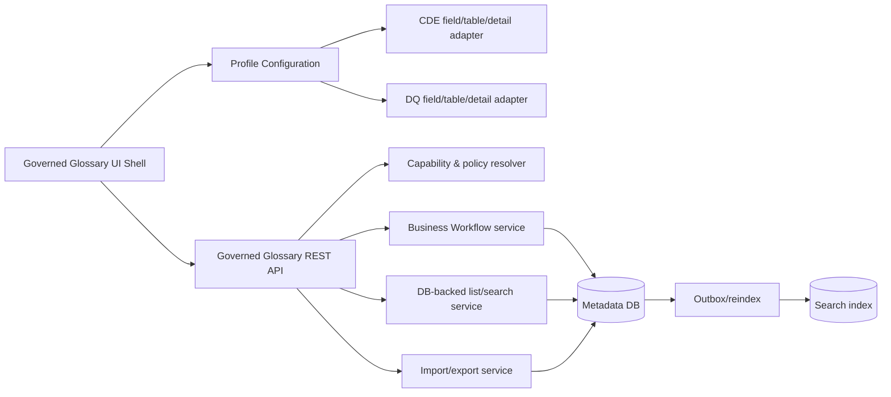
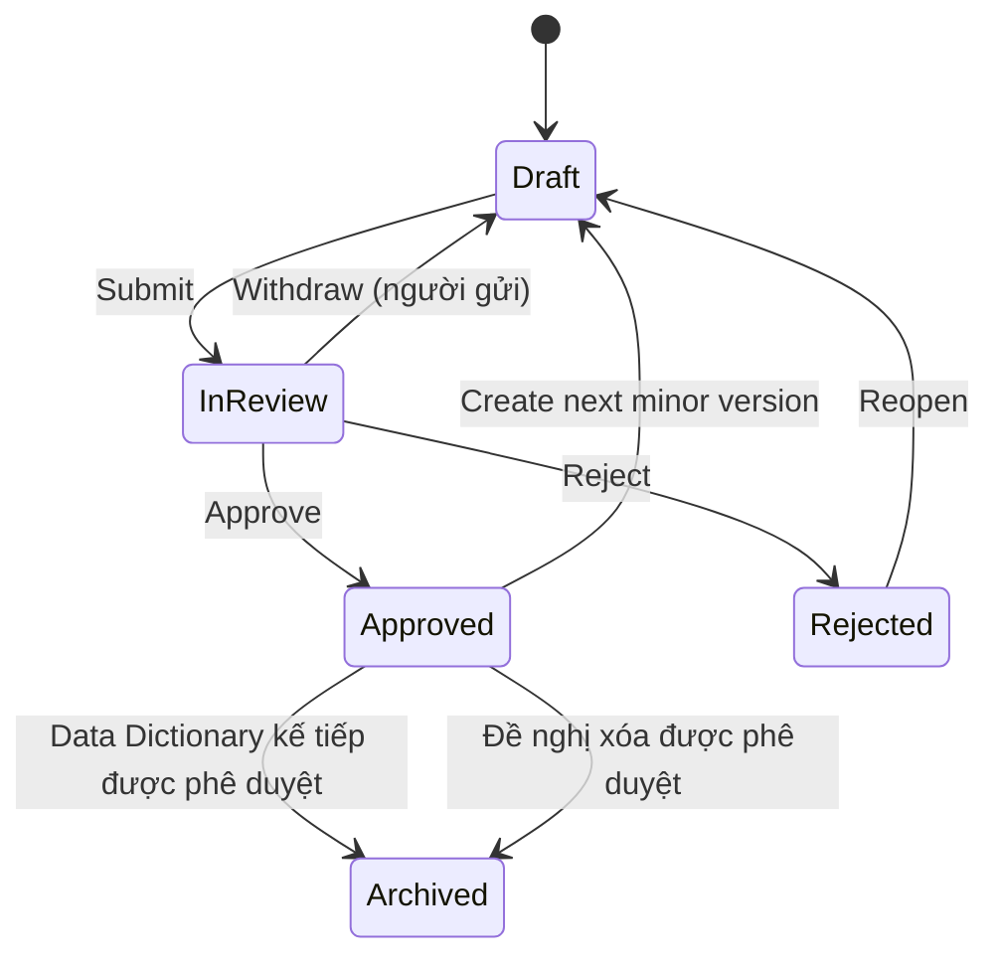

# Thiết kế kỹ thuật và UI/UX Chất lượng dữ liệu (Data Quality Glossary)

> Tài liệu này là thiết kế đích cho màn hình **Chất lượng dữ liệu** quản lý danh mục quy tắc chất lượng dữ liệu nghiệp vụ. Tính năng kế thừa layout, workflow, version, phân quyền và trải nghiệm của [Từ điển dữ liệu dùng chung](./cde-glossary-ui-design.md), nhưng sử dụng schema thuộc tính của quy tắc chất lượng dữ liệu.
>
> Baseline kiến trúc: [Kiến trúc tham chiếu OpenMetadata 1.13.3](./openmetadata-1.13.3-upstream-architecture-reference.md). Database là nguồn sự thật cho list/detail/workflow; search engine chỉ là projection phục vụ discovery, không quyết định trạng thái nghiệp vụ.

## Hiện trạng triển khai (cập nhật 2026-10-08)

> Đối chiếu mã nguồn tại commit `b9a2421e757`. Các mục còn lại là thiết kế đích; khác biệt ghi ở bảng dưới. Kiến trúc tổng thể: [Kiến trúc hiện tại hệ thống](./agribank-metadata-architecture.md).

| Hạng mục | Hiện trạng |
| --- | --- |
| Profile registry | `GovernedGlossaryProfileRegistry.Profile.DATA_QUALITY`. Không có feature flag. |
| Bootstrap | `DataQualityBootstrap` tạo glossary hệ thống `Data Quality` (displayName `Chất lượng dữ liệu`). Classification `DataQualityDimension`, `DataQualityTargetPopulation`, `DataQualityMethod`, `DataQualityFrequency` seed cố định từ `json/data/tags/*.json` (`provider: system`). |
| Version catalog | Catalog DQ đi theo Data Dictionary: khi DD `N+1` được phê duyệt, DQ Rule Approved của scope `N` bị archive; nếu catalog DQ đang ở `N` và không có working thì catalog `N` bị archive và catalog `N+1` mở dạng Draft rỗng (`advanceDataQualityCatalog`). Rule phải tạo lại trong scope mới (§5.1). |
| Tạo/sửa DQ Rule | Con trực tiếp của glossary DQ, đúng 1 CDE canonical, `name` là mã quy tắc. Workflow, Sửa phiên bản, hủy bản nháp dùng chung endpoint `/working/*` với CDE. |
| Xóa DQ Rule Approved | Đề nghị xóa (`POST .../working/deletion`) vào `In Review` ngay; duyệt thì archive Rule và đưa reconcile vào `dq_test_outbox` để ngừng testcase managed, vô hiệu hóa pipeline (§5.6). |
| Rút lại yêu cầu | `POST .../working/withdraw`, bulk `withdraw` (§5.6). |
| Tab Yêu cầu | `PendingRequestsTab` + `useDataQualityPendingRequestsAdapter` (§8.9). |
| List/search | Mặc định đọc `governed_glossary_search_index`; dự phòng DB qua `GlossaryFlatListService`/`GlossaryBusinessVersionSearchService` khi index lỗi (xem [Kiến trúc hiện tại §5](./agribank-metadata-architecture.md)). Tìm theo mã, tên, mô tả. Term DQ ẩn tab Tài sản. |
| Kiểm thử theo Rule | Đã có: [Thiết kế Kiểm thử theo Quy tắc CLDL](./dq-rule-test-execution-design.md). |
| Export | **Chưa có.** `GET /glossaryTerms/export` trả 400 `Export is not supported for this glossary profile`. |
| Import | Chưa có template/preview/commit nguyên tử ở backend. `DQImportPage` đọc, kiểm tra Excel ở client rồi tạo từng Rule; không nguyên tử (`GAP-DQ-01`). |
| UI | `DQGlossaryTermForm` (dùng `ClassificationSelect`, `CDESelectableField`), `DQGlossaryTableColumns`, `DQGlossaryTermOverview`/`Summary`, `DQImportExport`, `DQRuleTests`. |
| Assets, audit riêng DQ | Chưa triển khai. |
| Test | Unit test backend cho deletion/bulk/kiểm thử; test UI cho form, import. Chưa có integration test riêng DQ. |

Khác biệt có chủ đích hoặc còn mở: §6.3 Import/export, §10 read model riêng, §11 audit, §12 migration.

## 1. Mục tiêu và nguyên tắc

### 1.1. Mục tiêu

- Cung cấp một màn hình **Chất lượng dữ liệu** có cùng mental model với màn hình **Từ điển dữ liệu dùng chung**: danh mục bên trái, header/version/workflow, toolbar tìm kiếm và bộ lọc, bảng dữ liệu, form thêm/sửa, trang chi tiết, Assets, import/export và thao tác hàng loạt.
- Mỗi dòng là một **Quy tắc chất lượng dữ liệu** (`DQ Rule`), được lưu bằng `GlossaryTerm` thuộc glossary hệ thống `Data Quality`.
- Tái sử dụng engine Business Workflow, authorization, snapshot, list query và các component khung; chỉ thay profile, field schema, validation, cột, bộ lọc và mapping import/export.
- Bảo đảm Consumer chỉ thấy dữ liệu đã phê duyệt; Draft/In Review/Rejected không rò rỉ qua REST, search, export, deep link hoặc relation.
- Liên kết quy tắc DQ với CDE và tài sản metadata bằng định danh ổn định, không dựa trên text hiển thị.

### 1.2. Nguyên tắc thiết kế bắt buộc

1. **Không nhân bản màn hình CDE.** DQ là một cấu hình/profile của cùng feature shell.
2. **Không hard-code bằng display name.** Backend nhận diện profile từ glossary identity/name bất biến; frontend dùng `profileKey` do backend trả về.
3. **Không dùng Elasticsearch làm nguồn workflow.** Search có thể chậm hơn transaction; mọi mutation phải resolve lại từ database. (Chỉ màn hình danh sách đọc index, có dự phòng DB; workflow, chi tiết và tab Yêu cầu đọc DB.)
4. **Không có dual write không kiểm soát.** Quan hệ CDE có một nguồn sự thật; các nhãn snapshot chỉ để hiển thị lịch sử.
5. **Published snapshot chỉ đổi qua Sửa phiên bản.** Sửa quy tắc đã Approved bằng cách tạo working business version kế tiếp, hoặc dùng luồng Sửa phiên bản ([thiết kế CDE §5.6](./cde-glossary-ui-design.md)) để ghi đè chính version đó, lưu nội dung cũ vào lịch sử. Không có hủy duyệt.
6. **Authorization tại backend.** Ẩn nút ở frontend không thay thế kiểm tra quyền trên API.
7. **Schema có version.** Import template, validation và UI cùng tham chiếu một `schemaVersion`, tránh lệch cột sau nâng cấp.

## 2. Phạm vi và thuật ngữ

### 2.1. Trong phạm vi

- Một glossary hệ thống có technical name `Data Quality`, display name `Chất lượng dữ liệu`, profile `DATA_QUALITY`.
- Các DQ Rule là `GlossaryTerm` con trực tiếp của glossary này; UI không tạo cây rule lồng nhau.
- List/detail/create/edit, search/filter, workflow, business version, permission, bulk workflow, import/export Excel, CDE link, Assets và audit.
- Bootstrap/migration cho Custom Properties và Classifications/Tags của DQ.

### 2.2. Ngoài phạm vi

- Không thay thế module Data Quality/Observability gốc của OpenMetadata dùng `TestDefinition`, `TestCase`, test result và dashboard.
- Khai báo kiểm thử trên DQ Rule, tự sinh `TestCase` lên các Column gắn CDE, lịch chạy và tổng hợp kết quả theo Rule/CDE thuộc [Thiết kế Kiểm thử theo Quy tắc CLDL](./dq-rule-test-execution-design.md).
- Không cho người dùng tạo thêm glossary cùng profile hoặc đổi technical name của glossary hệ thống.

### 2.3. Tránh nhầm lẫn khái niệm

| Khái niệm | Entity kỹ thuật | Mục đích |
| --- | --- | --- |
| Danh mục Chất lượng dữ liệu | `Glossary` (`Data Quality`) | Quản trị quy tắc nghiệp vụ, version và phê duyệt |
| Quy tắc CLDL | `GlossaryTerm` thuộc `Data Quality` | Metadata mô tả một quy tắc |
| Kiểm thử chất lượng dữ liệu | `TestCase`/`TestDefinition` | Thực thi và lưu kết quả đo |
| CDE | `GlossaryTerm` thuộc `Data Dictionary` | Thành tố dữ liệu dùng chung được quy tắc tham chiếu |

Trên menu nên dùng nhãn **Chất lượng dữ liệu** cho danh mục mới. Khi cùng xuất hiện với module thực thi, module gốc phải có nhãn rõ hơn như **Giám sát chất lượng dữ liệu** để người dùng không nhầm.

### 2.4. Diễn giải yêu cầu “cây phân cấp danh mục”

Thiết kế này hiểu “kế thừa hoàn toàn CDE” theo invariant trong tài liệu CDE hiện hành: cây/panel điều hướng danh mục được tái sử dụng, nhưng các bản ghi nghiệp vụ là con trực tiếp và bảng là flat list; không tạo DQ Rule cha — DQ Rule con. Vì vậy nhánh DQ hiện đang gọi child loader/expand row được xem là compatibility code cần loại bỏ.

Nếu nghiệp vụ thực sự cần các node **Nhóm quy tắc DQ** nhiều cấp, đó không còn là khác biệt “chỉ ở bộ thuộc tính”. Khi đó phải bổ sung loại node `DQ_CATEGORY`, quy tắc leaf-only, permission/move/import riêng và thiết kế lại versioned membership; không được tận dụng tùy ý quan hệ parent của DQ Rule trong phạm vi kế hoạch này.

## 3. Baseline hiện trạng và khoảng trống

Repository đã có một phần implementation DQ. Đây là tài sản cần refactor và tái sử dụng, không viết lại từ đầu.

| Hạng mục | Hiện trạng | Quyết định thiết kế |
| --- | --- | --- |
| Nhận diện DQ | `isDataQualityGlossary()` dùng danh sách alias trong `Glossary.contant.ts` | Thay bằng `profileKey` từ backend; alias chỉ dùng migration/compatibility |
| Form | Có `DQGlossaryTermForm.component.tsx` với extension, tags, owners/reviewers | Tách shell/form renderer dùng schema; bỏ quyền suy diễn ở form |
| Bảng và filter | Có `DQGlossaryTableColumns.tsx`, filter DQ trong `GlossaryTermTab.component.tsx` | Tách `GovernedGlossaryTable` + profile column/filter descriptors |
| Chi tiết | Có `DQGlossaryTermOverview/Summary` | Giữ renderer DQ nhưng dùng field registry và permission chung |
| Import/export | Có xử lý XLSX phía trình duyệt trong `DQImportExport.utils.ts` | Chuyển validation/commit/export authoritative xuống backend; client chỉ preview/download |
| Bootstrap | Có `prepare/7_create_dq_glossary.py` | Dùng cho seed/dev; production bootstrap/migration phải chạy server-side, idempotent |
| Workflow backend | `GlossaryResource`, `GlossaryTermResource` và `DataDictionaryResolver` khóa vào `Data Dictionary` | Tổng quát hóa thành governed glossary profile trước khi bật DQ workflow |
| Business version | Seed DQ hiện dùng glossary `1.0`; CDE contract dùng parent `N`, term `N.MINOR` | Chuẩn hóa DQ catalog `N`, DQ Rule `N.MINOR`; migration xử lý dữ liệu thử nghiệm `1.0` |
| CDE link | Vừa lưu `relatedTerms`, vừa lưu `extension.cdeCode/cdeName` | `relatedTerms`/reference ID là nguồn sự thật; text chỉ là snapshot compatibility |
| Mã quy tắc | Dùng `name`, seed cũ từng thêm hậu tố `_2`, `_3` | Chuẩn hóa `name` là Mã quy tắc canonical; không tạo hoặc ghi `extension.ruleCode` |
| Thông tin phát hành | DQ hiện chưa hoàn chỉnh `Phiên bản`, `Loại phiên bản phát hành`, `Cấp phát hành`, `Ngày hiệu lực`, `Ngày hết hiệu lực` | Bổ sung vào schema 19 trường; tái sử dụng version/date/release contract của CDE |
| Query DQ | Một số nhánh list/filter dùng trực tiếp search index | Dùng DB-backed governed list/search; ES chỉ cho global discovery |

## 4. Kiến trúc đích: Governed Glossary Profile

### 4.1. Mô hình tái sử dụng



Phần dùng chung gồm route, loading/error state, header, version selector, state actions, optimistic locking, pagination, column preference, bulk action, permission gate và audit. Adapter DQ chỉ cung cấp field schema, column schema, filter schema, renderer, validator và import/export mapping.

### 4.2. Backend profile registry

Thay `DataDictionaryResolver` chuyên biệt bằng registry có allowlist tường minh, ví dụ:

```java
enum GovernedGlossaryProfileKey {
  DATA_DICTIONARY,
  DATA_QUALITY
}

record GovernedGlossaryProfile(
    GovernedGlossaryProfileKey key,
    String glossaryName,
    String displayName,
    boolean directChildrenOnly,
    VersionPolicy versionPolicy,
    Set<String> allowedExtensionKeys,
    Map<String, Cardinality> classificationRules) {}
```

Registry phải resolve từ `glossaryId` rồi đối chiếu technical `name`; không tin `displayName`, URL alias hoặc payload client. Mọi endpoint workflow gọi cùng resolver và nhận profile. Validation đặc thù được dispatch theo profile, không rải `if (name === ...)` ở Resource/Repository.

API detail/list trả thêm:

```json
{
  "profileKey": "DATA_QUALITY",
  "schemaVersion": 1,
  "capabilities": {
    "canViewPublished": true,
    "canViewWorking": false,
    "canCreate": false,
    "canEdit": false,
    "canSubmit": false,
    "canApprove": false,
    "canReject": false,
    "canImport": false,
    "canExport": true
  }
}
```

### 4.3. Frontend profile registry

Frontend chỉ chọn profile từ `profileKey` đã xác thực:

```ts
type GovernedGlossaryProfile = {
  key: 'DATA_DICTIONARY' | 'DATA_QUALITY';
  termLabelKey: string;
  fields: FieldDescriptor[];
  columns: ColumnDescriptor[];
  filters: FilterDescriptor[];
  importExport: ImportExportDescriptor;
  detailSections: DetailSectionDescriptor[];
};
```

Không cố biến mọi field thành renderer động phức tạp. Shell và hành vi dùng chung; các cell/editor đặc biệt vẫn là component typed (`DQDimensionCell`, `CdeReferenceField`, `MarkdownField`) được profile tham chiếu.

## 5. Mô hình dữ liệu

### 5.1. Identity, scope và version

- `Data Quality` là glossary hệ thống duy nhất có profile `DATA_QUALITY`.
- DQ catalog dùng business version canonical `N` (`1`, `2`, ...).
- DQ Rule dùng business version `N.MINOR` (`1.0`, `1.1`, ...), trong đó `N = parentBusinessVersion`.
- Một DQ Rule identity chỉ thuộc một parent scope. Cùng mã ở catalog version khác là identity khác; trong cùng scope, tạo minor version giữ identity.
- Technical FQN được scope hóa giống CDE: `{glossaryFqn}.{escapedTechnicalName}@v{N}`.
- DQ Rule là con trực tiếp; payload có `parent` là một term khác bị từ chối.

State machine và quy tắc Consumer/working/published/Archived dùng chung hoàn toàn với CDE:



Catalog DQ dùng cùng số version với Data Dictionary. Approve DD `N+1` archive mọi DQ Rule Approved của scope `N` (Rule gắn với CDE của scope `N` nên không còn hiệu lực), và nếu catalog DQ đang Approved ở `N` và không có working thì archive catalog `N`, mở catalog `N+1` Draft rỗng. Không có sao chép Rule sang scope mới.

Khi phê duyệt DQ catalog, backend phê duyệt nguyên tử toàn bộ DQ Rule working trong đúng
`parentBusinessVersion` rồi mới publish catalog và manifest. Trạng thái riêng trước đó của Rule
(`Draft`, `In Review` hoặc `Rejected`) không làm Rule bị bỏ khỏi lần phê duyệt catalog.

### 5.2. Schema hiển thị chính thức — 19 trường

Bảng danh sách, form và trang chi tiết phải dùng đúng nhãn và thứ tự sau. Checkbox chọn hàng và cột thao tác là control của UI, không tính vào 19 trường nghiệp vụ.

| STT | Trường UI | Lưu trữ | Kiểu/cardinality | Bắt buộc | Quy tắc |
| --- | --- | --- | --- | --- | --- |
| 1 | Mã quy tắc | `name` | string, đơn trị | Có | Trim; là identity nghiệp vụ và duy nhất trong một glossary scope |
| 2 | Tên quy tắc | `displayName` | string, đơn trị | Không | Người dùng nhập; trim; hiển thị `--` khi trống; không dùng làm technical identity |
| 3 | Mã CDE | `relatedTerms.term.id` → CDE `name` | reference, đơn trị ở v1 | Có | Nguồn sự thật là CDE ID; mã được resolve để hiển thị |
| 4 | Tên thành tố | `relatedTerms.term.id` → CDE `displayName` | derived string | Hệ thống | Read-only, tự điền theo CDE đã chọn |
| 5 | Tiêu chí chất lượng dữ liệu | Tag `DataQualityDimension.*` | đơn trị | Có | Allowlist classification |
| 6 | Quy tắc nghiệp vụ | `description` | markdown | Có | Sanitize khi render |
| 7 | Diễn giải quy tắc nghiệp vụ | `extension.ruleExplanation` | markdown | Không | Sanitize khi render |
| 8 | Ràng buộc / Yêu cầu khác | `extension.otherConstraints` | markdown | Không | Sanitize khi render |
| 9 | Các tiêu chí cơ sở | Tag `DataQualityTargetPopulation.*` | đa trị | Không | Nhãn UI mới của classification phạm vi kiểm tra hiện hữu; allowlist classification |
| 10 | Hình thức kiểm tra | Tag `DataQualityMethod.*` | đơn trị | Có | Allowlist classification |
| 11 | Tần suất | Tag `DataQualityFrequency.*` | đơn trị | Có | Allowlist classification |
| 12 | Ngưỡng chất lượng dữ liệu | `extension.qualityThreshold` | string | Không | Grammar v1: biểu thức ngưỡng; tối đa 64 ký tự |
| 13 | Văn bản quy định liên quan | `extension.relatedRegulatoryDocuments` | markdown | Không | Dùng chung property với CDE; sanitize khi render |
| 14 | Phiên bản | `businessVersion` | string `N.MINOR` | Hệ thống | Read-only; version nghiệp vụ canonical của DQ Rule |
| 15 | Loại phiên bản phát hành | `extension.releaseVersionType` | enum, đơn trị | Hệ thống | Read-only; `N.0` = `Bản chính`, `N.MINOR` với `MINOR >= 1` = `Bản phụ` |
| 16 | Cấp phát hành | `extension.releaseLevel` | enum, đơn trị | Không | `CEO` → `Tổng Giám đốc`; `TTQLDL` → `TTQLDL` |
| 17 | Ngày hiệu lực | `extension.effectiveDate` | date | Không | Lưu ISO `yyyy-MM-dd`, hiển thị `dd/MM/yyyy` |
| 18 | Ngày hết hiệu lực | `extension.expirationDate` | date | Không | Lưu ISO `yyyy-MM-dd`, hiển thị `dd/MM/yyyy`; không trước ngày hiệu lực |
| 19 | Trạng thái | workflow record `entityStatus` | enum | Hệ thống | Read-only; chỉ thay đổi qua workflow action; luôn là cột nghiệp vụ cuối cùng |

`termId`, `parentBusinessVersion`, `workingRevision`, `owners`, audit fields và capability vẫn tồn tại trong model kỹ thuật nhưng không phải cột nghiệp vụ trong danh sách 19 trường. `name` là trường nghiệp vụ **Mã quy tắc**, `businessVersion` là field hệ thống được chiếu read-only thành cột **Phiên bản**, còn `displayName` là trường nghiệp vụ **Tên quy tắc** do người dùng nhập.

Custom Properties được ghi mới cho profile DQ gồm `ruleExplanation`, `otherConstraints`, `qualityThreshold`, `relatedRegulatoryDocuments`, `releaseVersionType`, `releaseLevel`, `effectiveDate` và `expirationDate`. `relatedRegulatoryDocuments`, `releaseLevel`, `effectiveDate` và `expirationDate` dùng chung property đã có với CDE, không tạo property trùng. Hai field legacy `cdeCode`/`cdeName` chỉ được đọc trong migration window; sau cutover, Mã CDE và Tên thành tố luôn resolve từ relation. `exceptions` và tag `DataSource` cũ không còn thuộc schema DQ v1 mới; migration phải báo cáo dữ liệu còn tồn tại thay vì tự động làm mất dữ liệu.

`qualityThreshold` giữ kiểu string ở schema v1 để biểu diễn được `>= 99.5%`, `= 100%`, `count = 0`. Backend parse grammar thay vì chỉ kiểm tra chuỗi tùy ý:

```text
percentage := (">=" | ">" | "=" | "<=" | "<") decimal "%"
count      := "count" ("=" | "<=") nonNegativeInteger
```

Nếu nghiệp vụ chỉ chấp nhận phần trăm, schema version tiếp theo có thể tách `thresholdOperator` và `thresholdValue`; không đổi âm thầm kiểu của property đang có dữ liệu.

`releaseVersionType` là enum server-owned chỉ có hai giá trị: `Bản chính`, `Bản phụ`. Phiên bản đầu tiên của mỗi DQ Rule trong catalog scope `N` là `N.0` và mang giá trị `Bản chính`; các phiên bản tiếp theo `N.MINOR` với `MINOR >= 1` mang giá trị `Bản phụ`. Ví dụ rule `2.0` là `Bản chính`, còn `2.1`, `2.2`, ... là `Bản phụ`. Backend tạo và kiểm tra giá trị cùng `businessVersion`; API authoring, UI và Import không được gán hoặc sửa trực tiếp.

Hai trường ngày dùng cùng validator với CDE:

- API/database/snapshot lưu canonical ISO date `yyyy-MM-dd`, không kèm múi giờ.
- UI và Excel hiển thị/nhập `dd/MM/yyyy`.
- Nếu có cả hai ngày thì `expirationDate >= effectiveDate`.
- Working Draft được phép để trống một hoặc cả hai ngày; snapshot cũ thiếu ngày hiển thị `--`.

### 5.3. Mã nghiệp vụ, record ID và technical name

- UI, filter, Excel và audit dùng trực tiếp `name`; không dùng `extension.ruleCode` hoặc `name.split('_')`.
- `name` là mã duy nhất trong một Data Quality glossary scope. Import có mã trùng phải báo conflict, không tự thêm hậu tố hoặc tự gộp bản ghi.
- `termId` (UUID) là record ID bất biến. Export đặt ID trong sheet `_metadata` ẩn; import có metadata hợp lệ thì update đúng identity, không có thì tạo mới. ID không thuộc glossary/scope hiện tại hoặc actor không có quyền phải bị từ chối.
- `name` chính là Mã quy tắc do người dùng nhập khi tạo và không được đổi sau khi đã tạo identity.
- Unique key kỹ thuật vẫn là `(glossaryId, parentBusinessVersion, normalizedName)`. Exact-content duplicate chỉ tạo warning ở preview; không tự coi là cùng identity.
- Nếu một phát biểu cần áp dụng cho nhiều CDE, v1 tạo một record cho mỗi association. Pha sau có thể nâng cardinality mà không thay nghĩa `termId`.
- Migration từ dữ liệu `_2`, `_3` phải tạo báo cáo conflict; không được cắt hậu tố tự động nếu không chứng minh đó là suffix do seed script tạo.

### 5.4. Liên kết CDE

Quy tắc này áp dụng cho DQ Rule. Từ điển kỹ thuật không có phiên bản và luôn gắn với Data Dictionary
đang hiệu lực; liên kết CDE của nó theo [thiết kế riêng](./technical-dictionary-design.md) §7.
Hai bên dùng chung mô hình liên kết tới CDE identity và cách resolve nội dung hiển thị dưới đây.

**Mô hình liên kết**

- Liên kết trỏ tới **CDE identity**, không trỏ tới một version của CDE. Relation chỉ lưu `termId` ổn định của CDE; không lưu `versionContext` (`parentBusinessVersion`, `businessVersion`, `snapshotId`) và client không gửi các giá trị này.
- Mỗi CDE identity thuộc đúng một Data Dictionary scope (FQN `Data Dictionary.<mã>@v<N>`); các version `N.0`, `N.1`, … là các lần duyệt nối tiếp của cùng identity. Vì vậy một liên kết bao trùm mọi version `N.x` của CDE, kể cả version được tạo sau khi gán.
- CDE cùng mã ở scope `N+1` là identity khác; liên kết ở scope `N` không tự chuyển sang scope `N+1`.
- Nguồn sự thật là CDE `termId` trong relation, không phải `cdeCode` hoặc `cdeName` trong extension.
- Mỗi DQ Rule liên kết đúng một CDE; một CDE có thể được nhiều DQ Rule liên kết.

**Ràng buộc khi gán**

- Backend chỉ chấp nhận term thuộc profile `DATA_DICTIONARY`, đúng direct-child invariant và actor được phép xem.
- Scope của CDE đọc từ chính CDE identity và phải bằng `parentBusinessVersion` của DQ Rule. DQ scope `N` chỉ được liên kết với CDE thuộc Data Dictionary scope `N`; không fallback hoặc resolve chéo scope.
- Chỉ được gán mới khi Data Dictionary scope `N` đang `Approved` active và CDE có ít nhất một snapshot `Approved` trong scope.

**Resolve nội dung hiển thị**

- Khi đọc, backend resolve `termId` sang một published snapshot của CDE để lấy mã, tên thành tố và các thông tin hiển thị khác:
  - Scope active: snapshot `Approved` mới nhất chưa Archived, để version bị thu hồi không che predecessor đang hoạt động.
  - Scope đã đóng băng: snapshot `Approved` Archived mới nhất của chính scope đó. Vì scope không còn thay đổi, kết quả luôn cố định.
- “Mới nhất” được xác định bằng so sánh business version dạng số, không dựa vào thứ tự API hoặc so sánh chuỗi.
- Working version Draft/In Review của CDE không bao giờ được dùng để resolve.
- Nếu CDE không còn snapshot `Approved` nào trong scope, relation được giữ nguyên; UI hiển thị mã CDE kèm cảnh báo **“CDE không còn phiên bản được phê duyệt.”** và Submit/Approve DQ Rule bị từ chối cho tới khi đổi CDE.

Ví dụ: DQ1 được gán CDE1 khi CDE1 đang ở v1.0.

| Sự kiện | DQ1 hiển thị | Trang CDE1 |
| --- | --- | --- |
| CDE1 v1.1 được duyệt, đổi tên | Tên theo v1.1, không phải gán lại | Mở v1.0 hay v1.1 đều liệt kê DQ1 |
| CDE1 v1.2 đang Draft | Vẫn theo v1.1 | Mở Draft v1.2 cũng liệt kê DQ1 |
| CDE1 v1.1 bị thu hồi | Quay về theo v1.0 | Không đổi |
| Data Dictionary scope `1` đóng băng | Theo bản `Approved` cuối cùng của scope `1`, badge `Archived` | Không đổi |
| Data Dictionary scope `2` được duyệt | Không tự liên kết với CDE1 scope `2` | CDE1 scope `2` không liệt kê DQ1 |

**Lịch sử và audit**

- Published DQ snapshot lưu nhãn tham chiếu (mã, tên thành tố, FQN) tại thời điểm duyệt để render lịch sử phiên bản. Nhãn này chỉ phục vụ hiển thị lịch sử, không phải liên kết tới version CDE.
- Version CDE tại thời điểm DQ Rule được duyệt được suy ra bằng cách đối chiếu `publishedAt` của DQ snapshot với các snapshot CDE cùng scope; không lưu trùng thông tin này trên relation.
- Archive Data Dictionary/CDE không xóa, thay thế hoặc migrate relation hiện có. View/edit DQ cũ vẫn hiển thị CDE đã liên kết kèm badge `Archived`; CDE này chỉ dùng để bảo toàn giá trị hiện tại, không xuất hiện như lựa chọn cho liên kết mới.

**Tương thích dữ liệu cũ**

- Relation cũ còn `versionContext`: backend bỏ qua khi đọc và không ghi lại ở lần lưu tiếp theo; không cần migration riêng.
- `extension.cdeCode` và `extension.cdeName` hiện có được coi là compatibility fields: đọc fallback trong migration window, không ghi mới sau cutover.

**Reverse discovery**

- Câu hỏi “CDE đang được quy tắc nào kiểm soát” dùng relation index/read model theo `termId`, không quét text extension. Trang chi tiết CDE hiển thị danh sách DQ Rule liên kết, giống nhau ở mọi version của CDE trong scope.

### 5.5. Custom Properties là global theo entity type

Custom Properties của `glossaryTerm` có phạm vi toàn entity type, không riêng từng glossary. Vì vậy:

- Tên property DQ phải có semantic rõ và không đụng property CDE.
- UI chỉ render allowlist của profile; generic Glossary không tự động hiện field DQ.
- Backend từ chối extension key ngoài allowlist khi ghi working DQ Rule, nhưng giữ nguyên các key hệ thống được profile cho phép.
- Bootstrap property phải idempotent và kiểm tra cả name, type, displayName; cùng name khác type là lỗi vận hành, không tự overwrite.

### 5.6. Đề nghị xóa, rút lại, hủy bản nháp

Dùng chung cơ chế CDE ([Thiết kế CDE §5.7–5.8](./cde-glossary-ui-design.md)):

- **Đề nghị xóa** Rule Approved: `POST /glossaryTerms/{id}/working/deletion?parentBusinessVersion=N`, working `pendingDeletion` vào `In Review` ngay. Rule và kiểm thử vẫn chạy tới khi được duyệt.
- **Phê duyệt xóa**: archive mọi snapshot Approved của Rule trong scope, bỏ published head; trong cùng transaction ghi reconcile vào `dq_test_outbox` để gỡ testcase managed và vô hiệu hóa pipeline. Lịch sử Rule và kết quả kiểm thử được giữ.
- **Rút lại** (người gửi, `In Review`): `POST .../working/withdraw`; đề nghị xóa bị hủy, loại khác về `Draft`.
- **Hủy bản nháp** (`Draft`/`Rejected`): `DELETE .../working?expectedRevision=n`.

## 6. REST contract

### 6.1. Tái sử dụng endpoint workflow

Sau khi tổng quát hóa profile, DQ dùng cùng contract:

| Mục đích | Endpoint |
| --- | --- |
| Lấy working catalog | `GET /v1/glossaries/{id}/working` |
| Tạo version catalog kế tiếp | `POST /v1/glossaries/{id}/working` |
| Lưu Draft catalog | `PATCH /v1/glossaries/{id}/working` |
| Submit/Reject/Reopen/Approve catalog | `POST /v1/glossaries/{id}/working/{action}` |
| Lịch sử catalog | `GET /v1/glossaries/{id}/published` |
| Lấy catalog version | `GET /v1/glossaries/{id}/published/{businessVersion}` |
| Tạo DQ Rule | `POST /v1/glossaryTerms/governed` với glossary/scope được server resolve |
| Lấy/lưu working rule | `GET/PATCH /v1/glossaryTerms/{id}/working?parentBusinessVersion=N` |
| Tạo minor version | `POST /v1/glossaryTerms/{id}/working` |
| Workflow rule | `POST /v1/glossaryTerms/{id}/working/{action}` |
| Lịch sử rule | `GET /v1/glossaryTerms/{id}/published?parentBusinessVersion=N` |

Mọi mutation dùng `expectedRevision`. `409 Conflict` trả `currentRevision`, `currentStatus` và mã lỗi ổn định để UI yêu cầu reload; không tự merge nội dung governance.

Endpoint create/patch nhận DTO nghiệp vụ typed, không bắt frontend tự dựng `extension`, `tags` hoặc status. Ví dụ create:

```json
{
  "glossaryId": "uuid-data-quality",
  "parentBusinessVersion": "1",
  "payload": {
    "name": "DQ3.1",
    "description": "Thông tin ID khách hàng không được để trống.",
    "cdeTermId": "uuid-cde",
    "dimensionTagFqn": "DataQualityDimension.Accuracy",
    "targetPopulationTagFqns": [
      "DataQualityTargetPopulation.EntireCustomerBase"
    ],
    "methodTagFqn": "DataQualityMethod.TechnicalSqlRule",
    "frequencyTagFqn": "DataQualityFrequency.MonthlyOrQuarterly",
    "qualityThreshold": ">= 99%",
    "ruleExplanation": "...",
    "otherConstraints": "...",
    "relatedRegulatoryDocuments": "Quyết định 123/QĐ-NHNo",
    "releaseLevel": "CEO",
    "effectiveDate": "2026-10-01",
    "expirationDate": "2027-09-30"
  }
}
```

Server resolve profile từ `glossaryId`, cấp `termId`, dùng `name` làm Mã quy tắc để dựng FQN, map tags/extension và tạo working `N.0`. Nếu client gửi `profileKey`, giá trị này chỉ được dùng để phát hiện mismatch; không được dùng làm nguồn authorization/profile resolution.

Update dùng contract tương tự:

```json
{
  "expectedRevision": 4,
  "payload": {
    "description": "...",
    "cdeTermId": "uuid-cde",
    "dimensionTagFqn": "DataQualityDimension.Accuracy",
    "targetPopulationTagFqns": [],
    "methodTagFqn": "DataQualityMethod.TechnicalSqlRule",
    "frequencyTagFqn": "DataQualityFrequency.MonthlyOrQuarterly",
    "qualityThreshold": ">= 99%",
    "ruleExplanation": "...",
    "otherConstraints": "",
    "relatedRegulatoryDocuments": "",
    "releaseLevel": "TTQLDL",
    "effectiveDate": "2026-10-01",
    "expirationDate": ""
  }
}
```

Full mutable payload giúp xóa field có chủ đích và dễ validate. Server merge/preserve duy nhất các key hệ thống được profile khai báo; không áp dụng JSON merge tùy ý vào toàn entity.

### 6.2. List/search authoritative

Đề xuất endpoint profile-neutral:

```http
GET /v1/glossaryTerms/governed
  ?glossary={uuid}
  &parentBusinessVersion=1
  &q=...
  &statuses=Draft,In%20Review
  &tagFilters=DataQualityDimension.Accuracy,...
  &cdeTermIds=...
  &releaseVersionTypes=...
  &releaseLevels=CEO,TTQLDL
  &effectiveFrom=2026-01-01
  &expirationTo=2027-12-31
  &limit=25
  &offset=0
  &sort=name:asc
```

Response là flat rows đã authorization-filter và hydrate từ DB, có `paging.total`. Không trả tree node/load-more child cho profile direct-child. Backend whitelist sort/filter field; query text tìm trên `name`, `displayName`, `description`, CDE code/name và các extension text được phép.

### 6.3. Import/export

| Mục đích | Endpoint đề xuất |
| --- | --- |
| Tải template | `GET /v1/glossaryTerms/governed/import/template?profileKey=DATA_QUALITY&schemaVersion=1` |
| Validate/preview | `POST /v1/glossaryTerms/governed/import/preview?glossary=...&parentBusinessVersion=N&existingCodePolicy=...` |
| Commit | `POST /v1/glossaryTerms/governed/import/{sessionId}/commit` |
| Export | `GET /v1/glossaryTerms/governed/export?glossary=...&parentBusinessVersion=N&...filters` |

Preview lưu session có TTL, file hash, actor, scope, schema version và row plan. Commit kiểm tra lại quyền, revision/existing state và chạy transaction nguyên tử. Export stream từ backend sau authorization; không export chỉ những row đang có trên trang trình duyệt.

Sheet dữ liệu hiển thị đúng 19 trường nghiệp vụ. `Phiên bản` là cột presentation read-only lấy từ `businessVersion`; workbook không chèn UUID/revision vào danh sách cột người dùng. Để hỗ trợ update an toàn, workbook export có sheet ẩn `_metadata` ánh xạ số dòng với `termId`, `businessVersion` và `workingRevision`; template tạo mới không có identity mapping. Import update phải dùng metadata identity; import tạo mới dùng `name` và từ chối mã đã tồn tại trong cùng scope.

Schema workbook v1 dùng thứ tự canonical:

| # | Cột | Bắt buộc khi tạo | Mapping |
| --- | --- | --- | --- |
| 1 | Mã quy tắc | Có | `name` |
| 2 | Tên quy tắc | Không | `displayName`; trim; không dùng để match identity |
| 3 | Mã CDE | Có | Resolve sang `cdeTermId`; không lưu text làm nguồn sự thật |
| 4 | Tên thành tố | Hệ thống | Read-only, resolve từ CDE; import dùng để đối soát |
| 5 | Tiêu chí chất lượng dữ liệu | Có | `DataQualityDimension` |
| 6 | Quy tắc nghiệp vụ | Có | `description` |
| 7 | Diễn giải quy tắc nghiệp vụ | Không | `ruleExplanation` |
| 8 | Ràng buộc / Yêu cầu khác | Không | `otherConstraints` |
| 9 | Các tiêu chí cơ sở | Không | `DataQualityTargetPopulation`; DTO giữ `targetPopulationTagFqns` để tương thích |
| 10 | Hình thức kiểm tra | Có | `DataQualityMethod` |
| 11 | Tần suất | Có | `DataQualityFrequency` |
| 12 | Ngưỡng chất lượng dữ liệu | Không | `qualityThreshold` |
| 13 | Văn bản quy định liên quan | Không | `relatedRegulatoryDocuments` |
| 14 | Phiên bản | Chỉ export | `businessVersion`; read-only, import không được dùng để đổi version |
| 15 | Loại phiên bản phát hành | Chỉ export | `releaseVersionType`; read-only, backend suy ra từ `businessVersion` |
| 16 | Cấp phát hành | Không | `releaseLevel`, normalize nhãn sang mã enum |
| 17 | Ngày hiệu lực | Không | `effectiveDate`, nhập `dd/MM/yyyy`, lưu ISO |
| 18 | Ngày hết hiệu lực | Không | `expirationDate`, nhập `dd/MM/yyyy`, lưu ISO |
| 19 | Trạng thái | Chỉ export | Read-only; import không được dùng để transition |

Nhiều tag trong một cell dùng delimiter được khai báo trong metadata sheet, không tự đoán theo dấu phẩy vì label có thể chứa dấu phẩy. `Tên thành tố` phải khớp CDE được resolve từ `Mã CDE`; sai lệch là validation error, không ghi đè tên CDE. Hai ngày phải thỏa `Ngày hết hiệu lực >= Ngày hiệu lực`. Template cũ được nhận diện bằng header fingerprint và chuyển qua compatibility mapper có thời hạn.

## 7. Phân quyền và workflow

### 7.1. Capability là contract duy nhất cho UI

UI không suy quyền từ tên role, owner, reviewer hoặc release level. Nó chỉ dùng capability backend:

- `canViewPublished`, `canViewWorking`, `isConsumer`
- `canEditWorking` (lưu nháp, hủy bản nháp, reopen, import)
- `canCreateVersion` (tạo Rule/version, Sửa phiên bản; cùng `canSubmit` để đề nghị xóa)
- `canSubmit`, `canApprove`, `canReject`
- Rút lại yêu cầu: không có capability riêng; UI hiện khi `submittedBy` là người dùng hiện tại, backend kiểm tra lại
- Kiểm thử: `canEdit`, `canRun`, `canView` từ `GET /glossaryTerms/dataQuality/config`

Consumer-only được xác định bằng `canViewPublished=true && canViewWorking=false`, giống CDE. Trong lúc permission đang load, UI không render action để tránh flash nút trái quyền.

### 7.2. Trường reviewer

Vì yêu cầu là kế thừa mô hình CDE, target không cho client tự sửa `reviewers` trên DQ Rule. Tuyến phê duyệt do policy/capability quyết định. Component reviewer hiện có trong DQ form/overview phải được bỏ hoặc chuyển thành read-only audit widget nếu backend vẫn trả assignment hệ thống.

### 7.3. Ma trận thao tác mặc định

| Thao tác | `DataProposer` | `DataSteward` | `DataConsumer` / `BasicConsumer` |
| --- | --- | --- | --- |
| Xem Approved/Archived | Có | Có | Có |
| Xem working, tab Yêu cầu | Có | Có | Không |
| Tạo/sửa Draft, Sửa phiên bản, hủy bản nháp | Có | Không | Không |
| Submit, đề nghị xóa, rút lại yêu cầu của mình | Có | Không | Không |
| Approve/Reject (không duyệt yêu cầu của chính mình) | Không | Có | Không |
| Khai báo kiểm thử, lịch, Chạy ngay | Có (`canEdit`/`canRun`) | Không | Không |
| Import | Có | Không | Không |
| Export | Chưa có (`GAP-DQ-01`) | Chưa có | Chưa có |

`Admin` dùng OpenMetadata UI để quản trị (reconcile kiểm thử là Admin-only) và không mặc nhiên có `W`/`A`. Các role nghiệp vụ dùng Portal ([Kiến trúc triển khai tách Portal](./public-admin-split-deployment-architecture.md)).

## 8. Thiết kế UI/UX

### 8.1. Layout tổng thể

```text
┌────────────────────────────────────────────────────────────────────┐
│ Chất lượng dữ liệu  [v1] [Approved]      [Xuất] [⋯] [Thêm thuật ngữ]│
├───────────────────┬────────────────────────────────────────────────┤
│ Danh mục          │ [Tìm kiếm........] [Trạng thái] [Tiêu chí] ...│
│                   ├────────────────────────────────────────────────┤
│ • Chất lượng      │ □ Mã QT │ Tên quy tắc │ CDE │ Tiêu chí │ ...│
│   dữ liệu         │ □ DQ1.1 │ Tính chính xác│CDE1│ Chính xác│... │
│                   │                                                │
│                   │                         1–25 / 240  [‹] [›]     │
└───────────────────┴────────────────────────────────────────────────┘
```

- Giữ cùng spacing, typography, toolbar, table density, sticky header, resizable columns và column preferences của CDE.
- Profile direct-child hiển thị flat list; không có expand/collapse tree. Nút expand/collapse hiện tại của DQ phải bỏ.
- Bảng hiển thị đủ 19 trường nghiệp vụ theo đúng thứ tự đã chốt; mặc định cố định `Mã quy tắc`, `Tên quy tắc`, `Mã CDE`, `Trạng thái`. Checkbox và `Thao tác` là cột tiện ích ngoài schema.
- Column preference key phải mang schema version, ví dụ `governedGlossary.DATA_QUALITY.v1`, để schema mới không đọc layout cũ sai.

### 8.2. Cột mặc định

Thứ tự bắt buộc:

1. Mã quy tắc.
2. Tên quy tắc.
3. Mã CDE.
4. Tên thành tố.
5. Tiêu chí chất lượng dữ liệu.
6. Quy tắc nghiệp vụ.
7. Diễn giải quy tắc nghiệp vụ.
8. Ràng buộc / Yêu cầu khác.
9. Các tiêu chí cơ sở.
10. Hình thức kiểm tra.
11. Tần suất.
12. Ngưỡng chất lượng dữ liệu.
13. Văn bản quy định liên quan.
14. Phiên bản.
15. Loại phiên bản phát hành.
16. Cấp phát hành.
17. Ngày hiệu lực.
18. Ngày hết hiệu lực.
19. Trạng thái.

Các trường markdown dài (`description`, `ruleExplanation`, `otherConstraints`, `relatedRegulatoryDocuments`) vẫn là cột hiển thị nhưng cell rút gọn 2–3 dòng, có tooltip/popover hoặc mở detail, không render toàn bộ làm vỡ chiều cao bảng. Bảng cuộn ngang; column chooser có thể lưu tùy chọn cá nhân nhưng cấu hình mặc định luôn chứa đủ 19 trường.

### 8.3. Search và filter

- Search debounce 300–500 ms, hỗ trợ IME tiếng Việt và Enter để chạy ngay.
- Filter: Trạng thái, Tiêu chí chất lượng dữ liệu, Các tiêu chí cơ sở, Hình thức kiểm tra, Tần suất, CDE, Loại phiên bản phát hành, Cấp phát hành và khoảng Ngày hiệu lực/Ngày hết hiệu lực.
- Filter state đồng bộ vào URL để bookmark/share và back/forward hoạt động.
- Mỗi thay đổi filter reset page về 1; request cũ bị hủy/ignore bằng request generation.
- Chip **Xóa tất cả bộ lọc** xuất hiện khi có filter; empty state phân biệt “chưa có dữ liệu” với “không có kết quả”.
- Consumer không thấy option trạng thái working.

### 8.4. Form thêm/sửa

Form dùng modal/drawer shell chung với CDE, chia bốn section:

Tiêu đề modal tạo mới là **Thêm Thuật ngữ** và nút xác nhận là **Tạo Thuật ngữ**, thống nhất với shell Glossary/CDE; nội dung bên trong vẫn dùng thuật ngữ nghiệp vụ Quy tắc CLDL.

1. **Thông tin cơ bản:** `Mã quy tắc` và `Tên quy tắc`; `Phiên bản` và `Loại phiên bản phát hành` đặt cạnh nhau, đều read-only; `Quy tắc nghiệp vụ` là markdown toàn chiều rộng.
2. **Thông tin quản lý:** `Mã CDE` selector và `Tên thành tố` read-only đặt cạnh nhau; `Cấp phát hành`; `Ngày hiệu lực` và `Ngày hết hiệu lực` đặt cạnh nhau.
3. **Phân loại và kiểm soát:** `Tiêu chí chất lượng dữ liệu` và `Các tiêu chí cơ sở`; `Hình thức kiểm tra` và `Tần suất`; `Ngưỡng chất lượng dữ liệu` ở hàng cuối.
4. **Ngữ cảnh nghiệp vụ:** `Diễn giải quy tắc nghiệp vụ`, `Ràng buộc / Yêu cầu khác` và `Văn bản quy định liên quan` là ba markdown editor toàn chiều rộng. Trạng thái chỉ đọc; workflow action nằm ở header/footer chung.

Hành vi:

- Chọn CDE bằng selector/async search chuẩn của OpenMetadata; không tạo dropdown style riêng và không tải cứng 1.000 CDE.
- Option CDE lấy từ Data Dictionary scope có cùng số version `N` với catalog DQ đang mở (§5.4); request CDE luôn scope bằng ID + `parentBusinessVersion = N` và status `Approved`.
- Mỗi CDE identity chỉ có một option, khóa option là `termId`; nội dung option resolve theo §5.4. Backend scope/filter trước khi trả dữ liệu, frontend lọc phòng vệ.
- Placeholder là **“Tìm theo mã hoặc tên CDE”**; không hiển thị UUID. Mỗi option hiển thị `Mã CDE · Tên thành tố`, không hiển thị version vì người dùng chọn CDE chứ không chọn version; không lặp badge `Approved` trên từng dòng. Phần đầu dropdown hiển thị `Data Dictionary: <tên> · v<version> · Approved`.
- Search theo mã/tên, debounce và bỏ response quá hạn để tránh kết quả cũ ghi đè query mới. Loading, empty và error state phải tách biệt.
- Nếu Data Dictionary scope `N` chưa `Approved` hoặc đã `Archived`, disable chọn mới và hiển thị: **“Chưa có phiên bản Data Dictionary được phê duyệt và còn hiệu lực.”** Không fallback sang Data Dictionary scope khác, Draft hoặc Archived.
- Tên CDE là read-only từ reference; không cho người dùng gõ một tên khác với CDE đã chọn.
- Tên quy tắc ánh xạ trực tiếp tới `displayName`, do người dùng nhập và có thể để trống; UI trim trước khi gửi, bảng và chi tiết hiển thị `--` khi thiếu.
- Mã quy tắc chính là `name`, tạo identity/FQN và không được sửa sau khi tạo; business version và trạng thái không chỉnh trực tiếp.
- Date picker hiển thị `dd/MM/yyyy`, gửi ISO date; khi có cả hai ngày, Ngày hết hiệu lực không được trước Ngày hiệu lực.
- `Cấp phát hành` dùng đúng enum `CEO`/`TTQLDL`; `Loại phiên bản phát hành` hiển thị read-only theo quy tắc `N.0 = Bản chính`, `N.MINOR (MINOR >= 1) = Bản phụ`.
- Save Draft dùng optimistic lock; double-click chỉ phát một request.
- Validation hiển thị tại field và summary đầu form; giữ dữ liệu người dùng khi API lỗi.
- InReview/Approved/Archived render read-only; action theo capability ở header.

### 8.5. Trang chi tiết

Overview dùng cùng visual language với trang chi tiết CDE: breadcrumb, header, tab `Tổng quan`, card mô tả và các card section có heading/spacing/border thống nhất. Mỗi trường nghiệp vụ chỉ hiển thị một lần; không lặp lại field đã có trong header ở các card phía dưới.

**Header — 5 trường**

- `Tên quy tắc` là tiêu đề chính; `Mã quy tắc` là dòng phụ. Cùng header hiển thị badge `Trạng thái`, selector `Phiên bản`, badge `Loại phiên bản phát hành` và action workflow theo capability.
- Technical `name`, UUID, parent version và revision không hiển thị.

**Nội dung Overview — 14 trường còn lại**

1. Card **Liên kết CDE**: `Mã CDE` là selector đơn trị có thể sửa ở Draft khi có capability; `Tên thành tố` read-only và tự resolve từ cùng CDE reference. `Mã CDE` là link sang trang chi tiết CDE; card không hiển thị version CDE. Selector dùng cùng contract active-scope ở form. CDE thuộc scope đã đóng băng vẫn hiển thị theo quy tắc resolve §5.4 kèm badge `Archived`, nhưng bị disable trong danh sách lựa chọn mới.
2. Card **Quy tắc nghiệp vụ**: `Quy tắc nghiệp vụ` (`description`) hiển thị markdown toàn chiều rộng, cùng kiểu card Mô tả của CDE.
3. Card **Thông tin quản trị**: `Cấp phát hành`, `Ngày hiệu lực`, `Ngày hết hiệu lực`.
4. Card **Phân loại & kiểm soát**: `Tiêu chí chất lượng dữ liệu`, `Các tiêu chí cơ sở`, `Hình thức kiểm tra`, `Tần suất`, `Ngưỡng chất lượng dữ liệu`.
5. Card **Ngữ cảnh nghiệp vụ**: `Diễn giải quy tắc nghiệp vụ`, `Ràng buộc / Yêu cầu khác`, `Văn bản quy định liên quan`. Ba field markdown xếp dọc, toàn chiều rộng và ngăn cách như khối Ngữ cảnh nghiệp vụ của CDE.

Tổng cộng header và Overview phải phủ đủ đúng 19 trường, không thiếu và không trùng. Tên thành tố không có editor riêng; thay đổi Mã CDE phải cập nhật tên theo reference được chọn. Thứ tự canonical 19 trường vẫn áp dụng cho table/import/export; trang chi tiết nhóm field theo bố cục card ở trên để nhất quán với CDE. Giá trị thiếu hiển thị `--`.

- Tabs dùng chung: Overview, Assets, Versions/Audit theo quyền. Tab hệ thống không phù hợp được profile ẩn có chủ đích.
- Version view luôn read-only và giữ query `businessVersion` + `parentBusinessVersion`.
- Route chi tiết canonical dùng FQN có scope catalog `Data Quality.<technicalName>@v<parentBusinessVersion>` và query `businessVersion`, `parentBusinessVersion`, `termId`; working copy bổ sung `view=working`, đồng nhất contract điều hướng của CDE.

### 8.6. Bulk action

- Checkbox chỉ xuất hiện khi actor có capability phù hợp.
- Chỉ cho Submit các row Draft; Approve/Reject các row InReview; Withdraw các row InReview do chính người dùng gửi. Không có bulk hủy duyệt.
- Bảng dùng `BulkSelectionBar`, xác nhận bằng `ReviewActionConfirmModal`; gọi `POST /glossaryTerms/bulk/{submit|approve|reject|withdraw}`.
- Modal preview nhóm row hợp lệ/không hợp lệ và lý do.
- Backend xử lý từng row có optimistic lock, trả kết quả chi tiết; UI không báo thành công toàn bộ nếu chỉ một phần thành công.

### 8.7. Import UX

Luồng ba bước: tải/chọn file → validate/preview → commit.

- Preview hiển thị số row Create/Update/Skip/Error, lỗi theo dòng/cột và policy xử lý trùng.
- Không cho commit nếu còn error; warning cần xác nhận.
- Rời modal không tự commit; session hết TTL phải preview lại.
- Sau commit, refresh DB list và thông báo số row; reindex có thể hoàn tất sau mà không làm mất row khỏi list.

### 8.9. Tab Yêu cầu

Trang catalog Chất lượng dữ liệu có tab **Yêu cầu** như Data Dictionary ([Thiết kế CDE §6.4](./cde-glossary-ui-design.md)), dùng `PendingRequestsTab` với `useDataQualityPendingRequestsAdapter`. Loại yêu cầu: Thêm mới, Sửa, Xóa. Phê duyệt đề nghị xóa hiện cảnh báo: Rule bị loại khỏi phiên bản hiệu lực, testcase managed ngừng và pipeline bị vô hiệu hóa; lịch sử Rule và kết quả kiểm thử vẫn giữ.

### 8.8. Accessibility và responsive

- Label liên kết đúng input, error dùng `aria-describedby`, modal giữ focus trap.
- Status/dimension không truyền nghĩa chỉ bằng màu; luôn có text/icon.
- Thao tác bàn phím đầy đủ cho table toolbar, CDE selector và version selector.
- Dưới 992 px: filter chuyển vào drawer; detail grid một cột; table cuộn ngang, không ép chữ thành cột quá hẹp.

## 9. Validation và invariant backend

Backend phải kiểm tra lại toàn bộ, kể cả import:

- Glossary/profile/scope tồn tại và actor có quyền.
- DQ Rule là direct child, không có `parent` term.
- `businessVersion` khớp `parentBusinessVersion`.
- `name`, `description`, dimension, base criteria, method, frequency và CDE reference hợp lệ; `name` là Mã quy tắc bất biến, còn `displayName` là Tên quy tắc tùy chọn, được trim và giới hạn độ dài.
- Tags đúng classification/cardinality; không chấp nhận FQN giả.
- CDE reference thuộc Data Dictionary, không deleted và resolve được representation được phép.
- Backend bắt buộc `releaseVersionType` khớp `businessVersion` (`N.0 = Bản chính`, `N.MINOR` với `MINOR >= 1 = Bản phụ`) và từ chối client override; `releaseLevel` chỉ nhận `CEO` hoặc `TTQLDL`.
- `effectiveDate`/`expirationDate` là ISO date canonical và ngày hết hiệu lực không trước ngày hiệu lực.
- Extension không có key ngoài allowlist; markdown qua sanitizer khi render.
- Không sửa immutable identity/status/version/audit fields từ payload.
- Working revision và expected published head còn đúng tại thời điểm commit.
- Không chuyển trạng thái ngoài state machine.

Mã lỗi dùng ổn định, ví dụ `DQ_RULE_CODE_DUPLICATE`, `DQ_CDE_REFERENCE_INVALID`, `WORKING_REVISION_CONFLICT`, `DQ_TAG_CARDINALITY_INVALID`; message tiếng Việt do frontend i18n ánh xạ.

## 10. Search, hiệu năng và nhất quán

- Operational list query DB có index theo `(glossaryId, parentBusinessVersion, entityStatus, normalizedRuleCode)` và relation index theo `cdeTermId`.
- Pagination server-side; không tải toàn bộ rồi filter trong browser.
- Bulk fetch reference labels/owners để tránh N+1.
- Search index nhận event qua outbox sau commit. Reindex lỗi không rollback business transaction; có retry/DLQ và metric.
- Global search có thể eventual-consistent, nhưng click result phải re-authorize và resolve DB representation.
- Mục tiêu ban đầu: p95 list/filter dưới 1 giây với 50.000 rule; export stream, không giữ toàn workbook trong heap nếu dữ liệu lớn.

## 11. Audit, observability và bảo mật

- Audit event chứa actor, action, entity/profile, scope, business version, working revision, trước/sau cho field thay đổi và correlation ID.
- Metric: request latency/error theo endpoint/profile, transition count, conflict count, import rows/errors/duration, outbox lag, reindex failure.
- Log không ghi toàn bộ markdown/Excel row nếu có dữ liệu nhạy cảm; mask token và nội dung lỗi cell.
- File import giới hạn size/row, kiểm tra MIME/signature, chống zip bomb/formula injection. Export escape cell bắt đầu bằng `=`, `+`, `-`, `@`.
- Authorization test phải bao phủ direct URL, export và relation lookup, không chỉ nút UI.

## 12. Migration và compatibility

1. Inventory glossary `Data Quality`, terms, versions, suffix name, extension và relations hiện có.
2. Bootstrap profile/schema/classification idempotent, gồm `relatedRegulatoryDocuments` và bốn field phát hành `releaseVersionType`, `releaseLevel`, `effectiveDate`, `expirationDate`.
3. Chuẩn hóa parent catalog version từ dữ liệu thử nghiệm `1.0` sang `1` trong một transaction hoặc rebuild môi trường nếu chưa production.
4. Chuẩn hóa `name` thành Mã quy tắc từ nguồn import đáng tin cậy; mã trùng hoặc row mơ hồ đưa vào conflict report, không tự thêm hậu tố.
5. Resolve `relatedTerms` từ CDE ID; đối chiếu `cdeCode/cdeName`, không tự link nếu có nhiều candidate.
6. Backfill `relatedRegulatoryDocuments` từ nguồn nghiệp vụ đã duyệt nếu có; lập báo cáo riêng cho `exceptions` và tag `DataSource` legacy, không tự ánh xạ hoặc xóa.
7. Gắn parent scope/FQN, rebuild unique/index và working/published snapshot.
8. Dual-read compatibility cho `cdeCode/cdeName` trong một release; chỉ ghi model mới.
9. Reindex qua outbox, đối soát count/checksum rồi mới bật feature flag.
10. Sau thời gian ổn định, bỏ client-side import authoritative và logic `name.split('_')`.

Migration phải idempotent, có dry-run, marker, rollback theo toàn glossary và báo cáo orphan/conflict.

## 13. Quyết định kỹ thuật

| ID | Quyết định | Lý do |
| --- | --- | --- |
| ADR-DQ-01 | Dùng `Glossary`/`GlossaryTerm`, không tạo entity DQ mới | Tái sử dụng permission, relation, search và UI framework OpenMetadata |
| ADR-DQ-02 | Tổng quát hóa profile thay vì copy CDE | Giảm divergence và code trùng lặp |
| ADR-DQ-03 | DB là nguồn list/workflow | Tránh ES lag làm sai trạng thái/quyền |
| ADR-DQ-04 | `name` là Mã quy tắc canonical, `displayName` là Tên quy tắc | Loại bỏ dual-write giữa identity và custom property `ruleCode` |
| ADR-DQ-05 | CDE relation bằng ID là nguồn sự thật | Code/name có thể đổi và gây dual-write inconsistency |
| ADR-DQ-06 | Import/export authoritative ở backend | Bảo đảm quyền, atomicity, locking và dataset đầy đủ |
| ADR-DQ-07 | Parent version `N`, rule version `N.MINOR` | Đồng nhất contract CDE và deep link |
| ADR-DQ-08 | DQ Rule v1 tham chiếu một CDE | Phù hợp dữ liệu/form hiện tại; có đường nâng cấp rõ |
| ADR-DQ-09 | UI dùng đúng 19 trường nghiệp vụ đã chốt | Bổ sung Tên quy tắc (`displayName`), hiển thị business version và loại phát hành nhưng không bổ sung Owner/Reviewer/technical identity vào bảng nghiệp vụ |
| ADR-DQ-10 | Hai trường ngày dùng contract CDE | Đồng nhất format, validation và import/export |
| ADR-DQ-11 | CDE selector hiển thị mỗi CDE identity một option, lấy từ Data Dictionary scope cùng số version `N` với catalog DQ, khi scope đó đang active. Relation chỉ lưu `termId`, không lưu `versionContext`, và bao trùm mọi version `N.x` của CDE (§5.4) | Người dùng liên kết với thành tố dữ liệu chứ không với một lần sửa của nó; không phải gán lại khi CDE lên version minor; ngăn relation tới CDE chưa từng Approved và không chọn chéo scope |
| ADR-DQ-12 | Archive không rewrite relation DQ lịch sử | Bảo toàn audit, khả năng truy vết và tính bất biến của snapshot |
| ADR-DQ-13 | ~~Relation DQ→CDE lưu version context~~ — **Thay thế bởi ADR-DQ-11**: relation chỉ lưu `termId`, client không gửi `versionContext` | Khớp mã nguồn và đặc tả API §4.1 |
| ADR-DQ-14 | Catalog DQ dùng cùng số version với Data Dictionary; cutover DD archive Rule của scope cũ | Rule gắn CDE của một scope nên hết hiệu lực khi scope đó bị thay |
| ADR-DQ-15 | Xóa Rule Approved qua đề nghị xóa có phê duyệt, không xóa trực tiếp | Giữ maker-checker; gỡ testcase managed trong cùng transaction qua outbox |

## 14. Tiêu chí chấp nhận cấp tính năng

- DQ có cùng shell/UX/workflow/version/capability với CDE nhưng renderer/schema DQ riêng.
- Table/form/detail/export hiển thị đúng 19 trường đã chốt; `Tên quy tắc` đứng ngay sau `Mã quy tắc`, `Loại phiên bản phát hành` đứng ngay sau `Phiên bản` và `Trạng thái` là trường cuối cùng trong schema canonical. Utility/technical fields không chen vào schema nghiệp vụ. Riêng detail phải phân bổ 5 field ở header + 14 field trong các card Overview, không hiển thị trùng field.
- Không có component page-level CDE bị copy sang DQ; shared behavior có test contract cho cả hai profile.
- Consumer không thể đọc/export/search Draft/InReview/Rejected bằng bất kỳ đường nào.
- List/filter/pagination lấy từ DB và không mất row ngay sau workflow transition dù ES chưa reindex.
- CDE link không phụ thuộc text extension và không mở nhầm scope.
- Import preview/commit atomic, có optimistic locking, quyền và audit; export đủ toàn scope được phép.
- Published/Archived snapshot bất biến; deep link/version selector khôi phục đúng nội dung sau refresh.
- Migration dry-run không còn orphan, duplicate không giải thích được hoặc relation mâu thuẫn trước cutover.
