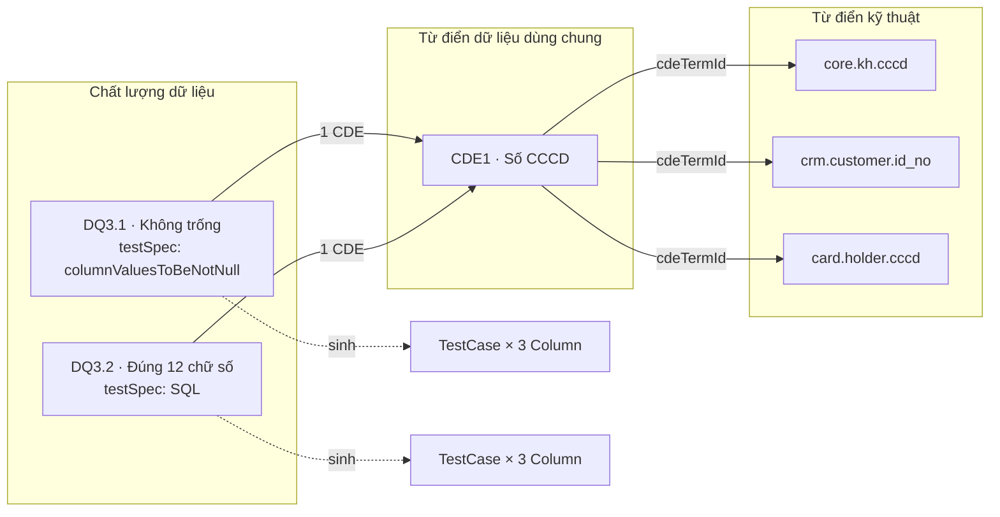

# Thiết kế Kiểm thử theo Quy tắc chất lượng dữ liệu (DQ Rule → Test Case)

> Trạng thái tài liệu: **Đề xuất** (2026-10-01). Chưa triển khai.
>
> Tài liệu này mở rộng [Thiết kế Chất lượng dữ liệu](./dq-glossary-ui-design.md) (DQ). Phần “Không tự động tạo
> `TestCase` từ DQ Rule; đây là integration phase riêng” ở §2.2 của tài liệu đó chính là phạm vi của tài liệu này.
> Liên kết CDE → Column dùng [Thiết kế Từ điển kỹ thuật](./technical-dictionary-design.md) (TD). Liên kết DQ Rule → CDE
> theo DQ §5.4. Baseline: [Kiến trúc tham chiếu OpenMetadata 1.13.3](./openmetadata-1.13.3-upstream-architecture-reference.md).

## 1. Yêu cầu và diễn giải

| # | Yêu cầu nghiệp vụ | Diễn giải kỹ thuật |
| --- | --- | --- |
| R1 | Glossary **Chất lượng dữ liệu** là nơi khai báo testcase | Mỗi DQ Rule mang một **Khai báo kiểm thử** (`testSpec`), là một phần nội dung của Rule nên có version, Draft và phê duyệt như các trường khác |
| R2 | Mỗi mã quy tắc liên kết 1 CDE; khai báo testcase một lần ở Rule và tự động áp dụng lên các Tài sản gắn với CDE đó | Hệ thống tự sinh một `TestCase` gốc của OpenMetadata cho mỗi cặp (Rule đã Approved, Column đang gắn CDE trong TD), và tự đồng bộ khi Rule, CDE hoặc TD thay đổi |
| R3 | Mỗi mã quy tắc có kết quả testcase của chính nó | Kết quả của Rule là kết quả gộp từ các `TestCase` do Rule đó sinh ra, đánh giá theo `Ngưỡng chất lượng dữ liệu` của Rule |
| R4 | CDE tổng hợp kết quả của mọi Rule liên kết, kèm danh sách testcase liên quan | Trang CDE có tab tổng hợp: kết quả từng Rule, phân theo Tiêu chí CLDL, và danh sách mọi `TestCase` do các Rule đó sinh ra |

“Tài sản gắn với CDE” là các **Column** có bản ghi TD với `cdeTermId` bằng CDE đó và `sourceStatus = Available`
(TD §4, §7.1). Đây cũng là nguồn của tab Tài sản của CDE (TD §11.5). Kiểm thử chỉ áp dụng ở mức Column.

## 2. Quyết định

| ID | Quyết định | Lý do |
| --- | --- | --- |
| DQT-01 | Thực thi và lưu kết quả bằng `TestDefinition`/`TestCase`/`TestSuite` và pipeline TestSuite **gốc** của OpenMetadata; không viết engine kiểm thử riêng | Tái sử dụng validator, connection, incident manager, lưu kết quả time-series và trang chi tiết testcase gốc |
| DQT-02 | Khai báo kiểm thử là một phần nội dung governed của DQ Rule: sửa ở Draft, có trong snapshot, `contentHash` và lịch sử phiên bản | Testcase có hiệu lực thực thi trên dữ liệu thật nên phải qua Maker–Checker như nội dung nghiệp vụ |
| DQT-03 | Mỗi DQ Rule có **tối đa một** khai báo kiểm thử ở v1. Rule chưa khai báo vẫn hợp lệ (quy tắc chỉ mô tả) | Mã quy tắc đã đủ chi tiết (vd. `DQ3.1`); 1 Rule ↔ 1 kiểm tra giúp kết quả Rule rõ nghĩa. Nâng lên nhiều khai báo sau mà không đổi model kết quả |
| DQT-04 | Chỉ Rule có snapshot **Approved** mới sinh testcase. Draft/In Review/Rejected không bao giờ chạy trên dữ liệu | Không chạy SQL chưa được duyệt |
| DQT-05 | Tập testcase là **trạng thái mong muốn** tính từ DB (Rule Approved × Column của CDE trong TD); một reconciler idempotent đưa OpenMetadata về đúng trạng thái đó | Nhiều nguồn sự kiện (Rule, CDE, TD, ingest, cutover); diff theo trạng thái an toàn hơn xử lý từng sự kiện |
| DQT-06 | Bảng `dq_rule_test_binding` là nguồn sự thật cho “testcase nào thuộc Rule nào”. Không dựa vào tag hay tên testcase | Đúng nguyên tắc DB-first của DQ §1.2; tag trên testcase là tag thừa kế từ Column, không ổn định |
| DQT-07 | Testcase do Rule sinh ra là **managed**: không sửa/xóa tay qua API hay UI gốc. Ghi nhận kết quả, incident và resolution vẫn bình thường | Tránh lệch giữa khai báo đã duyệt và cái đang chạy |
| DQT-08 | Loại kiểm tra (`TestDefinition`) **bất biến** trong một Rule identity. Version minor chỉ được đổi tham số, SQL và ngưỡng | Đổi loại kiểm tra là quy tắc khác; giữ được lịch sử kết quả liên tục trên cùng testcase |
| DQT-09 | Lịch chạy suy ra từ tag **Tần suất** của Rule; mỗi giá trị Tần suất có một logical TestSuite và một pipeline | Tổng số pipeline cố định (4), không phải một pipeline cho mỗi Rule |
| DQT-10 | Ngưỡng của Rule được đánh giá ở tầng governed, trên kết quả gốc của từng testcase | Validator gốc chỉ trả Success/Failed; ngưỡng `>= 99.5%` hoặc `count <= n` là quy tắc nghiệp vụ |
| DQT-11 | Kết quả không bị nhân bản: luôn đọc kết quả mới nhất và lịch sử từ time-series gốc theo `testCaseId` trong binding | Một nguồn sự thật cho kết quả |
| DQT-12 | Khi Rule, CDE hoặc Column không còn hiệu lực, testcase bị **soft-delete** (retire), không hard-delete | Soft-delete giữ kết quả lịch sử cho xem phiên bản đã lưu trữ; khôi phục lại được nếu cặp (Rule, Column) quay lại |

## 3. Mô hình khái niệm



Với ví dụ trên, hệ thống tạo 6 testcase. Kết quả của `DQ3.1` gộp từ 3 testcase của nó; trang CDE1 gộp cả 2 Rule
và liệt kê đủ 6 testcase.

| Mức | Thực thể | Kết quả |
| --- | --- | --- |
| Testcase | `TestCase` gốc trên một Column | Trạng thái kỹ thuật gốc (`Success`/`Failed`/`Aborted`/`Queued`) và **Kết quả theo ngưỡng** (§6.1) |
| Quy tắc | DQ Rule | Gộp kết quả theo ngưỡng của mọi testcase active (§6.2) |
| CDE | CDE | Gộp mọi Rule liên kết (§6.3) |

## 4. Khai báo kiểm thử trên DQ Rule

### 4.1. Hai loại khai báo

| Loại | Khi nào dùng | Tag **Hình thức kiểm tra** bắt buộc |
| --- | --- | --- |
| `LIBRARY` | Chọn một `TestDefinition` có sẵn mức Column (vd. `columnValuesToBeNotNull`, `columnValuesToMatchRegex`, `columnValuesToBeBetween`, `columnValuesToBeInSet`, `columnValuesToBeUnique`) và nhập tham số | `DataQualityMethod.DataProfiling` |
| `SQL` | Viết một câu SQL **đếm số bản ghi vi phạm**, dùng biến `{{ table_name }}`, `{{ column_name }}` để áp dụng chung cho mọi Column của CDE | `DataQualityMethod.TechnicalSqlRule` |

Loại `SQL` dùng validator rule-library có sẵn của ingestion (`ColumnRuleLibrarySqlExpressionValidator`): template
Jinja2 được render với tên bảng và tên cột lấy từ `entityLink` của từng testcase, và testcase **Success khi kết quả
bằng 0**. Vì vậy một câu SQL khai báo một lần chạy được trên mọi bảng gắn với CDE, đúng yêu cầu R2.

Ví dụ khai báo `SQL` cho `DQ3.2`:

```sql
SELECT COUNT(*) FROM {{ table_name }}
WHERE {{ column_name }} IS NOT NULL
  AND NOT REGEXP_LIKE({{ column_name }}, '^[0-9]{12}$')
```

Với loại `SQL`, hệ thống tạo một `TestDefinition` riêng cho Rule identity, tên `DQR__<parentBusinessVersion>__<mã quy tắc>`,
`entityType = COLUMN`, `testPlatforms = [OpenMetadata]`, `sqlExpression` = câu SQL đã duyệt. Definition này là
managed (DQT-07) và không xuất hiện trong danh sách chọn của loại `LIBRARY`.

### 4.2. Schema `testSpec`

Lưu trong payload governed của DQ Rule (working, snapshot và snapshot history) dưới khóa hệ thống
`extension.dqTestSpec`. Profile `DATA_QUALITY` khai báo đây là system key (DQ §5.5), validate bằng JSON schema riêng
`dqTestSpec.json`; Custom Properties chung không hiển thị khóa này.

```json
{
  "schemaVersion": 1,
  "kind": "LIBRARY",
  "testDefinitionFqn": "columnValuesToMatchRegex",
  "parameterValues": [{ "name": "regex", "value": "^[0-9]{12}$" }],
  "computePassedFailedRowCount": true
}
```

```json
{
  "schemaVersion": 1,
  "kind": "SQL",
  "sqlExpression": "SELECT COUNT(*) FROM {{ table_name }} WHERE {{ column_name }} IS NULL",
  "parameterValues": []
}
```

DTO create/patch của DQ Rule (DQ §6.1) thêm trường typed `testSpec` (cho phép `null` = chưa khai báo). Client không
tự dựng `extension`.

### 4.3. Validation

Kiểm tra khi Lưu Draft (lỗi cú pháp) và kiểm tra lại đầy đủ khi Submit/Approve:

- `kind` khớp tag Hình thức kiểm tra (§4.1). Lỗi `DQ_TEST_SPEC_METHOD_MISMATCH`.
- `LIBRARY`: `TestDefinition` tồn tại, `enabled`, `entityType = COLUMN`, không phải definition managed của Rule khác;
  `parameterValues` đủ tham số bắt buộc, đúng kiểu và đúng rule validate trong `parameterDefinition`.
- `SQL`: một câu lệnh duy nhất, chỉ `SELECT` (parse bằng SQL parser, từ chối DDL/DML, `;` thừa, comment chứa lệnh);
  có `{{ column_name }}` và `{{ table_name }}`; biến khác phải có trong `parameterValues`. Lỗi `DQ_TEST_SPEC_SQL_INVALID`.
- Ngưỡng (§6.1): ngưỡng phần trăm chỉ hợp lệ khi definition hỗ trợ đếm bản ghi đạt/không đạt
  (`supportsRowLevelPassedFailed`); với loại `SQL` chỉ nhận dạng `count = 0` hoặc `count <= n`. Lỗi
  `DQ_THRESHOLD_UNSUPPORTED`.
- Version minor không được đổi `kind` hoặc `testDefinitionFqn` so với version Approved trước (DQT-08). Lỗi
  `DQ_TEST_SPEC_DEFINITION_IMMUTABLE`.

Không kiểm tra kiểu dữ liệu của từng Column khi duyệt, vì tập Column của CDE thay đổi theo TD bất kỳ lúc nào. Column
có kiểu dữ liệu không thuộc `supportedDataTypes` của definition được đánh dấu **Không áp dụng** khi áp dụng (§5.4).

### 4.4. Version và phê duyệt

- `testSpec` đi cùng vòng đời của Rule: Draft sửa được, In Review/Approved/Archived chỉ đọc; snapshot giữ đúng
  `testSpec` tại thời điểm duyệt; luồng **Sửa phiên bản** (CDE §5.6) cũng ghi đè `testSpec` và lưu bản cũ vào lịch sử.
- Khi một version Approved mới thay version cũ, reconciler cập nhật tham số, SQL và lịch chạy của các testcase hiện có.
  Testcase giữ nguyên identity nên lịch sử kết quả liên tục; biểu đồ xu hướng đánh dấu mốc đổi version (§6.4).
- Hộp xác nhận Approve hiển thị số Column sẽ được áp dụng (preview §8), ví dụ: **“Phê duyệt sẽ áp dụng kiểm thử lên
  3 cột đang gắn CDE1 (1 cột không áp dụng do kiểu dữ liệu).”**

## 5. Áp dụng tự động lên Tài sản

### 5.1. Trạng thái mong muốn

Gọi `N` là `dataDictionaryVersion` đang gắn của TD (TD §4). Tập cặp cần có testcase:

```text
Desired = { (rule, column) |
    rule thuộc Data Quality scope N, có snapshot Approved hiệu lực, có testSpec
  ∧ column có technical_record.cdeTermId = cde(rule), sourceStatus = Available }
```

Rule thuộc scope khác `N`, Rule không còn snapshot Approved hiệu lực, và Column không còn gắn CDE đều nằm ngoài tập.

### 5.2. Testcase được sinh

| Thuộc tính | Giá trị |
| --- | --- |
| `entityLink` | `<#E::table::{tableFqn}::columns::{columnName}>` từ `technical_record.columnFqn` |
| `name` | `dqr__<mã quy tắc>`; FQN gốc là `{columnFqn}."dqr__<mã>"`. Mã quy tắc duy nhất trong scope (DQ §5.3) nên không trùng trên cùng Column |
| `displayName` | `<Mã quy tắc> · <Tên quy tắc>` |
| `description` | Quy tắc nghiệp vụ của Rule (markdown) |
| `testDefinition` | Definition của `LIBRARY` hoặc definition managed của `SQL` |
| `parameterValues`, `computePassedFailedRowCount` | Theo `testSpec` |
| Basic suite | Basic TestSuite của Table (OpenMetadata tạo nếu chưa có) |
| Logical suite | Suite thực thi theo Tần suất (§5.3) |
| Tag | Không gán. Testcase tự thừa kế tag Column, gồm tag CDE `Data Dictionary.<mã>@v<N>` do TD gắn (TD §6.4) |

Actor tạo/sửa là bot hệ thống `dq-governance-bot`, không phải người duyệt Rule.

### 5.3. Lịch chạy theo Tần suất

| Tag Tần suất | Logical TestSuite | Lịch mặc định (Asia/Ho_Chi_Minh) |
| --- | --- | --- |
| `DataQualityFrequency.Daily` | `DQR-Exec-Daily` | `0 2 * * *` |
| `DataQualityFrequency.Monthly` | `DQR-Exec-Monthly` | `0 2 1 * *` |
| `DataQualityFrequency.MonthlyOrQuarterly` | `DQR-Exec-Monthly` | `0 2 1 * *` |
| `DataQualityFrequency.Quarterly` | `DQR-Exec-Quarterly` | `0 2 1 1,4,7,10 *` |

- Bootstrap (idempotent) tạo các logical suite và pipeline TestSuite; Admin chỉnh giờ chạy trong trang pipeline gốc.
  Pipeline của logical suite gom testcase theo Table và dùng connection của từng service (`TestSuiteSource._process_logical_suite`).
- Đổi Tần suất ở version mới thì testcase được chuyển sang suite tương ứng.
- Vì testcase cũng nằm trong basic suite của Table, nếu Admin deploy pipeline cho riêng Table đó thì testcase chạy thêm
  một lần theo lịch của Table. Quy ước vận hành: không deploy pipeline Table cho các bảng có testcase managed (§11).

### 5.4. Binding và trạng thái

Mỗi cặp (Rule identity, Column) có tối đa một dòng `dq_rule_test_binding` (§7):

| Trạng thái | Ý nghĩa | Testcase gốc |
| --- | --- | --- |
| `ACTIVE` | Đang áp dụng | Tồn tại, chưa xóa |
| `NOT_APPLICABLE` | Kiểu dữ liệu Column không thuộc `supportedDataTypes` | Không tạo |
| `RETIRED` | Cặp không còn trong tập mong muốn | Soft-delete, giữ kết quả |
| `ERROR` | Reconciler không tạo/sửa được (`lastError`) | Tùy lỗi; worker thử lại |

Cặp quay lại tập mong muốn thì testcase đã soft-delete được **khôi phục** (restore), không tạo mới.

### 5.5. Sự kiện kích hoạt reconcile

| Sự kiện | Phạm vi reconcile |
| --- | --- |
| DQ Rule được Approve (version mới hoặc Sửa phiên bản) | Rule đó: tạo/sửa/retire theo `testSpec` và CDE mới |
| Version mới của Rule đổi CDE | Retire trên Column của CDE cũ, tạo trên Column của CDE mới |
| TD khai báo/sửa/xóa bản ghi, đổi CDE, `sourceStatus` đổi (TD §6.2, §8) | Column đó, với mọi Rule của CDE cũ và mới |
| Import TD commit | Các Column bị ảnh hưởng, theo lô |
| Ingest đổi kiểu dữ liệu Column | Column đó (có thể chuyển `ACTIVE` ↔ `NOT_APPLICABLE`) |
| Cutover Data Dictionary `N → N+1` (TD §9) | Retire **toàn bộ** binding scope `N` |
| Cutover Data Quality `N → N+1` | Retire toàn bộ binding của Rule scope `N` |
| Admin gọi reconcile toàn bộ | Toàn bộ tập mong muốn |

Cơ chế giống outbox của TD (TD §6.1): sự kiện `RECONCILE_RULE` / `RECONCILE_COLUMN` / `RETIRE_SCOPE` ghi vào
`dq_test_outbox` **trong cùng transaction** với thay đổi nghiệp vụ; xử lý ngay sau commit, lỗi thì worker thử lại.
Lỗi reconcile không rollback phê duyệt Rule hay lưu TD. Reconcile một Rule lấy khóa `FOR UPDATE` trên dòng
`dq_rule_exec` của Rule đó để hai lần reconcile không tạo trùng.

### 5.6. Khóa testcase managed

`TestCaseRepository` (và `TestDefinitionRepository` với definition managed) từ chối PUT/PATCH/DELETE từ actor khác
`dq-governance-bot` nếu `testCaseId` có trong binding: `409 DQ_MANAGED_TEST_CASE`, message “Testcase này được quản lý
bởi quy tắc {mã}. Hãy sửa khai báo kiểm thử trong Chất lượng dữ liệu.” Các thao tác sau vẫn cho phép: ghi kết quả
(`testCaseResults`), incident/resolution status, follow. Trang testcase gốc hiển thị badge **Quản lý bởi quy tắc {mã}**
link sang Rule và ẩn nút Sửa/Xóa.

## 6. Kết quả

### 6.1. Mức testcase — Kết quả theo ngưỡng

Kết quả mới nhất lấy từ time-series gốc. **Kết quả theo ngưỡng** tính như sau:

| Ngưỡng của Rule | Số liệu dùng | Đạt khi |
| --- | --- | --- |
| Trống | Trạng thái gốc | `Success` |
| `count = 0`, `count <= n` | Số bản ghi vi phạm: `failedRows`, hoặc giá trị `Row Count` của validator `SQL` | Thỏa biểu thức |
| `>= x%`, `> x%`, `= x%`, … | `passedRowsPercentage` (cần `computePassedFailedRowCount`) | Thỏa biểu thức |

Trạng thái gốc `Aborted` → **Lỗi thực thi**; chưa có kết quả → **Chưa có kết quả**. Trạng thái gốc vẫn hiển thị cạnh
kết quả theo ngưỡng để đối chiếu với incident manager gốc (có thể gốc báo `Failed` nhưng đạt ngưỡng `>= 99.5%`).

Kết quả **Quá hạn** là badge, không phải trạng thái: kết quả mới nhất cũ hơn 1,5 lần chu kỳ Tần suất.

### 6.2. Mức Quy tắc

Trên các binding `ACTIVE`, theo thứ tự ưu tiên:

1. **Không đạt** nếu có ít nhất một testcase Không đạt.
2. **Lỗi thực thi** nếu có ít nhất một testcase Lỗi thực thi.
3. **Chưa có kết quả** nếu có testcase chưa có kết quả, hoặc không có binding `ACTIVE` nào.
4. **Đạt** khi mọi testcase Đạt.

Rule chưa khai báo kiểm thử hiển thị **Chưa khai báo kiểm thử**. Số liệu kèm theo: số cột áp dụng / không áp dụng,
số testcase theo từng kết quả, tỷ lệ testcase đạt, thời điểm chạy gần nhất.

### 6.3. Mức CDE

- Thẻ tổng: số Rule liên kết, số Rule có khai báo kiểm thử, số Rule theo kết quả (§6.2), tổng testcase và tỷ lệ đạt.
- Phân theo **Tiêu chí chất lượng dữ liệu** (tag `DataQualityDimension` của Rule): tỷ lệ Rule đạt cho từng tiêu chí.
- Bảng Rule: một dòng cho mỗi Rule liên kết.
- Bảng testcase: mọi testcase `ACTIVE` của các Rule đó.

Danh sách Rule liên kết lấy từ relation DQ → CDE (DQ §5.4, reverse discovery), giống nhau ở mọi version của CDE trong
scope. Consumer chỉ thấy Rule Approved.

### 6.4. Xu hướng

Biểu đồ tỷ lệ đạt theo ngày trong 30/90 ngày, cho Rule và cho CDE, tính lúc đọc từ time-series theo danh sách
`testCaseId` trong binding (kể cả `RETIRED` trong khoảng thời gian còn active). Mốc phê duyệt version Rule (`publishedAt`
của snapshot) vẽ thành đường dọc. Nếu đo thấy chậm thì thêm bảng rollup theo ngày; v1 chưa làm.

## 7. Lưu trữ

Migration `1.13.3` (MySQL và PostgreSQL), cùng thư mục với bảng TD.

`dq_rule_exec`: một dòng cho mỗi Rule identity đã từng được áp dụng.

| Cột | Ghi chú |
| --- | --- |
| `ruleTermId` PK | |
| `parentBusinessVersion`, `ruleCode` | |
| `appliedBusinessVersion`, `appliedSpecHash` | Version và hash `testSpec` reconciler đã áp dụng lần cuối |
| `cdeTermId` | CDE tại lần áp dụng cuối |
| `managedTestDefinitionId` | Chỉ với loại `SQL` |
| `executionSuite` | `DQR-Exec-*` hiện tại |
| `revision`, `updatedAt` | |

`dq_rule_test_binding`: một dòng cho mỗi cặp (Rule identity, Column).

| Cột | Ghi chú |
| --- | --- |
| `id` PK | |
| `ruleTermId`, `columnKey` | UNIQUE. `columnKey` theo TD §3.1 |
| `columnFqn`, `cdeTermId` | Tại lần áp dụng cuối |
| `testCaseId`, `testCaseFqn` | `null` khi `NOT_APPLICABLE` |
| `state` | §5.4 |
| `stateReason`, `lastError`, `attempts` | |
| `activatedAt`, `retiredAt` | Dùng cho xu hướng §6.4 |
| `createdAt`, `updatedAt` | |

Index phụ: `(cdeTermId, state)` cho trang CDE, `(testCaseId)` cho khóa managed §5.6.

`dq_test_outbox`: `kind` (`RECONCILE_RULE`, `RECONCILE_COLUMN`, `RETIRE_SCOPE`, `RECONCILE_ALL`), `key`, `attempts`,
`lastError`, `enqueuedAt`.

Không có bảng kết quả riêng (DQT-11).

## 8. REST

| Mục đích | Endpoint |
| --- | --- |
| Danh sách `TestDefinition` chọn được cho `LIBRARY` | `GET /v1/glossaryTerms/governed/dataQuality/testDefinitions` |
| Preview áp dụng (Column của CDE, áp dụng được hay không) | `POST /v1/glossaryTerms/{ruleId}/dataQuality/preview` với `testSpec` và `cdeTermId` đang nhập |
| Kết quả Rule (tổng hợp + testcase, phân trang) | `GET /v1/glossaryTerms/{ruleId}/dataQuality/results` |
| Xu hướng Rule | `GET /v1/glossaryTerms/{ruleId}/dataQuality/trend?days=30` |
| Kết quả CDE (tổng hợp, theo tiêu chí, Rule, testcase) | `GET /v1/glossaryTerms/{cdeId}/dataQuality/results` |
| Xu hướng CDE | `GET /v1/glossaryTerms/{cdeId}/dataQuality/trend?days=30` |
| Reconcile toàn bộ (Admin) | `POST /v1/glossaryTerms/governed/dataQuality/reconcile` |
| Tình trạng reconcile (Admin) | `GET /v1/glossaryTerms/governed/dataQuality/reconcile/status` (outbox lag, binding `ERROR`) |

Ví dụ response kết quả Rule:

```json
{
  "rule": { "id": "uuid", "code": "DQ3.1", "threshold": ">= 99.5%", "frequency": "DataQualityFrequency.Daily" },
  "status": "FAILED",
  "summary": { "applied": 3, "notApplicable": 1, "passed": 2, "failed": 1, "aborted": 0, "noResult": 0, "lastRunAt": 1790000000000 },
  "testCases": [
    {
      "testCaseId": "uuid", "testCaseFqn": "core.kh.cccd.\"dqr__DQ3.1\"",
      "column": { "fqn": "core.kh.cccd", "table": "kh", "service": "core" },
      "nativeStatus": "Failed", "thresholdResult": "PASSED",
      "passedRowsPercentage": 99.8, "failedRows": 120, "timestamp": 1790000000000, "stale": false,
      "canViewDetail": true
    }
  ],
  "paging": { "offset": 0, "limit": 25, "total": 4 }
}
```

Mã lỗi mới: `DQ_TEST_SPEC_METHOD_MISMATCH`, `DQ_TEST_SPEC_SQL_INVALID`, `DQ_TEST_SPEC_PARAM_INVALID`,
`DQ_TEST_SPEC_DEFINITION_IMMUTABLE`, `DQ_THRESHOLD_UNSUPPORTED`, `DQ_MANAGED_TEST_CASE`.

## 9. Giao diện

### 9.1. DQ Rule — form và Overview

- Form thêm/sửa (DQ §8.4) thêm section thứ năm **Khai báo kiểm thử**, sau **Phân loại và kiểm soát**:
  - Loại kiểm tra: tự chọn theo **Hình thức kiểm tra** (Kỹ thuật SQL → `SQL`, Data Profiling → `LIBRARY`); không chọn
    Hình thức kiểm tra thì section bị khóa với gợi ý chọn trước.
  - `LIBRARY`: select `TestDefinition` (tên hiển thị + mô tả), rồi form tham số render từ `parameterDefinition`, dùng lại
    component tham số của form testcase gốc (`TestCaseFormV1`).
  - `SQL`: editor SQL (component SQL editor gốc), ghi chú biến `{{ table_name }}`, `{{ column_name }}`, và nhắc “Câu SQL
    phải trả về số bản ghi vi phạm; bằng 0 là đạt.”
  - Khối **Áp dụng cho**: gọi preview §8, liệt kê Column của CDE đang chọn, đánh dấu cột không áp dụng và lý do.
  - Nút **Bỏ khai báo kiểm thử** đặt `testSpec = null`.
- Overview (DQ §8.5) thêm card **Khai báo kiểm thử**, chỉ đọc, hiển thị theo version đang xem. Card không tính vào
  19 trường nghiệp vụ; bảng danh sách, Import và Export DQ giữ nguyên 19 trường ở v1.

### 9.2. DQ Rule — tab Kết quả kiểm thử

Thay nội dung tab `data_observability` (đã bật lại cho CDE/DQ trong `GlossaryTermsV1`) bằng view governed; giữ key tab
để URL không đổi, đổi nhãn thành **Kết quả kiểm thử**.

```text
┌──────────────────────────────────────────────────────────────────────────────┐
│ [Không đạt]  Ngưỡng ≥ 99,5%  ·  Hàng Ngày  ·  Chạy gần nhất 01/10/2026 02:05   │
│ ┌─────────┐ ┌─────────┐ ┌─────────┐ ┌─────────┐ ┌──────────────┐               │
│ │ 3 cột   │ │ 2 Đạt   │ │1 K.đạt  │ │ 0 Lỗi   │ │1 Không áp dụng│               │
│ └─────────┘ └─────────┘ └─────────┘ └─────────┘ └──────────────┘               │
│ Xu hướng 30 ngày  ▁▂▂▃▅▆▆▇▇▆▅  │ v1.1 duyệt 15/09                               │
├──────────────────────────────────────────────────────────────────────────────┤
│ Cột             │ Bảng     │ Kết quả  │ Gốc     │ Tỷ lệ đạt │ Vi phạm │ Lúc   │
│ cccd            │ core.kh  │ Đạt      │ Failed  │ 99,8%     │ 120     │ 02:05 │
│ id_no           │ crm.cust │ Không đạt│ Failed  │ 97,1%     │ 4.211   │ 02:05 │
└──────────────────────────────────────────────────────────────────────────────┘
```

- Click dòng mở trang testcase gốc (lịch sử, failed rows sample, incident).
- Tab hiển thị ở chế độ xem bản hiện hành và cả khi xem version (kết quả thuộc identity, không thuộc version). Rule của
  scope đã lưu trữ hiển thị banner **“Quy tắc đã ngừng áp dụng từ {retiredAt}. Kết quả chỉ để tra cứu.”**
- Rule chưa Approved: empty state **“Kiểm thử sẽ được áp dụng sau khi quy tắc được phê duyệt.”**

### 9.3. CDE — tab Chất lượng dữ liệu

Cũng thay nội dung tab `data_observability` của CDE, nhãn **Chất lượng dữ liệu**:

1. Thẻ tổng §6.3 và biểu đồ xu hướng.
2. Thanh **Theo tiêu chí**: mỗi Tiêu chí CLDL một chip có tỷ lệ Rule đạt.
3. Bảng **Quy tắc**: Mã quy tắc, Tên quy tắc, Tiêu chí, Ngưỡng, Tần suất, Số cột, Đạt/Không đạt, Kết quả, Chạy gần nhất.
   Click mở tab Kết quả kiểm thử của Rule.
4. Bảng **Testcase**: Mã quy tắc, Cột, Bảng, Kết quả, Gốc, Tỷ lệ đạt, Vi phạm, Lúc. Lọc theo Rule và Kết quả.

Tab **Quy tắc chất lượng dữ liệu** hiện có của CDE (CDE §7.1 mục 3) được gộp vào bảng Quy tắc ở trên.

### 9.4. Danh sách DQ

Không thêm cột vào 19 trường. Bổ sung bộ lọc ngoài schema **Kiểm thử**: Chưa khai báo / Đạt / Không đạt / Lỗi thực thi
/ Chưa có kết quả, tính từ §6.2. Đây là bộ lọc vận hành, không xuất Excel.

## 10. Phân quyền

| Thao tác | Điều kiện |
| --- | --- |
| Khai báo, sửa `testSpec` | Như sửa Draft DQ Rule (`canEdit`, DQ §7.3) |
| Phê duyệt (làm testcase có hiệu lực) | Như Approve DQ Rule |
| Xem card Khai báo kiểm thử | Như xem version Rule đó |
| Xem số liệu tổng hợp Rule/CDE | Như xem Rule/CDE Approved |
| Xem dòng testcase chi tiết | Thêm quyền `ViewTests`/`ViewAll` của OpenMetadata trên Table của Column. Dòng không có quyền bị ẩn, thẻ tổng ghi “{n} testcase bạn không có quyền xem” |
| Reconcile, xem tình trạng reconcile | Admin |

Người phê duyệt Rule không cần quyền `EditTests` trên từng Table; bot hệ thống tạo testcase. Vì vậy phê duyệt Rule loại
`SQL` là kiểm soát chính đối với câu SQL chạy trên dữ liệu thật (§11).

## 11. Rủi ro và vận hành

| Rủi ro | Biện pháp |
| --- | --- |
| SQL do người dùng viết chạy trên CSDL nghiệp vụ | Chỉ `SELECT` (§4.3), bắt buộc qua phê duyệt; connection của pipeline TestSuite dùng tài khoản chỉ đọc; timeout truy vấn theo cấu hình ingestion |
| SQL khác phương ngữ giữa các nguồn (Oracle, DB2, PostgreSQL…) | Preview liệt kê service của từng Column; ưu tiên `LIBRARY` khi có definition tương đương. Một Rule dùng một câu SQL; CDE trải nhiều phương ngữ thì tách Rule hoặc dùng `LIBRARY` |
| Testcase chạy hai lần (pipeline Table và pipeline Tần suất) | Quy ước vận hành §5.3; trang reconcile status liệt kê Table có pipeline basic suite chứa testcase managed |
| Số testcase lớn (Rule × Column) | Reconcile theo lô, outbox có retry; kết quả CDE phân trang |
| Cutover DD làm retire toàn bộ testcase | Đúng thiết kế: TD làm mới về trống (TD §9). Hộp xác nhận phê duyệt DD (TD §9.4) bổ sung “{n} testcase của {m} quy tắc sẽ ngừng chạy” |
| Testcase gốc bị xóa hẳn ngoài luồng | Reconciler phát hiện thiếu và tạo lại; kết quả cũ mất, ghi audit |

**Cần xác minh trước khi triển khai:**

1. Testcase index (`TestCaseIndex`) có chứa tag thừa kế từ Column không. Nếu có, testcase managed cũng xuất hiện trong
   Data Quality dashboard gốc khi lọc theo glossary term của CDE.
2. Pipeline của logical suite với testcase thuộc nhiều service: `_process_logical_suite` dùng `itertools.groupby` trên
   danh sách chưa sắp xếp theo Table, nên một Table có thể bị tách thành nhiều lô. Kết quả đúng nhưng chạy chậm hơn.
3. Định nghĩa `TestDefinition` managed loại `SQL` được ingestion chọn đúng `ColumnRuleLibrarySqlExpressionValidator`
   (cơ chế chọn validator theo `sqlExpression`/`validatorClass`).
4. Lưu `extension.dqTestSpec` dạng object qua cơ chế validate extension hiện có. Nếu validate Custom Property không cho
   kiểu object, lưu `testSpec` ở trường riêng trong payload governed do profile DQ quản lý.

## 12. Câu hỏi mở cho nghiệp vụ

| # | Câu hỏi | Đề xuất mặc định |
| --- | --- | --- |
| Q1 | Ngưỡng `>= x%` đánh giá theo **từng cột** hay theo **tổng bản ghi của mọi cột** của CDE? | Từng cột (§6.1); Rule đạt khi mọi cột đạt |
| Q2 | Có cần nhiều khai báo kiểm thử trong một Rule không? | Không ở v1 (DQT-03) |
| Q3 | Import/Export DQ có cần cột khai báo kiểm thử không? | Không ở v1; khai báo trên UI |
| Q4 | Có cần nút **Chạy ngay** cho một Rule? | Không ở v1; pipeline theo Tần suất chạy toàn bộ suite, chưa chạy được riêng một Rule |
| Q5 | Testcase do người dùng tự tạo trên cùng Column có tính vào kết quả CDE không? | Không; tab CDE chỉ gộp testcase do Rule sinh ra để kết quả khớp danh mục quy tắc đã duyệt |

## 13. Kế hoạch triển khai

| Mốc | Nội dung | Phụ thuộc |
| --- | --- | --- |
| T0 | Xác minh 4 mục §11; chốt Q1–Q5 | |
| T1 | Schema `dqTestSpec.json`, DTO `testSpec`, validation §4.3, form và card Overview §9.1 | DQ07–DQ09 workflow DQ dùng chung đã ổn định |
| T2 | Bảng §7, reconciler, outbox, bootstrap suite và pipeline §5.3, sinh testcase khi Approve Rule | T1 |
| T3 | Kích hoạt từ TD và cutover (§5.5), khóa managed §5.6 | T2; điểm kích hoạt của TD |
| T4 | API kết quả §8, tab Kết quả kiểm thử của Rule, tab Chất lượng dữ liệu của CDE, bộ lọc §9.4 | T2 |
| T5 | Xu hướng §6.4, reconcile status, cảnh báo cutover DD | T4 |

## 14. Tiêu chí chấp nhận

- Rule Approved có `testSpec` sinh đúng một testcase `ACTIVE` trên mỗi Column `Available` của CDE trong TD; Column không
  hợp kiểu được đánh dấu Không áp dụng; Draft/In Review/Rejected không sinh testcase.
- Gán, đổi, bỏ CDE trên TD, đổi CDE của Rule, approve version mới và cutover DD/DQ đều đưa tập testcase về đúng §5.1
  mà không tạo trùng, kể cả khi chạy lại reconcile nhiều lần.
- Version minor đổi tham số hoặc SQL thì cập nhật testcase hiện có, giữ lịch sử kết quả; đổi loại kiểm tra bị từ chối.
- Testcase managed không sửa/xóa được qua API/UI gốc; ghi kết quả và incident vẫn hoạt động.
- Kết quả Rule và CDE khớp với kết quả gốc của từng testcase và ngưỡng §6.1–6.3; dòng testcase tôn trọng quyền xem Table.
- SQL không phải `SELECT` đơn bị từ chối ở Lưu và ở Approve.
- Kết quả của Rule/CDE đã lưu trữ vẫn tra cứu được sau cutover.

## 15. Ảnh hưởng tới tài liệu và mã nguồn khác

| Nơi | Thay đổi |
| --- | --- |
| DQ design §2.2 | Bỏ “Không tự động tạo `TestCase`…”, “Không thực thi SQL…” khỏi ngoài phạm vi; trỏ sang tài liệu này |
| DQ design §6.1, §8.4, §8.5 | DTO có `testSpec`; form thêm section Khai báo kiểm thử; Overview thêm card |
| CDE design §7.1 mục 3 | Tab Quy tắc chất lượng dữ liệu gộp vào tab Chất lượng dữ liệu §9.3 |
| TD design §6.2, §9.4 | Thêm kích hoạt reconcile; thêm số testcase bị ngừng vào hộp xác nhận cutover |
| `GovernedGlossaryProfileRegistry` | System key `dqTestSpec` cho profile `DATA_QUALITY` |
| `GlossaryVersioningService`, `TechnicalRecordService`, `TechnicalCutover` | Ghi `dq_test_outbox` trong transaction |
| `TestCaseRepository`, `TestDefinitionRepository` | Khóa managed §5.6 |
| UI `GlossaryTermsV1`, `DQGlossaryTermForm`, `DQGlossaryTermOverview`, `CDEGlossaryTermOverview` | §9 |
