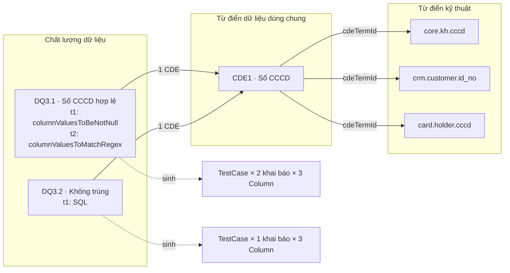

# Thiết kế Kiểm thử theo Quy tắc chất lượng dữ liệu (DQ Rule → Test Case)

> Trạng thái tài liệu: **Đang triển khai** (2026-10-01; 2026-10-03: một Rule có nhiều khai báo kiểm thử, kết quả xác
> minh T0 ở §11; **2026-10-05: lịch chạy và pipeline theo từng khai báo kiểm thử, giao diện tab Kiểm thử mới**, §5.3, §9).
> Chạy thử trên DEV chưa hoàn tất; xem §13.
>
> Tài liệu này mở rộng [Thiết kế Chất lượng dữ liệu](./dq-glossary-ui-design.md) (DQ). Phần “Không tự động tạo
> `TestCase` từ DQ Rule; đây là integration phase riêng” ở §2.2 của tài liệu đó chính là phạm vi của tài liệu này.
> Liên kết CDE → Column dùng [Thiết kế Từ điển kỹ thuật](./technical-dictionary-design.md) (TD). Liên kết DQ Rule → CDE
> theo DQ §5.4. Baseline: [Kiến trúc tham chiếu OpenMetadata 1.13.3](./openmetadata-1.13.3-upstream-architecture-reference.md).
>
> Thứ tự triển khai, file cần sửa, kiểm thử và tiêu chí nghiệm thu nằm ở
> [Kế hoạch triển khai Kiểm thử theo Quy tắc CLDL](./dq-rule-test-execution-implementation-plan.md).

## 1. Yêu cầu và diễn giải

| # | Yêu cầu nghiệp vụ | Diễn giải kỹ thuật |
| --- | --- | --- |
| R1 | Glossary **Chất lượng dữ liệu** là nơi khai báo testcase | Mỗi DQ Rule mang một danh sách **Khai báo kiểm thử** (`testSpecs`), không giới hạn số lượng. Danh sách là một phần nội dung của Rule nên có version, Draft và phê duyệt như các trường khác |
| R2 | Mỗi mã quy tắc liên kết 1 CDE; khai báo testcase một lần ở Rule và tự động áp dụng lên các Tài sản gắn với CDE đó | Hệ thống tự sinh một `TestCase` gốc của OpenMetadata cho mỗi bộ (Rule đã Approved, khai báo kiểm thử, Column đang gắn CDE trong TD), và tự đồng bộ khi Rule, CDE hoặc TD thay đổi |
| R3 | Mỗi mã quy tắc có kết quả testcase của chính nó | Kết quả của Rule là kết quả gộp từ mọi `TestCase` do Rule đó sinh ra, qua mọi khai báo, đánh giá theo ngưỡng của từng khai báo |
| R4 | CDE tổng hợp kết quả của mọi Rule liên kết, kèm danh sách testcase liên quan | Trang CDE có tab tổng hợp: kết quả từng Rule, phân theo Tiêu chí CLDL, và danh sách mọi `TestCase` do các Rule đó sinh ra |

“Tài sản gắn với CDE” là các **Column** có bản ghi TD với `cdeTermId` bằng CDE đó và `sourceStatus = Available`
(TD §4, §7.1). Đây cũng là nguồn của tab Tài sản của CDE (TD §11.5). Kiểm thử chỉ áp dụng ở mức Column.

## 2. Quyết định

| ID | Quyết định | Lý do |
| --- | --- | --- |
| DQT-01 | Thực thi và lưu kết quả bằng `TestDefinition`/`TestCase`/`TestSuite` và pipeline TestSuite **gốc** của OpenMetadata; không viết engine kiểm thử riêng | Tái sử dụng validator, connection, incident manager, lưu kết quả time-series và trang chi tiết testcase gốc |
| DQT-02 | Khai báo kiểm thử là một phần nội dung governed của DQ Rule: sửa ở Draft, có trong snapshot, `contentHash` và lịch sử phiên bản | Testcase có hiệu lực thực thi trên dữ liệu thật nên phải qua Maker–Checker như nội dung nghiệp vụ |
| DQT-03 | Mỗi DQ Rule có **không giới hạn** số khai báo kiểm thử, ở mọi version (`N.0` hay `N.MINOR`). Mỗi khai báo có `key` do hệ thống cấp, ổn định trong Rule identity và không tái sử dụng. Rule không có khai báo nào vẫn hợp lệ (quy tắc chỉ mô tả) | Một quy tắc nghiệp vụ thường cần nhiều kiểm tra kỹ thuật (vd. không trống và đúng định dạng); người dùng khai báo theo nhu cầu, không phải tách mã quy tắc. `key` giữ lịch sử kết quả của từng kiểm tra qua các version |
| DQT-04 | Chỉ Rule có snapshot **Approved** mới sinh testcase. Draft/In Review/Rejected không bao giờ chạy trên dữ liệu | Không chạy SQL chưa được duyệt |
| DQT-05 | Tập testcase là **trạng thái mong muốn** tính từ DB (Rule Approved × khai báo × Column của CDE trong TD); một reconciler idempotent đưa OpenMetadata về đúng trạng thái đó | Nhiều nguồn sự kiện (Rule, CDE, TD, ingest, cutover); diff theo trạng thái an toàn hơn xử lý từng sự kiện |
| DQT-06 | Bảng `dq_rule_test_binding` là nguồn sự thật cho “testcase nào thuộc khai báo nào của Rule nào”. Không dựa vào tag hay tên testcase | Đúng nguyên tắc DB-first của DQ §1.2; tag trên testcase là tag thừa kế từ Column, không ổn định |
| DQT-07 | Testcase do Rule sinh ra là **managed**: không sửa/xóa tay qua API hay UI gốc. Ghi nhận kết quả, incident và resolution vẫn bình thường | Tránh lệch giữa khai báo đã duyệt và cái đang chạy |
| DQT-08 | Loại kiểm tra (`kind`, `TestDefinition`) của một khai báo **bất biến** theo `key` trong Rule identity. Version sau được thêm, xóa khai báo và đổi tên, tham số, SQL, ngưỡng của khai báo hiện có; muốn đổi loại thì xóa khai báo cũ và thêm khai báo mới | Đổi loại kiểm tra là kiểm tra khác; giữ được lịch sử kết quả liên tục trên cùng testcase |
| DQT-09 | Mỗi Rule có **một logical TestSuite** chứa mọi testcase của Rule, và **mỗi khai báo kiểm thử có pipeline TestSuite riêng** (`DQR_pipeline_<key>`) chỉ chạy các testcase của khai báo đó. **Lịch chạy thuộc từng khai báo** (`scheduleCron`, `scheduleTimezone`), không suy ra từ tag Tần suất; khai báo không đặt lịch chỉ chạy khi bấm **Chạy ngay** (chạy mọi pipeline của Rule). Số pipeline bằng số khai báo đang có testcase `ACTIVE`, không cố định (thay quyết định 2026-10-03 "một pipeline cho cả Rule") | Các kiểm tra khác nhau trong một Rule thường cần nhịp chạy khác nhau (vd. hằng ngày và hằng tuần). Pipeline TestSuite gốc hỗ trợ giới hạn `testCases` theo tên, nên không cần suite riêng cho từng khai báo; kết quả, xu hướng và khóa managed vẫn đọc theo một suite của Rule. Tag Tần suất là trường mô tả nghiệp vụ, không ràng buộc lịch kỹ thuật |
| DQT-10 | Ngưỡng được đánh giá ở tầng governed, trên kết quả gốc của từng testcase. Mỗi khai báo có thể đặt ngưỡng riêng; để trống thì dùng `Ngưỡng chất lượng dữ liệu` của Rule | Validator gốc chỉ trả Success/Failed; ngưỡng `>= 99.5%` hoặc `count <= n` là quy tắc nghiệp vụ. Các kiểm tra khác loại trong một Rule thường cần ngưỡng khác nhau |
| DQT-11 | Kết quả không bị nhân bản: luôn đọc kết quả mới nhất và lịch sử từ time-series gốc theo `testCaseId` trong binding | Một nguồn sự thật cho kết quả |
| DQT-12 | Khi Rule, khai báo, CDE hoặc Column không còn hiệu lực, testcase bị **soft-delete** (retire), không hard-delete | Soft-delete giữ kết quả lịch sử cho xem phiên bản đã lưu trữ; khôi phục lại được nếu bộ (Rule, khai báo, Column) quay lại |
| DQT-13 | Khai báo `SQL` chạy bằng validator rule-library **gốc** `ColumnRuleLibrarySqlExpressionValidator`; không viết validator riêng ở ingestion (quyết định 2026-10-04). Câu SQL trả về các bản ghi vi phạm; ngưỡng chỉ dạng `count` | Không sửa tầng ingestion, Airflow dùng image gốc. Chấp nhận giới hạn của validator gốc (§11): không chạy trên Oracle/DB2, kéo toàn bộ bản ghi vi phạm về Airflow để đếm, không tính tỷ lệ đạt. Xem lại khi cần nguồn Oracle/DB2 |
| DQT-14 | `testSpecs` lưu ở trường tùy chọn mới **`dataQualityTestSpecs`** trong schema entity `GlossaryTerm`, không lưu trong `extension` và không dùng bảng riêng. Chỉ DQ Rule được có giá trị; mọi glossary khác luôn `null` | Payload governed (working, snapshot) là JSON của nguyên `GlossaryTerm`, schema `additionalProperties: false`, nên trường phải nằm trong schema mới đi cùng payload. Khi đó trường tự vào snapshot, `contentHash` và lịch sử phiên bản (DQT-02). `extension` không nhận object tùy ý; bảng riêng phải tự làm lại version và hash (§11, T0 mục 4). API gốc PUT/PATCH glossary term đã bị chặn, nên trường chỉ ghi được qua luồng working version |

## 3. Mô hình khái niệm



Với ví dụ trên, hệ thống tạo 9 testcase. Kết quả của `DQ3.1` gộp từ 6 testcase của nó (2 khai báo × 3 cột); trang
CDE1 gộp cả 2 Rule và liệt kê đủ 9 testcase.

| Mức | Thực thể | Kết quả |
| --- | --- | --- |
| Testcase | `TestCase` gốc trên một Column, thuộc một khai báo | Trạng thái kỹ thuật gốc (`Success`/`Failed`/`Aborted`/`Queued`) và **Kết quả theo ngưỡng** (§6.1) |
| Khai báo | Một phần tử của `testSpecs` | Gộp kết quả theo ngưỡng của mọi testcase active của khai báo (§6.2) |
| Quy tắc | DQ Rule | Gộp kết quả theo ngưỡng của mọi testcase active, qua mọi khai báo (§6.2) |
| CDE | CDE | Gộp mọi Rule liên kết (§6.3) |

## 4. Khai báo kiểm thử trên DQ Rule

### 4.1. Hai loại khai báo

| Loại | Khi nào dùng |
| --- | --- |
| `LIBRARY` | Chọn một `TestDefinition` có sẵn mức Column (vd. `columnValuesToBeNotNull`, `columnValuesToMatchRegex`, `columnValuesToBeBetween`, `columnValuesToBeInSet`, `columnValuesToBeUnique`) và nhập tham số |
| `SQL` | Viết một câu SQL **trả về các bản ghi vi phạm**, dùng biến `{{ table_name }}`, `{{ column_name }}` để áp dụng chung cho mọi Column của CDE |

Mỗi khai báo tự chọn loại; một Rule được **trộn** khai báo `LIBRARY` và `SQL`, không giới hạn số lượng mỗi loại. Tag
**Hình thức kiểm tra** (đơn trị, DQ §5) giữ nguyên là trường mô tả nghiệp vụ trong 19 trường, không ràng buộc loại của
khai báo, tương tự tag Tần suất với lịch chạy (DQT-09).

Loại `SQL` chạy bằng validator rule-library gốc `ColumnRuleLibrarySqlExpressionValidator` (DQT-13): template Jinja2
được render với `{{ table_name }}`, `{{ column_name }}` lấy từ `entityLink` của từng testcase và các tham số trong
`parameterValues`; câu SQL được kiểm tra `is_safe_sql_query`, chạy, rồi **số dòng trả về** là số vi phạm; testcase
`Success` khi bằng 0. Giá trị đếm ghi vào `testResultValue` (`Row Count`).

Vì vậy một câu SQL khai báo một lần chạy được trên mọi bảng gắn với CDE, đúng yêu cầu R2. Câu SQL phải **trả về các bản
ghi vi phạm, không tự `COUNT`** (câu `SELECT COUNT(*)` luôn trả 1 dòng nên luôn Failed). Ví dụ:

```sql
SELECT {{ column_name }} FROM {{ table_name }}
WHERE {{ column_name }} IS NOT NULL
  AND NOT REGEXP_LIKE({{ column_name }}, '^[0-9]{12}$')
```

Giới hạn của validator gốc:

| Giới hạn | Hệ quả |
| --- | --- |
| `{{ table_name }}` là `database.schema.table`, trừ MySQL, MariaDB, SQLite, CockroachDB (`schema.table`) | Không chạy trên **Oracle/DB2** (tên `default.SCHEMA.TABLE` sai cú pháp); testcase ra Lỗi thực thi |
| Đếm bằng cách đọc hết các dòng trả về | Nhiều bản ghi vi phạm thì chậm và tốn bộ nhớ trên Airflow; nên chỉ select cột khóa |
| Không tính tổng bản ghi | Khai báo `SQL` chỉ dùng ngưỡng `count = 0` / `count <= n`, không dùng ngưỡng phần trăm |

Với mỗi khai báo loại `SQL`, hệ thống tạo một `TestDefinition` riêng cho cặp (Rule identity, `key`), tên
`DQR__<parentBusinessVersion>__<mã an toàn>__<key>`, `entityType = COLUMN`, `testPlatforms = [OpenMetadata]`,
`validatorClass = ColumnRuleLibrarySqlExpressionValidator`, `sqlExpression` = câu SQL đã duyệt,
`supportsRowLevelPassedFailed = false`.
Definition này là managed (DQT-07) và không xuất hiện trong danh sách chọn của loại `LIBRARY`.

### 4.2. Schema `testSpecs`

Lưu ở trường tùy chọn `dataQualityTestSpecs` thêm vào schema `glossaryTerm.json` (DQT-14), kiểu `$ref`
`dqTestSpecs.json`. Payload governed của DQ Rule (working, snapshot và snapshot history) là JSON của nguyên
`GlossaryTerm`, nên trường đi cùng payload và tự vào `contentHash`. Quy tắc:

- Chỉ profile `DATA_QUALITY` được ghi trường này; glossary term của profile khác gửi giá trị khác `null` bị từ chối.
- Ghi qua luồng working version như các trường governed khác. API gốc `PUT`/`PATCH` glossary term đã trả lỗi
  “Direct glossary term patch is disabled”, nên không có đường ghi ngoài luồng duyệt.
- Không đưa vào search index của glossary term (bỏ trong `removeNonIndexableFields`) để SQL không lộ qua tìm kiếm.
- Không thuộc `extension`, nên Custom Properties chung không thấy trường này.

```json
{
  "schemaVersion": 1,
  "items": [
    {
      "key": "t1",
      "name": "Không trống",
      "kind": "LIBRARY",
      "testDefinitionFqn": "columnValuesToBeNotNull",
      "parameterValues": [],
      "computePassedFailedRowCount": true
    },
    {
      "key": "t2",
      "name": "Đúng 12 chữ số",
      "kind": "LIBRARY",
      "testDefinitionFqn": "columnValuesToMatchRegex",
      "parameterValues": [{ "name": "regex", "value": "^[0-9]{12}$" }],
      "computePassedFailedRowCount": true,
      "threshold": ">= 99.5%",
      "scheduleCron": "0 2 * * *",
      "scheduleTimezone": "Asia/Ho_Chi_Minh"
    }
  ]
}
```

```json
{
  "schemaVersion": 1,
  "items": [
    {
      "key": "t1",
      "name": "Không trùng số CCCD",
      "kind": "SQL",
      "sqlExpression": "SELECT {{ column_name }} FROM {{ table_name }} WHERE {{ column_name }} IS NOT NULL GROUP BY {{ column_name }} HAVING COUNT(*) > 1",
      "parameterValues": [],
      "computePassedFailedRowCount": false,
      "threshold": "count = 0"
    }
  ]
}
```

| Trường | Ghi chú |
| --- | --- |
| `key` | Hệ thống cấp khi Lưu Draft, dạng `t<n>`, `n` tăng dần trong Rule identity (lớn nhất từng xuất hiện ở working và snapshot history + 1). Không tái sử dụng key của khai báo đã xóa. Client gửi lại `key` cho khai báo đã có, bỏ trống cho khai báo mới |
| `name` | Bắt buộc, tối đa 128 ký tự, duy nhất trong Rule (không phân biệt hoa thường) |
| `threshold` | Không bắt buộc. Cùng grammar với `Ngưỡng chất lượng dữ liệu` (DQ §5). Để trống thì dùng ngưỡng của Rule. Phần trăm không cần toán tử: `90` hoặc `90%` hiểu là `>= 90%`, hiển thị chuẩn hóa `>= 90%` |
| `scheduleCron`, `scheduleTimezone` | Không bắt buộc. Cron 5 trường (tối đa 128 ký tự) và múi giờ IANA (mặc định `Asia/Ho_Chi_Minh`). Để trống = chỉ chạy khi bấm **Chạy ngay**. Nằm trong khai báo nên đi qua Draft và phê duyệt, nhưng **không nằm trong hash khai báo** (§5.3): đổi lịch không tạo lại testcase |
| `computePassedFailedRowCount` | Hệ thống luôn bật đếm dòng đạt/không đạt khi `TestDefinition` hỗ trợ (`supportsRowLevelPassedFailed`), nên mọi kết quả đều có tỷ lệ đạt. Cờ của khai báo chỉ còn tác dụng với definition không tự hỗ trợ |
| Thứ tự `items` | Là thứ tự hiển thị; đổi thứ tự không đổi `key` |

DTO create/patch của DQ Rule (DQ §6.1) thêm trường typed `testSpecs` (mảng phần tử như trên; mảng rỗng = chưa khai
báo); server ghi vào `dataQualityTestSpecs` của payload working.

### 4.3. Validation

Kiểm tra khi Lưu Draft (lỗi cú pháp) và kiểm tra lại đầy đủ khi Submit/Approve, cho **từng khai báo**:

- `kind` là `LIBRARY` hoặc `SQL`; không đối chiếu với tag Hình thức kiểm tra (§4.1).
- `name` có và duy nhất trong Rule. Lỗi `DQ_TEST_SPEC_NAME_DUPLICATE`.
- `key` client gửi lên phải là key đã có trong Rule identity. Lỗi `DQ_TEST_SPEC_KEY_UNKNOWN`.
- `LIBRARY`: `TestDefinition` tồn tại, `enabled`, `entityType = COLUMN`, không phải definition managed của Rule khác;
  `parameterValues` đủ tham số bắt buộc, đúng kiểu và đúng rule validate trong `parameterDefinition`. Lỗi
  `DQ_TEST_SPEC_PARAM_INVALID`.
- `SQL`: một câu lệnh duy nhất, chỉ `SELECT` (parse bằng SQL parser, từ chối DDL/DML, `;` thừa, comment chứa lệnh);
  có `{{ column_name }}` và `{{ table_name }}`; biến khác phải có trong `parameterValues`; danh sách select ngoài cùng
  không được chỉ gồm hàm gộp (vd. chỉ `COUNT(*)`), vì SQL phải trả về bản ghi vi phạm (§4.1). Lỗi
  `DQ_TEST_SPEC_SQL_INVALID`, với gợi ý “Câu SQL phải trả về các bản ghi vi phạm, không dùng COUNT(*)”.
- Ngưỡng hiệu lực (`threshold` của khai báo, hoặc ngưỡng của Rule) (§6.1): ngưỡng phần trăm chỉ hợp lệ với `LIBRARY` khi
  definition hỗ trợ đếm bản ghi đạt/không đạt (`supportsRowLevelPassedFailed`; hệ thống tự bật đếm); ngưỡng `count` hợp
  lệ với mọi khai báo. Số trần như `90` hiểu là `>= 90%`. Lỗi `DQ_THRESHOLD_UNSUPPORTED`, thông báo nêu cách nhập đúng
  ("use e.g. '>= 99.5%' or 'count = 0'") và chỉ rõ khai báo nào.
- `scheduleCron` (nếu có) là cron 5 trường hợp lệ và `scheduleTimezone` là múi giờ hợp lệ. Lỗi `DQ_SCHEDULE_INVALID`.
- Khai báo có cùng `key` với một khai báo trong version Approved trước không được đổi `kind` hoặc `testDefinitionFqn`
  (DQT-08). Lỗi `DQ_TEST_SPEC_DEFINITION_IMMUTABLE`.

Không giới hạn số khai báo. Không kiểm tra kiểu dữ liệu của từng Column khi duyệt, vì tập Column của CDE thay đổi theo TD
bất kỳ lúc nào. Column có kiểu dữ liệu không thuộc `supportedDataTypes` của definition được đánh dấu **Không áp dụng**
cho khai báo đó khi áp dụng (§5.4).

### 4.4. Version và phê duyệt

- `testSpecs` đi cùng vòng đời của Rule: Draft sửa được (thêm, sửa, xóa, sắp xếp khai báo), In Review/Approved/Archived
  chỉ đọc; snapshot giữ đúng `testSpecs` tại thời điểm duyệt; luồng **Sửa phiên bản** (CDE §5.6) cũng ghi đè
  `testSpecs` và lưu bản cũ vào lịch sử. Mọi version của Rule (`N.0`, `N.MINOR`) đều khai báo được.
- Khi một version Approved mới thay version cũ, reconciler so theo `key`:
  - Khai báo còn `key`: cập nhật tên, tham số và SQL của testcase hiện có. Testcase giữ nguyên identity nên
    lịch sử kết quả liên tục; biểu đồ xu hướng đánh dấu mốc đổi version (§6.4).
  - Khai báo mới: tạo testcase mới.
  - Khai báo bị xóa: retire testcase của khai báo đó (§5.4), giữ kết quả lịch sử.
- Hộp xác nhận Approve hiển thị số khai báo, số Column và số testcase sẽ được áp dụng (preview §8), ví dụ:
  **“Phê duyệt sẽ áp dụng 2 kiểm thử lên 3 cột đang gắn CDE1: 5 testcase (1 không áp dụng do kiểu dữ liệu), 1 kiểm thử bị
  ngừng.”**

## 5. Áp dụng tự động lên Tài sản

### 5.1. Trạng thái mong muốn

Gọi `N` là `dataDictionaryVersion` đang gắn của TD (TD §4). Tập bộ cần có testcase:

```text
Desired = { (rule, spec, column) |
    rule thuộc Data Quality scope N, có snapshot Approved hiệu lực
  ∧ spec ∈ testSpecs của snapshot Approved hiệu lực của rule
  ∧ column có technical_record.cdeTermId = cde(rule), sourceStatus = Available }
```

Rule thuộc scope khác `N`, Rule không còn snapshot Approved hiệu lực, khai báo không còn trong snapshot hiệu lực, và
Column không còn gắn CDE đều nằm ngoài tập.

### 5.2. Testcase được sinh

| Thuộc tính | Giá trị |
| --- | --- |
| `entityLink` | `<#E::table::{tableFqn}::columns::{columnName}>` từ `technical_record.columnFqn` |
| `name` | `dqr__<mã an toàn>__<key>` (mã an toàn: ký tự ngoài `[A-Za-z0-9_]` đổi thành `_`, vd. `DQ3.1` → `DQ3_1`, để tên không chứa dấu chấm làm sai FQN); FQN gốc là `{columnFqn}.dqr__DQ3_1__t1`. Mã quy tắc duy nhất trong scope (DQ §5.3) và `key` duy nhất trong Rule nên không trùng trên cùng Column |
| `displayName` | `<Mã quy tắc> · <Tên khai báo>` |
| `description` | Quy tắc nghiệp vụ của Rule (markdown) |
| `testDefinition` | Definition của `LIBRARY` hoặc definition managed của khai báo `SQL` |
| `parameterValues`, `computePassedFailedRowCount` | Theo khai báo |
| Basic suite | Basic TestSuite của Table (OpenMetadata tạo nếu chưa có) |
| Logical suite | Suite thực thi riêng của Rule (§5.3) |
| Tag | Không gán. Testcase tự thừa kế tag Column, gồm tag CDE `Data Dictionary.<mã>@v<N>` do TD gắn (TD §6.4) |

Actor tạo/sửa là bot hệ thống `dq-governance-bot`, không phải người duyệt Rule.

### 5.3. Suite, pipeline và lịch chạy

Mỗi Rule identity có một logical TestSuite `DQR__<parentBusinessVersion>__<mã an toàn>` chứa mọi testcase của Rule, qua
mọi khai báo (kết quả, xu hướng và khóa managed đọc theo suite này). Mỗi **khai báo** có thêm một pipeline TestSuite gốc
tên `DQR_pipeline_<key>`, FQN `<suite>.DQR_pipeline_<key>`, với `sourceConfig.config.testCases` là tên các testcase `ACTIVE` của
khai báo đó (pipeline gốc chỉ chạy các testcase có tên trong danh sách; tên không lặp). Reconciler tạo, cập nhật hoặc tắt
pipeline mỗi lần reconcile:

- Khai báo có testcase `ACTIVE`: tạo pipeline nếu chưa có; nếu lịch hoặc danh sách `testCases` đổi thì cập nhật và deploy
  lại; bật pipeline.
- Khai báo không còn testcase `ACTIVE`, đã bị xóa (`RETIRED`) hoặc Rule không còn hiệu lực: **tắt** pipeline, không xóa, để
  giữ lịch sử chạy. Khai báo quay lại thì bật lại.
- Pipeline `DQR_pipeline` duy nhất của Rule trong thiết kế cũ (nếu còn) bị tắt.

Pipeline gom testcase theo Table và dùng connection của từng service (`TestSuiteSource._process_logical_suite`).

**Lịch chạy** thuộc từng khai báo, không suy ra từ tag Tần suất:

| Thuộc tính | Ghi chú |
| --- | --- |
| Dạng lịch | Chọn nhanh (Hằng ngày / Hằng tuần / Hằng tháng / Hằng quý, 02:00) hoặc biểu thức cron 5 trường, trong form Thêm/Sửa kiểm thử (§9.1) |
| Múi giờ | Mặc định `Asia/Ho_Chi_Minh` |
| Không đặt lịch | Hợp lệ: pipeline không có `scheduleInterval`, khai báo chỉ chạy khi bấm **Chạy ngay** |
| Giá trị ban đầu | **Không đặt lịch** |
| Phê duyệt | Lịch là một phần của khai báo nên đi qua Draft và Maker–Checker như mọi thay đổi; đổi lịch **không tạo lại testcase** vì lịch không nằm trong hash khai báo |
| Quá hạn | Kết quả mới nhất cũ hơn 1,5 lần chu kỳ của lịch **của khai báo đó** (§6.1) |

**Chạy ngay**: trigger **mọi** pipeline của Rule (chỉ các khai báo có testcase `ACTIVE`) qua API trigger pipeline gốc;
mỗi pipeline chạy các testcase của khai báo của nó. Điều kiện: Rule có binding `ACTIVE` và không pipeline nào đang chạy
(nếu có, `409 DQ_TEST_RUN_IN_PROGRESS`). Khai báo đã ngừng không bị trigger. Kết quả ghi vào time-series như lần chạy theo
lịch.

**Chạy qua Portal.** Portal không có pipeline service client. Khi bấm **Chạy ngay**, Portal chỉ ghi mỗi pipeline một dòng
outbox `TRIGGER_PIPELINE` (cột `kind` giới hạn 24 ký tự) và trả ngay `triggered: true`. Server quản trị (`WITH_INGESTION=true`)
nhận ở vòng quét của worker `dq-test-outbox` (60 giây), deploy pipeline nếu chưa deploy rồi gọi Airflow. UI giữ trạng thái
"đang chờ chạy" cho đến khi thấy lần chạy mới bắt đầu hoặc quá 3 phút (§9.2).

- Vì testcase cũng nằm trong basic suite của Table, nếu Admin deploy pipeline cho riêng Table đó thì testcase chạy thêm
  một lần theo lịch của Table. Quy ước vận hành: không deploy pipeline Table cho các bảng có testcase managed (§11).
- Ghi chú hiện thực: entity tạo qua repository bằng `createOrUpdate` phải gọi `prepareInternal` trước (đặt FQN, test
  suite và definition cho testcase, FQN cho test suite và pipeline); thiếu bước này DB ghi thiếu `fqnHash` hoặc
  testcase mất quan hệ (§13).

### 5.4. Binding và trạng thái

Mỗi bộ (Rule identity, `key` khai báo, Column) có tối đa một dòng `dq_rule_test_binding` (§7):

| Trạng thái | Ý nghĩa | Testcase gốc |
| --- | --- | --- |
| `ACTIVE` | Đang áp dụng | Tồn tại, chưa xóa |
| `NOT_APPLICABLE` | Kiểu dữ liệu Column không thuộc `supportedDataTypes` của definition của khai báo | Không tạo |
| `RETIRED` | Bộ không còn trong tập mong muốn (gồm cả khai báo bị xóa ở version mới, `stateReason = SPEC_REMOVED`) | Soft-delete, giữ kết quả |
| `ERROR` | Reconciler không tạo/sửa được (`lastError`) | Tùy lỗi; worker thử lại mỗi phút. Testcase tồn tại nhưng mất quan hệ (cập nhật dở dang) được **xóa hẳn và tạo lại** |

Kiểu dữ liệu Column được so sau khi bỏ độ dài/độ chính xác (`number(12,0)` → `NUMBER`) và ánh xạ kiểu Oracle thường gặp
(`VARCHAR2`, `NVARCHAR2` → `VARCHAR`; `NCHAR` → `CHAR`; `CLOB`, `NCLOB` → `TEXT`); kiểu không nhận ra được coi là áp dụng
được. Ngừng (retire) testcase có kết quả dùng xóa mềm đệ quy để giữ kết quả.

Bộ quay lại tập mong muốn thì testcase đã soft-delete được **khôi phục** (restore), không tạo mới. Vì `key` không tái sử
dụng (DQT-03), khai báo mới không bao giờ khôi phục nhầm testcase của khai báo đã xóa.

### 5.5. Sự kiện kích hoạt reconcile

| Sự kiện | Phạm vi reconcile |
| --- | --- |
| DQ Rule được Approve (version mới hoặc Sửa phiên bản) | Rule đó: tạo/sửa/retire theo từng khai báo trong `testSpecs` và CDE mới |
| Version mới của Rule đổi CDE | Retire trên Column của CDE cũ, tạo trên Column của CDE mới, cho mọi khai báo |
| TD khai báo/sửa/xóa bản ghi, đổi CDE, `sourceStatus` đổi (TD §6.2, §8) | Column đó, với mọi khai báo của mọi Rule của CDE cũ và mới |
| Import TD commit | Các Column bị ảnh hưởng, theo lô |
| Ingest đổi kiểu dữ liệu Column | Column đó (có thể chuyển `ACTIVE` ↔ `NOT_APPLICABLE` theo từng khai báo) |
| Cutover Data Dictionary `N → N+1` (TD §9) | Retire **toàn bộ** binding scope `N` |
| Cutover Data Quality `N → N+1` | Retire toàn bộ binding của Rule scope `N` |
| Rule được Approve với lịch của khai báo đổi | Cập nhật `scheduleInterval` của pipeline khai báo đó (một phần của `RECONCILE_RULE`), không đụng testcase. `SYNC_PIPELINE` còn lại chỉ để xử lý dòng cũ và chạy reconcile Rule |
| Admin gọi reconcile toàn bộ | Toàn bộ tập mong muốn |

Cơ chế giống outbox của TD (TD §6.1): sự kiện `RECONCILE_RULE` / `RECONCILE_COLUMN` / `RETIRE_SCOPE` / `SYNC_PIPELINE` ghi vào
`dq_test_outbox` **trong cùng transaction** với thay đổi nghiệp vụ; xử lý ngay sau commit, lỗi thì worker thử lại.
Lỗi reconcile không rollback phê duyệt Rule hay lưu TD. Reconcile một Rule lấy khóa `FOR UPDATE` trên dòng
`dq_rule_exec` của Rule đó để hai lần reconcile không tạo trùng.

### 5.6. Khóa testcase managed

`TestCaseRepository` (và `TestDefinitionRepository` với definition managed) từ chối PUT/PATCH/DELETE từ actor khác
`dq-governance-bot` nếu `testCaseId` có trong binding: `409 DQ_MANAGED_TEST_CASE`, message “Testcase này được quản lý
bởi quy tắc {mã}, kiểm thử {tên khai báo}. Hãy sửa khai báo kiểm thử trong Chất lượng dữ liệu.” Các thao tác sau vẫn
cho phép: ghi kết quả (`testCaseResults`), incident/resolution status, follow. Trang testcase gốc hiển thị badge
**Quản lý bởi quy tắc {mã}** link sang Rule và ẩn nút Sửa/Xóa.

## 6. Kết quả

### 6.1. Mức testcase — Kết quả theo ngưỡng

Kết quả mới nhất lấy từ time-series gốc. **Kết quả theo ngưỡng** tính theo ngưỡng hiệu lực của khai báo sinh ra
testcase (`threshold` của khai báo, để trống thì dùng ngưỡng của Rule):

| Ngưỡng hiệu lực | Số liệu dùng | Đạt khi |
| --- | --- | --- |
| Trống | Trạng thái gốc | `Success` |
| `count = 0`, `count <= n` | Số bản ghi vi phạm: `failedRows`, hoặc giá trị `Row Count` của validator SQL với khai báo `SQL` | Thỏa biểu thức |
| `>= x%`, `> x%`, `= x%`, … (nhập `x` trần = `>= x%`) | `passedRowsPercentage` (hệ thống tự bật đếm dòng khi definition hỗ trợ) | Thỏa biểu thức |

Trạng thái gốc `Aborted` → **Lỗi thực thi**; chưa có kết quả → **Chưa có kết quả**. Trạng thái gốc vẫn hiển thị cạnh
kết quả theo ngưỡng để đối chiếu với incident manager gốc (có thể gốc báo `Failed` nhưng đạt ngưỡng `>= 99.5%`).

Mỗi dòng kết quả có thêm `resultMessage` (thông báo của engine, dịch sang tiếng Việt ở UI với các câu đã biết), `resultValues`,
`passedRows` và `totalRows`. `totalRows` là số dòng engine dùng làm mẫu số của tỷ lệ đạt, suy ra từ
`passedRows × 100 / passedRowsPercentage` (bao gồm cả dòng mà phép kiểm tra bỏ qua như giá trị rỗng); nếu engine không
trả phần trăm thì dùng `passedRows + failedRows`.

Kết quả **Quá hạn** là badge, không phải trạng thái: kết quả mới nhất cũ hơn 1,5 lần chu kỳ của lịch của **khai báo** sinh
ra testcase (khoảng cách giữa hai lần chạy liên tiếp theo cron). Khai báo chưa đặt lịch không có badge Quá hạn.

Testcase của khai báo đã ngừng (`RETIRED`) không xuất hiện trong bảng kết quả, thẻ tổng hay xu hướng; chỉ xem lại khi lọc
riêng khai báo đó (bộ lọc **Đã ngừng**).

### 6.2. Mức khai báo và mức Quy tắc

Cùng một quy tắc gộp, áp dụng trên các binding `ACTIVE` của **một khai báo** (kết quả khai báo) hoặc của **mọi khai báo**
của Rule (kết quả Rule), theo thứ tự ưu tiên:

1. **Không đạt** nếu có ít nhất một testcase Không đạt.
2. **Lỗi thực thi** nếu có ít nhất một testcase Lỗi thực thi.
3. **Chưa có kết quả** nếu có testcase chưa có kết quả, hoặc không có binding `ACTIVE` nào.
4. **Đạt** khi mọi testcase Đạt.

Như vậy Rule chỉ Đạt khi mọi kiểm thử Đạt trên mọi cột. Rule có `testSpecs` rỗng hiển thị **Chưa khai báo kiểm thử**.
Số liệu kèm theo: số khai báo, số cột áp dụng / không áp dụng, số testcase theo từng kết quả, tỷ lệ testcase đạt, thời
điểm chạy gần nhất; và cùng bộ số liệu đó cho từng khai báo.

### 6.3. Mức CDE

- Thẻ tổng: số Rule liên kết, số Rule có khai báo kiểm thử, số Rule theo kết quả (§6.2), tổng testcase và tỷ lệ đạt.
- Phân theo **Tiêu chí chất lượng dữ liệu** (tag `DataQualityDimension` của Rule): tỷ lệ Rule đạt cho từng tiêu chí.
- Bảng Rule: một dòng cho mỗi Rule liên kết.
- Bảng testcase: mọi testcase `ACTIVE` của các Rule đó.

Danh sách Rule liên kết lấy từ relation DQ → CDE (DQ §5.4, reverse discovery), giống nhau ở mọi version của CDE trong
scope. Consumer chỉ thấy Rule Approved.

### 6.4. Xu hướng

Biểu đồ tỷ lệ đạt theo ngày trong 30/90 ngày, cho Rule (có thể lọc theo khai báo) và cho CDE, tính lúc đọc từ
time-series theo `testCaseId` trong binding. **Tính theo số dòng dữ liệu, không theo số testcase**: mỗi ngày lấy kết quả
mới nhất của từng testcase, tỷ lệ = Σ dòng đạt / Σ `totalRows` (§6.1), giống con số engine hiển thị ở trang testcase gốc.
Testcase không có số dòng (vd. khai báo `SQL`) không vào biểu đồ. Testcase của khai báo đã ngừng bị loại. Biểu đồ không vẽ
mốc phiên bản. Nếu đo thấy chậm thì thêm bảng rollup theo ngày; v1 chưa làm.

## 7. Lưu trữ

Migration `1.13.3` (MySQL và PostgreSQL), cùng thư mục với bảng TD.

`dq_rule_exec`: một dòng cho mỗi Rule identity đã từng được áp dụng.

| Cột | Ghi chú |
| --- | --- |
| `ruleTermId` PK | |
| `parentBusinessVersion`, `ruleCode` | |
| `appliedBusinessVersion`, `appliedSpecsHash` | Version và hash `testSpecs` reconciler đã áp dụng lần cuối |
| `cdeTermId` | CDE tại lần áp dụng cuối |
| `testSuiteId` | Logical suite của Rule (§5.3). Pipeline của từng khai báo tìm theo FQN `<suite>.DQR_pipeline_<key>`, không lưu id |
| `pipelineId` | Chỉ còn cho pipeline `DQR_pipeline` của thiết kế cũ (bị tắt) |
| `scheduleCron`, `scheduleTimezone`, `scheduleUpdatedBy`, `scheduleUpdatedAt` | **Không còn dùng**: lịch nằm trong khai báo (§4.2). Giữ cột để khỏi đổi schema |
| `revision`, `updatedAt` | |

`dq_rule_test_spec_exec`: một dòng cho mỗi khai báo (Rule identity, `key`) đã từng được áp dụng.

| Cột | Ghi chú |
| --- | --- |
| `ruleTermId`, `specKey` | PK |
| `name`, `kind`, `testDefinitionFqn` | Tại lần áp dụng cuối |
| `managedTestDefinitionId` | Chỉ với loại `SQL` |
| `appliedSpecHash` | Hash của khai báo đã áp dụng lần cuối |
| `state` | `ACTIVE` / `RETIRED` |
| `retiredAt`, `updatedAt` | |

`dq_rule_test_binding`: một dòng cho mỗi bộ (Rule identity, khai báo, Column).

| Cột | Ghi chú |
| --- | --- |
| `id` PK | |
| `ruleTermId`, `specKey`, `columnKey` | UNIQUE. `columnKey` theo TD §3.1 |
| `columnFqn`, `cdeTermId` | Tại lần áp dụng cuối |
| `testCaseId`, `testCaseFqn` | `null` khi `NOT_APPLICABLE` |
| `state` | §5.4 |
| `stateReason`, `lastError`, `attempts` | |
| `activatedAt`, `retiredAt` | Dùng cho xu hướng §6.4 |
| `createdAt`, `updatedAt` | |

Index phụ: `(cdeTermId, state)` cho trang CDE, `(ruleTermId, specKey, state)` cho kết quả theo khai báo,
`(testCaseId)` cho khóa managed §5.6.

`dq_test_outbox`: `kind` (tối đa 24 ký tự: `RECONCILE_RULE`, `RECONCILE_COLUMN`, `RETIRE_SCOPE`, `SYNC_PIPELINE`, `RECONCILE_ALL`,
`SYNC_INGESTION_PIPELINE`, `TRIGGER_PIPELINE`), `subjectKey`, `payload`, `attempts`, `lastError`, `enqueuedAt`.

Không có bảng kết quả riêng (DQT-11).

## 8. REST

Mọi endpoint nằm dưới `/v1/glossaryTerms/dataQuality` (cùng kiểu với `/v1/glossaryTerms/technical`), do
`DqRuleTestResource` phục vụ.

| Mục đích | Endpoint |
| --- | --- |
| Quyền của người gọi và múi giờ mặc định | `GET /config` → `{defaultTimezone, capabilities}` |
| Danh sách `TestDefinition` chọn được cho `LIBRARY` | `GET /testDefinitions` |
| Preview áp dụng (Column của CDE, áp dụng được hay không, theo từng khai báo) | `POST /preview` với `{cdeTermId, dataQualityTestSpecs}` |
| Kiểm tra lịch và xem 5 lần chạy tới | `POST /schedule/preview` với `{cron, timezone}` |
| Kết quả Rule (tổng hợp, theo khai báo, testcase, phân trang; lọc `specKey`) | `GET /rules/{ruleId}/results` |
| Xu hướng Rule (lọc `specKey`) | `GET /rules/{ruleId}/trend?days=30` |
| Chạy ngay (mọi pipeline của Rule) | `POST /rules/{ruleId}/run` |
| Trạng thái lần chạy gần nhất và **từng pipeline** (`pipelines[]`: `specKey`, `specName`, `pipelineName`, `schedule`, `deployed`, `state`, `startedAt`, `endedAt`) | `GET /rules/{ruleId}/run/latest` |
| Bỏ bản nháp (Draft/Rejected): xóa working version, giữ các bản đã duyệt; thuật ngữ chưa từng duyệt thì xóa cả thuật ngữ | `DELETE /v1/glossaryTerms/{id}/working?parentBusinessVersion=&expectedRevision=` (ngoài `/dataQuality`) |
| Trạng thái kết quả của mọi Rule hiệu lực (cho bộ lọc danh sách; cache 30 giây) | `GET /rules/status` |
| Kết quả CDE (tổng hợp, theo tiêu chí, Rule, testcase) | `GET /cdes/{cdeId}/results` |
| Xu hướng CDE | `GET /cdes/{cdeId}/trend?days=30` |
| Rule nào quản lý một testcase (cho trang testcase gốc) | `GET /testCases/{testCaseId}/managedBy` |
| Reconcile toàn bộ (Admin) | `POST /reconcile` |
| Tình trạng reconcile (Admin) | `GET /reconcile/status` (outbox lag, số pipeline, binding `ERROR`) |

Ví dụ response kết quả Rule:

```json
{
  "rule": { "id": "uuid", "code": "DQ3.1", "threshold": ">= 99.5%", "frequency": "DataQualityFrequency.Daily" },
  "status": "FAILED",
  "summary": { "specs": 2, "applied": 5, "notApplicable": 1, "passed": 4, "failed": 1, "aborted": 0, "noResult": 0, "lastRunAt": 1790000000000 },
  "specs": [
    {
      "key": "t1", "name": "Không trống", "kind": "LIBRARY", "testDefinitionFqn": "columnValuesToBeNotNull",
      "threshold": null, "effectiveThreshold": ">= 99.5%", "status": "PASSED",
      "summary": { "applied": 3, "notApplicable": 0, "passed": 3, "failed": 0, "aborted": 0, "noResult": 0 }
    },
    {
      "key": "t2", "name": "Đúng 12 chữ số", "kind": "LIBRARY", "testDefinitionFqn": "columnValuesToMatchRegex",
      "threshold": ">= 99.5%", "effectiveThreshold": ">= 99.5%", "status": "FAILED",
      "summary": { "applied": 2, "notApplicable": 1, "passed": 1, "failed": 1, "aborted": 0, "noResult": 0 }
    }
  ],
  "testCases": [
    {
      "testCaseId": "uuid", "testCaseFqn": "core.kh.cccd.dqr__DQ3_1__t2",
      "spec": { "key": "t2", "name": "Đúng 12 chữ số" },
      "column": { "fqn": "core.kh.cccd", "table": "kh", "service": "core" },
      "nativeStatus": "Failed", "thresholdResult": "PASSED",
      "passedRowsPercentage": 99.8, "failedRows": 120, "passedRows": 59880, "totalRows": 60000,
      "resultMessage": "Found 59880 value(s) matching regex pattern vs 60000 value(s) in the column.",
      "timestamp": 1790000000000, "stale": false,
      "canViewDetail": true
    }
  ],
  "paging": { "offset": 0, "limit": 25, "total": 6 }
}
```

Khai báo trong response là `dataQualityTestSpecs.items[]` kèm `scheduleCron`, `scheduleTimezone` (§4.2). API lịch cấp Rule
(`GET`/`PUT /rules/{ruleId}/schedule`) của thiết kế 2026-10-03 đã bỏ; `POST /schedule/preview` giữ lại để form kiểm tra cron.

Mã lỗi mới: `DQ_TEST_SPEC_NAME_DUPLICATE`, `DQ_TEST_SPEC_KEY_UNKNOWN`,
`DQ_TEST_SPEC_SQL_INVALID`, `DQ_TEST_SPEC_PARAM_INVALID`, `DQ_TEST_SPEC_DEFINITION_IMMUTABLE`,
`DQ_THRESHOLD_UNSUPPORTED`, `DQ_MANAGED_TEST_CASE`, `DQ_SCHEDULE_INVALID`, `DQ_TEST_RUN_IN_PROGRESS`,
`DQ_TEST_RUN_NOT_AVAILABLE` (Rule chưa có testcase `ACTIVE`). Lỗi của từng khai báo trả kèm `specKey` (hoặc chỉ số phần tử với
khai báo mới chưa có key) để UI chỉ đúng chỗ.

## 9. Giao diện

### 9.1. DQ Rule — form và Overview

- Form thêm/sửa (DQ §8.4) thêm section thứ năm **Khai báo kiểm thử**, sau **Phân loại và kiểm soát**:
  - Danh sách khai báo, mỗi khai báo là một card; nút **Thêm kiểm thử** thêm card mới, không giới hạn số lượng. Kéo thả
    để sắp xếp.
  - **Loại kiểm tra** chọn riêng trên từng card (`Thư viện` → `LIBRARY`, `SQL` → `SQL`); các card trong một Rule được
    khác loại. Card mới mặc định theo Hình thức kiểm tra của Rule (Kỹ thuật SQL → `SQL`, còn lại → `LIBRARY`) cho tiện,
    người dùng đổi được. Không bắt buộc chọn Hình thức kiểm tra trước.
  - Mỗi card có: **Tên kiểm thử** (bắt buộc), nội dung theo loại, **Ngưỡng riêng** (không bắt buộc; placeholder hiển thị
    ngưỡng của Rule; nhập số như `90` được hiểu là `≥ 90%`, kèm dòng gợi ý), **Lịch chạy**, nút **Xóa**.
  - **Lịch chạy**: ô chọn (Không đặt lịch / Hằng ngày / Hằng tuần / Hằng tháng / Hằng quý / Biểu thức cron tùy chọn); khi
    chọn lịch hiện ô cron (chỉ sửa được ở chế độ tùy chọn), ô múi giờ, mô tả bằng lời và ba lần chạy tới (gọi
    `POST /schedule/preview`); cron sai hiện lỗi `DQ_SCHEDULE_INVALID`.
  - `LIBRARY`: select `TestDefinition` (tên hiển thị + mô tả), rồi form tham số render từ `parameterDefinition`, dùng lại
    component tham số của form testcase gốc (`TestCaseFormV1`). Card của khai báo đã từng Approved khóa ô chọn
    definition (DQT-08), gợi ý “Muốn đổi loại kiểm tra, hãy xóa kiểm thử này và thêm kiểm thử mới.”
  - `SQL`: editor SQL (component SQL editor gốc), ghi chú biến `{{ table_name }}`, `{{ column_name }}`, và nhắc “Câu SQL
    phải trả về các bản ghi vi phạm, không dùng COUNT(*); không có bản ghi nào là đạt.” Không có công tắc **Tính tỷ
    lệ đạt** cho `SQL`; công tắc này chỉ có ở `LIBRARY` khi definition hỗ trợ.
  - Khối **Áp dụng cho**: gọi preview §8, liệt kê Column của CDE đang chọn, với mỗi Column đánh dấu khai báo nào không
    áp dụng và lý do; dòng tổng ghi số testcase sẽ sinh.
- Card **Khai báo kiểm thử** nằm ở **đầu tab Kiểm thử** (§9.2), không còn ở Overview. Card không tính vào 19 trường
  nghiệp vụ; bảng danh sách, Import và Export DQ giữ nguyên 19 trường ở v1.

### 9.2. DQ Rule — tab Kiểm thử

Thay nội dung tab `data_observability` (đã bật lại cho CDE/DQ trong `GlossaryTermsV1`) bằng view governed; giữ key tab
để URL không đổi, nhãn là **Kiểm thử** (không còn "Kết quả kiểm thử"). Tab gồm hai phần: **khai báo** (luôn có) và **kết
quả** (khi Rule đã được áp dụng). Bản thiết kế hình ảnh nằm ở canvas "Kiểm thử DQ" (claude.ai), 5 trạng thái.

Từ trên xuống khi Rule đã có kết quả:

1. Card **Khai báo kiểm thử**: bảng Tên kiểm thử, Cách kiểm tra (chữ thường), Phép kiểm tra kèm tham số (vd.
   `regex: ^[0-9]{12}$`), Ngưỡng (`≥ 90%`, hoặc "Theo quy tắc (≥ 90%)" khi không có ngưỡng riêng), Lịch chạy ở dạng chữ
   ("Hằng ngày lúc 02:00"; cron thô chỉ khi không khớp mẫu có sẵn), và cột **Hành động** (Sửa, Xóa) khi đang ở bản Draft
   và có quyền. Nút **Thêm kiểm thử** ở góc phải tiêu đề. Bản đã phê duyệt chỉ đọc; muốn khai báo thì **Tạo phiên bản mới**.
2. **Thanh trạng thái**: Trạng thái quy tắc, Ngưỡng, Chạy gần nhất căn trái; nút **Chạy ngay** sát phải. Lịch không còn
   hiện ở đây.
3. Banner "Yêu cầu chạy đã được ghi nhận…" khi vừa bấm **Chạy ngay** qua Portal và chưa thấy pipeline bắt đầu (tối đa 3 phút).
4. Card **Pipeline chạy kiểm thử**: mỗi khai báo một dòng: Kiểm thử (tên pipeline `DQR_pipeline_<key>` ở tooltip), Lịch chạy,
   Trạng thái (huy hiệu: Đang chờ, Đang chạy, Thành công, Thành công một phần, Thất bại, Chưa chạy), Đã bắt đầu, Kết thúc.
   Khai báo đã xóa không hiện. Tự làm mới mỗi 5 giây khi có pipeline đang chạy.
5. Ba thẻ biểu đồ tròn: **Tổng testcase**, **Phạm vi áp dụng**, **Kiểm thử đã khai báo** (đạt x/y của từng khai báo).
6. Card **Xu hướng tỷ lệ đạt** (§6.4): tiêu đề, phụ đề "Tỷ lệ dòng dữ liệu đạt theo ngày…", nút chuyển 30/90 ngày.
7. Card **Kết quả testcase**: Kiểm thử, Cột, Bảng (kèm schema), Kết quả, Tỷ lệ đạt, Bản ghi vi phạm, Thời điểm chạy, **Chi
   tiết** (thông báo kết quả, tiếng Việt), Hành động (**Mở testcase** → trang testcase gốc). Dòng mở rộng hiện thông báo
   gốc và các giá trị đo. Bộ lọc theo khai báo ở góc phải tiêu đề.

**Đồng nhất style với OpenMetadata**: mọi trạng thái (kết quả, pipeline, không áp dụng, lỗi đồng bộ, quá hạn) dùng
`StatusBadge`; các card cùng tiêu đề 16px, bo góc, viền, và bảng tràn sát mép với khoảng đệm ô giống nhau (lớp `.dq-tests-tab`).

**Các trạng thái khác**

- **Bản nháp chưa phê duyệt**: card Khai báo (có Thêm/Sửa/Xóa) và empty state **"Quy tắc chưa được phê duyệt. Kiểm thử sẽ
  được áp dụng sau khi quy tắc được phê duyệt."** Không có thanh trạng thái, kết quả hay nút Chạy ngay.
- **Đã phê duyệt, chưa khai báo**: card Khai báo trống và empty state với nút **Tạo phiên bản mới để khai báo kiểm thử**.
- **Đã phê duyệt nhưng chưa cột nào áp dụng được**: nếu có testcase `ERROR` thì banner đỏ **"Đồng bộ kiểm thử bị lỗi"** (số
  testcase lỗi, "hệ thống tự thử lại mỗi phút") cùng bảng **Phạm vi áp dụng** (kiểm thử, cột, bảng, trạng thái, lý do:
  không tạo được testcase / phép kiểm tra không nhận kiểu dữ liệu của cột). Nếu không có lỗi thì empty state "Chưa có cột nào
  được áp dụng" kèm gợi ý kiểm tra CDE liên kết và kiểu dữ liệu.
- Bản đang xem là Draft của một Rule đã có bản duyệt: kết quả và Chạy ngay thuộc về phiên bản đã duyệt (kết quả thuộc
  identity, không thuộc version). Khai báo đã bị xóa ở version hiện hành vẫn tra cứu được qua bộ lọc **Đã ngừng**. Rule của
  scope đã lưu trữ hiển thị banner **"Quy tắc đã ngừng áp dụng từ {retiredAt}. Kết quả chỉ để tra cứu."**
- Nút **Chạy ngay** ẩn với người không có quyền; xác nhận "Chạy {k} kiểm thử trên {n} cột của quy tắc {mã} ngay bây giờ?"
  rồi chuyển thành **Đang chạy…** (khóa).

**Xóa bản nháp**: mục **Xóa** trong menu ⋮ của trang thuật ngữ Draft (DQ và CDE) cho người có quyền sửa bản nháp; ẩn với
glossary (Data Dictionary, Data Quality) và với bản đã phê duyệt. Bấm Xóa gọi `DELETE /glossaryTerms/{id}/working` (§8); sau
khi xóa quay về danh sách. Bảng danh sách thuật ngữ DQ không có cột **Hành động**.

### 9.3. CDE — tab Chất lượng dữ liệu

Cũng thay nội dung tab `data_observability` của CDE, nhãn **Chất lượng dữ liệu**, cùng bố cục và style với §9.2:

1. Hàng ba thẻ biểu đồ tròn: **Quy tắc** (Đạt, Không đạt, Lỗi thực thi, Chưa có kết quả), **Tổng testcase**, **Theo tiêu chí**
   (mỗi tiêu đề CLDL một thanh tiến độ `Rule đạt/Rule`).
2. Card **Xu hướng tỷ lệ đạt** (§6.4).
3. Card **Quy tắc**: Mã quy tắc (link sang tab Kiểm thử của Rule), Tên quy tắc, Tiêu chí, Ngưỡng (`≥ x%`), Lịch chạy (chữ, nhiều
   lịch xếp dọc), Số kiểm thử, Số cột, Đạt/Không đạt, Kết quả, Chạy gần nhất, Hành động: **Chạy ngay** có biểu tượng
   (cùng điều kiện và quyền như ở tab Rule).
4. Card **Testcase** (kèm số lượng; bộ lọc Quy tắc, Kết quả ở thanh tiêu đề): Mã quy tắc, Kiểm thử, Cột, Bảng, Kết quả,
   Tỷ lệ đạt, Vi phạm, Thời điểm, Chi tiết, Mở testcase. Dòng không áp dụng hoặc lỗi đồng bộ hiện nhãn tiếng Việt.

Tab **Quy tắc chất lượng dữ liệu** hiện có của CDE (CDE §7.1 mục 3) được gộp vào bảng Quy tắc ở trên.

### 9.4. Danh sách DQ

Không thêm cột vào 19 trường. Bổ sung bộ lọc ngoài schema **Kiểm thử**: Chưa khai báo / Đạt / Không đạt / Lỗi thực thi
/ Chưa có kết quả, tính từ §6.2. Đây là bộ lọc vận hành, không xuất Excel.

## 10. Phân quyền

| Thao tác | Điều kiện |
| --- | --- |
| Khai báo, sửa, xóa khai báo trong `testSpecs` | Như sửa Draft DQ Rule (`canEdit`, DQ §7.3) |
| Phê duyệt (làm testcase có hiệu lực) | Như Approve DQ Rule |
| Đặt, đổi lịch chạy | Là một phần của khai báo: như sửa Draft DQ Rule, và có hiệu lực sau khi phê duyệt (không còn quyền riêng) |
| Xóa bản nháp | Như sửa bản nháp (`canEditWorking`); server vẫn kiểm tra chính sách `notApproved()` của Data Proposer |
| Chạy ngay | Như sửa DQ Rule (`canEdit`), hoặc Admin |
| Xem card Khai báo kiểm thử | Như xem version Rule đó |
| Xem số liệu tổng hợp Rule/CDE | Như xem Rule/CDE Approved |
| Xem dòng testcase chi tiết | Thêm quyền `ViewTests`/`ViewAll` của OpenMetadata trên Table của Column. Dòng không có quyền bị ẩn, thẻ tổng ghi “{n} testcase bạn không có quyền xem” |
| Reconcile, xem tình trạng reconcile | Admin |

Người phê duyệt Rule không cần quyền `EditTests` trên từng Table; bot hệ thống tạo testcase. Vì vậy phê duyệt Rule loại
`SQL` là kiểm soát chính đối với các câu SQL chạy trên dữ liệu thật (§11).

## 11. Rủi ro và vận hành

| Rủi ro | Biện pháp |
| --- | --- |
| SQL do người dùng viết chạy trên CSDL nghiệp vụ | Chỉ `SELECT` (§4.3), bắt buộc qua phê duyệt; connection của pipeline TestSuite dùng tài khoản chỉ đọc; timeout truy vấn theo cấu hình ingestion |
| Nhiều bản ghi vi phạm (hàng triệu dòng) | Validator gốc đọc hết các dòng trả về; hướng dẫn chỉ select cột khóa. Nếu cần, xem lại validator riêng đếm ở database (DQT-13) |
| Khai báo `SQL` trên nguồn Oracle/DB2 | Chưa hỗ trợ (DQT-13); dùng `LIBRARY` cho các nguồn này. Xem lại khi đưa nguồn Oracle/DB2 vào |
| SQL khác phương ngữ giữa các nguồn (Oracle, DB2, PostgreSQL…) | Preview liệt kê service của từng Column; ưu tiên `LIBRARY` khi có definition tương đương. Mỗi khai báo `SQL` dùng một câu cho mọi Column; CDE trải nhiều phương ngữ thì tách Rule hoặc dùng `LIBRARY` |
| Testcase chạy hai lần (pipeline Table và pipeline của Rule) | Quy ước vận hành §5.3; trang reconcile status liệt kê Table có pipeline basic suite chứa testcase managed |
| Số pipeline tăng theo số khai báo (mỗi khai báo có testcase một DAG Airflow) | Pipeline chỉ deploy khi khai báo có testcase `ACTIVE`; khai báo ngừng hoặc Rule retire thì disable pipeline. Giới hạn số DAG chạy đồng thời bằng pool/concurrency của Airflow. Trang reconcile status thống kê số pipeline |
| Nhiều khai báo đặt cùng giờ, dồn tải lên CSDL nguồn | Concurrency của Airflow giới hạn số lần chạy song song; chọn giờ lệch nhau cho các khai báo lớn |
| Bấm Chạy ngay liên tục | Chặn khi có pipeline của Rule đang chạy (`DQ_TEST_RUN_IN_PROGRESS`); ghi audit người bấm |
| Chạy ngay qua Portal chậm tới vài phút | Portal chỉ ghi outbox; server quản trị nhận ở vòng quét 60 giây. UI báo "đang chờ chạy" tối đa 3 phút. Nếu server quản trị hoặc Airflow không chạy, yêu cầu nằm lại trong `dq_test_outbox` (xem `lastError`) |
| Số testcase lớn (Σ khai báo × Column). Không giới hạn số khai báo theo quyết định DQT-03 | Hộp xác nhận Approve hiển thị số testcase sẽ sinh (§4.4); reconcile theo lô, outbox có retry; kết quả Rule và CDE phân trang; pipeline gom testcase theo Table nên nhiều khai báo trên cùng bảng chạy chung một lô |
| Cutover DD làm retire toàn bộ testcase | Đúng thiết kế: TD làm mới về trống (TD §9). Hộp xác nhận phê duyệt DD (TD §9.4) bổ sung “{n} testcase của {m} quy tắc sẽ ngừng chạy” |
| Testcase gốc bị xóa hẳn ngoài luồng | Reconciler phát hiện thiếu và tạo lại; kết quả cũ mất, ghi audit |
| Testcase tồn tại nhưng mất quan hệ với definition (cập nhật dở dang, tạo thiếu `prepareInternal`) | Reconciler bắt `EntityRelationshipNotFoundException`, xóa hẳn testcase hỏng rồi tạo lại sạch (§5.4) |

**Kết quả xác minh T0 (đọc code, 2026-10-03):**

| # | Giả định | Kết luận | Ảnh hưởng thiết kế | Còn phải làm |
| --- | --- | --- | --- | --- |
| 1 | Testcase index chứa tag thừa kế từ Column | Gần như có: `TestCaseRepository.inheritTags` gộp tag Table và Column khi đọc kèm `tags`; `TestCaseIndex` lấy `entity.getTags()`. Testcase managed hiện trong dashboard DQ gốc khi lọc theo tag CDE | Không đổi. Tab kết quả đọc từ binding (DQT-06), không phụ thuộc index | Ở T3: kiểm tra testcase có được reindex khi TD đổi tag CDE trên Column |
| 2 | Logical suite nhiều Table và service | Có: `_process_logical_suite` gom theo Table bằng `itertools.groupby` trên danh sách chưa sắp xếp, nên một Table có thể bị tách nhiều lô. Kết quả đúng, chậm hơn | Không đổi. Suite riêng mỗi Rule có ít testcase nên ảnh hưởng nhỏ | Không |
| 3 | Definition `SQL` managed chạy đúng validator | Cơ chế chọn đúng: ingestion nạp validator theo `validatorClass`. Biến Jinja2 `{{ table_name }}`, `{{ column_name }}` đúng (mô tả `{table}`/`{column}` trong `testDefinition.json` đã cũ). Validator gốc đếm số dòng trả về (nên SQL phải trả về bản ghi vi phạm) và ghép tên bảng `database.schema.table`, sai trên Oracle/DB2 | DQT-13: dùng validator gốc, chấp nhận giới hạn (§4.1) | Khi cần Oracle/DB2: quyết định cách xử lý tên bảng |
| 4 | Lưu `testSpecs` trong `extension` | Không phù hợp: `validateExtension` bắt mỗi key là custom property đã đăng ký và validate theo kiểu property; không có kiểu nhận object tùy ý. Payload governed là JSON của `GlossaryTerm` (đọc lại bằng `readValue(payload, GlossaryTerm.class)`), schema `additionalProperties: false`, nên không chèn được trường ngoài schema. API gốc `PUT`/`PATCH` glossary term đã bị chặn | DQT-14: thêm trường tùy chọn `dataQualityTestSpecs` vào schema `GlossaryTerm` (§4.2) | Không |
| 5 | Pipeline riêng mỗi Rule, không lịch, trigger thủ công (DQT-09) | API gốc có sẵn: `POST /v1/services/ingestionPipelines/deploy/{id}`, `POST .../trigger/{id}`, `GET .../{fqn}/pipelineStatus` | Không đổi | Ở T2: thử deploy pipeline TestSuite không có `scheduleInterval` lên Airflow |

## 12. Câu hỏi mở cho nghiệp vụ

| # | Câu hỏi | Đề xuất mặc định |
| --- | --- | --- |
| Q1 | Ngưỡng `>= x%` đánh giá theo **từng cột** hay theo **tổng bản ghi của mọi cột** của CDE? | **Đã chốt (2026-10-03):** từng cột (§6.1); khai báo đạt khi mọi cột đạt, Rule đạt khi mọi khai báo đạt |
| Q2 | Có cần nhiều khai báo kiểm thử trong một Rule không? | **Đã chốt (2026-10-03):** có, không giới hạn số lượng, ở mọi version (DQT-03) |
| Q3 | Import/Export DQ có cần cột khai báo kiểm thử không? | **Đã chốt (2026-10-03):** không; khai báo trên UI, Import/Export giữ 19 trường |
| Q4 | Có cần nút **Chạy ngay** cho một Rule? | **Đã chốt (2026-10-03):** có. Pipeline và lịch do người dùng đặt, nút Chạy ngay ở tab Kiểm thử và bảng Quy tắc của CDE (DQT-09, §5.3, §9.2); từ 2026-10-05 mỗi khai báo có pipeline và lịch riêng |
| Q7 | Đổi lịch chạy có cần phê duyệt không? | **Đổi (2026-10-05):** có. Lịch thuộc từng khai báo kiểm thử nên đi theo phiên bản của quy tắc; trước đó (2026-10-03) lịch thuộc cả Rule và không cần duyệt |
| Q5 | Testcase do người dùng tự tạo trên cùng Column có tính vào kết quả CDE không? | **Đã chốt (2026-10-03):** không; tab CDE chỉ gộp testcase do Rule sinh ra (có binding, DQT-06) để kết quả khớp danh mục quy tắc đã duyệt |
| Q6 | Một Rule có cần trộn khai báo `LIBRARY` và `SQL` không? | **Đã chốt (2026-10-03):** có. Loại chọn theo từng khai báo; tag Hình thức kiểm tra chỉ mô tả, không ràng buộc (§4.1) |

## 13. Ghi chú hiện thực (2026-10-03)

Những điểm hiện thực khác hoặc chi tiết hơn so với các mục trên:

- **Không có cờ bật/tắt:** tính năng luôn hoạt động trên server quản trị. Worker outbox chỉ khởi động khi server không ở
  chế độ Portal (Portal dùng tài khoản DB chỉ đọc).
- **Actor `dq-governance-bot`** chỉ là tên ghi vào `updatedBy`; không có entity bot. Khóa managed (§5.6) dựa trên cờ
  trong tiến trình (`DqManagedWrite`) đặt quanh các lệnh ghi của reconciler, không dựa trên tên người dùng, nên không ai
  mạo danh được bằng cách đặt tên.
- **Trường lưu khai báo:** `GlossaryTerm.dataQualityTestSpecs` (DQT-14). Request lưu Draft có cùng tên trường; vắng mặt
  nghĩa là giữ nguyên, có mặt với `items` rỗng nghĩa là bỏ hết khai báo.
- **Kích hoạt reconcile:**
  - Approve Rule (kể cả Sửa phiên bản) ghi `RECONCILE_RULE` trong transaction của `publish`.
  - Công bố một glossary governed (cutover DD/DQ hoặc duyệt catalog kèm các Rule) ghi `RECONCILE_ALL`, vì tập Rule hiệu
    lực đổi theo `dataDictionaryVersion` đang gắn và theo snapshot lưu trữ.
  - Thay đổi TD không ghi outbox DQ trong transaction của TD; thay vào đó entry `PROJECTION` bền vững của TD, khi được
    xử lý, ghi `RECONCILE_COLUMN` của DQ. Các Column cùng một lô được gộp: mỗi Rule bị ảnh hưởng chỉ reconcile một lần.
- **Lỗi pipeline không hoàn tác binding:** lỗi tạo suite/pipeline hoặc deploy được đếm là lỗi của lần reconcile (entry
  outbox thử lại) nhưng binding đã ghi vẫn được giữ.
- **Bộ lọc Kiểm thử ở danh sách DQ** lọc trên các dòng đã tải của trang hiện tại, theo trạng thái từ `GET /rules/status`.
- **Chưa có:** thống kê Table có pipeline basic suite chứa testcase managed trong `GET /reconcile/status`; kiểm thử tích
  hợp (`openmetadata-integration-tests`) và E2E Playwright.
- **Validator SQL:** dùng validator rule-library gốc, không có validator riêng và không có image ingestion riêng (DQT-13,
  2026-10-04).

## 14. Ghi chú hiện thực (2026-10-05)

Thay đổi và phát hiện khi chạy thử trên DEV (chưa nghiệm thu):

- **Lịch và pipeline theo khai báo** (DQT-09, §5.3): thêm `scheduleCron`, `scheduleTimezone` vào `DqTestSpec`; lịch không nằm
  trong hash khai báo. Bỏ `GET`/`PUT /rules/{id}/schedule`, `DqRuleTestService.setSchedule` và các cột lịch cấp Rule.
- **Ngưỡng**: `90`/`90%` hiểu là `>= 90%` (`DqThreshold.parse`, `normalize`); thông báo lỗi nêu cách nhập đúng. Phần trăm
  không còn đòi bật `computePassedFailedRowCount` thủ công: testcase tự đếm dòng khi definition hỗ trợ (§4.2).
- **Lỗi nền đã sửa** (cùng nguyên nhân: `createOrUpdate` không gọi `prepareInternal` cho entity mới):
  - Testcase mới thiếu test suite và definition → `NullPointerException` ở `storeRelationships`, để lại dòng `test_case`
    không quan hệ; các lần thử lại sau rơi vào nhánh cập nhật và lỗi mãi. Sửa: `prepareInternal` trước khi tạo, và tự phục hồi
    bằng cách xóa hẳn rồi tạo lại (§5.4).
  - Test suite và pipeline mới thiếu FQN → `null value in column fqnhash`; lỗi SQL làm hỏng cả transaction reconcile nên
    `dq_rule_exec` cũng không được ghi.
  - Pipeline gửi sang Airflow không có `service` (là quan hệ, không nằm trong JSON lưu) → Airflow báo `'NoneType' object has no
    attribute 'type'`. Sửa: nạp `service` trước khi deploy hoặc trigger.
  - `kind` của outbox dài 26 ký tự vượt `varchar(24)` → đổi `TRIGGER_INGESTION_PIPELINE` thành `TRIGGER_PIPELINE`.
  - Ngừng testcase đã có kết quả báo `testCase is not empty` → dùng xóa mềm đệ quy.
  - Kiểu dữ liệu Column dạng `number(12,0)` không được nhận ra nên coi là áp dụng được; testcase regex trên cột số làm
    pipeline thất bại. Sửa ở §5.4.
- **Kết quả**: thêm `resultMessage`, `resultValues`, `passedRows`, `totalRows`; xu hướng tính theo số dòng (§6.4); testcase
  của khai báo đã ngừng bị loại khỏi bảng, thẻ tổng và xu hướng.
- **`GET /rules/{id}/run/latest`** trả thêm `pipelines[]` (§8); bỏ trường `schedule` khỏi kết quả Rule.
- **Bản nháp**: `DELETE /glossaryTerms/{id}/working` (§8, §9.2) vì API xóa thuật ngữ cũ bị `requireCde` chặn với glossary Data
  Quality và bị `assertDeletable` chặn khi đã có bản published.
- **Môi trường dev**: biên dịch Maven mặc định biên dịch lại toàn bộ module vì `ReportsHandler.java` không sinh `.class`;
  `local-dev.sh` bỏ plugin swagger và chỉ biên dịch file đổi (`FULL_COMPILE=true` để biên dịch đủ), `dev.sh restart-server` biên
  dịch một lần rồi khởi động server và Portal song song.
- **Còn mở**: khóa ô Phép kiểm tra ở form khi khai báo đã từng được duyệt (hiện chỉ khóa khi `minor > 0`, lỗi báo muộn ở bước Gửi
  duyệt); banner "đang sửa bản nháp" ở tab Kiểm thử; kiểm thử tích hợp và E2E.

