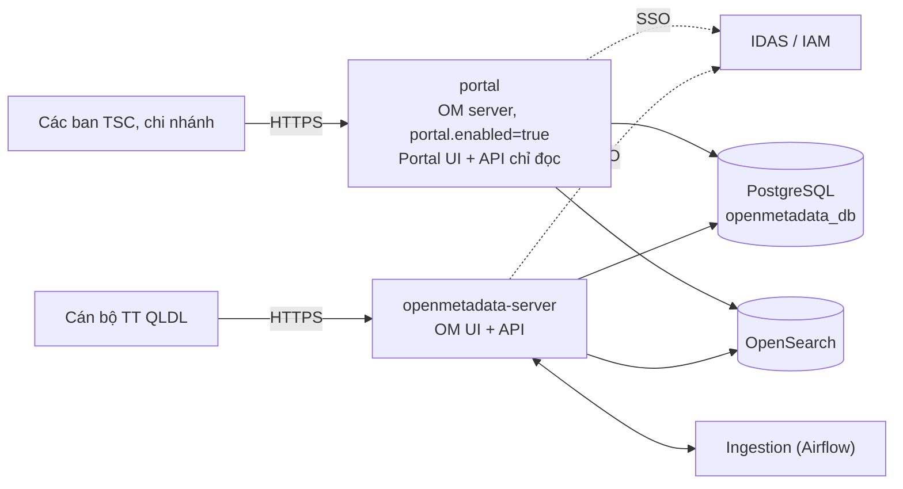

# Kiến trúc triển khai tách Cổng tra cứu (Portal) và OpenMetadata

> Trạng thái: **Đã cài đặt trên DEV** (2026-10-02). Đã chạy thử bằng server chạy trực tiếp từ mã nguồn, với database chỉ đọc:
> đăng nhập, duyệt Home, Explore, Domains, Data Dictionary, chi tiết thuật ngữ, tìm kiếm và đăng xuất bằng trình duyệt thật.
> Chưa chạy thử bằng image Docker, chưa chạy thử đăng nhập SSO và chưa chạy trọn quy trình khởi tạo từ database trống (xem §6.4, §9).
> Baseline: [Kiến trúc tham chiếu OpenMetadata 1.13.3](./openmetadata-1.13.3-upstream-architecture-reference.md),
> [API governed](../api/openmetadata-governed-api-specification.md).

## 1. Yêu cầu

| Giao diện | Người dùng chính | Chức năng |
| --- | --- | --- |
| **Portal** | Các ban TSC, chi nhánh (`BasicConsumer`) | Đúng những gì `BasicConsumer` thấy trên OpenMetadata: Home, Explore, Domains, Data Dictionary (CDE, quy tắc CLDL bản Approved/Archived), xuất Excel. **Chỉ đọc** |
| **OpenMetadata** | Cán bộ TT QLDL: `Admin`, `DataSteward`, `DataProposer`, `DataConsumer` | Toàn bộ chức năng |

Đã chốt:

1. Portal **là OpenMetadata đã cắt giảm tính năng và chỉ đọc**. Chỉ khác là có **2 UI và 2 service riêng**. Mọi cơ chế khác giữ y hệt OpenMetadata.
2. Mọi user và role đều đăng nhập qua IDAS/IAM, như OpenMetadata.
3. Portal phân quyền bằng RBAC của OpenMetadata (user, role, policy trong OM).
4. Vẫn giữ role `BasicConsumer` trên OpenMetadata để người dùng test nhanh.
5. Cách ly mạng giữa các vùng do tầng hạ tầng vật lý đảm nhiệm, không thuộc phạm vi phần mềm.
6. Portal **chỉ có quyền đọc** trên database: kết nối bằng một user PostgreSQL chỉ có `SELECT` (SPL-07).

## 2. Quyết định kiến trúc

| ID | Quyết định | Lý do |
| --- | --- | --- |
| SPL-01 | Service `portal` là **chính OpenMetadata server**, chạy instance riêng với `portal.enabled=true` (`OM_PORTAL_ENABLED=true`) | Đăng nhập, user, RBAC, search, export có sẵn. Không viết lại cơ chế |
| SPL-02 | Portal UI là bản build `openmetadata-ui` với `VITE_APP_MODE=portal` (`yarn build:portal`) | Một codebase, hai bản build |
| SPL-03 | Ở chế độ Portal, server **từ chối mọi request ghi** (`PortalReadOnlyFilter`, trả `403`) | Portal chỉ đọc kể cả khi user có role cao hơn `BasicConsumer` |
| SPL-04 | Menu Portal cố định theo persona `BasicConsumerPersona`: Home, Explore, Domains, Data Dictionary | Portal hiển thị đúng như `BasicConsumer` thấy trên OM |
| SPL-05 | Portal dùng chung database PostgreSQL và OpenSearch với OM, nên dữ liệu duyệt xong là Portal thấy ngay | Cơ chế y hệt OM |
| SPL-06 | Portal tắt kết nối Ingestion (`PIPELINE_SERVICE_CLIENT_ENABLED=false`) và không đăng ký MCP | Portal không chạy pipeline và không mở công cụ ghi |
| SPL-07 | Portal kết nối PostgreSQL bằng user **`portal_ro`: chỉ `SELECT`, mọi phiên đều `default_transaction_read_only=on`** | Chỉ đọc được đảm bảo ở tầng database, không chỉ ở tầng ứng dụng. Máy Portal bị chiếm cũng không ghi được |
| SPL-08 | Ở chế độ Portal, server **không chạy việc nền và không ghi khi khởi động** (§4.1) | `portal_ro` không ghi được. Việc nền là của server OM, chạy trùng sẽ gửi thông báo và chạy app hai lần |

### 2.1. Những gì đã bỏ so với đề xuất trước

Đề xuất đầu tiên dựng Portal thành một service Java riêng. Đề xuất đó đã bị thay bằng SPL-01 và các thành phần sau không còn tồn tại:

| Đã bỏ | Thay bằng |
| --- | --- |
| Module `openmetadata-portal` (Dropwizard + JDBI, API con tương thích OM) | Chính OM server ở chế độ Portal |
| Schema `portal` với các view lọc dữ liệu và role PostgreSQL `portal_ro` chỉ đọc | Portal dùng DB của OM, quyền đọc/ghi do RBAC và `PortalReadOnlyFilter` kiểm soát |
| Đăng nhập và phân quyền bằng nhóm IAM `MMD_PORTAL_VIEWER`, người dùng không có tài khoản OM | Tài khoản và RBAC của OM |
| Module `openmetadata-governed-common` (tách `CdeExcelExporter` cho Portal dùng chung) | 5 class đưa lại về `openmetadata-service`, Portal dùng endpoint export sẵn có |

## 3. Kiến trúc tổng thể

## 4. Thành phần

### 4.1. Server ở chế độ Portal

| Cơ chế | Cách làm |
| --- | --- |
| Cấu hình | `portal.enabled` trong `conf/openmetadata.yaml` (`OM_PORTAL_ENABLED`, mặc định `false`). Lớp `PortalConfiguration` |
| Chỉ đọc | `PortalReadOnlyFilter` (Jersey, pre-matching): cho qua `GET`, `HEAD`, `OPTIONS`. Chỉ cho `POST` tới `v1/users/login`, `v1/users/refresh`, `v1/users/logout`, `v1/search/aggregate`. Mọi request khác trả `403` |
| UI | Phục vụ `/portal-assets` (bản build Portal) thay cho `/assets`, cả file tĩnh lẫn `index.html` |
| MCP | Không đăng ký |
| Ingestion | Tắt bằng `PIPELINE_SERVICE_CLIENT_ENABLED=false` |
| Đăng nhập, RBAC, search, export | Giữ nguyên OM. Export CDE dùng endpoint `GET glossaryTerms/export` sẵn có |
| Database | User `portal_ro` (§6.3). Biến `DB_PG_TARGET_SERVER_TYPE=any`, vì driver PostgreSQL không coi phiên chỉ đọc là máy chủ `primary` |

Các servlet đăng nhập (`/api/v1/auth/*`, `/callback`, SAML) không đi qua Jersey nên vẫn hoạt động như OM.

**Việc nền và ghi khi khởi động bị tắt ở chế độ Portal** (cờ tĩnh `PortalConfiguration.isActive()`, đặt ở đầu `run()`):

| Thành phần | Ở Portal |
| --- | --- |
| Dữ liệu khởi tạo (seed): role, policy, persona, glossary, bot, user admin | Không tạo. `EntityRepository.initializeEntity`, `UserRepository.initializeUsers` và `BotResource.initialize` bỏ qua. Dữ liệu do server OM tạo, nên **OM phải chạy ít nhất một lần trước Portal** |
| Bootstrap Data Dictionary, Data Quality, Technical Dictionary và outbox | Bỏ qua |
| Worker nền, retry worker của search index, job phân tán (search, RDF) | Không đăng ký |
| Scheduler của app (Quartz), cài app mặc định, dọn job cũ | Không chạy |
| Scheduler thông báo (alert, subscription) và consumer audit log | Không chạy, chỉ giữ registry trong bộ nhớ |
| Flowable (workflow): async executor và dọn lịch sử | Tắt. Engine vẫn nạp để các endpoint đọc dùng được |
| Ghi nhận hoạt động người dùng, `lastLoginTime` | Không ghi |
| Lưu refresh token | Không lưu. Phiên đăng nhập kéo dài đúng bằng hạn của access token |
| Audit đăng nhập và đăng xuất | Ghi ra log ứng dụng, logger `portal.audit`, dạng `event=userLogin user=... userId=...`, để SIEM thu thập |

### 4.2. Portal UI

| Cơ chế | Cách làm |
| --- | --- |
| Build | `yarn build:portal` ra `ui/dist-portal`. `openmetadata-ui/pom.xml` đóng gói vào `portal-assets` cạnh `assets` |
| Route, NavBar, provider | Dùng chung với OM |
| Menu | `PORTAL_SIDEBAR_LIST`: Home, Explore, Domains, Data Dictionary (giống `persona.BasicConsumerPersona`). Mục dưới chỉ có Đăng xuất |
| Nút sửa | Ẩn theo quyền RBAC như OM. Nếu user có quyền ghi, server vẫn từ chối (SPL-03) |
| Web analytics | Instance analytics của bản Portal không có plugin, nên không gửi `PUT analytics/web/events/collect` |
| Dev server | `yarn start:portal`: Vite ở `http://localhost:3001`, proxy `/api` và `/callback` sang Portal `:8595`. Bản OM: cổng `3000`, proxy sang `:8585` |

## 5. Xác thực và phân quyền

| | Portal | OpenMetadata |
| --- | --- | --- |
| Đăng nhập | IDAS/IAM, cùng cấu hình SSO của OM. Khi dùng OIDC confidential, đặt callback riêng `PORTAL_AUTHENTICATION_CALLBACK_URL` | IDAS/IAM |
| Tài khoản | User trong OM, **phải tạo sẵn**. Portal không tự đăng ký user khi đăng nhập SSO lần đầu (`POST /users` bị chặn) | User trong OM |
| Phân quyền | RBAC của OM, cộng giới hạn chỉ đọc | RBAC của OM |

## 6. Môi trường DEV

Hai cách chạy, dùng chung PostgreSQL và OpenSearch của `docker-compose.dev.yml`.

### 6.1. Chạy bằng Docker

| Service | Vai trò |
| --- | --- |
| `openmetadata-server` | OM UI + API, cổng `${OPENMETADATA_UI_PORT:-80}` và `8585`. Dùng user DB của OM |
| `portal` | Cùng image với `openmetadata-server`. Kế thừa biến môi trường qua YAML anchor, khai báo tường minh kết nối PostgreSQL (user `portal_ro`) và OpenSearch. Bật `OM_PORTAL_ENABLED=true`, cổng `${PORTAL_UI_PORT:-8595}`. Chỉ khởi động khi `openmetadata-server` đã khỏe, vì Portal không tự tạo dữ liệu khởi tạo (`depends_on` với `service_healthy`) |

`deploy/dev/build-server-image.sh` chạy `yarn build` và `yarn build:portal` rồi mới build server, nên một image chứa cả hai bản UI.

### 6.2. Chạy từ mã nguồn (không build image)

`deploy/dev/local-dev.sh`: PostgreSQL và OpenSearch chạy trong Docker, server và UI chạy trên máy.

| Lệnh | Việc làm | Cổng |
| --- | --- | --- |
| `infra` | Bật PostgreSQL và OpenSearch, tắt server/portal trong Docker, tạo (hoặc cập nhật) user `portal_ro` | PostgreSQL `8001`, OpenSearch `8086` |
| `migrate` | Chạy migration | |
| `reindex` | Dựng lại index OpenSearch từ PostgreSQL | |
| `server` | OM server | API `8585`, admin `8586` |
| `portal` | OM server ở chế độ Portal, kết nối bằng `portal_ro` | API `8595`, admin `8596` |
| `ui`, `ui-portal` | Vite | `3000`, `3001` |

Lưu ý khi chạy từ mã nguồn:

- Classpath dựng từ `openmetadata-dist` (không phải `openmetadata-service`) để khớp phiên bản jar trong image. Dựng từ `openmetadata-service` làm Maven chọn `jetty-util` 12.1.1 thay vì 12.1.7, và server lỗi `NoSuchMethodError` khi một kết nối bị ngắt giữa lúc ghi phản hồi.
- Server chạy trên máy không phục vụ UI. Dùng Vite ở `3000` và `3001`. Lần tải đầu của Vite mất khoảng một phút vì phải biên dịch module.
- Ingestion tắt mặc định.
- Database trống thì chạy `migrate`, rồi chạy server OM ít nhất một lần (để tạo dữ liệu khởi tạo) trước khi chạy Portal.

### 6.3. User database chỉ đọc

`deploy/dev/postgres-init/portal-read-only-role.sql` (idempotent, chạy bằng superuser):

- tạo role `portal_ro` có `LOGIN`, `CONNECTION LIMIT 40`;
- `ALTER ROLE ... SET default_transaction_read_only = on`: mọi phiên đều chỉ đọc, kể cả khi mở giao dịch `READ WRITE`;
- `GRANT SELECT` trên mọi bảng của schema `public` của `openmetadata_db`, và `ALTER DEFAULT PRIVILEGES` cho bảng mà migration tạo sau này.

Ba cách áp dụng:

| Tình huống | Cách |
| --- | --- |
| Volume PostgreSQL mới (compose) | `zz-portal-role.sh` tự chạy ở lần khởi tạo đầu. File SQL được mount ở `/portal-init`, không để trong `docker-entrypoint-initdb.d`, vì thư mục đó chạy mọi `*.sql` mà không có mật khẩu |
| Database đã có (DEV) | `./local-dev.sh infra` |
| Môi trường khác | DBA chạy `psql -U postgres -v portal_password=... -f portal-read-only-role.sql` |

Mật khẩu lấy từ `PORTAL_RO_PASSWORD` (mặc định `portal_ro_password`, chỉ cho DEV).

### 6.4. Khởi tạo lại từ đầu

Thứ tự bắt buộc, vì Portal không tạo schema và không tạo dữ liệu khởi tạo:

| Bước | Việc | Ghi chú |
| --- | --- | --- |
| 0 | Dừng và xóa dữ liệu: `docker compose -f docker-compose.dev.yml down -v`, rồi `sudo rm -rf docker-volume/db-data-postgres` | `-v` xóa volume OpenSearch. Thư mục dữ liệu PostgreSQL thuộc quyền user của container nên cần `sudo`. Giữ file `.env` |
| 1 | `./local-dev.sh infra` | Bật PostgreSQL và OpenSearch. Ở lần khởi tạo đầu PostgreSQL tự tạo `portal_ro`; `infra` chạy lại script cho chắc (idempotent) |
| 2 | `./local-dev.sh migrate` | Tạo schema. Bảng tạo ở bước này tự cấp quyền đọc cho `portal_ro` nhờ `ALTER DEFAULT PRIVILEGES` |
| 3 | `./local-dev.sh server` và chờ healthcheck `:8586` | Server OM tạo dữ liệu khởi tạo (admin, role, policy, persona, glossary, bot). **Phải xong trước Portal** |
| 4 | Đăng nhập OM bằng `admin`, tạo user và gán role `BASIC_CONSUMER` | Portal không tự đăng ký user |
| 5 | `./local-dev.sh portal`, `./local-dev.sh ui`, `./local-dev.sh ui-portal` | Mỗi lệnh một terminal |

Nếu Explore hoặc tìm kiếm trống sau bước 3, chạy `./local-dev.sh reindex`.

Với Docker: build image bằng `build-server-image.sh`, rồi `docker compose up -d`. Compose tự giữ đúng thứ tự: `execute-migrate-all` (bước 2), rồi `openmetadata-server` (bước 3), rồi `portal`. Bước 4 vẫn làm tay.

## 7. Kiểm thử

Đã chạy:

- `PortalReadOnlyFilterTest` (16 ca): cho qua đọc và đăng nhập, chặn `POST`/`PUT`/`PATCH`/`DELETE` còn lại.
- `PortalConfigurationTest`, `TokenRepositoryPortalTest`: cờ Portal, và Portal không lưu token trong khi OM vẫn lưu.
- `LeftSidebar.constants.test.ts`: menu Portal đúng như BasicConsumer. `WebAnalyticsUtils.test.ts`: instance analytics của Portal không gửi sự kiện (ca này fail khi tắt cờ Portal).
- Quyền của `portal_ro` (PostgreSQL): `SELECT` thành công; `INSERT`, `DELETE`, `CREATE TABLE` bị từ chối, kể cả khi mở giao dịch `READ WRITE`; bảng tạo sau đó vẫn đọc được. Kiểm tra cả trên một PostgreSQL mới khởi tạo từ script.
- Portal chạy bằng `portal_ro` (server chạy từ mã nguồn): khởi động sạch, **0 lệnh ghi bị từ chối và 0 dòng ERROR**. User `BasicConsumer` đăng nhập được và `GET` các endpoint `loggedInUser`, `permissions`, `glossaries`, `glossaryTerms`, `domains`, `search/query` đều trả `200`; `POST search/aggregate` trả `200`; `POST glossaries` trả `403`.
- Duyệt Portal bằng trình duyệt thật (Playwright) với user `BasicConsumer`: đăng nhập, Home, Explore (bảng và thuật ngữ), Domains, Data Dictionary, Data Quality, chi tiết một thuật ngữ, ô tìm kiếm, đăng xuất. Request không phải `GET`: chỉ có `POST /api/v1/auth/login` (servlet) và `POST /api/v1/users/logout`. Menu và vai trò hiển thị đúng như BasicConsumer.

Chưa chạy:

- So sánh với cùng user trên OM: cùng dữ liệu, cùng file Excel.
- Xuất Excel trên Portal.
- Chạy cả hai service bằng image Docker.
- Chạy trọn quy trình khởi tạo từ đầu (§6.4) trên database trống. Từng bước đã chạy riêng lẻ: khởi tạo PostgreSQL mới từ script, `migrate`, server OM, Portal.
- Đăng nhập SSO (OIDC) qua IDAS/IAM: DEV không có IdP.

## 8. Sửa đổi về sau

| Thay đổi | Phải sửa |
| --- | --- |
| Giao diện, nghiệp vụ, quyền | Một lần trong OM. Build lại cả hai bản UI |
| Thêm mục menu cho Portal | `PORTAL_MENU` trong `LeftSidebar.constants.ts` |
| Màn hình Portal cần `POST` chỉ đọc mới | Thêm path vào `PortalReadOnlyFilter.ALLOWED_POST_PATHS` |
| Thêm việc nền hoặc ghi khi khởi động vào OM | Thêm chốt `PortalConfiguration.isActive()`. Nếu không, Portal sẽ ghi và bị `portal_ro` từ chối (thấy ngay ở log khởi động) |

## 9. Rủi ro và việc còn mở

Đã xử lý (so với bản trước): danh sách `POST` được chốt bằng cách ghi lại request của trình duyệt (analytics bị tắt ở bản Portal); Portal không còn giữ quyền ghi database (SPL-07); việc nền của OM không chạy trên Portal (SPL-08).

| # | Việc | Ghi chú |
| --- | --- | --- |
| 1 | Đăng nhập SSO chưa chạy thử | Luồng OIDC lưu session và tạo user ở các lớp khác với đăng nhập basic. Cần chạy thử với IDAS/IAM thật trên UAT. Mọi lệnh ghi còn sót lại sẽ bị `portal_ro` từ chối và hiện trong log |
| 2 | User phải tạo sẵn trong OM | Portal không tự đăng ký user khi đăng nhập lần đầu. User mới của chi nhánh phải được tạo trong OM (hoặc có quy trình cấp tài khoản) trước khi vào Portal |
| 3 | Không lưu refresh token | Với đăng nhập basic, Portal không lưu được refresh token nên không làm mới được: phiên kéo dài bằng hạn của access token rồi phải đăng nhập lại (suy ra từ mã nguồn, chưa chạy thử lúc hết hạn). Với SSO cần xem lại khi chạy thử mục 1, và xác nhận với người dùng cùng cấu hình thời hạn token |
| 4 | Số liệu hoạt động người dùng | Portal không ghi `lastLoginTime`, hoạt động và web analytics, nên báo cáo người dùng hoạt động của OM không tính người dùng Portal. Đăng nhập, đăng xuất vẫn có trong log `portal.audit` |
| 5 | Thứ tự khởi động | Portal không tạo dữ liệu khởi tạo (quy trình ở §6.4). Compose đã ép Portal đợi server OM khỏe. Khi nâng cấp OM, chạy migration và server OM bản mới trước khi chạy Portal bản mới. Môi trường không dùng compose phải tự đảm bảo thứ tự này |
| 6 | OIDC | Callback của Portal riêng (`PORTAL_AUTHENTICATION_CALLBACK_URL`), phải đăng ký thêm trên IDAS/IAM |
| 7 | Mạng và PostgreSQL | Chặn truy cập OM từ WAN, cho phép Portal tới PostgreSQL và OpenSearch, và giới hạn `portal_ro` theo IP trong `pg_hba.conf` (UAT/PROD dùng `hostssl` + `scram-sha-256`) do hạ tầng đảm nhiệm. Cần đặt mật khẩu `portal_ro` riêng cho UAT/PROD |
| 8 | OpenSearch | Portal vẫn ghi được vào OpenSearch nếu có lệnh ghi nào đi qua (DEV không bật Security plugin). Trên UAT/PROD cấp cho Portal một user OpenSearch chỉ đọc, và kiểm tra Portal vẫn chạy được với user đó |
