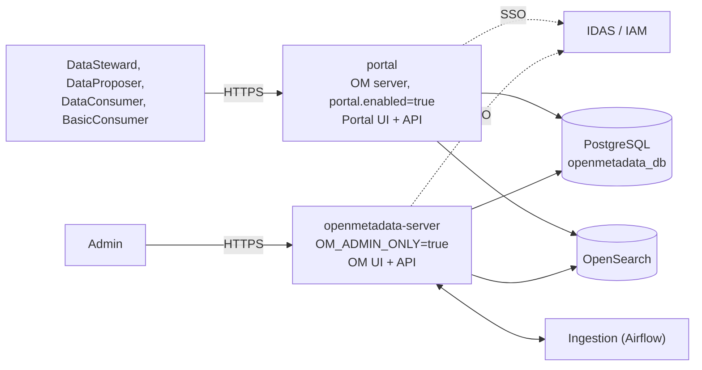
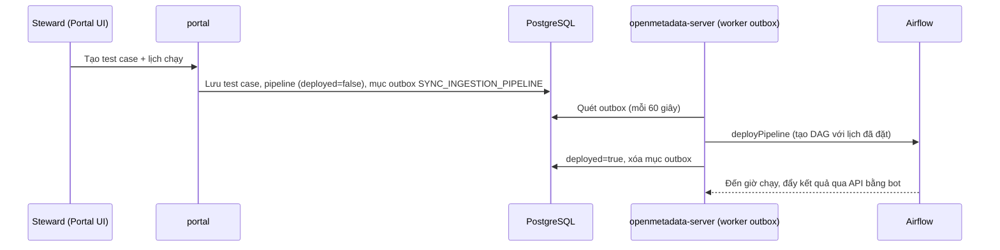

# Kiến trúc triển khai tách Cổng tra cứu (Portal) và OpenMetadata

> Trạng thái: **Thiết kế sửa đổi 2026-10-05. Mã nguồn đã sửa theo thiết kế này (§7), đã chạy test đơn vị, chưa chạy thử trên DEV.**
> Chưa chạy: luồng đề xuất → duyệt trên Portal, deploy pipeline qua outbox với Airflow thật, chặn non-Admin trên OM, SSO, image Docker (§8).
> Baseline: [Kiến trúc tham chiếu OpenMetadata 1.13.3](./openmetadata-1.13.3-upstream-architecture-reference.md),
> [Kiến trúc hiện tại hệ thống](./agribank-metadata-architecture.md), [API governed](../api/openmetadata-governed-api-specification.md).

## 1. Yêu cầu

| Giao diện | Người dùng | Chức năng |
| --- | --- | --- |
| **Portal** | `DataSteward`, `DataProposer`, `DataConsumer`, `BasicConsumer` | Đúng những gì role đó làm được trên OpenMetadata, **kể cả ghi** (đề xuất, duyệt CDE và quy tắc CLDL). Menu theo persona của role |
| **OpenMetadata** | **Chỉ `Admin`** | Toàn bộ chức năng, gồm cấu hình hệ thống, service, ingestion, user, role, policy |

Đã chốt:

1. Portal **là OpenMetadata với UI riêng**. Chỉ khác là có **2 UI và 2 service riêng**. Mọi cơ chế khác giữ y hệt OpenMetadata.
2. Mọi user đều đăng nhập qua IDAS/IAM, như OpenMetadata.
3. Portal phân quyền đọc/ghi bằng RBAC của OpenMetadata (user, role, policy trong OM). Portal không thêm giới hạn riêng.
4. **Chỉ `Admin` được vào OpenMetadata UI.** User không phải Admin đăng nhập OM bị từ chối, kể cả `BasicConsumer`.
5. Cách ly mạng giữa các vùng do tầng hạ tầng vật lý đảm nhiệm, không thuộc phạm vi phần mềm.

## 2. Quyết định kiến trúc

| ID | Quyết định | Lý do |
| --- | --- | --- |
| SPL-01 | Service `portal` là **chính OpenMetadata server**, chạy instance riêng với `portal.enabled=true` (`OM_PORTAL_ENABLED=true`) | Đăng nhập, user, RBAC, workflow duyệt, search, export có sẵn. Không viết lại cơ chế |
| SPL-02 | Portal UI là bản build `openmetadata-ui` với `VITE_APP_MODE=portal` (`yarn build:portal`) | Một codebase, hai bản build |
| SPL-03 | Portal **cho phép ghi**. Quyền đọc/ghi do RBAC của OM quyết định, như trên OM | `DataSteward`, `DataProposer` làm việc trên Portal |
| SPL-04 | Menu Portal **theo persona mặc định của user**, cùng cơ chế với OM (`useSidebarItems`). Persona có sẵn: `DataStewardPersona`, `DataProposerPersona`, `DataConsumerPersona`, `BasicConsumerPersona` | Mỗi role thấy đúng menu của mình. Sửa menu một lần trong persona |
| SPL-05 | Portal dùng chung database PostgreSQL và OpenSearch với OM, **cùng user DB của OM (đọc/ghi)** | Cơ chế y hệt OM. Dữ liệu ghi ở Portal thì OM thấy ngay và ngược lại |
| SPL-06 | Portal **không kết nối Airflow** (`PIPELINE_SERVICE_CLIENT_ENABLED=false`) và không đăng ký MCP | Chỉ server OM nói chuyện với Airflow. Không phải mở mạng từ Portal tới Airflow |
| SPL-08 | Ở chế độ Portal, server **không chạy việc nền và không tạo dữ liệu khởi tạo** (§4.1) | Việc nền là của server OM, chạy trùng sẽ gửi thông báo và chạy app hai lần |
| SPL-09 | Ở OM server, **chỉ user Admin (`isAdmin=true`) và bot được gọi API** (`OM_ADMIN_ONLY=true`). User khác bị `403` | Chỉ Admin dùng OM UI. Bot vẫn cần gọi API OM cho ingestion |
| SPL-10 | Pipeline tạo hoặc sửa trên Portal được **server OM deploy thay** qua outbox trong DB chung (§4.4). Portal chỉ ghi yêu cầu, worker outbox của OM gọi Airflow | Test case và quy tắc CLDL tạo trên Portal vẫn chạy theo lịch mà Portal không cần nối Airflow. Dùng lại outbox `DqTestOutbox` có sẵn |

### 2.1. Những gì đã bỏ so với các bản trước

| Đã bỏ | Thay bằng |
| --- | --- |
| Module `openmetadata-portal` (Dropwizard + JDBI, API con tương thích OM) | Chính OM server ở chế độ Portal |
| Schema `portal` với các view lọc dữ liệu | Portal dùng DB của OM |
| Đăng nhập và phân quyền bằng nhóm IAM `MMD_PORTAL_VIEWER`, người dùng không có tài khoản OM | Tài khoản và RBAC của OM |
| Module `openmetadata-governed-common` | 5 class đưa lại về `openmetadata-service`, Portal dùng endpoint export sẵn có |
| Portal chỉ đọc: `PortalReadOnlyFilter` chặn mọi request ghi (SPL-03 cũ) | RBAC của OM (SPL-03 mới) |
| User PostgreSQL `portal_ro` chỉ `SELECT` (SPL-07 cũ) | User DB của OM (SPL-05) |
| Menu Portal cố định theo `BasicConsumerPersona` (`PORTAL_MENU`, SPL-04 cũ) | Menu theo persona của user (SPL-04 mới) |
| Không lưu refresh token, không ghi `lastLoginTime` và hoạt động người dùng ở Portal | Giữ như OM |
| Giữ `BasicConsumer` trên OM để test nhanh | Chỉ Admin vào OM (SPL-09) |

## 3. Kiến trúc tổng thể

## 4. Thành phần

### 4.1. Server ở chế độ Portal

| Cơ chế | Cách làm |
| --- | --- |
| Cấu hình | `portal.enabled` trong `conf/openmetadata.yaml` (`OM_PORTAL_ENABLED`, mặc định `false`). Lớp `PortalConfiguration` |
| Đọc/ghi | Như OM: mọi request đi qua xác thực và RBAC của OM. Không có filter chặn ghi |
| UI | Phục vụ `/portal-assets` (bản build Portal) thay cho `/assets`, cả file tĩnh lẫn `index.html` |
| MCP | Không đăng ký |
| Ingestion | Tắt bằng `PIPELINE_SERVICE_CLIENT_ENABLED=false` |
| Đăng nhập, RBAC, workflow, search, export | Giữ nguyên OM |
| Database | Cùng user DB với OM |

**Việc nền bị tắt ở chế độ Portal** (cờ tĩnh `PortalConfiguration.isActive()`, đặt ở đầu `run()`). Các thao tác ghi theo request của user (refresh token, `lastLoginTime`, hoạt động người dùng) chạy như OM.

| Thành phần | Ở Portal |
| --- | --- |
| Dữ liệu khởi tạo (seed): role, policy, persona, glossary, bot, user admin | Không tạo. Dữ liệu do server OM tạo, nên **OM phải chạy ít nhất một lần trước Portal** |
| Bootstrap Data Dictionary, Data Quality, Technical Dictionary | Bỏ qua |
| Outbox `DqTestOutbox` | Portal **chỉ ghi mục outbox, không xử lý**: không chạy worker và `drainAsync()`/`drainPending()` không làm gì. Worker của server OM xử lý (§4.4) |
| Worker nền, retry worker của search index, job phân tán (search, RDF) | Không đăng ký |
| Scheduler của app (Quartz), cài app mặc định, dọn job cũ | Không chạy |
| Scheduler thông báo (alert, subscription) và consumer audit log | Không chạy. Server OM đọc change event do Portal ghi vào DB và xử lý |
| Flowable (workflow): async executor và dọn lịch sử | Tắt. Workflow do thao tác trên Portal khởi động được executor của server OM chạy tiếp (cần chạy thử, §9) |

### 4.2. Portal UI

| Cơ chế | Cách làm |
| --- | --- |
| Build | `yarn build:portal` ra `ui/dist-portal`. `openmetadata-ui/pom.xml` đóng gói vào `portal-assets` cạnh `assets` |
| Route, NavBar, provider | Dùng chung với OM |
| Menu | Theo persona mặc định của user, như OM. Bỏ `PORTAL_SIDEBAR_LIST` |
| Nút sửa, task, đề xuất, duyệt | Hiện theo quyền RBAC như OM |
| Pipeline | Tạo, sửa lịch, bật/tắt, xóa, chạy ngay: như OM, nhưng có hiệu lực sau tối đa 60 giây (§4.4). Khi `deployed=false`, nút Tạm dừng/Tiếp tục bị khóa với chú thích "Pipeline chưa được triển khai" (cơ chế có sẵn của OM). Ẩn nút Logs và mục Kill (cần gọi Airflow trực tiếp). Endpoint `status` trả `200` "Pipelines are deployed by the OpenMetadata server" để form tạo test case vẫn gọi deploy |
| Settings | Ẩn mục Settings ở menu dưới (giữ như bản đầu: `IS_PORTAL_MODE` chỉ còn Đăng xuất). Cấu hình hệ thống làm trên OM UI (chỉ Admin) |
| Dev server | `yarn start:portal`: Vite ở `http://localhost:3001`, proxy `/api` và `/callback` sang Portal `:8595`. Bản OM: cổng `3000`, proxy sang `:8585` |

### 4.3. Server OM chỉ cho Admin (SPL-09)

| Cơ chế | Cách làm |
| --- | --- |
| Cấu hình | `OM_ADMIN_ONLY` (mặc định `false` để DEV test nhanh; UAT/PROD bật `true`). Chỉ có tác dụng khi `portal.enabled=false` |
| Đăng nhập | Mọi phương thức (basic, LDAP, OIDC, SAML) đều gọi `UserRepository.updateUserLastLoginTime` khi đã biết user và trước khi trả token. Hàm này gọi `AdminOnlyAccess.requireAllowedLogin`, từ chối user không phải Admin hoặc bot bằng `AuthorizationException` (403) "This account can only use the Portal..." |
| API | `AdminOnlyFilter` (Jersey, ngay sau `JwtFilter`): cho qua user `isAdmin=true` và bot (`isBot=true`). Còn lại, kể cả user không tồn tại, trả `403`. Request không có user và các endpoint công khai của `JwtFilter.EXCLUDED_ENDPOINTS` (đăng nhập, cấu hình auth) để `JwtFilter` xử lý. Chặn cả token cấp từ Portal mang sang OM |
| Audit | Lần bị từ chối ghi mức WARN vào log ứng dụng, dạng `event=denied user=... method=... path=...` (API) hoặc `event=denied user=... reason=login` |

### 4.4. Deploy pipeline thay cho Portal (SPL-10)

Dùng outbox `DqTestOutbox` có sẵn: bảng `dq_test_outbox` trong DB chung, worker của server OM chạy mỗi 60 giây, mục lỗi được giữ lại và chạy lại, xử lý lặp lại an toàn (mỗi mục được dựng lại từ DB khi xử lý). Mục outbox của luồng quy tắc CLDL được ghi cùng giao dịch với thay đổi. Mục `SYNC_INGESTION_PIPELINE` và `TRIGGER_PIPELINE` được ghi ngay sau khi pipeline được lưu, trong giao dịch riêng.

| Luồng | Cách làm |
| --- | --- |
| Quy tắc CLDL được duyệt trên Portal | Đã ghi mục outbox `RECONCILE_RULE`, `SYNC_PIPELINE` như hiện nay. Chỉ sửa: Portal không tự xử lý (§4.1), để worker OM tạo test case, pipeline và deploy |
| Test case tạo bằng form chuẩn (`TestCaseFormV1`) và pipeline sửa trực tiếp trên Portal | Ở chế độ Portal, `IngestionPipelineRepository` ghi mục outbox mới **`SYNC_INGESTION_PIPELINE`** (khóa: id pipeline) khi tạo, sửa (lịch, cấu hình), bật/tắt hoặc xóa pipeline. Worker OM đọc lại pipeline từ DB: còn thì deploy lại và áp trạng thái bật/tắt, đã xóa thì xóa DAG (bỏ qua nếu DAG không còn) |
| Chạy ngay trên Portal | Endpoint trigger ở chế độ Portal ghi mục outbox **`TRIGGER_PIPELINE`** và trả `202`. Worker OM deploy nếu cần rồi trigger. Áp dụng cho cả `DqRuleTestService.trigger` |
| Pipeline tạo trên OM | Không đổi: OM deploy ngay như hiện nay, không đi qua outbox |

Ghi chú:

- Quyền: Portal vẫn kiểm tra RBAC trên `IngestionPipeline` như OM. Worker OM chạy bằng tài khoản hệ thống, không kiểm tra lại.
- Lỗi deploy (Airflow không chạy, cấu hình sai): mục outbox giữ lại kèm lỗi và chạy lại ở vòng sau. `pendingCount()`, `oldestPendingAt()` dùng để giám sát.
- Lịch cron tính theo múi giờ của Airflow (mặc định UTC).

## 5. Xác thực và phân quyền

| | Portal | OpenMetadata |
| --- | --- | --- |
| Người dùng | `DataSteward`, `DataProposer`, `DataConsumer`, `BasicConsumer` | Admin và bot |
| Đăng nhập | IDAS/IAM, cùng cấu hình SSO của OM. Khi dùng OIDC confidential, đặt callback riêng `PORTAL_AUTHENTICATION_CALLBACK_URL` | IDAS/IAM |
| Tài khoản | User trong OM. Tự đăng ký khi đăng nhập SSO lần đầu như OM, role mặc định theo cấu hình OM | User trong OM |
| Phân quyền | RBAC của OM | RBAC của OM, cộng giới hạn chỉ Admin (SPL-09) |

## 6. Môi trường DEV

Hai cách chạy, dùng chung PostgreSQL và OpenSearch của `docker-compose.dev.yml`.

### 6.1. Chạy bằng Docker

| Service | Vai trò |
| --- | --- |
| `openmetadata-server` | OM UI + API, cổng `${OPENMETADATA_UI_PORT:-80}` và `8585` |
| `portal` | Cùng image và cùng biến môi trường (DB, OpenSearch) với `openmetadata-server` qua YAML anchor. Bật `OM_PORTAL_ENABLED=true`, cổng `${PORTAL_UI_PORT:-8595}`. Chỉ khởi động khi `openmetadata-server` đã khỏe (`depends_on` với `service_healthy`) |

`deploy/dev/build-server-image.sh` chạy `yarn build` và `yarn build:portal` rồi mới build server, nên một image chứa cả hai bản UI.

### 6.2. Chạy từ mã nguồn (không build image)

`deploy/dev/local-dev.sh`: PostgreSQL và OpenSearch chạy trong Docker, server và UI chạy trên máy.

| Lệnh | Việc làm | Cổng |
| --- | --- | --- |
| `infra` | Bật PostgreSQL và OpenSearch, tắt server/portal trong Docker | PostgreSQL `8001`, OpenSearch `8086` |
| `migrate` | Chạy migration | |
| `reindex` | Dựng lại index OpenSearch từ PostgreSQL | |
| `server` | OM server | API `8585`, admin `8586` |
| `portal` | OM server ở chế độ Portal | API `8595`, admin `8596` |
| `ui`, `ui-portal` | Vite | `3000`, `3001` |

Lưu ý khi chạy từ mã nguồn:

- Classpath dựng từ `openmetadata-dist` (không phải `openmetadata-service`) để khớp phiên bản jar trong image. Dựng từ `openmetadata-service` làm Maven chọn `jetty-util` 12.1.1 thay vì 12.1.7, và server lỗi `NoSuchMethodError` khi một kết nối bị ngắt giữa lúc ghi phản hồi.
- Server chạy trên máy không phục vụ UI. Dùng Vite ở `3000` và `3001`. Lần tải đầu của Vite mất khoảng một phút vì phải biên dịch module.
- Ingestion tắt mặc định.

### 6.3. Khởi tạo lại từ đầu

| Bước | Việc | Ghi chú |
| --- | --- | --- |
| 0 | Dừng và xóa dữ liệu: `docker compose -f docker-compose.dev.yml down -v`, rồi `sudo rm -rf docker-volume/db-data-postgres` | `-v` xóa volume OpenSearch. Thư mục dữ liệu PostgreSQL thuộc quyền user của container nên cần `sudo`. Giữ file `.env` |
| 1 | `./local-dev.sh infra` | Bật PostgreSQL và OpenSearch |
| 2 | `./local-dev.sh migrate` | Tạo schema |
| 3 | `./local-dev.sh server` và chờ healthcheck `:8586` | Server OM tạo dữ liệu khởi tạo (admin, role, policy, persona, glossary, bot). **Phải xong trước Portal** |
| 4 | Đăng nhập OM bằng `admin`, tạo user và gán role (`DATA_STEWARD`, `DATA_PROPOSER`, `DATA_CONSUMER`, `BASIC_CONSUMER`) cùng persona mặc định | Với SSO, user tự đăng ký ở Portal; Admin chỉ cần gán role |
| 5 | `./local-dev.sh portal`, `./local-dev.sh ui`, `./local-dev.sh ui-portal` | Mỗi lệnh một terminal |

Nếu Explore hoặc tìm kiếm trống sau bước 3, chạy `./local-dev.sh reindex`.

Với Docker: build image bằng `build-server-image.sh`, rồi `docker compose up -d`. Compose tự giữ đúng thứ tự: `execute-migrate-all` (bước 2), rồi `openmetadata-server` (bước 3), rồi `portal`. Bước 4 vẫn làm tay.

## 7. Thay đổi mã nguồn (đã làm 2026-10-05)

| Thành phần | Việc đã làm |
| --- | --- |
| `PortalReadOnlyFilter`, `PortalReadOnlyFilterTest`, `TokenRepositoryPortalTest` | Xóa. Bỏ đăng ký filter trong `OpenMetadataApplication` |
| Chốt Portal quanh lưu refresh token (`TokenRepository`), `lastLoginTime` (`UserRepository`), theo dõi hoạt động người dùng (`OpenMetadataApplication`), audit đăng nhập (`AuditLogRepository`, bỏ logger `portal.audit`) | Bỏ, chạy như OM. Giữ chốt cho seed và việc nền (§4.1) |
| `deploy/dev`: `portal-read-only-role.sql`, `zz-portal-role.sh`, `PORTAL_RO_PASSWORD`, `DB_PG_TARGET_SERVER_TYPE`, `use_portal_database_user`, `apply_portal_role` | Xóa. Service `portal` kế thừa toàn bộ biến DB và OpenSearch của `openmetadata-server`. `local-dev.sh portal` ép `PIPELINE_SERVICE_CLIENT_ENABLED=false` kể cả khi `WITH_INGESTION=true` |
| `PORTAL_MENU`, `PORTAL_SIDEBAR_LIST`, `usePortalSidebarItems`, test menu Portal | Xóa. Portal dùng `useSidebarItems` theo persona như OM |
| Tắt web analytics ở bản Portal | Bỏ |
| SPL-09 | `AdminOnlyConfiguration` (`adminOnly.enabled`, `OM_ADMIN_ONLY`), `AdminOnlyAccess`, `AdminOnlyFilter`, kiểm tra ở `updateUserLastLoginTime` (§4.3). Mặc định tắt. `OM_ADMIN_ONLY` có trong compose và `conf/openmetadata.yaml`. Portal bỏ qua cờ này |
| `DqTestOutbox.drainAsync()`, `drainPending()` | Không làm gì ở chế độ Portal. Nếu không, Portal sẽ tự xử lý mục outbox mà không có client pipeline, `DqPipelineGateway.deploy` chỉ ghi log và mục outbox bị coi là xong, **pipeline không bao giờ được deploy** |
| `DqTestOutbox`, `DqPipelineGateway` | Thêm `SYNC_INGESTION_PIPELINE`, `TRIGGER_PIPELINE`, và `syncIngestionPipeline`/`triggerIngestionPipeline` (deploy, lưu `deployed=true`, bật/tắt đúng trạng thái, xóa DAG khi pipeline đã xóa) |
| `IngestionPipelineRepository` | `postUpdate`: Portal ghi mục outbox khi pipeline đã deploy mà đổi lịch, cấu hình hoặc `enabled`. `postDelete`: Portal ghi mục outbox để OM xóa DAG |
| `IngestionPipelineResource` | Ở Portal: `deploy` và `bulk/deploy` ghi mục outbox (kiểm tra quyền `DEPLOY`), `trigger` ghi mục trigger, `toggleIngestion` đổi `enabled` trong DB rồi ghi mục outbox, `status` trả 200. `kill` và `logs` giữ nguyên (client rỗng) |
| `DqRuleTestService.run` | Ở Portal: ghi mục trigger thay vì gọi client pipeline |
| Portal UI | Ẩn nút Logs và mục Kill của pipeline (`IS_PORTAL_MODE`) |

Chưa làm: kiểm tra menu của 4 persona khớp nghiệp vụ trên Portal (cần mở bằng từng role).

## 8. Kiểm thử

Đã chạy (test đơn vị, 130 ca trong nhóm liên quan đều qua):

- `AdminOnlyConfigurationTest`, `AdminOnlyAccessTest`, `AdminOnlyFilterTest`: cờ admin-only, Portal bỏ qua cờ, từ chối đăng nhập và API với non-Admin, cho qua Admin và bot, không đụng endpoint công khai.
- `DqTestOutboxPortalTest`: Portal không xử lý outbox.
- `PortalConfigurationTest`, `JwtFilterTest`, `IngestionPipelineRepositoryTest`, các test `Dq*`.
- UI: `WebAnalyticsUtils.test.ts`, `PipelineActions*.test.tsx`; `tsc` không báo lỗi ở các file đã sửa. 5 suite UI khác (`CustomizeNavigation`, `EntityUtilClassBase`, `PipelineDetails`, `TableProfilerProvider`, `ParameterForm`) fail y hệt trên HEAD trước khi sửa, không do thay đổi này.

Cần chạy (chưa chạy):

- Đăng nhập Portal bằng từng role (`DataSteward`, `DataProposer`, `DataConsumer`, `BasicConsumer`): menu đúng persona, nút sửa đúng quyền.
- Luồng đề xuất và duyệt CDE, quy tắc CLDL trọn vẹn trên Portal: `DataProposer` tạo đề xuất, `DataSteward` nhận task và duyệt, trạng thái Approved hiện ở cả Portal và OM. Thông báo gửi đúng một lần. Workflow (Flowable) khởi động từ Portal được OM chạy tiếp (§10 mục 2).
- RBAC: `DataConsumer`, `BasicConsumer` gọi API ghi trên Portal bị `403`.
- SPL-09 với server thật: non-Admin đăng nhập OM bị từ chối (basic và SSO); token cấp từ Portal gọi API OM bị `403`; Admin và bot ingestion vẫn chạy bình thường.
- SPL-10 với Airflow thật: trên Portal tạo test case kèm lịch, sửa lịch, tắt, xóa, chạy ngay. Trong 60 giây DAG được tạo, đổi lịch, pause, bị xóa, có lượt chạy; đến giờ đặt thì có kết quả test. Tắt Airflow rồi tạo pipeline: mục outbox giữ lại và được deploy khi Airflow chạy lại. Kiểm tra pipeline `enabled=false` được deploy rồi pause đúng.
- Duyệt quy tắc CLDL trên Portal: pipeline `DQR_pipeline_<key>` của từng khai báo được server OM deploy.
- Xuất Excel trên Portal.
- Chạy cả hai service bằng image Docker và trọn quy trình khởi tạo §6.3 trên database trống.
- Đăng nhập SSO (OIDC) qua IDAS/IAM trên UAT.

## 9. Sửa đổi về sau

| Thay đổi | Phải sửa |
| --- | --- |
| Giao diện, nghiệp vụ, quyền | Một lần trong OM. Build lại cả hai bản UI |
| Menu của một role trên Portal | Persona của role đó |
| Thêm việc nền hoặc seed vào OM | Thêm chốt `PortalConfiguration.isActive()` để không chạy trùng trên Portal |

## 10. Rủi ro và việc còn mở

| # | Việc | Ghi chú |
| --- | --- | --- |
| 1 | Portal có quyền ghi database | Bỏ lớp chỉ đọc ở tầng database. An toàn dữ liệu chỉ còn dựa vào RBAC của OM. Máy Portal bị chiếm thì ghi được vào DB |
| 2 | Workflow duyệt (Flowable) khởi động từ Portal | Async executor tắt ở Portal. Cần chạy thử job của workflow được executor của server OM nhận và chạy hết. Nếu không, bật executor ở Portal và kiểm tra không chạy trùng |
| 3 | Đăng nhập SSO chưa chạy thử | Cần chạy thử với IDAS/IAM thật trên UAT, cả ở Portal lẫn chặn non-Admin ở OM |
| 4 | Admin dùng Portal | Chưa chốt Admin có vào Portal không. Mặc định RBAC cho phép |
| 5 | Thứ tự khởi động | Portal không tạo dữ liệu khởi tạo. Khi nâng cấp OM, chạy migration và server OM bản mới trước Portal bản mới |
| 6 | OIDC | Callback của Portal riêng (`PORTAL_AUTHENTICATION_CALLBACK_URL`), phải đăng ký thêm trên IDAS/IAM |
| 7 | Mạng | Chặn truy cập OM từ WAN, chỉ mở cho mạng của Admin, cho phép Portal tới PostgreSQL và OpenSearch, do hạ tầng đảm nhiệm. Portal không cần tới Airflow |
| 8 | Trễ deploy | Thay đổi pipeline trên Portal có hiệu lực sau tối đa 60 giây (chu kỳ worker OM). Nếu server OM dừng, pipeline mới không được deploy cho tới khi OM chạy lại; lịch của DAG đã deploy vẫn chạy |
| 9 | Nhiều instance server OM | Khóa của outbox (`ReentrantLock`) chỉ có tác dụng trong một tiến trình. Nếu chạy nhiều instance OM, cần khóa trong DB để không deploy trùng |
