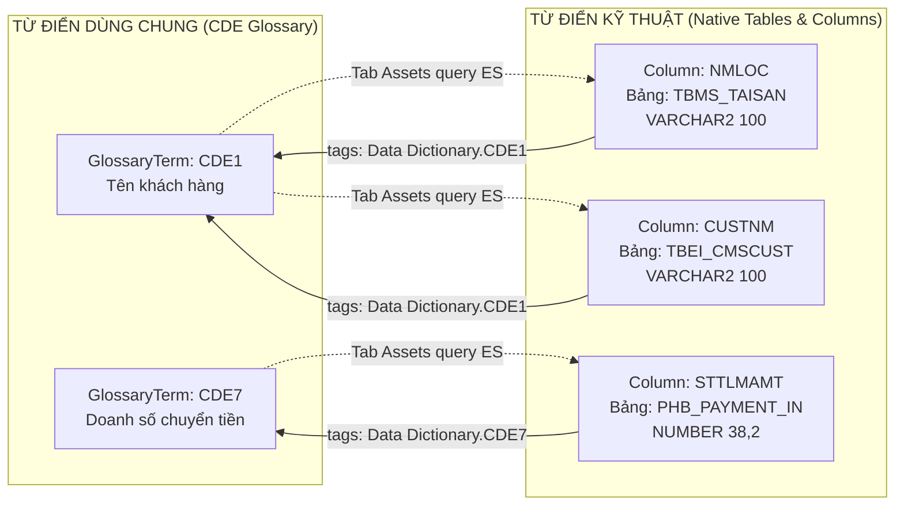

# Thiết kế giao diện Từ điển kỹ thuật (Technical Dictionary) trên OpenMetadata: Phương án 3 (Tái sử dụng Native Table & Column)

> **Phương án kiến trúc:** **Phương án 3 (Hybrid)** — Tái sử dụng 100% Native Object **`Table` & `Column`** có sẵn trong OpenMetadata Data Catalog, kết nối hai chiều với **`GlossaryTerm` (CDE)** trong *Từ điển dữ liệu dùng chung*.  
> **Nguồn dữ liệu tham chiếu:** [`openmetadata-python-client/cde/TuDienKyThuat.xlsx`](file:///home/dinhphu/Documents/Agribank-Metadata/openmetadata-python-client/cde/TuDienKyThuat.xlsx)  
> **Mô hình tham chiếu:**  
> - [Thực thể Table & Column core](file:///home/dinhphu/Documents/Agribank-Metadata/OpenMetadata/openmetadata-ui/src/main/resources/ui/src/generated/entity/data/table.ts)  
> - [Component SchemaTable](file:///home/dinhphu/Documents/Agribank-Metadata/OpenMetadata/openmetadata-ui/src/main/resources/ui/src/components/Database/SchemaTable/SchemaTable.component.tsx)  
> - [Từ điển dữ liệu dùng chung (CDE Glossary)](file:///home/dinhphu/Documents/Agribank-Metadata/OpenMetadata/openmetadata-ui/src/main/resources/ui/src/components/Glossary/GlossaryTerms/CDEGlossaryTermSummary.tsx)  
> - [Chất lượng dữ liệu (Data Quality Glossary)](file:///home/dinhphu/Documents/Agribank-Metadata/OpenMetadata/openmetadata-ui/src/main/resources/ui/src/components/Glossary/GlossaryTerms/DQGlossaryTermSummary.tsx)

---

## 1. Bản chất Kiến trúc Phương án 3: Tái sử dụng Native `Table` & `Column`

Thay vì tạo thêm hàng ngàn bản ghi `GlossaryTerm` bị trùng lặp dữ liệu với cấu trúc cơ sở dữ liệu vật lý, **Phương án 3** tận dụng trực tiếp các Object có sẵn của OpenMetadata:

1. **Object `Table` & `Column` (Data Catalog Assets):** Lưu trữ toàn bộ đặc tả vật lý thực tế của hệ thống (Tên bảng, Tên cột, Kiểu dữ liệu `dataTypeDisplay`, Độ dài `dataLength`, Số thập phân `scale`, Mô tả cột `description`, Hệ thống nguồn `service`).
2. **Cơ chế `TagLabel` (Glossary Source):** Gán trực tiếp Mã CDE nghiệp vụ (`source: "Glossary"`, `tagFQN: "Data Dictionary.CDE1"`) vào từng Cột (`Column`).
3. **Ánh xạ Hai Chiều Tự Động (Bidirectional Synergy):**
   - **Chiều 1 (Từ Nghiệp vụ $\rightarrow$ Kỹ thuật):** Khi người dùng vào *Từ điển dữ liệu dùng chung* xem `CDE1 - Tên khách hàng`, tab **Tài sản liên quan (Assets)** tự động liệt kê toàn bộ các Bảng và Cột đang ánh xạ tới CDE1 (`TBMS_TAISAN.NMLOC`, `TBEI_CMSCUST.CUSTNM`...).
   - **Chiều 2 (Từ Kỹ thuật $\rightarrow$ Nghiệp vụ):** Khi người dùng vào giao diện **Từ điển kỹ thuật (Technical Dictionary)** hoặc xem trang chi tiết Bảng (`TableDetailsPage`), danh sách cột hiển thị rõ đặc tả kỹ thuật và Badge `[🔗 CDE1 - Tên khách hàng]` điều hướng ngược về CDE Glossary.



---

## 2. Ma trận Ánh xạ 19 Trường Excel vào Native Object OpenMetadata

| STT | Tên cột trong Excel | Giải thích nội dung | Object OpenMetadata sử dụng | Thuộc tính có sẵn trong OpenMetadata | Ghi chú & Kiểu dữ liệu |
|:---:|---|---|---|---|---|
| 1 | **Hệ Thống nguồn** | Hệ thống chứa dữ liệu (SRC30, IPCAS...) | `DatabaseService` / `Database` | `table.service.name` hoặc `database.name` | Đại diện cho hệ thống vật lý |
| 2 | **Tên Bảng** | Tên kỹ thuật của bảng trong DB | `Entity: Table` | **`table.name`** (hoặc `table.displayName`) | Monospace font (`TBMS_TAISAN`) |
| 3 | **Tên Trường** | Tên kỹ thuật của cột trong bảng | `Object: Column` | **`column.name`** (hoặc `column.displayName`)| Monospace font (`NMLOC`, `CUSTNM`) |
| 4 | **Kiểu Dữ Liệu** | Kiểu dữ liệu kỹ thuật (VARCHAR2, NUMBER...) | `Object: Column` | **`column.dataType`** & **`column.dataTypeDisplay`** | Native Enum + Display String (`VARCHAR2`, `NUMBER`) |
| 5 | **Độ Dài Trường** | Độ dài tối đa của trường (100, 38...) | `Object: Column` | **`column.dataLength`** | Kiểu số nguyên (`100`, `38`) |
| 6 | **Chữ Số Sau Dấu Phẩy** | Số chữ số thập phân (2, N/A...) | `Object: Column` | **`column.scale`** & `column.precision` | `scale` lưu chính xác số chữ số thập phân (`2`) |
| 7 | **Mô tả trường dữ liệu** | Diễn giải ngữ nghĩa kỹ thuật của cột | `Object: Column` | **`column.description`** | Nội dung markdown của cột |
| 8 | **Mã CDE quy chiếu** | Mã CDE nghiệp vụ tương ứng (CDE1, CDE7...) | `Object: Column.tags` | **`TagLabel`** (`source: "Glossary"`, `tagFQN: "Data Dictionary.CDE1"`) | **OpenMetadata hỗ trợ sẵn gắn CDE Tag vào Cột!** |
| 9 | **Tên Thành Tố CDE** | Tên nghiệp vụ của CDE | `GlossaryTerm` | `glossaryTerm.displayName` (lấy tự động từ CDE Term) | `Tên khách hàng`, `Doanh số chuyển tiền` |
| 10 | **Định Nghĩa Thành Tố** | Ý nghĩa nghiệp vụ của CDE | `GlossaryTerm` | `glossaryTerm.description` | Lấy trực tiếp từ CDE Term khi liên kết |
| 11 | **Loại Thành Tố Dữ Liệu**| Dữ liệu nguyên tố / Chuyển đổi | `Object: Column.tags` | `tags` thuộc Classification `DataElementType` | Tag: `AtomicDataElement` / `TransformedDataElement` |
| 12 | **Loại Trường Dữ Liệu** | Tự sinh, Tính toán, Tải lên, Nhập thủ công | `Object: Column.tags` | `tags` thuộc Classification `FieldGenerationType` | Tag: `SystemGenerated` / `SystemDerived` / `ManualInput` / `FileUpload` |
| 13 | **Phương Thức Tạo** | Tham số, Mã cứng, N/A | `Object: Column.tags` | `tags` thuộc Classification `DataCreationMethod` | Tag: `Parameterised` / `Hardcoded` / `NotApplicable` |
| 14 | **Thời Gian Sẵn Sàng** | Thời gian có dữ liệu T+X (T+0, T+1...) | `Object: Column` hoặc `Table` | Custom Property `timeliness` (hoặc Classification Tag) | Chuỗi ký tự (VD: `T+0`, `T+1`) |
| 15 | **Chủ Sở Hữu Hệ Thống** | Đơn vị quản lý hệ thống (TT QLDL...) | `Entity: Table` | Custom Property `systemOwner` (trên `Table`) | Text/Team quản lý hệ thống nguồn |
| 16 | **Báo cáo/ Màn hình/ CN** | Báo cáo, màn hình liên quan | `Entity: Table` | Custom Property `reports` (trên `Table`) | Markdown danh sách báo cáo sử dụng |
| 17 | **Owner (Kỹ thuật)** | Cán bộ/Team phụ trách (MS1, QuangNT...) | `Entity: Table` | **`table.owners`** (`EntityReference[]`) | Native User / Team quản trị bảng |
| 18 | **Tài Liệu Liên Quan** | Văn bản quy định, tài liệu tham khảo | `Entity: Table` | Custom Property `relatedDocumentation` (trên `Table`) | Markdown tài liệu liên quan |
| 19 | **Ghi chú kỹ thuật** | Ghi chú bộ lọc SQL (`BIZSVC`, `SUBSTR`...)| `Entity: Table` / `Column` | Custom Property `technicalNotes` | Markdown / Code block ghi chú cấu hình |

---

## 3. Thiết kế Giao diện 1: Màn hình Tra cứu Từ điển kỹ thuật (Technical Dictionary View)

Giao diện tra cứu danh mục Ma trận Kỹ thuật tập trung (Technical Dictionary Matrix View) cho phép kỹ sư dữ liệu và chuyên viên nghiệp vụ lọc tìm nhanh chóng trên toàn bộ cơ sở dữ liệu Agribank:

### 3.1. Sơ đồ Bố cục Giao diện

```
+----------------------------------------------------------------------------------------------------------------------------------------------------------------+
| [Logo Agribank]  Tìm kiếm bảng, cột, CDE, hệ thống...                                  [Miền: Tất cả v]  [Tiếng Việt v]   [Chuông]  [Avatar User]              |
+----------------------------------------------------------------------------------------------------------------------------------------------------------------+
| [Icon] | Khám phá >                                                                                                                                            |
|        | 📘 TỪ ĐIỂN KỸ THUẬT (TECHNICAL DICTIONARY)                                                                               [Xuất Excel]  [...]          |
| [Icon] | Danh mục ma trận cấu trúc kỹ thuật: Hệ thống, Bảng, Cột và ánh xạ quy chiếu về Thành tố dữ liệu dùng chung (CDE)                                            |
|        +-------------------------------------------------------------------------------------------------------------------------------------------------------+
| [Icon] | [Tất cả Cột kỹ thuật (2,449)]    [Bảng dữ liệu (320)]    [Hệ thống nguồn (12)]                                                                        |
|        +-------------------------------------------------------------------------------------------------------------------------------------------------------+
|        | [🔍 Tìm tên bảng, tên cột, mã CDE, kiểu DL... ]  [Nguồn: Tất cả v]  [Loại thành tố: Tất cả v]  [Loại trường: Tất cả v]  [Tùy chỉnh cột v]             |
|        +-------------------------------------------------------------------------------------------------------------------------------------------------------+
|        | Tên Bảng       | Tên Cột    | Nguồn | Mã CDE quy chiếu | Tên thành tố CDE   | Kiểu dữ liệu | Độ dài | Loại thành tố      | Loại trường       | Thời gian | Thao tác |
|        |----------------|------------|-------|------------------|--------------------|--------------|--------|--------------------|-------------------|-----------|----------|
|        | `TBMS_TAISAN`  | `NMLOC`    | SRC30 | [🔗 CDE1]        | Tên khách hàng     | VARCHAR2(100)| 100    | [Dữ liệu nguyên tố]| [Nhập thủ công]   | T+0       | [Chi tiết] |
|        | `TBEI_CMSCUST` | `CUSTNM`   | SRC30 | [🔗 CDE1]        | Tên khách hàng     | VARCHAR2(100)| 100    | [Dữ liệu nguyên tố]| [Nhập thủ công]   | T+0       | [Chi tiết] |
|        | `PHB_PAYMENT`  | `STTLMAMT` | CITAD | [🔗 CDE7]        | Doanh số chuyển tiền| NUMBER(38,2)| 38 (2) | [Dữ liệu nguyên tố]| [Hệ thống tự sinh]| T+1       | [Chi tiết] |
|        | `LN_LIMIT`     | `AVL_LMT`  | SCR30 | [🔗 CDE21]       | Hạn mức khả dụng   | NUMBER(18,2) | 18 (2) | [DL chuyển đổi]    | [Hệ thống tính]   | T+0       | [Chi tiết] |
+--------+-------------------------------------------------------------------------------------------------------------------------------------------------------+
|                                              Hiển thị 1-15 trong tổng số 2,449 cột kỹ thuật | [< Trang 1 >] | 15 hàng/trang v                                  |
+----------------------------------------------------------------------------------------------------------------------------------------------------------------+
```

### 3.2. Quy cách Cột Bảng Tra cứu Kỹ thuật

1. **Tên Bảng (`tableName` - Cố định trái):** Link dẫn tới trang `TableDetailsPage` (`/table/{tableFqn}`). Font monospace, in đậm.
2. **Tên Cột (`columnName` - Cố định trái):** Link mở Drawer chi tiết Cột. Font monospace, màu sắc nổi bật.
3. **Hệ thống nguồn (`serviceName`):** Tag pill xanh dương (`SRC30`, `IPCAS`, `CITAD`...).
4. **Mã CDE quy chiếu (`cdeCode`):** Tag pill `[🔗 CDE1]` link trực tiếp sang CDE Term trong *Từ điển dữ liệu dùng chung*.
5. **Tên thành tố CDE (`cdeDisplayName`):** Text hiển thị tên nghiệp vụ (`Tên khách hàng`), tooltip khi dài.
6. **Kiểu dữ liệu (`dataTypeDisplay`):** Tag monospace (`VARCHAR2(100)`, `NUMBER(38,2)`).
7. **Độ dài / Thập phân (`dataLength` / `scale`):** Format chuẩn `100`, `38 (2 số thập phân)`.
8. **Loại thành tố (`DataElementType`):** Pill Tím (`Dữ liệu nguyên tố`) / Cam (`Dữ liệu chuyển đổi`).
9. **Loại trường (`FieldGenerationType`):** Pill Xanh lá (`Hệ thống tự sinh`) / Xanh dương (`Hệ thống tính toán`) / Xám (`Nhập thủ công`) / Hồng (`Tải lên`).
10. **Thời gian sẵn sàng (`timeliness`):** Tag xanh Cyan (`T+0`, `T+1`...).
11. **Thao tác:** Nút xem chi tiết Bảng / Cột.

---

## 4. Thiết kế Giao diện 2: Nâng cấp Trang Chi tiết Bảng (`TableDetailsPage` - Tab Schema)

Trên trang chi tiết Bảng hiện hữu của OpenMetadata ([`SchemaTable.component.tsx`](file:///home/dinhphu/Documents/Agribank-Metadata/OpenMetadata/openmetadata-ui/src/main/resources/ui/src/components/Database/SchemaTable/SchemaTable.component.tsx)), bổ sung trực tiếp cột **"Quy chiếu CDE"** và các nhãn đặc tả kỹ thuật:

```
+----------------------------------------------------------------------------------------------------------------------------------------------------------------+
| Cột (Column) | Kiểu dữ liệu   | Mô tả                                      | Quy chiếu CDE (Business Term)   | Phân loại kỹ thuật       | Thao tác |
|--------------|----------------|--------------------------------------------|---------------------------------|--------------------------|----------|
| 🔑 `NMLOC`   | `VARCHAR2(100)`| Tên tiếng Việt có dấu của chủ sở hữu TS    | [🔗 CDE1 - Tên khách hàng]     | [Nguyên tố] [Nhập tay]   | [✏️]     |
| 🔹 `CIF_NO`  | `VARCHAR2(20)` | Mã số định danh khách hàng (số CIF)        | [🔗 CDE3 - Mã số khách hàng]    | [Nguyên tố] [Tự sinh]    | [✏️]     |
| 🔹 `AVL_BAL` | `NUMBER(18,2)` | Số dư khả dụng hiện tại                    | [🔗 CDE15 - Số dư khả dụng]     | [Chuyển đổi] [Tính toán] | [✏️]     |
+----------------------------------------------------------------------------------------------------------------------------------------------------------------+
```

- **Tag CDE trên Cột:** Hiển thị Badge viền xanh thương hiệu `[🔗 CDE1 - Tên khách hàng]`. Click vào sẽ điều hướng thẳng sang trang CDE Term tương ứng.
- **Thêm/Gán CDE trực tiếp:** Người dùng có quyền có thể bấm nút `+ Thêm Tag` trên Cột và chọn nhanh bất kỳ CDE Term nào từ *Từ điển dữ liệu dùng chung*.

---

## 5. Thiết kế Giao diện 3: Tích hợp trên CDE Glossary (Tab Tài sản liên quan - Assets)

Khi mở một CDE Term (ví dụ: `CDE1 - Tên khách hàng`) trong *Từ điển dữ liệu dùng chung*, Tab **Tài sản liên quan (Assets)** tự động hiển thị danh sách tất cả các Cột và Bảng kỹ thuật đang được map với CDE này:

```
+----------------------------------------------------------------------------------------------------------------------------------------------------------------+
| 📘 CDE1: Tên khách hàng (Từ điển dữ liệu dùng chung)                                                                                                           |
+----------------------------------------------------------------------------------------------------------------------------------------------------------------+
| [Tổng quan]    [Tài sản liên quan (5 Bảng & Cột)]    [Đồ thị quan hệ]    [Luồng hoạt động & Nhiệm vụ]                                                          |
+----------------------------------------------------------------------------------------------------------------------------------------------------------------+
| Danh sách các trường kỹ thuật trong Cơ sở dữ liệu đang biểu diễn cho Thành tố CDE1:                                                                            |
|                                                                                                                                                                |
| 1. `SRC30.TBMS_TAISAN`  -> Cột: `NMLOC`    | Kiểu: `VARCHAR2(100)` | Loại: [Dữ liệu nguyên tố] | Nhập: [Nhập thủ công] | [Mở Bảng ->]                         |
| 2. `SRC30.TBEI_CMSCUST` -> Cột: `CUSTNM`   | Kiểu: `VARCHAR2(100)` | Loại: [Dữ liệu nguyên tố] | Nhập: [Nhập thủ công] | [Mở Bảng ->]                         |
| 3. `SRC30.TBEI_RMDEAL`  -> Cột: `CUSTNM`   | Kiểu: `VARCHAR2(100)` | Loại: [Dữ liệu nguyên tố] | Nhập: [Nhập thủ công] | [Mở Bảng ->]                         |
| 4. `IPCAS.CIF_HEADER`   -> Cột: `FULL_NAME`| Kiểu: `VARCHAR2(150)` | Loại: [Dữ liệu nguyên tố] | Nhập: [Nhập thủ công] | [Mở Bảng ->]                         |
+----------------------------------------------------------------------------------------------------------------------------------------------------------------+
```

---

## 6. Kế hoạch Triển khai Kỹ thuật (Technical Implementation Plan)

### 6.1. Tầng Dữ liệu & Nạp Metadata (Backend / Python Ingestion)
- **Tạo Classifications & Tags:**
  - `DataElementType`: `AtomicDataElement` ("Dữ liệu nguyên tố"), `TransformedDataElement` ("Dữ liệu chuyển đổi").
  - `FieldGenerationType`: `SystemGenerated` ("Hệ thống tự sinh"), `SystemDerived` ("Hệ thống tính toán"), `ManualInput` ("Nhập thủ công"), `FileUpload` ("Tải lên").
  - `DataCreationMethod`: `Parameterised` ("Tham số"), `Hardcoded` ("Mã cứng"), `NotApplicable` ("N/A").
- **Tạo Custom Properties trên Entity `Table`:**
  - `systemOwner` (string): Chủ sở hữu hệ thống.
  - `reports` (markdown): Báo cáo / Màn hình / Chức năng sử dụng.
  - `relatedDocumentation` (markdown): Tài liệu liên quan.
  - `technicalNotes` (markdown): Ghi chú kỹ thuật, cấu hình filter SQL.
  - `timeliness` (string): Thời gian sẵn sàng (T+0, T+1...).
- **Nâng cấp Script Nạp Metadata:**
  - Script [`6_assign_cde_assets.py`](file:///home/dinhphu/Documents/Agribank-Metadata/openmetadata-python-client/prepare/6_assign_cde_assets.py) đọc file [`TuDienKyThuat.xlsx`](file:///home/dinhphu/Documents/Agribank-Metadata/openmetadata-python-client/cde/TuDienKyThuat.xlsx), nạp đồng thời:
    1. Cột `Column`: `name`, `dataType`, `dataLength`, `scale`, `description`.
    2. Gán Tag CDE: `tagFQN: "Data Dictionary.CDE1"` vào Cột.
    3. Gán Classification Tags (`DataElementType`, `FieldGenerationType`, `DataCreationMethod`) vào Cột.
    4. Gán Custom Properties (`systemOwner`, `reports`, `technicalNotes`...) lên Bảng/Cột tương ứng.

### 6.2. Tầng Giao diện Frontend (React / TypeScript)

```text
openmetadata-ui/src/main/resources/ui/src/
├── pages/TechnicalDictionaryPage/
│   ├── TechnicalDictionaryPage.component.tsx      <-- [MỚI] Trang tra cứu Ma trận Kỹ thuật toàn hệ thống
│   ├── TechnicalDictionaryTable.component.tsx      <-- [MỚI] Bảng danh sách Cột, Bảng, Kiểu DL và CDE link
│   └── technicalDictionary.less                   <-- [MỚI] CSS styling chuyên biệt
├── components/Database/SchemaTable/
│   └── SchemaTable.component.tsx                  <-- [CẬP NHẬT] Hiển thị Badge CDE rõ nét trên cột Schema
├── constants/
│   └── TechnicalDictionary.constants.ts           <-- [MỚI] Column keys, default columns, preference keys
└── locale/languages/
    ├── vi-vn.json                                 <-- Bổ sung nhãn tiếng Việt
    └── en-us.json                                 <-- Bổ sung nhãn tiếng Anh
```

---

## 7. Tiêu chuẩn Nghiệm thu & Kiểm thử (Verification Plan)

- [ ] **Tra cứu Cột $\rightarrow$ CDE:** Trên trang Từ điển kỹ thuật, tra cứu một cột (ví dụ `NMLOC`) -> Hiển thị đúng Bảng `TBMS_TAISAN`, Kiểu `VARCHAR2(100)`, và Badge `[🔗 CDE1 - Tên khách hàng]`.
- [ ] **Điều hướng 2 chiều:**
  - Click vào Badge `[🔗 CDE1]` trên Cột -> Điều hướng sang đúng thuật ngữ `CDE1` trong *Từ điển dữ liệu dùng chung*.
  - Trong trang `CDE1`, mở Tab *Tài sản liên quan (Assets)* -> Thấy ngay danh sách các bảng/cột `TBMS_TAISAN.NMLOC`, `TBEI_CMSCUST.CUSTNM`...
- [ ] **Xem Chi tiết Bảng:** Mở trang Bảng `TBMS_TAISAN` -> Tab Schema hiển thị trực quan các cột kèm CDE tag và phân loại nguyên tố/chuyển đổi.
- [ ] **Không trùng lặp dữ liệu:** Metadata được lưu 1 nguồn duy nhất trên `Table` & `Column` entity của OpenMetadata.
