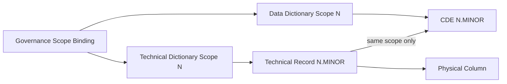

# Thiết kế kỹ thuật và UI/UX Từ điển kỹ thuật theo Scope và Business Version

> Trạng thái tài liệu: **Thiết kế đích để review**.
>
> Tài liệu mô tả màn hình **Từ điển kỹ thuật**, scope của Từ điển kỹ thuật, business version của từng bản ghi kỹ thuật và quy tắc liên kết cùng scope với **Từ điển dữ liệu dùng chung**.
>
> Thiết kế kế thừa ngôn ngữ giao diện, workflow, version selector, bảng dữ liệu và permission model từ [Từ điển dữ liệu dùng chung](./cde-glossary-ui-design.md) và [Chất lượng dữ liệu](./dq-glossary-ui-design.md). Baseline kiến trúc: [Kiến trúc tham chiếu OpenMetadata 1.13.3](./openmetadata-1.13.3-upstream-architecture-reference.md).

## 1. Mục tiêu và nguyên tắc

### 1.1. Mục tiêu

- Cung cấp một danh mục tập trung để tra cứu các trường kỹ thuật đã được thu thập từ hệ thống nguồn.
- Quản lý Từ điển kỹ thuật theo các **scope nghiệp vụ độc lập**.
- Mỗi bản ghi trường kỹ thuật có **business version riêng**, có lịch sử và workflow riêng trong scope.
- Chỉ cho phép một trường kỹ thuật ánh xạ tới CDE thuộc **đúng Data Dictionary scope đã liên kết**.
- Không cho phép liên kết chéo scope dù hai CDE có cùng mã hoặc cùng tên hiển thị.
- Giữ đầy đủ các thuộc tính kỹ thuật trên bảng và modal vì hiện tại không có trang chi tiết riêng.
- Giữ trải nghiệm nhất quán với Từ điển dữ liệu dùng chung và Chất lượng dữ liệu.
- Hỗ trợ xuất Excel đúng scope và đúng phạm vi dữ liệu mà người dùng được phép xem.

### 1.2. Nguyên tắc thiết kế bắt buộc

1. **Scope được nhận diện bằng ID bất biến.** Số version chỉ là nhãn nghiệp vụ, không phải khóa duy nhất để xác nhận cùng scope.
2. **Liên kết scope là một ràng buộc backend.** Frontend lọc option để hỗ trợ trải nghiệm nhưng backend phải từ chối mọi liên kết chéo scope.
3. **CDE reference dùng identity và version chính xác.** Không lưu mã CDE hoặc display name làm khóa liên kết.
4. **Business version của bản ghi kỹ thuật nằm trong scope.** Phần nguyên của version bản ghi phải bằng version scope đang chứa bản ghi.
5. **Published snapshot bất biến.** Sửa một bản ghi đã Approved phải tạo working version kế tiếp; không ghi đè snapshot cũ.
6. **Một physical column có tối đa một technical record identity trong một scope.** Cùng column có thể xuất hiện trong scope khác với identity/snapshot độc lập.
7. **Database là nguồn sự thật cho scope, version, workflow và list nghiệp vụ.** Search index chỉ là projection phục vụ discovery.
8. **Không xây dựng trang chi tiết riêng trong phạm vi hiện tại.** Bảng, version selector và modal phải cho phép xem/sửa đủ thông tin cần thiết.
9. **Không lược bỏ thuộc tính hiện có.** Bảng dùng cuộn ngang và column preference; form dùng section và cuộn dọc.
10. **Authorization được thực thi ở backend.** Ẩn nút theo role/capability ở frontend không thay thế kiểm tra API.

## 2. Phạm vi và thuật ngữ

### 2.1. Trong phạm vi

- Identity cố định của Từ điển kỹ thuật.
- Scope/version của Từ điển kỹ thuật.
- Binding một-một giữa Technical Dictionary scope và Data Dictionary scope.
- Business version và workflow của từng bản ghi kỹ thuật.
- Route, header, scope selector, thống kê, toolbar, filter, bảng và modal.
- Gán CDE cùng scope, survivorship rank và các thuộc tính kỹ thuật.
- Lịch sử version của bản ghi ngay từ bảng/modal.
- Xuất Excel theo scope.
- Permission cho Data Proposer, Data Steward, Data Consumer và Admin.
- Migration dữ liệu hiện có sang scope/version model.

### 2.2. Ngoài phạm vi hiện tại

- Trang chi tiết riêng cho từng trường kỹ thuật.
- Import Excel vào Từ điển kỹ thuật.
- Bulk edit hoặc bulk workflow.
- Tự động đề xuất CDE bằng machine learning.
- Thay đổi tên database, schema, bảng hoặc cột đã đồng bộ từ nguồn.
- Liên kết một Technical Dictionary scope tới nhiều Data Dictionary scope.
- Liên kết một bản ghi kỹ thuật tới CDE ngoài scope để “tham khảo”.
- Tự động remap CDE giữa hai scope chỉ dựa trên mã CDE giống nhau.

### 2.3. Thuật ngữ

| Thuật ngữ | Ý nghĩa |
| --- | --- |
| Technical Dictionary identity | Danh mục hệ thống duy nhất có technical name bất biến `Technical Dictionary` |
| Technical Dictionary scope | Một version nghiệp vụ của Từ điển kỹ thuật, chứa tập technical record của cùng một kỳ/phạm vi quản trị |
| Data Dictionary scope | Một version nghiệp vụ của `Data Dictionary` theo tài liệu CDE |
| Scope binding | Quan hệ bất biến ghép đúng một Technical Dictionary scope với đúng một Data Dictionary scope |
| Technical record identity | Identity của một trường kỹ thuật trong một Technical Dictionary scope |
| Technical record business version | Version nghiệp vụ `N.MINOR` của technical record trong scope `N` |
| Physical column | `Column` metadata do ingestion tạo và cập nhật |
| CDE reference | Liên kết tới đúng CDE identity, CDE business version và Data Dictionary scope |
| Working version | Bản Draft/In Review/Rejected có thể tham gia workflow nhưng chưa phải published snapshot |
| Published version | Snapshot Approved, bất biến và có thể xem lịch sử |

## 3. Mô hình scope

### 3.1. Ba tầng định danh


```mermaid
flowchart LR
  GS[Governance Scope Binding] --> TD[Technical Dictionary Scope N]
  GS --> DD[Data Dictionary Scope N]
  TD --> TR[Technical Record N.MINOR]
  DD --> CDE[CDE N.MINOR]
  TR -->|same scope only| CDE
  TR --> COL[Physical Column]
```

Thiết kế sử dụng ba tầng:

1. **Catalog identity:** `Technical Dictionary` và `Data Dictionary` là hai catalog khác nhau.
2. **Scope/version:** mỗi catalog có version nghiệp vụ riêng nhưng được ghép bằng `scopeId` và exact version identity.
3. **Record version:** technical record và CDE có business version riêng trong scope tương ứng.

### 3.2. Scope binding

Scope binding là object authoritative, tối thiểu gồm:

| Thuộc tính | Kiểu | Quy tắc |
| --- | --- | --- |
| `scopeId` | UUID | ID bất biến, dùng để xác nhận cùng scope |
| `scopeVersion` | Integer | Nhãn nghiệp vụ `N`, duy nhất trong Technical Dictionary |
| `technicalDictionaryVersionId` | UUID | Exact version record của Technical Dictionary |
| `dataDictionaryVersionId` | UUID | Exact version record của Data Dictionary |
| `dataDictionaryBusinessVersion` | String | Snapshot label để hiển thị, không dùng làm khóa |
| `status` | Enum | `Building`, `Active`, `Archived` |
| `createdAt`, `createdBy` | Audit | Bắt buộc |

Ràng buộc:

- `technicalDictionaryVersionId` là duy nhất trong bảng binding.
- Một Technical Dictionary scope liên kết đúng một Data Dictionary scope.
- Một Data Dictionary scope chỉ liên kết tối đa một Technical Dictionary scope trong profile hiện tại.
- Binding không được thay Data Dictionary target sau khi đã có technical record.
- So sánh cùng scope bằng `scopeId`/exact version ID, không chỉ so sánh chuỗi `businessVersion = N`.
- UI có thể hiển thị cùng nhãn `N` cho hai catalog để người dùng dễ hiểu, nhưng backend vẫn xác thực bằng ID.

### 3.3. Vòng đời scope

| Trạng thái | Ý nghĩa | Mutation |
| --- | --- | --- |
| `Building` | Đang tạo technical identities/snapshot cho các column | Chỉ job hệ thống |
| `Active` | Scope đang hoạt động | Cho phép workflow theo capability |
| `Archived` | Scope lịch sử, binding và snapshot bị đóng băng | Chỉ đọc và export |

Luồng tạo scope:

1. Người có capability chọn **Tạo phiên bản mới**.
2. Backend yêu cầu chọn một Data Dictionary scope hợp lệ chưa được binding.
3. Backend tạo `scopeId` và Technical Dictionary version record.
4. Job bootstrap tạo technical record identity cho các physical column đủ điều kiện.
5. Khi bootstrap hoàn tất, scope chuyển từ `Building` sang `Active`.
6. Nếu Data Dictionary scope liên kết chuyển `Archived`, Technical Dictionary scope tương ứng cũng phải chuyển `Archived` hoặc bị khóa mutation ngay trong cùng transaction/outbox workflow.

Không cho phép scope `Active` tiếp tục tạo liên kết mới tới CDE nếu Data Dictionary scope đã Archived.

## 4. Business version của bản ghi kỹ thuật

### 4.1. Technical record identity

Mỗi identity gồm:

| Thuộc tính | Ý nghĩa |
| --- | --- |
| `recordId` | UUID ổn định của technical record trong scope |
| `scopeId` | Scope chứa record |
| `columnId` | ID physical column hiện tại |
| `columnFqn` | Snapshot/locator phục vụ hiển thị và compatibility |
| `technicalName` | Tên kỹ thuật ổn định do backend sinh |

Unique constraint bắt buộc:

```text
UNIQUE(scopeId, columnId)
```

Nếu column ID không còn tồn tại do re-ingestion/migration, reconciliation phải resolve bằng lineage/migration mapping có kiểm soát; không tự nối chỉ vì FQN giống nhau.

### 4.2. Version policy

- Technical Dictionary scope dùng version số nguyên `N`.
- Technical record trong scope `N` dùng version `N.MINOR`.
- Version khởi tạo là `N.0`.
- Sửa bản Approved gần nhất tạo `N.(MINOR + 1)` ở trạng thái Draft.
- Lưu Draft chỉ tăng `workingRevision`, không tăng business version.
- Reject không tăng business version.
- Approved tạo published snapshot bất biến của đúng `N.MINOR`.
- Phần nguyên của technical record business version bắt buộc bằng `scopeVersion`.

Ví dụ:

```text
Technical Dictionary scope: 2
Physical column: MIS.MISDB.ms1.AGR_USER.customer_id

Record versions:
- 2.0 Approved -> CDE1 v2.1
- 2.1 Rejected -> CDE7 v2.0
- 2.2 Draft    -> CDE1 v2.2
```

Tất cả CDE ở ví dụ trên bắt buộc thuộc exact Data Dictionary scope đã binding với Technical Dictionary scope `2`.

### 4.3. Record version payload

| Nhóm | Thuộc tính chính |
| --- | --- |
| Identity | `recordId`, `scopeId`, `columnId`, `columnFqn` |
| Version | `businessVersion`, `workingRevision`, `entityStatus` |
| CDE reference | `cdeTermId`, `cdeBusinessVersion`, `dataDictionaryVersionId` |
| CDE snapshot | `cdeCodeSnapshot`, `cdeNameSnapshot` |
| Đặc tả | `survivorshipRank`, `survivorshipNote`, `elementType`, `generationType`, `creationMethod`, `timeliness`, `systemOwner` |
| Nguồn snapshot | database/schema/table/column/service/data type/description |
| Audit | `createdAt`, `createdBy`, `updatedAt`, `updatedBy`, reviewer/action metadata |

`cdeCodeSnapshot` và `cdeNameSnapshot` chỉ phục vụ lịch sử/hiển thị. Chúng không được dùng để resolve hoặc validate liên kết.

## 5. Invariant liên kết cùng scope

### 5.1. Điều kiện tạo liên kết

Một technical record chỉ được liên kết tới CDE khi tất cả điều kiện sau đúng:

1. Technical record thuộc `scopeId` đang Active.
2. `scopeId` resolve ra đúng `dataDictionaryVersionId` từ scope binding.
3. CDE reference thuộc chính xác `dataDictionaryVersionId` đó.
4. `cde.parentBusinessVersion` khớp scope Data Dictionary đã binding.
5. CDE version được tham chiếu tồn tại và người dùng có quyền xem.
6. CDE ở trạng thái `Approved` tại thời điểm tạo/gửi duyệt mapping.
7. CDE không thuộc một Data Dictionary scope Archived khác.

Backend trả `409 Conflict` hoặc validation error có mã ổn định nếu vi phạm `SCOPE_MISMATCH`.

### 5.2. Những cách liên kết bị cấm

- Tìm CDE toàn cục theo `name = CDE1` rồi lấy bản đầu tiên.
- Ghép scope chỉ vì phần nguyên business version giống nhau.
- Fallback từ CDE không tồn tại trong scope mới sang CDE cùng mã ở scope cũ.
- Lưu chỉ `cdeCode`, `cdeName` hoặc FQN display làm reference authoritative.
- Cho phép URL/query parameter thay đổi scope nhưng vẫn giữ `cdeTermId` cũ.
- Clone mapping sang scope mới trước khi xác nhận target CDE cùng scope.

### 5.3. Hiển thị historical reference

- Khi xem Technical Dictionary scope Archived, UI hiển thị CDE snapshot đúng version đã lưu.
- Link tới CDE lịch sử phải mang đủ `businessVersion` và `parentBusinessVersion`.
- Historical reference được xem nhưng không được chọn lại cho mutation ở scope Active khác.

## 6. Mô hình trạng thái và workflow

### 6.1. Trạng thái technical record

```text
Draft ──submit──> In Review ──approve──> Approved
  ▲                    │
  │                    └──reject──> Rejected ──reopen──> Draft
  └──── create next version from Approved ──────────────┘
```

| Trạng thái | Chỉnh sửa | Hành động chính |
| --- | --- | --- |
| Draft | Có capability | Lưu nháp, Gửi duyệt |
| In Review | Không | Phê duyệt, Từ chối |
| Rejected | Qua Reopen | Chỉnh sửa lại |
| Approved | Bất biến | Tạo version kế tiếp, Thu hồi theo policy |
| Scope Archived | Không | Xem lịch sử, Xuất Excel |

### 6.2. Validation khi submit/approve

- Record và CDE phải cùng scope theo Mục 5.
- CDE reference vẫn tồn tại và vẫn Approved.
- Các field bắt buộc hợp lệ theo schema.
- `workingRevision` phải khớp optimistic lock.
- Không tồn tại working version khác của cùng `recordId` trong scope.
- Survivorship rank không xung đột theo rule nghiệp vụ của cùng CDE nếu rank bắt buộc duy nhất.

## 7. Phân quyền

UI sử dụng capability backend, không suy diễn quyền cuối cùng từ tên role.

| Capability | Consumer | Proposer | Steward | Admin |
| --- | ---: | ---: | ---: | ---: |
| `canViewPublished` | Có | Có | Có | Có |
| `canViewWorking` | Không | Theo ownership | Có | Có |
| `canEditWorking` | Không | Theo ownership | Không mặc định | Có |
| `canSubmit` | Không | Có | Không mặc định | Có |
| `canApprove` | Không | Không | Có | Có |
| `canReject` | Không | Không | Có | Có |
| `canRevoke` | Không | Không | Theo policy | Có |
| `canCreateScope` | Không | Không | Theo policy | Có |
| `canExport` | Có | Có | Có | Có |

Backend áp dụng scope, status visibility và ownership trước khi tính `total`, sort và pagination.

## 8. Cấu trúc màn hình

```text
Quản trị / Từ điển kỹ thuật

┌────────────────────────────────────────────────────────────────────────┐
│ [Icon] Từ điển kỹ thuật  [Active] [Phiên bản scope: 2 ▾]               │
│        Scope CDE: Data Dictionary v2                    [Tạo version]   │
├────────────────┬────────────────┬────────────────┬─────────────────────┤
│ Tổng cột       │ Bảng dữ liệu   │ Đã quy chiếu  │ Hệ thống nguồn      │
│ 65.928         │ 2.795          │ 31.204         │ 12                  │
└────────────────┴────────────────┴────────────────┴─────────────────────┘

┌────────────────────────────────────────────────────────────────────────┐
│ [Tìm kiếm] [Trạng thái] [Nguồn] [CDE] [Loại TT] [Loại trường] [⋯]     │
├────────────────────────────────────────────────────────────────────────┤
│ Database │ Schema │ Bảng │ Cột │ CDE │ Version │ Status │ Action       │
│ ...                                                                    │
└────────────────────────────────────────────────────────────────────────┘
```

Màn hình gồm:

1. Breadcrumb.
2. Entity header và scope selector.
3. Bốn card thống kê theo scope.
4. Toolbar, filter và menu thao tác.
5. Bảng technical record versions.
6. Modal chỉnh sửa/version history.

## 9. Header và scope selector

### 9.1. Entity header

- Header dùng cùng visual language với Từ điển dữ liệu dùng chung.
- Icon có khung trung tính; tiêu đề `24px`, font weight `600`.
- Mô tả nằm dưới tiêu đề.
- Hiển thị badge trạng thái của Technical Dictionary scope.
- Hiển thị dòng binding: **“Scope CDE: Data Dictionary vN”**.
- Nút trực diện **Tạo phiên bản mới** chỉ hiển thị khi scope hiện tại cho phép và actor có `canCreateScope`.

### 9.2. Scope selector

- Nhãn: **Phiên bản scope: N**.
- Mỗi option hiển thị version, trạng thái và Data Dictionary version đã binding.
- Consumer chỉ thấy scope Active/Archived được phép xem.
- Người có quyền working thấy cả Building/working scope theo capability.
- Chuyển scope cập nhật URL và reset search/filter/page.
- Scope Archived luôn read-only.
- Scope `Building` hiển thị progress và chưa cho mutation record.

URL canonical:

```text
/technical-dictionary?scopeId={uuid}&scopeVersion={N}&currentPage=1&pageSize=50
```

`scopeId` là khóa authoritative. `scopeVersion` dùng để URL dễ đọc và backend phải kiểm tra hai giá trị tương thích; không fallback nếu mismatch.

## 10. Card thống kê

Tất cả số liệu được tính trong Technical Dictionary scope đang chọn và theo visibility của người dùng.

| Card | Ý nghĩa |
| --- | --- |
| Tổng Cột kỹ thuật | Số technical record identity trong scope |
| Bảng dữ liệu | Số table phân biệt của các record trong scope |
| Đã quy chiếu CDE | Số record version hiệu lực có CDE reference cùng scope |
| Hệ thống nguồn | Số service phân biệt trong scope |

Quy chuẩn UI:

- Desktop: bốn card trên một hàng.
- Tablet: hai card trên một hàng.
- Mobile: một card trên một hàng.
- Số liệu `22px`, icon màu nhẹ, chiều cao tối thiểu `86px`.
- Card không drill-down nếu chưa có query contract tương ứng.

## 11. Toolbar, tìm kiếm và bộ lọc

### 11.1. Tìm kiếm

- Placeholder: **“Tìm kiếm tên bảng, cột, mã CDE...”**.
- Search chỉ chạy trong `scopeId` đang chọn.
- Hỗ trợ tìm theo database, schema, table, column, CDE code và CDE name snapshot.
- Debounce 300–500 ms; Enter chạy ngay.
- Mỗi thay đổi reset page về 1; response cũ bị hủy hoặc bỏ qua bằng request generation.

### 11.2. Bộ lọc

| Bộ lọc | Giá trị |
| --- | --- |
| Trạng thái | Draft, In Review, Rejected, Approved |
| Nguồn | Service thuộc scope |
| Mã CDE quy chiếu | Đã gán/Chưa gán hoặc CDE cùng scope |
| Loại thành tố | Atomic/Transformed |
| Loại trường dữ liệu | Manual/System generated/System derived/File upload |
| Phiên bản bản ghi | Latest, tất cả version hoặc version cụ thể |

Quy tắc:

- Nhiều giá trị cùng nhóm kết hợp `OR`; các nhóm kết hợp `AND`.
- Filter state đồng bộ vào URL.
- Consumer không thấy option working status.
- Mặc định bảng hiển thị version hiệu lực mới nhất theo visibility. Chế độ **Tất cả phiên bản** hiển thị các row version ngang hàng.

### 11.3. Menu ba chấm

- Không có nút Reload riêng.
- Menu ba chấm nằm trước **Tùy chỉnh** cột.
- Các action theo capability/scope status:
  - **Xuất Excel**.
  - Các action quản trị khác chỉ bổ sung khi có contract cụ thể.

## 12. Bảng danh sách

### 12.1. Thứ tự cột

1. Tên cơ sở dữ liệu.
2. Tên schema.
3. Tên bảng.
4. Tên cột.
5. Nguồn.
6. Mã CDE quy chiếu.
7. Tên thành tố CDE.
8. Phiên bản CDE.
9. Thứ hạng (`Rank`).
10. Loại dữ liệu.
11. Loại thành tố.
12. Loại trường dữ liệu.
13. Phương thức tạo.
14. Thời gian.
15. Chủ sở hữu hệ thống.
16. Mô tả.
17. Phiên bản bản ghi.
18. Trạng thái.
19. Thao tác.

### 12.2. Quy tắc hiển thị version

- Mặc định mỗi `recordId` hiển thị version mới nhất mà actor được phép xem.
- Chế độ **Tất cả phiên bản** hiển thị các version ngang hàng, sắp xếp cùng record cạnh nhau và version mới nhất ở trên.
- Version working và published của cùng record không được trộn scope.
- Badge version hiển thị `vN.MINOR`.
- Click badge/version mở version selector hoặc modal lịch sử vì chưa có trang detail.
- Historical/Approved version luôn read-only.

### 12.3. Hiển thị cell

- Database, schema và table điều hướng tới entity khi có FQN.
- Mã CDE điều hướng tới đúng historical CDE route với đủ scope/version.
- Không tạo link CDE bằng `Data Dictionary.${cdeCode}` nếu thiếu exact reference.
- Nguồn, kiểu dữ liệu và classification dùng pastel badge.
- Thứ hạng dùng `SurvivorshipBadge`.
- Giá trị thiếu hiển thị `--`.
- Cột thao tác fixed bên phải; bảng resizable và có column preference theo schema version mới.

Column preference key mới:

```text
technicalDictionaryTableColumns_v6
```

Không tái sử dụng `v5` vì schema bổ sung cột version và semantics scope.

### 12.4. Cột bắt buộc không được ẩn

- Tên cơ sở dữ liệu.
- Tên bảng.
- Tên cột.
- Phiên bản bản ghi.
- Trạng thái.
- Thao tác.

### 12.5. Phân trang

- Database áp dụng scope, permission, search và filter trước `total`, sort và pagination.
- Không page search index rồi hydrate/filter trong application.
- Hỗ trợ page size chuẩn 10/15/25/50 theo component dùng chung.

## 13. Modal chỉnh sửa bản ghi kỹ thuật

### 13.1. Nguyên tắc

- Modal rộng `720px`, cuộn dọc và responsive một cột trên mobile.
- Tiêu đề thay đổi theo ngữ cảnh:
  - **Chỉnh sửa trường kỹ thuật** cho Draft hiện có.
  - **Tạo phiên bản mới** khi sửa một bản Approved.
  - **Xem phiên bản trường kỹ thuật** cho historical/read-only.
- Dòng phụ hiển thị `Database / Schema / Table / Column`.
- Scope, business version và trạng thái luôn hiển thị read-only ở đầu form.

### 13.2. Nhóm 1 — Thông tin scope và phiên bản

| Trường | Control | Hành vi |
| --- | --- | --- |
| Technical Dictionary scope | Read-only | `vN` |
| Data Dictionary scope | Read-only | Catalog/version đã binding |
| Phiên bản bản ghi | Read-only | `vN.MINOR` |
| Trạng thái | Badge read-only | Draft/In Review/Rejected/Approved |

### 13.3. Nhóm 2 — Thông tin trường kỹ thuật

| Trường | Control | Hành vi |
| --- | --- | --- |
| Tên bảng | Input disabled | Đồng bộ từ Table |
| Tên cột | Input disabled | Đồng bộ từ Column |

Database, schema, service và data type vẫn có thể hiển thị dưới dạng contextual summary ở header/section; không cho chỉnh sửa.

### 13.4. Nhóm 3 — Thông tin đặc tả và quy chiếu

| Trường | Control | Bắt buộc | Mặc định khi tạo `N.0` |
| --- | --- | --- | --- |
| Mã CDE quy chiếu | Async searchable Select | Không | Trống |
| Thứ hạng sinh tồn | Select 1–5 | Không | Chưa gán |
| Loại thành tố | Select | Có | `AtomicDataElement` |
| Loại trường dữ liệu | Select | Có | `ManualInput` |
| Phương thức tạo | Select | Có | `NotApplicable` |
| Thời gian | Input | Không | `T` |
| Chủ sở hữu hệ thống | Input | Không | Trống |
| Mô tả | Markdown/Text area | Theo nghiệp vụ | Snapshot từ Column |

### 13.5. CDE selector cùng scope

- Selector gọi API với `scopeId` và exact `dataDictionaryVersionId` từ binding; client không tự dựng filter từ số version.
- Chỉ trả CDE Approved thuộc đúng Data Dictionary scope.
- Placeholder: **“Tìm theo mã hoặc tên CDE trong Data Dictionary vN”**.
- Option hiển thị `Mã CDE · Tên thành tố · vN.MINOR`.
- Header dropdown hiển thị `Data Dictionary vN · Approved`.
- Không tải cứng tối đa 1.000 CDE; dùng async search và pagination.
- Khi đổi scope, mọi option/cache CDE scope trước phải bị xóa.
- Khi mở historical version, selector chuyển read-only và hiển thị exact historical CDE reference.
- Nếu không có CDE Approved trong scope, disable selector và hiển thị empty state rõ ràng; không fallback scope cũ.

### 13.6. Save và workflow

- **Lưu nháp** cập nhật working revision, không tăng business version.
- **Gửi duyệt** validate same-scope invariant lần cuối ở backend.
- **Phê duyệt** tạo published snapshot bất biến.
- **Tạo phiên bản mới** từ Approved copy nội dung sang `N.(MINOR+1)` Draft trong cùng scope.
- Double-click chỉ phát một request.
- Conflict optimistic lock hiển thị thông báo yêu cầu tải bản mới; không ghi đè im lặng.

## 14. REST contract đề xuất

### 14.1. Scope

```http
GET  /v1/technical-dictionary/scopes
GET  /v1/technical-dictionary/scopes/{scopeId}
POST /v1/technical-dictionary/scopes
POST /v1/technical-dictionary/scopes/{scopeId}/archive
```

Tạo scope yêu cầu:

```json
{
  "dataDictionaryVersionId": "uuid",
  "expectedDataDictionaryBusinessVersion": "2"
}
```

Backend tạo `scopeId`; client không được tự gửi ID hoặc binding tùy ý.

### 14.2. List/search technical records

```http
GET /v1/technical-dictionary/scopes/{scopeId}/records
  ?q=customer
  &statuses=Approved,Draft
  &sources=MIS
  &cdeMapping=MAPPED
  &versionView=LATEST
  &page=1
  &limit=50
```

Response tối thiểu:

```json
{
  "scope": {
    "id": "scope-uuid",
    "businessVersion": "2",
    "status": "Active",
    "dataDictionaryVersionId": "dd-version-uuid",
    "dataDictionaryBusinessVersion": "2"
  },
  "data": [],
  "paging": {
    "total": 65928,
    "page": 1,
    "limit": 50
  },
  "capabilities": {}
}
```

### 14.3. Record version và workflow

```http
GET  /v1/technical-dictionary/scopes/{scopeId}/records/{recordId}/versions
GET  /v1/technical-dictionary/scopes/{scopeId}/records/{recordId}?businessVersion=2.1
POST /v1/technical-dictionary/scopes/{scopeId}/records/{recordId}/versions
PATCH /v1/technical-dictionary/scopes/{scopeId}/records/{recordId}/working
POST /v1/technical-dictionary/scopes/{scopeId}/records/{recordId}/submit
POST /v1/technical-dictionary/scopes/{scopeId}/records/{recordId}/approve
POST /v1/technical-dictionary/scopes/{scopeId}/records/{recordId}/reject
POST /v1/technical-dictionary/scopes/{scopeId}/records/{recordId}/reopen
POST /v1/technical-dictionary/scopes/{scopeId}/records/{recordId}/revoke
```

Mọi mutation yêu cầu `expectedWorkingRevision` hoặc `If-Match`.

### 14.4. CDE selector

```http
GET /v1/technical-dictionary/scopes/{scopeId}/cde-options
  ?q=CDE1
  &status=Approved
  &page=1
  &limit=25
```

Backend tự resolve `dataDictionaryVersionId` từ binding. API không nhận Data Dictionary scope tùy ý từ client để tránh parameter tampering.

### 14.5. Thống kê và export

```http
GET /v1/technical-dictionary/scopes/{scopeId}/stats
GET /v1/technical-dictionary/scopes/{scopeId}/export?format=xlsx
```

Export là server-side, áp dụng authorization và exact scope trước khi sinh file.

## 15. Persistence và projection về OpenMetadata

### 15.1. Nguồn sự thật

Nguồn sự thật cho nghiệp vụ mới là các record scope/version trong database. `Column.tags` và `Column.extension` trở thành projection để:

- Tương thích trang asset hiện có.
- Hỗ trợ global discovery.
- Hiển thị liên kết CDE trên Table/Column.

Không đọc `có glossary tag = Approved` để suy diễn trạng thái authoritative.

### 15.2. Ghi dữ liệu

Một workflow commit phải ghi nguyên tử hoặc qua outbox có retry/idempotency:

1. Technical record version/snapshot.
2. CDE reference exact version.
3. Survivorship rule tương ứng.
4. Projection sang Column tags/extension.
5. Event reindex/audit.

Không để client tự patch Table rồi patch GlossaryTerm như hai mutation độc lập không có transaction contract.

### 15.3. Survivorship rule

Rule phải mang tối thiểu:

```json
{
  "technicalRecordId": "uuid",
  "technicalRecordBusinessVersion": "2.1",
  "scopeId": "uuid",
  "assetId": "column-uuid",
  "assetFqnSnapshot": "MIS.MISDB.ms1.AGR_USER.customer_id",
  "rank": 1
}
```

Khi xem lịch sử, rule resolve theo record/version/scope; không chỉ theo `assetFqn` mutable.

## 16. Xuất Excel

- Người dùng chọn **Xuất Excel** trong menu ba chấm.
- File `.xlsx`, tên:

```text
TuDienKyThuat_Agribank_v{scopeVersion}_yyyy-MM-dd.xlsx
```

- Worksheet: **Từ điển kỹ thuật vN**.
- Export chứa toàn bộ technical record versions mà actor được phép xem trong exact scope đang chọn.
- Mặc định export không phụ thuộc page hiện tại.
- Quyết định áp dụng/không áp dụng search và filter phải là query parameter tường minh; không phụ thuộc state ngầm trên client.
- File bổ sung các cột:
  - Technical Dictionary scope version.
  - Technical record business version.
  - Record status.
  - Data Dictionary version.
  - CDE business version.
- File không chứa UUID nội bộ trừ khi có chế độ export kỹ thuật riêng.

## 17. Responsive, accessibility và trạng thái UI

### 17.1. Responsive/accessibility

- Từ `1200px` trở xuống: thống kê hai cột.
- Từ `767px` trở xuống: thống kê và form một cột.
- Modal rộng `calc(100vw - 24px)` trên mobile.
- Scope selector, version selector và menu action dùng keyboard được.
- Badge không chỉ truyền đạt bằng màu; luôn có text.
- Action icon có tooltip và accessible name.
- Focus state dùng màu primary.

### 17.2. Trạng thái giao diện

| Trạng thái | Yêu cầu |
| --- | --- |
| Scope Building | Hiển thị progress, disable mutation |
| Loading list | Spinner/skeleton trong vùng bảng |
| Không có record | Empty state theo scope |
| Không có kết quả | Gợi ý đổi search/filter |
| CDE scope không khả dụng | Disable selector; không fallback |
| Đang lưu | Disable submit lặp |
| Conflict | Giữ dữ liệu form, yêu cầu reload/merge |
| Scope mismatch | Hiển thị lỗi rõ Data Dictionary/CDE scope không tương thích |
| Scope Archived | Toàn bộ read-only, vẫn cho export |

## 18. Migration từ dữ liệu hiện tại

### 18.1. Tạo scope ban đầu

1. Resolve Data Dictionary scope Active hiện tại.
2. Tạo Technical Dictionary scope đầu tiên và binding exact Data Dictionary version ID.
3. Gán `scopeVersion` tương ứng theo quyết định migration được duyệt.
4. Snapshot danh sách physical column vào technical record identities.

### 18.2. Chuyển đổi bản ghi

Với mỗi column:

- Tạo `recordId` và version khởi tạo `N.0`.
- Copy thuộc tính kỹ thuật hiện có.
- Nếu có CDE tag, resolve exact CDE identity/version trong Data Dictionary scope đã binding.
- Chỉ tạo CDE reference nếu resolve duy nhất và cùng scope.
- Nếu tag trỏ sang scope khác, đánh dấu migration error `SCOPE_MISMATCH`; không tự remap theo mã.
- Nếu không resolve được CDE, giữ record Draft/chưa gán và đưa vào báo cáo đối soát.
- Status lấy từ migration rule đã chốt; không mặc định `có CDE = Approved` nếu thiếu bằng chứng workflow.

### 18.3. Rollout

1. Tạo schema và backfill ở chế độ read-only.
2. Chạy báo cáo đối soát count, mapping và scope mismatch.
3. Bật dual-read để so sánh projection cũ với model mới.
4. Chuyển list/detail/workflow sang database model mới.
5. Bật outbox projection về Column/search index.
6. Gỡ logic suy diễn status và CDE bằng tag sau thời gian compatibility.

## 19. Ánh xạ mã nguồn dự kiến

| Hạng mục | Hiện tại | Thay đổi chính |
| --- | --- | --- |
| Page/header/list | `TechnicalDictionaryPage.component.tsx` | Thêm scope/version state; dùng API DB-backed |
| Bảng | `TechnicalDictionaryTable.component.tsx` | Thêm record/CDE version columns và version mode |
| Modal | `TechnicalDictionaryEditModal.component.tsx` | Thêm scope/version/status; async same-scope CDE selector |
| Styling | `technicalDictionary.less` | Style scope/version badges và historical/read-only state |
| Constants | `TechnicalDictionary.constants.ts` | Column schema `v6`, filter/version keys |
| Metadata parser | `TechnicalDictionaryMetadata.ts` | Chỉ còn compatibility/source snapshot helper |
| REST client | File mới trong `rest/` | Scope/list/version/workflow/export APIs |
| Backend resource | Module mới/chuyên biệt | Scope, record version, capability và export contract |
| Persistence | Migration/schema mới | Scope binding, identity, working và published snapshots |

## 20. Quyết định đã chốt và điểm cần review

### 20.1. Quyết định đã chốt trong thiết kế này

| ID | Quyết định |
| --- | --- |
| TD-D01 | Scope authoritative dùng UUID/exact version ID, không dùng chuỗi version đơn thuần |
| TD-D02 | Một Technical Dictionary scope binding đúng một Data Dictionary scope |
| TD-D03 | Chỉ CDE Approved trong cùng scope được chọn cho mapping mới |
| TD-D04 | Technical record version dùng `N.MINOR`, phần nguyên khớp Technical Dictionary scope `N` |
| TD-D05 | Approved snapshot bất biến; chỉnh sửa tạo version kế tiếp |
| TD-D06 | Cross-scope mapping bị backend từ chối, không fallback theo CDE code |
| TD-D07 | DB là nguồn sự thật; tags/extension/search là projection |
| TD-D08 | Không có trang detail; bảng và modal giữ đầy đủ thuộc tính |

### 20.2. Điểm cần review

| ID | Câu hỏi | Khuyến nghị |
| --- | --- | --- |
| TD-R01 | Scope mới copy mapping từ scope cũ hay khởi tạo trắng? | Chỉ copy khi có mapping table được duyệt giữa exact CDE identities; mặc định không tự copy |
| TD-R02 | Scope Technical Dictionary có bắt buộc cùng số version hiển thị với Data Dictionary? | Có thể hiển thị cùng `N`, nhưng vẫn dùng binding ID làm authoritative |
| TD-R03 | Khi Data Dictionary scope Archived, Technical Dictionary scope archive ngay hay có grace period? | Archive/khóa mutation đồng bộ để không tạo mapping vào scope đóng |
| TD-R04 | Version `N.0` ban đầu của record có status gì? | Draft trừ khi migration có bằng chứng Approved hợp lệ |
| TD-R05 | Export áp dụng filter hiện tại hay toàn scope? | Mặc định toàn scope được phép xem; nếu hỗ trợ filter phải gửi query rõ ràng |
| TD-R06 | Rank có phải duy nhất trong cùng CDE không? | Chốt invariant backend trước khi approve |
| TD-R07 | Column mới ingest sau khi scope Active xử lý thế nào? | Tạo identity + `N.0 Draft` bằng event/outbox idempotent |
| TD-R08 | Column bị xóa/đổi FQN xử lý ra sao? | Giữ historical record; dùng column ID/migration mapping, không nối bằng FQN mù |
| TD-R09 | Cho phép technical record tham chiếu CDE Approved cũ trong cùng scope hay chỉ latest Approved? | Nên lưu exact version; selector mặc định latest Approved nhưng cho policy quyết định lịch sử |

## 21. Tiêu chí chấp nhận

### 21.1. Scope

1. Mỗi Technical Dictionary scope có `scopeId` và binding tới exact Data Dictionary version.
2. URL và mọi API list/mutation mang `scopeId`.
3. Chuyển scope không giữ lại CDE option/cache từ scope trước.
4. Scope Archived chỉ đọc và vẫn export được.
5. Scope Building không cho record mutation.

### 21.2. Business version

1. Mỗi technical record có `recordId` và business version `N.MINOR`.
2. Phần nguyên record version khớp scope version.
3. Approved snapshot không bị ghi đè.
4. Sửa Approved tạo version Draft kế tiếp.
5. Version selector/history không hiển thị record từ scope khác.

### 21.3. Same-scope CDE mapping

1. CDE selector chỉ trả CDE Approved từ Data Dictionary scope đã binding.
2. Backend từ chối CDE của scope khác với mã lỗi `SCOPE_MISMATCH`.
3. Không có fallback theo CDE code/name/FQN display.
4. CDE link lịch sử chứa đủ parent scope và business version.
5. Export ghi đúng Technical Dictionary scope, Data Dictionary version và CDE version.

### 21.4. UI và workflow

1. Header hiển thị scope version, status và Data Dictionary binding.
2. Thống kê, search, filter, total và pagination đều scope-aware.
3. Bảng có cột business version của record và CDE.
4. Modal hiển thị scope/version/status read-only và giữ đủ thuộc tính hiện tại.
5. Permission lấy từ capability backend.
6. Save/submit/approve dùng optimistic lock.
7. Export chạy server-side trên exact scope và authorization hiện hành.

## 22. Tài liệu tham khảo

- [Thiết kế Từ điển dữ liệu dùng chung](./cde-glossary-ui-design.md).
- [Thiết kế Chất lượng dữ liệu](./dq-glossary-ui-design.md).
- [Kiến trúc tham chiếu OpenMetadata 1.13.3](./openmetadata-1.13.3-upstream-architecture-reference.md).
