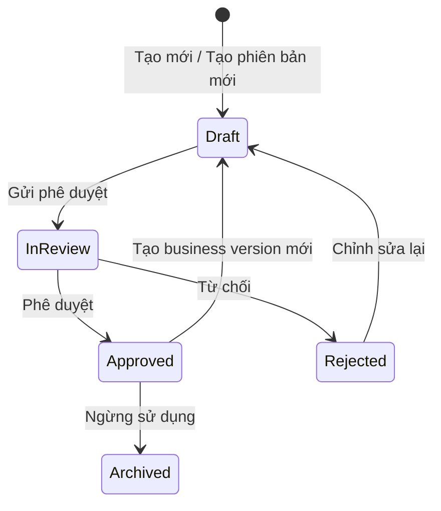
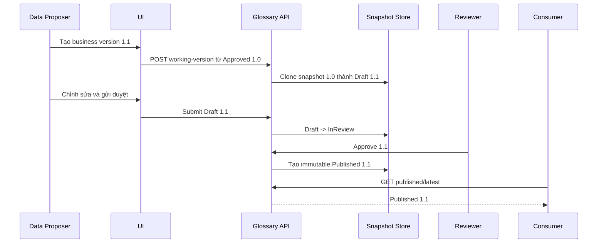

# Thiết kế luồng Glossary và Glossary Term theo Version, Workflow và Role

## 1. Mục tiêu

Tài liệu này mô tả thiết kế mong muốn cho Glossary và Glossary Term, bao gồm:

- Phân biệt working version và published version.
- Nội dung từng Role được phép nhìn thấy.
- Hành vi màn hình khi người dùng tạo, chỉnh sửa, gửi duyệt, phê duyệt, từ chối và xem lịch sử.
- Quan hệ giữa version của Glossary và version của Glossary Term.
- Các nhược điểm của implementation hiện tại và hướng xử lý.

Thiết kế ưu tiên nguyên tắc: Consumer luôn nhìn thấy bản Approved ổn định gần nhất và không bị ảnh hưởng bởi Draft/In Review đang được chỉnh sửa.

## 2. Khái niệm

### 2.1. Glossary

Glossary là tập hợp có quản trị của nhiều Glossary Term. Trong trường hợp Từ điển dữ liệu dùng chung, mỗi bản phát hành Glossary phải xác định chính xác các Term và phiên bản Term thuộc bản phát hành đó.

### 2.2. Glossary Term

Glossary Term là một mục từ hoặc CDE thuộc Glossary. Term có workflow và business version riêng, độc lập với native metadata version của OpenMetadata.

### 2.3. Hai loại version

| Loại version | Ví dụ | Mục đích |
| --- | --- | --- |
| Native metadata version | `0.1`, `0.2`, `1.0` | OpenMetadata sử dụng để lưu lịch sử thay đổi kỹ thuật của entity. |
| Business version | `1.0`, `1.1`, `2.0` | Người dùng nghiệp vụ sử dụng để phát hành Glossary/CDE. |

Hai loại version phải được đặt tên và xử lý tách biệt. Không dùng `version` mà không xác định đó là `nativeVersion` hay `businessVersion`.

### 2.4. Working version và published version

- **Working version**: bản đang soạn thảo hoặc đang chờ duyệt. Chỉ người có quyền quản trị nội dung được nhìn thấy.
- **Published version**: snapshot bất biến đã Approved. Consumer sử dụng bản này.
- Mỗi Glossary hoặc Glossary Term chỉ có tối đa một working version tại một thời điểm, nhưng có thể có nhiều published version trong lịch sử.

## 3. Mô hình trạng thái



Quy tắc:

- `Draft`: được chỉnh sửa bởi Proposer và các Role có quyền quản trị.
- `InReview`: khóa các trường nghiệp vụ; chỉ cho phép Reviewer/Steward phê duyệt hoặc từ chối.
- `Rejected`: không hiển thị cho Consumer; người soạn thảo có thể đưa về Draft để sửa.
- `Approved`: snapshot bất biến và được hiển thị cho Consumer.
- `Archived`: vẫn xem được trong lịch sử nhưng không phải bản mặc định.
- Không coi thiếu `entityStatus` là Approved. Phương án triển khai mới không hỗ trợ dữ liệu thiếu trạng thái; môi trường phải được khởi tạo lại với dữ liệu tuân thủ schema mới.

## 4. Role và phạm vi trách nhiệm

### 4.1. Các Role nghiệp vụ

| Role | Trách nhiệm chính |
| --- | --- |
| Admin | Quản trị toàn bộ, xử lý ngoại lệ và cấu hình hệ thống. |
| Organization | Role hệ thống có quyền theo policy; không mặc định là Consumer. |
| Data Steward | Kiểm soát chất lượng, duyệt/từ chối và quản trị nội dung được giao. |
| Reviewer | Người được gán trực tiếp vào Glossary/Term để duyệt. Đây có thể là assignment, không nhất thiết là một Role hệ thống riêng. |
| Data Proposer | Tạo Draft, chỉnh sửa và gửi duyệt. |
| Data Consumer | Khai thác nội dung đã được phê duyệt. |
| Basic Consumer | Chỉ đọc nội dung đã được phê duyệt với tập chức năng tối thiểu. |

Quyền thực tế phải được backend xác định từ Role, policy, quyền trên entity và reviewer assignment. Frontend chỉ dùng kết quả quyền từ backend để điều khiển giao diện.

### 4.2. Ma trận nội dung được nhìn thấy

| Nội dung | Admin | Data Steward | Reviewer được gán | Data Proposer | Data Consumer | Basic Consumer |
| --- | --- | --- | --- | --- | --- | --- |
| Glossary Draft | Có | Có trong phạm vi quản lý | Có khi được gán duyệt | Có khi là owner/người tạo hoặc có quyền edit | Không | Không |
| Glossary In Review | Có | Có | Có khi được gán duyệt | Có, chỉ đọc | Không | Không |
| Glossary Approved mới nhất | Có | Có | Có | Có | Có | Có |
| Glossary Approved cũ | Có | Có | Có | Có | Có nếu được phép xem lịch sử | Có nếu được phép xem lịch sử |
| Term Draft/Rejected | Có | Có trong phạm vi quản lý | Có khi liên quan phiên duyệt | Có khi được phép chỉnh sửa | Không | Không |
| Term In Review | Có | Có | Có khi được gán duyệt | Có, chỉ đọc | Không | Không |
| Term Approved | Có | Có | Có | Có | Có | Có |
| Audit/workflow history | Có | Có | Có trong phạm vi được giao | Có với entity liên quan | Không mặc định | Không |
| Import | Có | Theo policy | Không mặc định | Theo policy | Không | Không |
| Export | Có | Có | Có | Có | Có | Có |

### 4.3. Ma trận thao tác

| Thao tác | Admin | Data Steward | Reviewer | Data Proposer | Data Consumer | Basic Consumer |
| --- | --- | --- | --- | --- | --- | --- |
| Tạo Glossary/Term | Có | Theo policy | Không | Có | Không | Không |
| Tạo business version mới | Có | Theo policy | Không | Có | Không | Không |
| Chỉnh sửa Draft | Có | Theo policy | Không mặc định | Có | Không | Không |
| Gửi duyệt | Có | Theo policy | Không | Có | Không | Không |
| Approve/Reject | Có | Có | Có khi được gán | Không | Không | Không |
| Thu hồi Approved | Có | Có theo policy | Không mặc định | Không | Không | Không |
| Xóa | Có | Theo policy | Không | Theo policy với Draft | Không | Không |
| Xem/chọn version | Có | Có | Có | Có | Chỉ Approved | Chỉ Approved |

## 5. Thiết kế version của Glossary và Glossary Term

### 5.1. Snapshot của Glossary

Published Glossary không được chỉ lưu danh sách `termIds`. Snapshot phải tham chiếu chính xác phiên bản của từng Term:

```json
{
  "glossaryId": "...",
  "businessVersion": "1.0",
  "status": "Approved",
  "publishedAt": 0,
  "publishedBy": "...",
  "terms": [
    {
      "termId": "...",
      "termBusinessVersion": "1.0",
      "termNativeVersion": "0.8"
    }
  ]
}
```

Quy tắc:

- Snapshot Approved là bất biến.
- Glossary 1.0 luôn hiển thị đúng Term version đã được đóng gói lúc phát hành.
- Term 1.1 được tạo sau đó không làm thay đổi nội dung của Glossary 1.0.
- Xóa hoặc đổi tên Term hiện hành không được phá vỡ snapshot đã phát hành.

### 5.2. Tạo business version mới của Glossary

Khi tạo Glossary 1.1 từ Glossary 1.0:

1. Sao chép danh sách Term revision từ published snapshot 1.0.
2. Tạo working snapshot 1.1 ở trạng thái Draft.
3. Người dùng thêm, bỏ hoặc thay đổi version Term trong working snapshot.
4. Published snapshot 1.0 không thay đổi.

Không reset danh sách Term về rỗng theo mặc định. Nếu nghiệp vụ cần một bản trắng, cung cấp lựa chọn riêng “Tạo phiên bản trống”.

### 5.3. Điều kiện phê duyệt Glossary

Glossary chỉ được Approved khi:

- Không còn Term Draft, In Review hoặc Rejected trong working snapshot.
- Mỗi Term reference trỏ tới một Term Approved xác định.
- Không có Term bị xóa hoặc không còn quyền truy cập.
- Business version không trùng với một published version đã tồn tại.
- Validation nghiệp vụ bắt buộc đã đạt.

Backend phải kiểm tra các điều kiện trên trong cùng transaction phê duyệt; frontend validation chỉ có tác dụng hỗ trợ người dùng.

## 6. Luồng màn hình Glossary

### 6.1. Danh sách Glossary

#### Admin, Data Steward, Reviewer và Data Proposer

Mỗi Glossary hiển thị:

- Tên và mô tả.
- Badge trạng thái của working version nếu có.
- Business version của working version.
- Published version mới nhất.
- Số lượng Term trong working/published snapshot tương ứng.

Cho phép lọc theo `Draft`, `In Review`, `Rejected`, `Approved`, owner và reviewer nếu Role có quyền.

#### Data Consumer và Basic Consumer

- Chỉ hiển thị Glossary có ít nhất một published version.
- Luôn hiển thị published version mới nhất, kể cả khi phía quản trị đang có Draft mới.
- Không hiển thị dấu hiệu hoặc dữ liệu của working version.
- Glossary chưa từng Approved không xuất hiện trong danh sách và không truy cập được bằng URL trực tiếp.

### 6.2. Trang chi tiết Glossary

Header cần hiển thị rõ:

- Tên Glossary.
- `Business version`.
- Badge trạng thái.
- Nhãn `Bản đang làm việc` hoặc `Bản đã phát hành`.
- Dropdown chọn version phù hợp với Role.

| Trạng thái/ngữ cảnh | Nội dung màn hình |
| --- | --- |
| Draft | Form có thể chỉnh sửa; nút Lưu, Gửi duyệt và Hủy thay đổi theo quyền. |
| In Review | Nội dung chỉ đọc; Reviewer thấy Approve/Reject; Proposer thấy trạng thái đang chờ duyệt. |
| Rejected | Hiển thị người từ chối và thời gian; Proposer thấy nút Chỉnh sửa lại. |
| Approved hiện hành | Nội dung chỉ đọc; Role quản trị thấy Tạo phiên bản mới hoặc Thu hồi phê duyệt. |
| Approved lịch sử | Nội dung chỉ đọc; banner “Bạn đang xem phiên bản lịch sử”; không có thao tác cập nhật. |

### 6.3. Bảng Term trong Glossary

- Working Glossary hiển thị Term revision thuộc working snapshot.
- Published Glossary hiển thị Term revision đã được đóng băng trong snapshot.
- Không lấy “current Term” thay cho revision trong snapshot.
- Badge trạng thái và business version phải thuộc cùng một revision.
- Search, filter, pagination và export phải chạy trên cùng tập snapshot; không trộn kết quả current index với historical data.

## 7. Luồng màn hình Glossary Term

### 7.1. Data Proposer tạo hoặc chỉnh sửa Draft

1. Người dùng chọn “Tạo mới” hoặc “Tạo phiên bản mới”.
2. Màn hình mở form Draft.
3. Nếu tạo version mới, hệ thống clone dữ liệu từ Approved gần nhất.
4. Người dùng lưu nhiều lần nhưng vẫn ở cùng working version.
5. Màn hình hiển thị rõ `Draft <businessVersion>`.
6. Khi chọn “Gửi duyệt”, hệ thống validation và chuyển sang In Review.

### 7.2. Reviewer/Data Steward duyệt

1. Reviewer mở danh sách cần duyệt.
2. Màn hình hiển thị diff giữa Draft và Approved gần nhất.
3. Reviewer chọn Approve hoặc Reject.
4. Approve tạo immutable published snapshot.
5. Reject chuyển trạng thái sang Rejected, không yêu cầu nhập lý do.
6. Consumer chỉ thấy thay đổi sau khi transaction publish hoàn tất.

### 7.3. Consumer xem Term

- URL mặc định trả Approved gần nhất.
- Dropdown version chỉ chứa các version Approved được phép xem.
- Không hiển thị action chỉnh sửa, gửi duyệt, approve, reject hoặc import.
- Nếu Term hiện có Draft 1.1 và Approved 1.0, Consumer vẫn thấy 1.0.
- Nếu chưa có Approved version, API trả `404` hoặc `403` theo policy; frontend không được tự suy đoán từ current entity.

## 8. Hành vi khi người dùng thao tác

| Thao tác | Phản hồi tức thời trên UI | Sau khi thành công |
| --- | --- | --- |
| Tạo Draft mới | Disable nút xác nhận, hiển thị loading | Chuyển sang working version mới, badge Draft. |
| Lưu Draft | Hiển thị trạng thái đang lưu | Cập nhật dữ liệu nhưng không tạo business version mới. |
| Gửi duyệt | Hiển thị validation và modal xác nhận | Khóa form, badge In Review, hiện reviewer/assignee. |
| Approve | Modal xác nhận và danh sách validation | Chuyển sang published snapshot, badge Approved, cập nhật version selector. |
| Reject | Xác nhận thao tác, không nhập lý do | Badge Rejected và hiển thị người từ chối. |
| Tạo version kế tiếp | Yêu cầu business version mới | Clone Approved gần nhất thành Draft; bản Approved cũ vẫn phục vụ Consumer. |
| Chọn version lịch sử | Loading riêng cho nội dung | Banner lịch sử, toàn bộ trường chỉ đọc. |
| Import | Hiển thị bước validation trước khi ghi | Chỉ tạo/cập nhật Draft; không tự động Approved. |
| Export | Chọn working hoặc published nếu có quyền | File phải ghi rõ business version và trạng thái nguồn. Consumer luôn export published snapshot. |

Các request mutation cần có optimistic locking. Nếu entity đã thay đổi từ lúc người dùng mở màn hình, UI hiển thị thông báo conflict và yêu cầu tải lại, không âm thầm ghi đè.

## 9. Luồng dữ liệu đề xuất



API đề xuất:

```text
GET  /glossaries/{id}/working
POST /glossaries/{id}/working
POST /glossaries/{id}/working/submit
POST /glossaries/{id}/working/approve
POST /glossaries/{id}/working/reject
GET  /glossaries/{id}/published/latest
GET  /glossaries/{id}/published/{businessVersion}
GET  /glossaryTerms/{id}/published/latest
GET  /glossaryTerms/{id}/published/{businessVersion}
```

Backend phải trả đúng representation theo quyền. Không tải toàn bộ history về frontend rồi mới lọc Draft/Approved.

## 10. Nhược điểm còn tồn tại trong implementation hiện tại

### 10.1. Hai hệ thống version bị trộn lẫn

Native version và business version cùng xuất hiện dưới tên `version`. Dữ liệu cũ còn tồn tại dưới nhiều tên trường như `cdeVersion` và `phien_ban`, khiến logic parse bị lặp và dễ chọn nhầm version.

### 10.2. Approved snapshot phụ thuộc native history

Current entity bị chuyển từ Approved sang Draft khi tạo version mới. Consumer muốn xem Approved cũ phải tìm lại từ `/versions` hoặc audit log.

Session consolidation của OpenMetadata có thể gộp các update gần nhau. GlossaryTerm đã có ngoại lệ chống consolidation cho thay đổi status/business version, nhưng Glossary chưa có cơ chế tương đương.

### 10.3. Audit log đang được dùng như snapshot store dự phòng

Frontend phải đọc audit log khi native history thiếu bản Approved. Audit log phù hợp cho truy vết, không nên là nguồn dữ liệu chính để dựng màn hình nghiệp vụ.

### 10.4. Snapshot Glossary chỉ giữ `termIds`

`termIds` không cho biết Term business/native version nào thuộc bản Glossary đã phát hành. Khi Term hiện hành thay đổi, hệ thống phải suy đoán revision từ history.

Ngoài ra, working Glossary hiện có thể reset `termIds` về rỗng khi tạo version mới, làm hành vi khác với kỳ vọng “kế thừa bản đã phát hành”.

### 10.5. API Glossary và GlossaryTerm không đồng nhất

GlossaryTerm API có một số xử lý riêng cho Consumer và latest Approved snapshot. Glossary API vẫn chủ yếu trả current entity và raw native history. Vì vậy frontend phải tự bổ sung logic cho Glossary.

### 10.6. Elasticsearch chỉ phản ánh current entity

Nếu current Term là Draft thì document tìm kiếm cũng là Draft, trong khi Consumer cần Approved cũ. Indexing còn có độ trễ sau workflow transition. Kết quả search có thể không đồng nhất với trang chi tiết.

### 10.7. Phân quyền bị triển khai ở cả frontend và backend

Frontend tự suy luận Consumer từ Role/persona, trong khi backend có quy tắc Role riêng. Hai bên có thể cho kết quả khác nhau. Lọc dữ liệu nhạy cảm ở frontend cũng không đủ an toàn.

### 10.8. Logic version bị phân tán

Logic đọc version, chọn Approved snapshot, fallback audit, xác định version view và quyền thao tác nằm ở nhiều component. Một thay đổi version thường ảnh hưởng danh sách, header, bảng, detail, import/export, search và permission.

### 10.9. Trạng thái Reject chưa đồng nhất

Một số luồng dùng `Rejected`, trong khi một số thao tác reject đưa entity trực tiếp về `Draft`. Điều này làm filter, badge, audit và hành vi “chỉnh sửa lại” không thống nhất.

### 10.10. Nguy cơ hiệu năng và bảo mật

- UI có thể phải gọi history/audit cho từng Glossary hoặc từng Term, tạo mô hình N+1 request.
- Glossary version history hiện chưa áp dụng quy tắc lọc Consumer tương đương GlossaryTerm.
- Việc frontend nhận raw history rồi tự lọc có nguy cơ để lộ Draft qua API hoặc developer tools.

## 11. Hướng xử lý

### Giai đoạn 1: Ổn định implementation hiện tại

1. Thêm quy tắc không consolidation cho Glossary khi `entityStatus` hoặc business version thay đổi.
2. Áp dụng kiểm soát Consumer tại Glossary API, bao gồm list, get, history và get specific version.
3. Centralize việc đọc/chuẩn hóa business version; ngừng viết field legacy.
4. Thống nhất state transition, đặc biệt là `Rejected` và `Draft`.
5. Backend cung cấp latest Approved cho cả Glossary và GlossaryTerm; bỏ việc UI tự ghép raw history.
6. Bổ sung contract test cho từng Role và từng trạng thái.

### Giai đoạn 2: Xây published snapshot đúng nghĩa

Khi bắt đầu giai đoạn 2, toàn bộ dữ liệu và implementation Glossary/Glossary Term cũ sẽ được xóa để xây lại từ đầu. Vì vậy giai đoạn này không thực hiện migration, backfill hoặc duy trì compatibility fallback cho `cdeVersion`, `phien_ban`, native history và audit log. Dữ liệu mới phải được tạo theo schema và workflow mới ngay từ đầu.

1. Tạo storage model riêng cho working version và published snapshot.
2. Snapshot Glossary lưu exact Term revision, không chỉ `termId`.
3. Phê duyệt tạo snapshot bất biến trong một transaction.
4. Consumer API chỉ đọc published snapshot.
5. Search/index tách working index và published index hoặc bổ sung published document rõ ràng.
6. Định nghĩa `businessVersion` thành field chính thức trong working version và published snapshot; không đọc hoặc ghi `cdeVersion`, `phien_ban` và các field legacy.
7. Xóa storage và API fallback dựa trên latest-published extension, native history hoặc audit log; audit log chỉ còn dùng cho truy vết.
8. Xóa logic frontend tự dựng Approved version từ history/audit và chỉ sử dụng representation do published API trả về.
9. Backend trả permission response thống nhất cho working/published view và các workflow action; frontend không tự suy luận quyền từ Role ở nhiều component.
10. Tách state frontend của working version, latest published version và selected historical version để không ghi đè lẫn nhau.
11. Cập nhật import để chỉ tạo hoặc sửa working version; cập nhật export để ghi rõ business version, trạng thái và snapshot nguồn.
12. Bổ sung contract, transaction, authorization, concurrency và search consistency test cho storage/API mới.

## 12. Kiểm thử chấp nhận tối thiểu

1. Khi Glossary 1.0 Approved và Draft 1.1 tồn tại, Consumer vẫn nhìn thấy 1.0.
2. Consumer truy cập trực tiếp Draft 1.1 bằng URL/API không nhận được nội dung Draft.
3. Proposer nhìn thấy cả working 1.1 và published 1.0 nhưng không có nút Approve.
4. Reviewer được gán nhìn thấy In Review và có Approve/Reject.
5. Reviewer không được gán không thể approve qua API.
6. Glossary 1.0 luôn hiển thị đúng Term revision đã phát hành dù Term đã có version mới.
7. Search, detail, export và API trả cùng một published snapshot cho Consumer.
8. Tạo Draft mới không làm biến mất Approved khỏi danh sách Consumer.
9. Reject lưu đầy đủ trạng thái, người thao tác và thời gian; không yêu cầu lý do.
10. Hai người cập nhật cùng Draft nhận conflict thay vì ghi đè dữ liệu.
11. Import chỉ tạo/cập nhật Draft và không tự động công bố dữ liệu.
12. Không có API Consumer nào trả raw Draft/In Review/Rejected trong response.

## 13. Quyết định thiết kế cốt lõi

- Business version là khái niệm nghiệp vụ độc lập với native metadata version.
- Published snapshot là bất biến và là nguồn dữ liệu duy nhất cho Consumer.
- Glossary snapshot phải tham chiếu exact Term revision.
- Backend chịu trách nhiệm phân quyền và chọn đúng representation.
- Audit log chỉ phục vụ truy vết, không phải nguồn chính để dựng published view.
- Frontend hiển thị dữ liệu do API đã resolve, không tự tái dựng snapshot từ nhiều nguồn.
