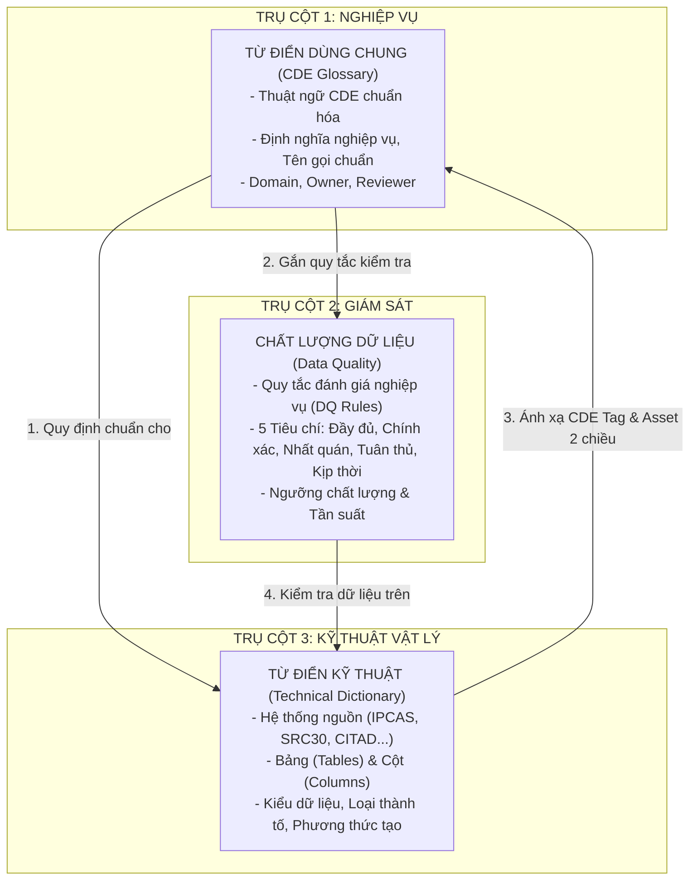
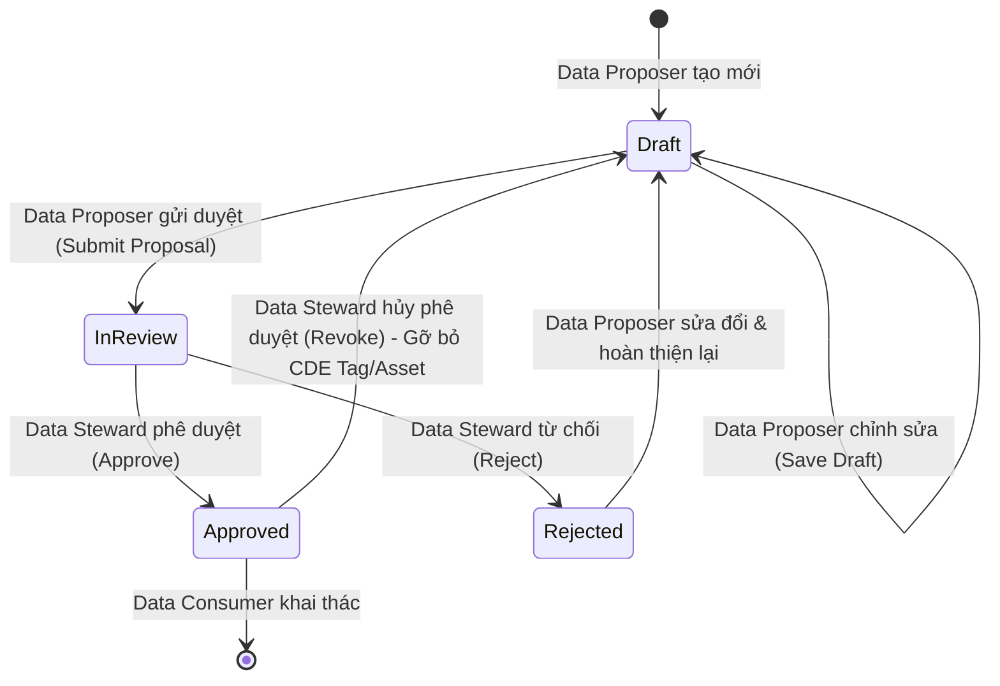

# Tổng quan Quy trình Vận hành (Workflow) & Ma trận Phân quyền 3 Trụ cột Quản trị Dữ liệu Agribank

> **Hệ thống:** Agribank Enterprise Data Governance Platform (OpenMetadata Customization)  
> **Phiên bản tài liệu:** v1.0 — Chuẩn hóa Vận hành & Phân quyền  
> **Phạm vi:** 3 trụ cột dữ liệu cốt lõi:
> 1. **Từ điển dữ liệu dùng chung (CDE Glossary / Data Dictionary)**
> 2. **Chất lượng dữ liệu (Data Quality Glossary)**
> 3. **Từ điển kỹ thuật (Technical Dictionary)**

---

## 1. Kiến trúc Tổng quan 3 Trụ cột Dữ liệu (Tri-Pillar Synergy)

Hệ thống quản trị dữ liệu Agribank được thiết kế theo mô hình liên kết 3 trụ cột khép kín, bảo đảm **Một nguồn sự thật duy nhất (Single Source of Truth)** từ tầng nghiệp vụ quản trị đến tầng kỹ thuật vật lý:

---

## 2. Định nghĩa các Vai trò Người dùng (Persona & Role Definitions)

| Vai trò | Role / Persona Code | Bản chất & Mục đích | Trách nhiệm chính tại Agribank |
|---|---|---|---|
| **Data Proposer** *(Người đề xuất / Maker)* | `DataProposer` / `DataProposerPersona` | Cán bộ nghiệp vụ tại các Khối, Ban, Trung tâm chuyên trách | - Soạn thảo, đề xuất mới CDE, quy tắc Chất lượng dữ liệu. - Đề xuất cấu hình ánh xạ trường kỹ thuật với CDE. - Gửi yêu cầu phê duyệt sang Data Steward. |
| **Data Steward** *(Người kiểm soát / Checker)* | `DataSteward` / `DataStewardPersona` | Cán bộ Quản trị Dữ liệu chuyên trách (Trung tâm QLDL) | - Thẩm định tính chuẩn hóa, tính duy nhất và tuân thủ. - Phê duyệt (`Approved`) hoặc Từ chối (`Rejected`) đề xuất. - Hủy phê duyệt (`Revoke`) khi nghiệp vụ hoặc cấu trúc kỹ thuật thay đổi. |
| **Data Consumer** *(Người khai thác / Reader)* | `DataConsumer` / `BasicConsumerPersona` | Cán bộ kinh doanh, phân tích viên, lãnh đạo phòng ban | - Tra cứu, tra soát định nghĩa chuẩn, quy tắc CLDL, cấu trúc bảng/cột. - Khai thác dữ liệu theo các CDE đã được phê duyệt chuẩn. - Chỉ có quyền xem (`Read-only`), không sửa đổi dữ liệu. |
| **Data Admin** *(Quản trị viên / System Admin)* | `Admin` / `Organization` | Quản trị viên hệ sinh thái Quản trị Dữ liệu Agribank | - Cấu hình hệ thống, phân quyền Role/Persona, cấu hình Policy. - Giám sát sức khỏe nền tảng, tích hợp hệ thống nguồn. - Xử lý các ngoại lệ nghiệp vụ và bảo trì hệ thống. |

---

## 3. Ma trận Phân định Trách nhiệm (RACI Matrix)

*Quy ước:* **R** = Responsible (Thực hiện) | **A** = Accountable (Phê duyệt / Chịu trách nhiệm) | **C** = Consulted (Tham vấn) | **I** = Informed (Tra cứu / Được thông báo)

| Chức năng / Quy trình | Data Proposer *(Maker)* | Data Steward *(Checker)* | Data Consumer *(Reader)* | Data Admin *(Admin)* |
|---|:---:|:---:|:---:|:---:|
| **1. Từ điển dữ liệu dùng chung (CDE)** | | | | |
| - Tra cứu, tìm kiếm CDE | I | I | **I** | I |
| - Tạo mới / Đề xuất chỉnh sửa CDE (Draft) | **R** | C | - | A |
| - Gửi yêu cầu phê duyệt CDE (In Review) | **R** | A | - | A |
| - Thẩm định & Phê duyệt CDE (Approved) | - | **A / R** | I | A |
| - Từ chối phê duyệt CDE (Rejected) | I | **A / R** | - | A |
| - Hủy phê duyệt CDE (Revoke) | - | **A / R** | I | A |
| **2. Chất lượng dữ liệu (Data Quality Rules)** | | | | |
| - Tra cứu quy tắc, tiêu chí & ngưỡng CLDL | I | I | **I** | I |
| - Đề xuất quy tắc CLDL mới / Sửa quy tắc | **R** | C | - | A |
| - Phê duyệt quy tắc CLDL (Approved) | - | **A / R** | I | A |
| - Từ chối quy tắc CLDL (Rejected) | I | **A / R** | - | A |
| - Hủy phê duyệt quy tắc CLDL (Revoke) | - | **A / R** | I | A |
| **3. Từ điển kỹ thuật (Technical Dictionary)** | | | | |
| - Tra cứu Ma trận Kỹ thuật (Bảng, Cột, Kiểu DL, CDE) | I | I | **I** | I |
| - Đề xuất ánh xạ Cột $\rightarrow$ CDE & Phân loại | **R** | C | - | A |
| - Thẩm định & Phê duyệt ánh xạ Cột (Approved) | - | **A / R** | I | A |
| - Tự động đồng bộ CDE Tag & Asset 2 chiều | System | System | I | System |
| - Từ chối đề xuất ánh xạ Cột (Rejected) | I | **A / R** | - | A |
| - Hủy phê duyệt ánh xạ Cột & Gỡ CDE Asset (Revoke) | - | **A / R** | I | A |

---

## 4. Vòng đời Trạng thái Dữ liệu (State Transition Diagram)

Mọi bản ghi dữ liệu (Thuật ngữ CDE, Quy tắc CLDL, Ánh xạ Từ điển kỹ thuật) đều tuân theo chu trình 4 trạng thái chuẩn hóa:

---

## 5. Danh mục Tài liệu Quy trình Chi tiết

Để nắm rõ các bước thao tác, luồng API và tác động dữ liệu của từng phân hệ, vui lòng tham khảo các tài liệu chuyên sâu:

1. 📘 [**Quy trình Từ điển dữ liệu dùng chung (CDE Glossary Workflow)**](./cde-glossary-workflow.md)
   - Đặc tả quy trình đề xuất, thẩm định, phê duyệt và liên kết CDE.
2. 📗 [**Quy trình Chất lượng dữ liệu (Data Quality Workflow)**](./data-quality-workflow.md)
   - Đặc tả 5 tiêu chí CLDL, quản trị quy tắc, phân loại ngưỡng và chu kỳ đánh giá.
3. 📙 [**Quy trình Từ điển kỹ thuật (Technical Dictionary Workflow)**](./technical-dictionary-workflow.md)
   - Đặc tả quy trình ma trận Bảng/Cột, cơ chế đề xuất, phê duyệt, gán/gỡ CDE Tag và đồng bộ Asset hai chiều.
