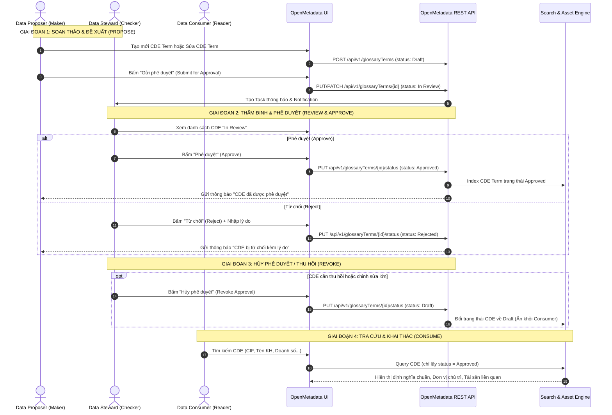

# Quy trình Vận hành Từ điển Dữ liệu Dùng chung (CDE Glossary Workflow)

> **Mục tiêu:** Quản lý tập trung toàn bộ các **Thành tố dữ liệu dùng chung (Critical Data Elements - CDE)** của Agribank, chuẩn hóa tên gọi, định nghĩa nghiệp vụ, quy tắc sử dụng và đơn vị chủ trì.  
> **Glossary hệ thống:** `Data Dictionary` (Tên hiển thị: `Từ điển dữ liệu dùng chung`)  
> **Áp dụng cho các Role:** `Data Proposer` (Maker), `Data Steward` (Checker), `Data Consumer` (Reader), `Data Admin`.

---

## 1. Sơ đồ Luồng Công việc Tổng thể (CDE Lifecycle Sequence)

---

## 2. Quy trình Chi tiết Theo Từng Role

### 2.1. Vai trò: `Data Proposer` (Maker / Người đề xuất)

#### A. Mục tiêu & Quyền hạn
- **Được phép:**
  - Tra cứu toàn bộ danh mục CDE hiện hữu để tránh tạo trùng lặp.
  - Soạn thảo CDE mới (Mã CDE, Tên hiển thị, Định nghĩa nghiệp vụ, Miền dữ liệu Domain, Đơn vị chủ trì Owner).
  - Chỉnh sửa các CDE ở trạng thái `Draft` hoặc `Rejected`.
  - Gửi yêu cầu phê duyệt CDE sang Data Steward (`In Review`).
- **Không được phép:**
  - Tự phê duyệt CDE do chính mình tạo ra (`Approved`).
  - Hủy phê duyệt CDE đã ban hành (`Revoke`).

#### B. Các bước thao tác chuẩn:
1. **Bước 1: Tra cứu trước khi tạo mới**
   - Vào menu `Từ điển dữ liệu` $\rightarrow$ `Từ điển dữ liệu dùng chung`.
   - Tìm kiếm theo Mã CDE hoặc Từ khóa nghiệp vụ để xác nhận CDE chưa từng tồn tại.
2. **Bước 2: Soạn thảo thông tin CDE**
   - Bấm nút **`+ Thêm thuật ngữ` (Add Term)**.
   - Nhập thông tin bắt buộc:
     - **Tên kỹ thuật (`name`):** Mã CDE (Ví dụ: `CDE1`, `CDE476`).
     - **Tên hiển thị (`displayName`):** Tên thành tố tiếng Việt (Ví dụ: `Mã số khách hàng`, `Doanh số chuyển tiền`).
     - **Mô tả (`description`):** Định nghĩa nghiệp vụ chi tiết, căn cứ ban hành, quy tắc định dạng.
     - **Miền dữ liệu (`Domain`):** Gán đúng Miền quản lý (Ví dụ: *Khách hàng*, *Tiền gửi*, *Tín dụng*).
     - **Chủ sở hữu (`Owners`):** Đơn vị hoặc cá nhân phụ trách nội dung CDE.
3. **Bước 3: Lưu nháp và Gửi phê duyệt**
   - Lưu ở trạng thái `Draft` để kiểm tra lại.
   - Khi hoàn thiện, bấm nút **`Gửi phê duyệt`** để chuyển trạng thái sang `In Review`.

---

### 2.2. Vai trò: `Data Steward` (Checker / Người kiểm soát)

#### A. Mục tiêu & Quyền hạn
- **Được phép:**
  - Xem danh sách tất cả các CDE đang chờ duyệt (`In Review`).
  - Thẩm định tính đầy đủ, chính xác, tính duy nhất của CDE.
  - Phê duyệt CDE (`Approve`) để đưa vào áp dụng chính thức.
  - Từ chối CDE (`Reject`) kèm lý do rõ ràng để Proposer hoàn thiện lại.
  - Hủy phê duyệt CDE (`Revoke`) khi CDE hết hiệu lực hoặc cần tái cấu trúc.
- **Không được phép:**
  - Tự tiện sửa đổi nội dung nghiệp vụ cốt lõi nếu không có đề xuất rõ ràng từ Maker.

#### B. Các bước thao tác chuẩn:
1. **Bước 1: Tiếp nhận yêu cầu phê duyệt**
   - Vào `Trung tâm thông báo` hoặc `Từ điển dữ liệu dùng chung` $\rightarrow$ Lọc trạng thái `Đang xem xét (In Review)`.
2. **Bước 2: Thẩm định CDE**
   - Kiểm tra các tiêu chuẩn:
     - Mã CDE đã chuẩn hóa theo quy tắc đặt mã Agribank chưa?
     - Tên hiển thị có dấu, chuẩn thuật ngữ ngân hàng chưa?
     - Định nghĩa có rõ ràng, không mập mờ, không xung đột với CDE khác?
     - Đã gán đúng Domain và Owner chưa?
3. **Bước 3: Ra quyết định Phê duyệt / Từ chối**
   - **Nếu đạt yêu cầu:** Bấm nút **`Phê duyệt` (Approve)**. Trạng thái chuyển thành `Approved`. CDE xuất bản công khai cho toàn ngân hàng.
   - **Nếu chưa đạt:** Bấm nút **`Từ chối` (Reject)** $\rightarrow$ Nhập lý do (Ví dụ: *"Định nghĩa trùng lặp với CDE12, đề nghị làm rõ phạm vi áp dụng"*). Trạng thái chuyển thành `Rejected`.
4. **Bước 4: Hủy phê duyệt (Revoke - Khi cần thiết)**
   - Đối với CDE đang `Approved`, nếu phát hiện sai sót hoặc có quyết định bãi bỏ:
   - Data Steward mở CDE Term $\rightarrow$ Bấm nút **`Hủy phê duyệt` (Revoke Approval)**.
   - Hệ thống chuyển trạng thái CDE về `Draft`, tự động gỡ khỏi danh sách công khai của Consumer.

---

### 2.3. Vai trò: `Data Consumer` (Reader / Người khai thác)

#### A. Mục tiêu & Quyền hạn
- **Được phép:**
  - Tra cứu, tìm kiếm toàn bộ danh mục CDE đã phê duyệt (`Approved`).
  - Xem định nghĩa chuẩn, công thức tính, đơn vị chủ trì của từng CDE.
  - Xem danh sách các Bảng & Cột dữ liệu kỹ thuật đang lưu trữ CDE này (Tab `Tài sản liên quan - Assets`).
  - Xem các Quy tắc Chất lượng Dữ liệu đang giám sát CDE này.
- **Không được phép:**
  - Tạo mới, chỉnh sửa, gửi duyệt hoặc thay đổi trạng thái của bất kỳ CDE nào.

#### B. Các bước thao tác chuẩn:
1. **Bước 1: Tìm kiếm & Tra cứu**
   - Sử dụng thanh tìm kiếm toàn cục hoặc vào `Từ điển dữ liệu dùng chung`.
   - Tìm theo tên nghiệp vụ (Ví dụ: *Dư nợ*, *Lãi suất*, *Số tài khoản*).
2. **Bước 2: Đọc hiểu & Khai thác**
   - Đọc định nghĩa chuẩn hóa để áp dụng vào báo cáo quản trị / nghiệp vụ.
   - Chuyển sang tab **`Tài sản liên quan (Assets)`** để biết chính xác trường dữ liệu vật lý nằm ở Bảng nào, Hệ thống nào (IPCAS, Kho RRTD, SRC30...).

---

### 2.4. Vai trò: `Data Admin` (Quản trị hệ thống)

- Quản lý cấu hình Glossary, phân quyền Steward theo từng Domain.
- Cấu hình Workflow phê duyệt nhiều cấp (Multi-tier Approval) nếu có yêu cầu mở rộng.
- Chạy script nạp hàng loạt (Bulk Ingestion) dữ liệu CDE từ file Excel theo phê duyệt của Hội đồng Quản trị Dữ liệu.

---

## 3. Đặc tả Dữ liệu CDE (Data Schema & Attributes)

| Tên trường | Thuộc tính OpenMetadata | Kiểu dữ liệu | Bắt buộc | Mô tả |
|---|---|---|:---:|---|
| **Mã CDE** | `name` | `string` | ✅ | Mã định danh CDE không dấu (VD: `CDE1`, `CDE3`) |
| **Tên thành tố CDE** | `displayName` | `string` | ✅ | Tên nghiệp vụ tiếng Việt có dấu (VD: `Mã số khách hàng`) |
| **Định nghĩa CDE** | `description` | `markdown` | ✅ | Diễn giải ngữ nghĩa nghiệp vụ, công thức tính |
| **Miền dữ liệu** | `domain` | `EntityReference` | ✅ | Domain quản trị (Khách hàng, Tín dụng, Kế toán...) |
| **Chủ sở hữu** | `owners` | `EntityReference[]` | ✅ | Ban/Phòng/Cá nhân chịu trách nhiệm nghiệp vụ |
| **Người kiểm soát** | `reviewers` | `EntityReference[]` | ⚪ | Data Steward phụ trách phê duyệt |
| **Trạng thái** | `entityStatus` | `enum` | ✅ | `Draft`, `InReview`, `Approved`, `Rejected` |
| **Tài sản liên quan** | `assets` | `EntityReference[]` | ⚪ | Các Cột/Bảng kỹ thuật ánh xạ tới CDE này |
