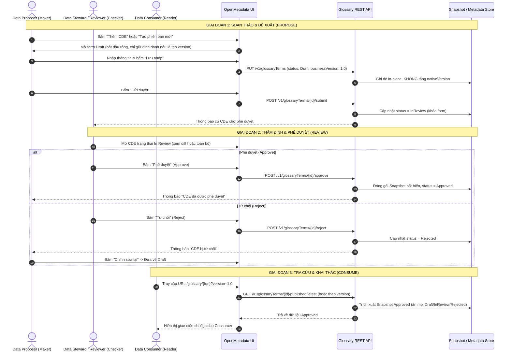

# Quy trình Vận hành và Kịch bản Kiểm thử Thành tố Dữ liệu Dùng chung (CDE Glossary Workflow & Test Scenarios)

Tài liệu này mô phỏng chi tiết các luồng thao tác của người dùng, quy tắc xử lý nghiệp vụ và các kịch bản kiểm thử (Test Scenarios) phục vụ công tác kiểm thử (QA/UAT) cho phân hệ **Từ điển dữ liệu dùng chung** (`Data Dictionary`) và các **Thành tố dữ liệu dùng chung (CDE / GlossaryTerm)**.

> [!NOTE]
> Tài liệu thiết kế giao diện UI tương ứng được lưu tại: [cde-glossary-ui-design.md](file:///home/dinhphu/Documents/Agribank-Metadata/OpenMetadata/docs/design/cde-glossary-ui-design.md).
> Bản chất kỹ thuật của CDE là entity `GlossaryTerm` trong OpenMetadata.

---

## 1. Sơ đồ Tuần tự Luồng Công việc Tổng thể (CDE Lifecycle Sequence)

---

## 2. Quy trình Chi tiết Theo Từng Role

### 2.1. Vai trò `Data Proposer` (Maker / Người đề xuất)

#### A. Quyền hạn:
- Tạo mới CDE ở trạng thái `Draft` với business version ban đầu (mặc định `1.0`).
- Chỉnh sửa và lưu nháp nhiều lần bản `Draft` (dữ liệu ghi đè trực tiếp tại chỗ, không sinh lịch sử rác).
- Chuyển CDE bị `Rejected` về `Draft` để chỉnh sửa lại.
- Gửi yêu cầu phê duyệt CDE sang trạng thái `In Review`.
- Tạo phiên bản nghiệp vụ mới (`businessVersion` mới như `1.1`, `2.0`) từ một bản đã `Approved`.

#### B. Các bước thao tác chuẩn:
1. **Tạo CDE mới:**
   - Vào Từ điển dữ liệu dùng chung $\rightarrow$ Bấm nút **`+ Thêm CDE`**.
   - Điền đầy đủ thông tin: Mã CDE (`name`), Tên hiển thị (`displayName`), Ý nghĩa nghiệp vụ (`description`), Miền (`domains`), Chủ sở hữu (`owners`), các thẻ Phân loại dữ liệu và các Custom Properties (`dataQualityRules`, `effectiveDate`, `expirationDate`, `entityRelationship`, `relatedRegulatoryDocuments`).
   - Bấm **`Lưu nháp`**: Hệ thống lưu CDE ở trạng thái `Draft 1.0`.
2. **Gửi phê duyệt:**
   - Tại trang chi tiết CDE Draft, kiểm tra lại thông tin.
   - Bấm **`Gửi duyệt`** $\rightarrow$ Xác nhận modal $\rightarrow$ Trạng thái chuyển sang `In Review 1.0` (form bị khóa).
3. **Tạo phiên bản nghiệp vụ mới (Upgrade Version):**
   - Mở CDE đang có bản `Approved 1.0` $\rightarrow$ Bấm nút **`Tạo phiên bản mới`**.
   - Nhập số phiên bản mới (ví dụ: `1.1`).
   - Màn hình mở form Draft mới **bắt đầu rỗng**: hệ thống chỉ giữ các trường định danh bất biến (`id`, `name`, `fullyQualifiedName`, quan hệ `glossary`), để trống các trường nghiệp vụ để người dùng nhập mới.
   - Bản `1.0` đã Approved vẫn giữ nguyên trạng thái bất biến và tiếp tục phục vụ Consumer.

---

### 2.2. Vai trò `Data Steward / Reviewer` (Checker / Người kiểm soát)

#### A. Quyền hạn:
- Tiếp nhận và xem xét các CDE ở trạng thái `In Review` trong phạm vi được phân công.
- Phê duyệt (`Approve`) để xuất bản chính thức bản phát hành bất biến.
- Từ chối (`Reject`) không bắt buộc nhập lý do, trả về cho Proposer sửa.

#### B. Các bước thao tác chuẩn:
1. **Tiếp nhận kiểm duyệt:**
   - Mở CDE có trạng thái `In Review`.
   - Xem nội dung đề xuất hoặc bản diff so với phiên bản Approved trước đó.
2. **Phê duyệt:**
   - Bấm **`Phê duyệt (Approve)`** $\rightarrow$ Xác nhận.
   - Hệ thống chuyển trạng thái sang `Approved`, tạo bản snapshot bất biến và lập tức cho phép Consumer tra cứu.
3. **Từ chối:**
   - Bấm **`Từ chối (Reject)`** $\rightarrow$ Xác nhận.
   - Hệ thống chuyển trạng thái CDE sang `Rejected`.

---

### 2.3. Vai trò `Data Consumer` (Reader / Người khai thác)

#### A. Quyền hạn:
- Tra cứu, tìm kiếm và xem chi tiết tất cả các CDE ở trạng thái `Approved`.
- Xem lịch sử các phiên bản đã `Approved` trước đó thông qua Dropdown chọn version hoặc URL Query Param `?version=...`.
- Xuất dữ liệu (Export) toàn bộ các CDE đã Approved ra file qua nút Export trong menu `...` của Glossary.
- **Tuyệt đối không:** Xem được bất kỳ bản ghi nào đang là `Draft`, `In Review` hoặc `Rejected`; giao diện hoàn toàn không hiển thị bất kỳ nút thao tác (action) nào đối với các trạng thái này.

---

## 3. Kịch bản Kiểm thử Chi tiết (Test Scenarios & Test Cases)

| Mã TC | Tên kịch bản | Role thực hiện | Các bước kiểm thử | Kết quả mong đợi |
| :--- | :--- | :--- | :--- | :--- |
| **TC-01** | Tạo CDE mới & Lưu nháp in-place | Data Proposer | 1. Bấm `+ Thêm CDE`. 2. Nhập Mã: `CDE001`, Tên: `Mã khách hàng`, Mô tả. 3. Bấm `Lưu nháp`. 4. Sửa lại mô tả, bấm `Lưu nháp` lần 2. | • CDE lưu ở trạng thái `Draft 1.0`. • Dữ liệu ghi đè trực tiếp tại chỗ (in-place). • `nativeVersion` kỹ thuật không bị tăng ngầm. |
| **TC-02** | Gửi duyệt CDE | Data Proposer | 1. Mở CDE `CDE001` đang Draft. 2. Bấm `Gửi duyệt`. 3. Xác nhận trên modal. | • Trạng thái chuyển thành `In Review 1.0`. • Toàn bộ form và các nút sửa bị khóa (chỉ đọc với Proposer). |
| **TC-03** | Từ chối duyệt CDE | Reviewer & Proposer | 1. Reviewer mở `CDE001` (`In Review`). 2. Bấm `Từ chối (Reject)`. 3. Proposer mở lại CDE và bấm `Chỉnh sửa lại`. | • CDE chuyển sang trạng thái `Rejected 1.0`. • Khi Proposer bấm `Chỉnh sửa lại`, CDE quay về `Draft 1.0` và mở khóa form để sửa. |
| **TC-04** | Phê duyệt CDE | Data Steward / Reviewer | 1. Reviewer mở `CDE001` (`In Review`). 2. Bấm `Phê duyệt (Approve)`. | • CDE chuyển sang trạng thái `Approved 1.0`. • Snapshot bất biến được tạo trong database. • Nút chuyển thành `Tạo phiên bản mới`. |
| **TC-05** | Phân quyền tra cứu của Consumer | Data Consumer | 1. Consumer vào Từ điển dữ liệu dùng chung. 2. Tìm kiếm `CDE001`. 3. Thử đổi URL param `?version=Draft`. | • Consumer chỉ nhìn thấy bản `1.0 [Approved]` trong danh sách và dropdown version. • Màn hình chỉ đọc, không có các nút chỉnh sửa/gửi duyệt/approve. • Nếu cố tình gõ URL trỏ vào bản Draft/InReview/Rejected, hệ thống trả lỗi 403 hoặc 404, hiển thị màn hình báo lỗi và tuyệt đối không hiển thị bất kỳ nút action nào. |
| **TC-06** | Tạo version mới v1.1 từ v1.0 | Data Proposer | 1. Mở `CDE001` đã Approved 1.0. 2. Bấm `Tạo phiên bản mới`. 3. Nhập version: `1.1`. | • Mở form Draft mới với số hiệu `Draft 1.1`. • Form bắt đầu rỗng (chỉ giữ định danh mã CDE). • Bản `1.0 Approved` cũ vẫn tồn tại nguyên vẹn phục vụ Consumer. |
| **TC-07** | Hiển thị bảng Flat List ngang hàng | Consumer & Steward | 1. Hệ thống có `CDE001` bản 1.0 Approved và bản 1.1 Draft. 2. Consumer mở bảng danh sách. 3. Steward mở bảng danh sách. | • Bảng hiển thị các dòng ngang hàng, không thụt lề con. • Consumer: chỉ thấy dòng `CDE001` - Version 1.0 `[Approved]`. • Steward: thấy cả dòng 1.1 `[Draft]` và dòng 1.0 `[Approved]`. |
| **TC-08** | Xuất dữ liệu CDE (Export) | Mọi Role | 1. Bấm menu dấu ba chấm (`...`) trên Header của Glossary. 2. Bấm chọn `Export`. | • Chỉ có duy nhất 1 nút Export trên menu Glossary. • Xuất toàn bộ danh sách CDE mà người dùng được phép xem ra file (Consumer chỉ xuất bản Approved; Steward xuất toàn bộ). |

---

## 4. Xử lý Ngoại lệ và Xung đột Dữ liệu (Conflict Handling)

1. **Optimistic Locking:**
   - Mỗi giao dịch sửa đổi mang theo định danh version/timestamp hiện hành. Nếu một người dùng khác đã submit/approve trước đó, hệ thống lập tức hiển thị thông báo: *"Dữ liệu đã được cập nhật bởi người dùng khác, vui lòng tải lại trang"*, không âm thầm ghi đè dữ liệu.
2. **Xóa CDE:**
   - Chỉ cho phép xóa CDE ở trạng thái `Draft` do chính mình tạo (hoặc Admin).
   - Tuyệt đối không xóa cứng (hard delete) các bản CDE đã từng được `Approved` để bảo toàn tính toàn vẹn của snapshot lịch sử Từ điển dữ liệu dùng chung.
