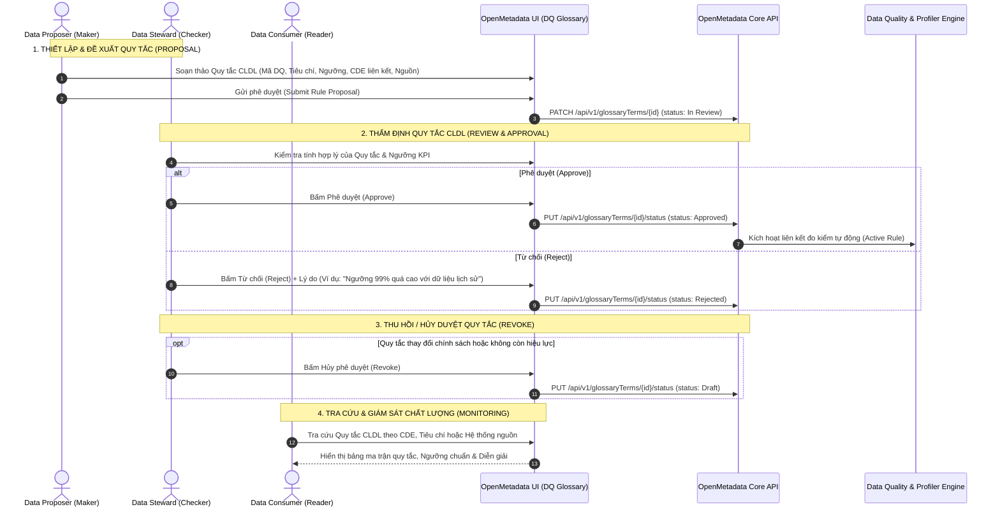

# Quy trình Vận hành Phân hệ Chất lượng Dữ liệu (Data Quality Workflow)

> **Mục tiêu:** Quản lý tập trung, chuẩn hóa và giám sát toàn bộ các **Quy tắc Kiểm tra Chất lượng Dữ liệu (Data Quality Rules - DQ Rules)** của Agribank theo 5 tiêu chí chuẩn quốc tế và liên kết chặt chẽ với CDE.  
> **Glossary hệ thống:** `Data Quality` (Tên hiển thị: `Chất lượng dữ liệu`)  
> **Áp dụng cho các Role:** `Data Proposer` (Maker), `Data Steward` (Checker), `Data Consumer` (Reader), `Data Admin`.

---

## 1. Sơ đồ Luồng Vận hành Quy tắc Chất lượng Dữ liệu

---

## 2. Chuẩn hóa 5 Tiêu chí Chất lượng Dữ liệu (5 Quality Dimensions)

Mọi quy tắc chất lượng dữ liệu tại Agribank bắt buộc phải phân loại vào 1 trong 5 tiêu chí chuẩn:

| STT | Tiêu chí (Tiếng Việt) | Dimension Tag (EN) | Màu sắc Pill | Định nghĩa & Ý nghĩa nghiệp vụ | Ví dụ điển hình tại Agribank |
|:---:|---|---|:---:|---|---|
| 1 | **Tính đầy đủ** | `Completeness` | **Xanh dương** (`#1890FF`) | Dữ liệu bắt buộc không được để trống (`NULL`, `Blank`, `Empty`) trên các trường trọng yếu. | Số CIF, Tên khách hàng, Số CCCD không được rỗng. |
| 2 | **Tính chính xác** | `Accuracy` | **Xanh lá** (`#52C41A`) | Dữ liệu phản ánh đúng thực tế khách hàng/giao dịch và tuân thủ định dạng chuẩn. | Số CMND 9/12 số, Mã số thuế 10/13 số, Ngày sinh hợp lệ. |
| 3 | **Tính nhất quán** | `Consistency` | **Cam / Amber** (`#FA8C16`) | Dữ liệu không bị mâu thuẫn giữa các bảng, các hệ thống hoặc trong cùng một bản ghi. | Tổng dư nợ trên Tài khoản khớp với Tổng dư nợ Khách hàng. |
| 4 | **Tính tuân thủ** | `Compliance` | **Tím** (`#722ED1`) | Dữ liệu tuân thủ danh mục chuẩn, chuẩn mực của NHNN hoặc chính sách Agribank. | Mã loại hình kinh tế, Mã ngành nghề phải thuộc danh mục chuẩn. |
| 5 | **Tính kịp thời** | `Timeliness` | **Xanh Cyan** (`#13C2C2`) | Dữ liệu được cập nhật và sẵn sàng đúng thời gian quy định (T+0, T+1, cuối ngày). | Giao dịch phát sinh trong ngày phải được hạch toán trước 18h00. |

---

## 3. Quy trình Chi tiết Theo Từng Role

### 3.1. Vai trò: `Data Proposer` (Maker / Người đề xuất)

#### A. Mục tiêu & Quyền hạn
- **Được phép:**
  - Tra cứu các quy tắc CLDL hiện có để tránh trùng lặp.
  - Tạo mới quy tắc CLDL gắn với Thành tố CDE tương ứng.
  - Khai báo đầy đủ các trường: Mã quy tắc (`DQx.x`), Tiêu chí CLDL, Diễn giải quy tắc, Ràng buộc kỹ thuật, Dấu hiệu ngoại lệ, Hệ thống nguồn, Tập kiểm tra, Hình thức kiểm tra, Tần suất, Ngưỡng chất lượng.
  - Gửi yêu cầu phê duyệt sang Data Steward.
- **Không được phép:**
  - Tự phê duyệt quy tắc do mình tạo ra (`Approved`).
  - Hủy phê duyệt quy tắc đã ban hành (`Revoke`).

#### B. Các bước thao tác chuẩn:
1. **Bước 1: Khởi tạo quy tắc mới**
   - Vào menu `Chất lượng dữ liệu` $\rightarrow$ Bấm nút **`+ Thêm quy tắc` (Add Rule)**.
2. **Bước 2: Nhập thông tin chi tiết**
   - **Mã quy tắc (`name`):** Đặt theo cú pháp chuẩn (Ví dụ: `DQ1.1`, `DQ3.2`, `DQ476.1`).
   - **Mã CDE liên kết:** Chọn CDE tương ứng từ *Từ điển dữ liệu dùng chung* (Ví dụ: `CDE1 - Tên khách hàng`).
   - **Tiêu chí CLDL:** Chọn 1 trong 5 tiêu chí (*Tính đầy đủ, Tính chính xác, Tính nhất quán, Tính tuân thủ, Tính kịp thời*).
   - **Nội dung quy tắc (`description`):** Phát biểu ngắn gọn, rõ ràng yêu cầu chất lượng.
   - **Ngưỡng chất lượng (`qualityThreshold`):** Nhập tỷ lệ chấp nhận (Ví dụ: `0.99` (99%), `1.00` (100%)).
   - **Hệ thống nguồn & Tần suất:** Chọn hệ thống (`IPCAS`, `Kho RRTD`...) và chu kỳ (`Hàng Quý`, `Tháng/Quý`...).
3. **Bước 3: Gửi phê duyệt**
   - Kiểm tra kỹ các trường $\rightarrow$ Bấm **`Gửi phê duyệt`** để chuyển trạng thái sang `In Review`.

---

### 3.2. Vai trò: `Data Steward` (Checker / Người kiểm soát)

#### A. Mục tiêu & Quyền hạn
- **Được phép:**
  - Thẩm định tính khả thi, tính chặt chẽ của quy tắc và ngưỡng chất lượng.
  - Phê duyệt quy tắc (`Approve`) để đưa vào vận hành giám sát chính thức.
  - Từ chối quy tắc (`Reject`) kèm lý do điều chỉnh.
  - Hủy phê duyệt (`Revoke`) khi quy tắc không còn phù hợp với chính sách mới.
- **Không được phép:**
  - Sửa đổi trực tiếp quy tắc mà không có biên bản/đề xuất từ Maker.

#### B. Các bước thao tác chuẩn:
1. **Bước 1: Tiếp nhận và Rà soát**
   - Lọc danh sách quy tắc ở trạng thái `Đang xem xét (In Review)`.
   - Đánh giá:
     - Quy tắc có khả thi về mặt kỹ thuật SQL không?
     - Ngưỡng KPI có phù hợp với thực tế nguồn dữ liệu không?
     - Ngoại lệ đã được định nghĩa đầy đủ, tránh báo động giả (False Positives) chưa?
2. **Bước 2: Phê duyệt / Từ chối**
   - **Phê duyệt:** Bấm **`Phê duyệt` (Approve)**. Quy tắc chuyển sang `Approved`.
   - **Từ chối:** Bấm **`Từ chối` (Reject)** $\rightarrow$ Nhập lý do (Ví dụ: *"Đề nghị bổ sung dấu hiệu ngoại lệ cho khách hàng mở tài khoản online"*).
3. **Bước 3: Hủy phê duyệt (Revoke)**
   - Khi có thay đổi chính sách tín dụng/khách hàng khiến quy tắc cũ không còn đúng:
   - Mở quy tắc $\rightarrow$ Bấm **`Hủy phê duyệt` (Revoke)** $\rightarrow$ Quy tắc quay về `Draft` để Proposer chỉnh sửa lại.

---

### 3.3. Vai trò: `Data Consumer` (Reader / Người khai thác)

#### A. Mục tiêu & Quyền hạn
- **Được phép:**
  - Tra cứu toàn bộ các quy tắc CLDL đã được phê duyệt (`Approved`).
  - Lọc quy tắc theo Tiêu chí chất lượng, Nguồn dữ liệu, Tần suất kiểm tra.
  - Tùy biến cột hiển thị để xem các trường nâng cao (Tập dữ liệu kiểm tra, Hình thức kiểm tra, Dấu hiệu ngoại lệ).
  - Nhấp vào Mã CDE để xem định nghĩa nghiệp vụ của thành tố tương ứng.
- **Không được phép:** Chỉnh sửa, gửi duyệt hay thay đổi trạng thái quy tắc.

---

## 4. Bảng Đặc tả Thuộc tính Quy tắc Chất lượng Dữ liệu

| STT | Tên trường hiển thị | Thuộc tính OpenMetadata | Kiểu dữ liệu | Mô tả & Ví dụ |
|:---:|---|---|:---:|---|
| 1 | **Mã quy tắc** | `name` *(Core)* | `string` | `DQ1.1`, `DQ3.1`, `DQ476.1` |
| 2 | **Mã CDE liên kết** | `customProperties.cdeCode` + `relatedTerms` | `string` + `EntityReference` | `CDE1`, `CDE3` (Link sang CDE Glossary) |
| 3 | **Tên thành tố CDE** | `customProperties.cdeName` | `string` | `Tên khách hàng`, `Số CIF` |
| 4 | **Tiêu chí CLDL** | `tags` *(Classification `DataQualityDimension`)* | `TagLabel` | `Completeness`, `Accuracy`... (Pill màu) |
| 5 | **Nội dung quy tắc** | `description` *(Core)* | `markdown` | Nội dung phát biểu quy tắc nghiệp vụ |
| 6 | **Ngưỡng chất lượng** | `customProperties.qualityThreshold` | `string` | `0.99` (99%), `1` (100%), Badge màu |
| 7 | **Hệ thống nguồn** | `tags` *(Classification `DataSource`)* | `TagLabel` | `IPCAS`, `CreditRiskDataWarehouse` |
| 8 | **Tần suất** | `tags` *(Classification `DataQualityFrequency`)* | `TagLabel` | `Quarterly`, `MonthlyOrQuarterly`, `Daily` |
| 9 | **Tập dữ liệu kiểm tra** | `tags` *(Classification `DataQualityTargetPopulation`)* | `TagLabel` | `EntireCustomerBase`, `IndividualCustomers` |
| 10| **Hình thức kiểm tra** | `tags` *(Classification `DataQualityMethod`)* | `TagLabel` | `TechnicalSqlRule`, `DataProfiling` |
| 11| **Diễn giải quy tắc** | `customProperties.ruleExplanation` | `markdown` | Diễn giải chi tiết ngữ cảnh áp dụng |
| 12| **Ràng buộc khác** | `customProperties.otherConstraints` | `markdown` | Kiểm tra Not Null, Format chuẩn... |
| 13| **Dấu hiệu ngoại lệ** | `customProperties.exceptions` | `markdown` | Các trường hợp chấp nhận ngoại lệ |
| 14| **Trạng thái** | `entityStatus` *(Core)* | `enum` | `Draft`, `InReview`, `Approved`, `Rejected` |
