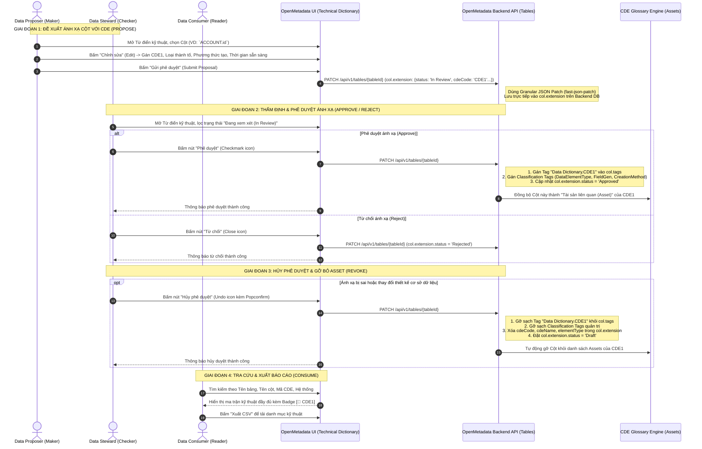

# Quy trình Vận hành Từ điển Kỹ thuật (Technical Dictionary Workflow)

> **Mục tiêu:** Quản lý ma trận cấu trúc dữ liệu kỹ thuật vật lý (Hệ thống, Bảng, Cột, Kiểu dữ liệu) và thiết lập quan hệ ánh xạ hai chiều giữa Cột vật lý với **Thành tố dữ liệu dùng chung (CDE)**.  
> **Kiến trúc:** Phương án 3 (Hybrid) — Tái sử dụng trực tiếp Native Entity `Table` & `Column` của OpenMetadata, gắn kết với `GlossaryTerm` (CDE) thông qua Tag `Data Dictionary.<cdeCode>`.  
> **Áp dụng cho các Role:** `Data Proposer` (Maker), `Data Steward` (Checker), `Data Consumer` (Reader), `Data Admin`.

---

## 1. Sơ đồ Luồng Vận hành Từ điển Kỹ thuật (Technical Dictionary Sequence)



---

## 2. Quy trình Chi tiết Theo Từng Role

### 2.1. Vai trò: `Data Proposer` (Maker / Người đề xuất)

#### A. Mục tiêu & Quyền hạn
- **Được phép:**
  - Xem danh sách toàn bộ Bảng và Cột kỹ thuật đã được Ingestion vào hệ thống.
  - Mở Modal chỉnh sửa ánh xạ (`TechnicalDictionaryEditModal`) trên các trường ở trạng thái `Draft` hoặc `Rejected`.
  - Khai báo đề xuất:
    - **Mã CDE quy chiếu:** Chọn CDE tương ứng (Ví dụ: `CDE1 - Mã số khách hàng`).
    - **Loại thành tố dữ liệu:** `Dữ liệu nguyên tố (AtomicDataElement)` hoặc `Dữ liệu chuyển đổi (TransformedDataElement)`.
    - **Loại trường dữ liệu:** `Hệ thống tự sinh`, `Hệ thống tính toán`, `Nhập thủ công`, `Tải lên`.
    - **Phương thức tạo:** `Tham số hoá`, `Mã cứng`, `Không áp dụng`.
    - **Thời gian sẵn sàng:** `T+0`, `T+1`...
    - **Chủ sở hữu hệ thống:** Đơn vị phụ trách hạ tầng.
  - Lưu nháp (`Lưu nháp` $\rightarrow$ `Draft`) hoặc Gửi duyệt (`Gửi duyệt` $\rightarrow$ `In Review`).
- **Không được phép:**
  - Tự bấm phê duyệt (`Approve`) hoặc từ chối (`Reject`).
  - Hủy phê duyệt (`Revoke`) các bản ghi đã `Approved`.

#### B. Các bước thao tác chuẩn:
1. **Bước 1: Tìm kiếm trường kỹ thuật cần ánh xạ**
   - Vào menu `Khám phá` $\rightarrow$ `Từ điển kỹ thuật`.
   - Tìm kiếm theo Tên bảng (Ví dụ: `ACCOUNT`, `TBMS_TAISAN`) hoặc Tên cột (Ví dụ: `ID`, `NMLOC`, `CIF_NO`).
2. **Bước 2: Soạn thảo đề xuất ánh xạ**
   - Tại dòng của cột cần ánh xạ, bấm nút **`Chỉnh sửa` (Icon cây bút)** ở cột Thao tác.
   - Chọn Mã CDE từ danh sách gợi ý.
   - Chọn Loại thành tố, Loại trường, Phương thức tạo, Thời gian sẵn sàng và Chủ sở hữu hệ thống.
3. **Bước 3: Gửi phê duyệt**
   - Bấm nút **`Gửi duyệt`**.
   - Hệ thống tự động gửi Granular JSON Patch lên OpenMetadata backend, cập nhật `col.extension` với trạng thái `In Review` và thông báo tới Data Steward.

---

### 2.2. Vai trò: `Data Steward` (Checker / Người kiểm soát)

#### A. Mục tiêu & Quyền hạn
- **Được phép:**
  - Lọc và xem danh sách các trường kỹ thuật đang chờ duyệt (`In Review`).
  - Thẩm định tính chính xác của việc ánh xạ (Cột vật lý này có đúng là đại diện cho CDE đó không, kiểu dữ liệu và độ dài có tương thích không).
  - Phê duyệt (`Approve`): Tự động gán Tag CDE `Data Dictionary.<cdeCode>`, gán thẻ phân loại, chuyển trạng thái sang `Approved` và gắn Cột vào Assets của CDE.
  - Từ chối (`Reject`): Chuyển trạng thái sang `Rejected` kèm lý do.
  - Hủy phê duyệt (`Revoke`): Đối với các cột đã `Approved`, khi hủy duyệt hệ thống sẽ xóa sạch Tag CDE, xóa Tag phân loại, xóa thông tin CDE trong extension, chuyển về `Draft` và **gỡ hoàn toàn khỏi CDE Assets**.
- **Không được phép:**
  - Không thể tự ý chỉnh sửa nội dung đề xuất bằng nút Edit (đảm bảo nguyên tắc kiểm soát kép Maker-Checker).

#### B. Các bước thao tác chuẩn:
1. **Bước 1: Lọc danh sách chờ duyệt**
   - Vào `Từ điển kỹ thuật` $\rightarrow$ Chọn bộ lọc Trạng thái: `Đang xem xét (In Review)`.
2. **Bước 2: Thẩm định chuyên môn**
   - So sánh kiểu dữ liệu vật lý của Cột với định nghĩa CDE trong *Từ điển dữ liệu dùng chung*.
   - Kiểm tra các phân loại: Dữ liệu nguyên tố hay chuyển đổi, phương thức tạo có chuẩn xác không.
3. **Bước 3: Phê duyệt (Approve) hoặc Từ chối (Reject)**
   - **Phê duyệt:** Bấm nút **`Phê duyệt` (Icon dấu tích xanh)** tại cột Thao tác.
     - *Kết quả:* Cột chuyển sang `Approved`. Cột xuất hiện trong Tab *Tài sản liên quan (Assets)* của CDE tương ứng.
   - **Từ chối:** Bấm nút **`Từ chối` (Icon dấu nhân đỏ)** tại cột Thao tác.
     - *Kết quả:* Cột chuyển sang `Rejected` để Data Proposer nắm được và điều chỉnh.
4. **Bước 4: Hủy phê duyệt (Revoke)**
   - Khi có thay đổi thiết kế DB hoặc phát hiện ánh xạ nhầm:
   - Tại cột đang `Approved`, bấm nút **`Hủy phê duyệt` (Icon hoàn tác màu cam)** $\rightarrow$ Xác nhận trên hộp thoại Popconfirm.
   - *Kết quả:* Hệ thống tự động gỡ sạch CDE Tag khỏi Bảng/Cột trên database và gỡ khỏi danh sách CDE Assets. Trạng thái cột quay về `Draft`.

---

### 2.3. Vai trò: `Data Consumer` (Reader / Người khai thác)

#### A. Mục tiêu & Quyền hạn
- **Được phép:**
  - Tra cứu ma trận Từ điển kỹ thuật toàn ngân hàng (hơn 2,400+ cột và 320+ bảng dữ liệu).
  - Tìm kiếm đa tiêu chí: Tên bảng, Tên cột, Mã CDE, Hệ thống nguồn, Kiểu dữ liệu, Thời gian sẵn sàng.
  - Bấm vào Badge `[🔗 CDE1]` để chuyển nhanh sang xem định nghĩa nghiệp vụ của CDE.
  - Bấm vào Tên bảng để xem trang chi tiết Schema Bảng (`TableDetailsPage`).
  - Sử dụng tính năng **`Tùy chỉnh cột`** để ẩn/hiện các cột kỹ thuật theo nhu cầu phân tích.
  - Bấm nút **`Xuất CSV`** để tải báo cáo danh mục ma trận kỹ thuật phục vụ lập trình/tích hợp.
- **Không được phép:**
  - Không có quyền chỉnh sửa, đề xuất, phê duyệt, từ chối hay hủy phê duyệt.

---

### 2.4. Vai trò: `Data Admin` (Quản trị hệ thống)

- Quản trị cấu hình kết nối Ingestion Pipeline tự động quét schema từ cơ sở dữ liệu vật lý (Oracle, PostgreSQL, MySQL, DB2...).
- Cấu hình phân quyền Role và Policy cho Data Proposer, Data Steward, Data Consumer.
- Khắc phục các ngoại lệ về quyền hạn (RBAC) hoặc lỗi đồng bộ Elasticsearch / Opensearch.

---

## 3. Đặc tả Kỹ thuật Cơ chế Đồng bộ Hai Chiều (Bidirectional Sync Details)

### 3.1. So sánh Tên cột Không phân biệt Chữ hoa / Chữ thường (Case-Insensitive Normalization)
Do các hệ quản trị CSDL (Oracle, Postgres, MySQL) lưu trữ tên bảng/cột theo các quy ước khác nhau (`ID`, `id`, `ACCOUNT`, `account`):
- Mọi hàm đồng bộ Backend ([`syncColumnProposalToBackend`](file:///home/dinhphu/Documents/Agribank-Metadata/OpenMetadata/openmetadata-ui/src/main/resources/ui/src/pages/TechnicalDictionaryPage/TechnicalDictionaryPage.component.tsx), [`syncColumnMetadataToBackend`](file:///home/dinhphu/Documents/Agribank-Metadata/OpenMetadata/openmetadata-ui/src/main/resources/ui/src/pages/TechnicalDictionaryPage/TechnicalDictionaryPage.component.tsx), [`removeColumnMetadataFromBackend`](file:///home/dinhphu/Documents/Agribank-Metadata/OpenMetadata/openmetadata-ui/src/main/resources/ui/src/pages/TechnicalDictionaryPage/TechnicalDictionaryPage.component.tsx)) đều chuẩn hóa so sánh:
  ```typescript
  col.name?.toLowerCase() === item.columnName?.toLowerCase()
  ```

### 3.2. Cơ chế Granular JSON Patch (Tránh lỗi 403 `EditAll`)
- Thay vì thay thế toàn bộ mảng `path: '/columns'`, hệ thống sử dụng `compare(table, updatedTable)` từ thư viện `fast-json-patch`.
- OpenMetadata sinh các lệnh patch vi mô (`path: '/columns/0/tags'`, `path: '/columns/0/extension'`), chỉ yêu cầu các quyền `EditGlossaryTerms`, `EditTags`, `EditCustomFields` của Data Steward mà không đòi hỏi quyền tối cao `EditAll` trên toàn bộ bảng.

---

## 4. Ma trận Thuộc tính Từ điển Kỹ thuật (Technical Dictionary Attribute Mapping)

| STT | Tên cột hiển thị | Vị trí lưu trữ OpenMetadata | Kiểu dữ liệu | Mô tả |
|:---:|---|---|:---:|---|
| 1 | **Tên Bảng** | `Table.name` *(Core)* | `string` | Tên bảng vật lý (VD: `ACCOUNT`, `TBMS_TAISAN`) |
| 2 | **Tên Cột** | `Column.name` *(Core)* | `string` | Tên cột vật lý (VD: `ID`, `NMLOC`, `CUSTNM`) |
| 3 | **Hệ thống nguồn** | `Table.service.name` | `string` | Nguồn dữ liệu vật lý (VD: `IPCAS`, `SRC30`, `CITAD`) |
| 4 | **Mã CDE quy chiếu** | `Column.tags` (Tag Glossary) + `Column.extension.cdeCode` | `TagLabel` | Tag `Data Dictionary.CDE1` kèm Badge link CDE |
| 5 | **Tên thành tố CDE** | `Column.extension.cdeName` / `GlossaryTerm.displayName` | `string` | Tên nghiệp vụ tiếng Việt (VD: `Tên khách hàng`) |
| 6 | **Kiểu dữ liệu** | `Column.dataTypeDisplay` *(Core)* | `string` | Kiểu dữ liệu chuẩn (VD: `VARCHAR2(100)`, `NUMBER(38,2)`) |
| 7 | **Độ dài / Thập phân** | `Column.dataLength` & `Column.scale` *(Core)* | `number` | Độ dài tối đa và số chữ số thập phân |
| 8 | **Loại thành tố** | `Column.tags` (Classification `DataElementType`) | `TagLabel` | `AtomicDataElement` / `TransformedDataElement` |
| 9 | **Loại trường** | `Column.tags` (Classification `FieldGenerationType`) | `TagLabel` | `SystemGenerated` / `ManualInput` / `FileUpload` |
| 10| **Phương thức tạo** | `Column.tags` (Classification `DataCreationMethod`) | `TagLabel` | `Parameterised` / `Hardcoded` / `NotApplicable` |
| 11| **Thời gian sẵn sàng** | `Column.extension.timeliness` | `string` | `T+0`, `T+1`... |
| 12| **Chủ sở hữu hệ thống** | `Table.extension.systemOwner` | `string` | Đơn vị quản lý hệ thống nguồn |
| 13| **Trạng thái** | `Column.extension.status` | `enum` | `Draft`, `In Review`, `Approved`, `Rejected` |
